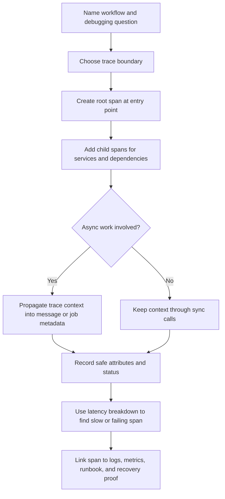

# Tracing

Tracing follows one request, job, message, or workflow as it moves through a
system. A distributed trace is a trace whose spans cross process, service,
queue, worker, or dependency boundaries. It is useful when a responder needs to
answer where time was spent, which dependency failed, which async step continued
later, or which component handled a specific part of the work.

Metrics show patterns. Logs explain individual events. Traces connect the path.

Use [Observability basics](observability-basics.md) to decide which workflows
need cross-component visibility. Use [Logs](logs.md) for the structured events
inside each step.

## Purpose

Use tracing design to answer:

- Which services, databases, caches, queues, workers, or providers participated
  in one workflow?
- Where did the request spend time?
- Which span failed, retried, timed out, or returned a degraded result?
- Did a trace ID propagate across synchronous and asynchronous boundaries?
- Which dependency or downstream call is the likely cause of latency or errors?
- Which spans should be captured, sampled, redacted, and retained?

The goal is not to trace every internal function. The goal is to make a
critical path explainable when latency or failure crosses component boundaries.

## When This Matters

Tracing matters when:

- one user action calls several services, databases, caches, queues, or
  third-party dependencies;
- p95 or p99 latency is high and component metrics do not show where time went;
- a write path continues through an outbox, worker, webhook, or provider call
  after the original request returns;
- retries, fallbacks, circuit breakers, or timeouts make the actual execution
  path different from the happy path;
- support needs to inspect one affected request, resource, job, or tenant;
- a team needs before/after evidence for a performance or dependency change;
- logs can show events but cannot show causal order and duration across
  boundaries.

It matters less for a small single-process prototype where structured logs and
basic metrics already explain the full workflow.

## Questions To Ask

Start with the workflow:

- What is the user-visible or operator-visible action being traced?
- Which services, data stores, caches, queues, workers, and providers can touch
  the workflow?
- Which step is most likely to be slow, flaky, retried, or rate-limited?
- Which request ID, trace ID, resource ID, job ID, message ID, or provider ID
  connects this work across boundaries?
- Which span attributes are useful and safe?
- Which payload, secret, personal data, or high-cardinality field must be
  excluded?
- Which traces should always be kept: errors, slow requests, degraded paths, or
  low-volume critical workflows?
- What should the responder do after finding the slow or failing span?

## Trace Design Flow



The flow starts from a debugging question because tracing every function creates
noise. Trace boundaries should match decisions a responder can act on.

## Decision Guidance

### Start With The Trace Boundary

A trace boundary is the workflow scope the team wants to follow.

Good trace boundaries:

- one HTTP or API request;
- one background job;
- one message consumed from a queue;
- one scheduled import or export;
- one webhook handling attempt;
- one state transition that triggers async work.

For example:

```text
Workflow: resident submits equipment reservation
Root span: API request to submit reservation
Child spans: authorization, inventory check, database transaction, outbox write
Async continuation: reminder job and provider call
Debugging question: did the delay happen in the API, database, worker, or provider?
```

This boundary is useful because each child span maps to a component or
dependency a responder can investigate.

### Model Spans Around Meaningful Work

A span represents a timed unit of work inside a trace. A span should describe an
operation that can be slow, fail, retry, or explain a decision.

Useful spans:

- inbound request handling;
- authorization or policy decision when it is a meaningful dependency;
- database query or transaction family;
- cache lookup and fallback read;
- queue publish or outbox insert;
- worker job processing;
- external provider call;
- file upload, export, import, or search operation;
- retry, fallback, degradation, or circuit-breaker path.

Weak spans:

- every helper function;
- every loop iteration;
- raw payload parsing with no user-visible impact;
- spans with names that change per user, ID, or payload;
- spans that record secrets or large request bodies.

Use stable span names such as `reservation.submit`, `database.reservation_write`,
or `provider.reminder_send`. Put variable data in safe attributes, not in the
span name.

### Propagate Trace Context

Propagation carries trace context from one component to the next. Without it,
the trace breaks into disconnected fragments and the responder loses the path.

Propagate context through carriers such as:

- inbound and outbound HTTP or RPC headers;
- queue messages and outbox records;
- worker job metadata;
- scheduled task execution records;
- provider callback or webhook metadata when safe.

For asynchronous work, store the trace or correlation context with the message
or job when it is created. The worker can then start a child span or linked span
when it processes the work. Record enqueue time or queue-wait span data so
responders can separate time spent waiting from time spent executing.

Logs should include trace IDs and related correlation IDs as evidence fields,
but logs do not usually propagate context by themselves.

Example propagation path:

```text
API request trace_id=trace_5b2d
  -> outbox message trace_id=trace_5b2d, message_id=msg_91
  -> worker job trace_id=trace_5b2d, job_id=job_7ac0
  -> provider call trace_id=trace_5b2d, provider_request_id=prov_44
```

If a boundary cannot safely carry the trace ID, carry another safe correlation
ID and document how responders join the evidence.

### Use Latency Breakdowns

Latency breakdown is one of tracing's main benefits. It shows how much time was
spent in each part of a workflow.

Look for:

- one child span consuming most of the request duration;
- several small downstream calls adding up to a slow request;
- time spent waiting for a database connection, lock, or provider response;
- retries that hide inside a successful request;
- queue wait time versus worker processing time;
- cross-region or external dependency latency;
- missing spans where the trace goes quiet during the delay.

Example interpretation:

| Trace Signal | Likely Meaning | Next Check |
| --- | --- | --- |
| API span is long, child spans are short | App code, serialization, or local CPU may dominate | Profile route or inspect payload work |
| Database span dominates | Query, lock, connection, or transaction is likely | Check query metrics and database logs |
| Many provider spans appear | Fanout or retry behavior may dominate | Check timeout and retry policy |
| Queue wait span dominates | Worker capacity or downstream dependency may be behind | Check queue age and worker health |
| Cache miss span followed by slow database span | Cache is not protecting the path | Check hit rate and source load |
| Trace has missing async continuation | Context propagation or instrumentation is broken | Check outbox and worker metadata |

Do not optimize the longest span automatically. Ask whether that span is on the
user-visible critical path and whether changing it would improve the workflow's
target.

### Make Dependencies Visible

Traces are especially useful for dependency visibility. A dependency can be
internal, such as a database or cache, or external, such as a payment,
notification, identity, search, or storage provider.

For each dependency span, record safe attributes:

- dependency name or class;
- operation family, not raw query text with private values;
- result class such as success, timeout, rate_limited, rejected, ambiguous, or
  unavailable;
- duration and retry count;
- timeout budget or remaining deadline when relevant;
- provider request or receipt ID when safe;
- fallback or degradation decision.

Avoid attaching full SQL statements with personal values, request bodies,
tokens, authorization headers, or provider payloads. A span should identify the
dependency path without becoming another sensitive data store.

Dependency spans should connect to metrics. A trace can explain one slow
provider call, while metrics show whether provider latency or timeout rate is
affecting many users.

### Decide Sampling And Retention

Tracing can create high volume and sensitive context. Keep the traces that help
debug the system without retaining every low-value path forever.

Common policies:

- keep all traces for errors and degraded results;
- keep all traces for low-volume critical workflows;
- sample high-volume successful reads;
- keep slow traces above a latency threshold;
- base sampling on outcome and latency so slow or failed traces are retained
  even when high-volume successful traffic is sampled;
- increase sampling temporarily during an incident;
- reduce retention for verbose debug attributes;
- restrict trace access when spans can expose tenant, dependency, or workflow
  details;
- keep trace IDs in logs longer than full trace details when cost is high.

Sampling should not hide rare high-impact events. If a payment, permission,
deletion, export, or critical provider call fails, the trace should usually be
kept even if successful reads are sampled.

## Trade-Offs

| Choice | Benefit | Cost |
| --- | --- | --- |
| Trace every request | Complete visibility | High storage, indexing, and privacy risk |
| Sample successful traces | Controls cost | May miss rare slow successful paths |
| Always keep error traces | Preserves debugging evidence | More volume during incidents |
| Add more spans | Better latency breakdown | More overhead and harder traces to read |
| Add fewer spans | Simpler traces | Blind spots between components |
| Rich span attributes | Faster debugging | More sensitive data and cardinality risk |
| Minimal attributes | Lower risk | May require more log searches |
| Async propagation | Connects request to later work | Requires message/job metadata discipline |

Use enough tracing to explain the workflow, not enough to mirror the entire
program execution.

## Common Mistakes

- Adding traces but not propagating trace context through queues or workers.
- Naming spans with user IDs, resource IDs, or other high-cardinality values.
- Recording secrets, raw payloads, SQL values, tokens, or personal data as span
  attributes.
- Keeping only successful fast traces and dropping the traces needed for
  incidents.
- Treating traces as a replacement for metrics, logs, audit records, or
  runbooks.
- Creating spans for every helper function instead of meaningful boundaries.
- Ignoring queue wait time and measuring only worker execution time.
- Looking at the longest span without checking whether it is on the critical
  path.
- Failing to link traces to logs through request IDs, trace IDs, job IDs, or
  resource IDs.

## Example

A neighborhood equipment library lets residents reserve tools and receive a
pickup reminder. A resident reports that the reservation page was slow and the
reminder arrived late.

Trace design:

```text
Root span: reservation.submit
Trace ID: trace_5b2d
Resource ID: reservation_884
Tenant ID: branch_17
```

Span breakdown:

| Span | Duration | Result | What It Shows |
| --- | --- | --- | --- |
| `reservation.submit` | 920 ms | success | Full user request duration |
| `authz.check_reservation` | 25 ms | allowed | Authorization was not the delay |
| `database.inventory_check` | 310 ms | success | Inventory query is meaningful but not dominant |
| `database.reservation_write` | 420 ms | success | Write transaction is the largest request span |
| `outbox.reminder_enqueue` | 35 ms | success | Async work was created |
| `worker.reminder_queue_wait` | 6 min | success | Reminder waited before a worker picked it up |
| `worker.reminder_send` | 2.4 s | success | Worker processing was short compared with queue wait |
| `provider.email_send` | 240 ms | success | Provider accepted the reminder quickly |

Interpretation:

- The page was slow because the reservation write path consumed most of the
  synchronous request.
- The reminder was late because the job waited in the queue, not because the
  email provider was slow.
- Adding API instances would not fix the reminder delay unless worker capacity
  or downstream limits are also addressed.
- The trace should link to logs for `request_id=req_8f31`, `job_id=job_7ac0`,
  and `provider_request_id=prov_44`.
- Metrics should confirm whether many reservations have high write latency or
  whether this was an isolated request.

Next decision:

- inspect database transaction duration and lock waits for reservation writes;
- inspect queue age and worker saturation for reminder jobs;
- add a runbook check that starts from trace ID, then follows the job ID and
  provider receipt.

In an interview or design review, explain tracing as a path: name the workflow,
identify the root span, show which child span or missing span explains latency,
then connect the next check to metrics and logs.

This trace does not include resident contact details, email body, raw SQL
values, or provider payloads. It carries enough safe identifiers to debug the
workflow without turning tracing into a sensitive data dump.

## Checklist

Before accepting a tracing design, confirm:

- The workflow and debugging question are named.
- The root span matches a user-visible request, job, message, or state
  transition.
- Child spans map to meaningful services, data stores, caches, queues, workers,
  and providers.
- Trace context propagates through synchronous and asynchronous boundaries.
- Logs include trace IDs or correlation IDs needed to join evidence.
- Span names are stable and do not include user-specific or payload-specific
  values.
- Span attributes are safe, bounded, and useful for debugging.
- Latency breakdowns can distinguish API time, database time, dependency time,
  queue wait, worker processing, retries, and fallbacks where relevant.
- Dependency spans capture result class, duration, retry behavior, timeout
  behavior, and safe provider references.
- Sampling keeps error, degraded, slow, and critical workflow traces.
- Sensitive data, secrets, raw payloads, private notes, and full SQL values are
  excluded.
- Retention and access are appropriate for the privacy and cost risk.
- The trace connects to metrics, logs, runbooks, and recovery proof.

## Related Pages

- [Operations overview](./)
- [Observability basics](observability-basics.md)
- [Logs](logs.md)
- [Metrics](metrics.md)
- [Retries and backoff](../communication/retries-and-backoff.md)
- [Outbox pattern](../communication/outbox-pattern.md)
- [Timeouts](../reliability/timeouts.md)
- [Circuit breakers](../reliability/circuit-breakers.md)
- [Bulkheads](../reliability/bulkheads.md)
- [Bottleneck analysis](../scalability/bottleneck-analysis.md)
