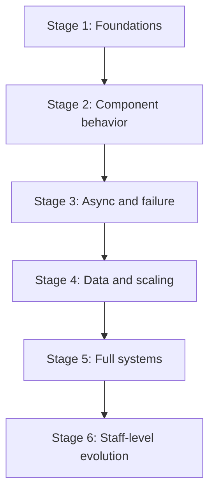

# Challenge Progression

## Purpose

Use this progression to move from small component behavior to full system
designs. Each stage combines labs, walkthroughs, and practice prompts so you can
build intuition in code, then explain the architecture decision in a complete
design.

The goal is not to finish every item quickly. The goal is to know what skill
each exercise should prove before moving to the next stage.

## When This Matters

Use this page when:

- you want a guided sequence instead of picking random labs or walkthroughs;
- you can explain individual components but struggle to combine them;
- you want to decide which practice prompt is appropriate next;
- you need a plan that separates beginner, intermediate, senior, and staff-level
  design skills.

## How To Use The Progression

1. Start at the first stage where the expected skills are not yet comfortable.
2. Run or read the lab before the paired walkthrough when a lab exists.
3. Write a short design answer before reading the walkthrough.
4. Compare your answer with the [self-review checklist](self-review-checklist.md)
   and [system design rubric](system-design-rubric.md).
5. Move up only when you can explain the trade-off, failure behavior, and
   version 1 simplification without looking at the page.

## Progression Map

Treat the stages as a learning loop. If a full walkthrough feels hard to
explain, drop back to the lab or decision page that isolates the weak concept.

## Stage 1: Foundations

Expected skills:

- state the problem and version 1 boundary;
- separate functional and non-functional requirements;
- name core entities and one source of truth;
- sketch one read path and one write path;
- remove unjustified components before drawing the final diagram.

Practice sequence:

| Order | Challenge | Why It Fits |
| --- | --- | --- |
| 1 | [Requirement discovery](../method/requirement-discovery.md) | Turns vague prompts into architecture-shaping requirements |
| 2 | [System design process](../method/system-design-process.md) | Gives the repeatable flow from prompt to decisions |
| 3 | [Interview beginner prompts](interview-practice-prompts.md#beginner-prompts) | Keeps scope small enough to practice requirements and data ownership |
| 4 | [URL shortener walkthrough](../walkthroughs/url-shortener.md) | Shows a compact full design with read/write paths, identifiers, caching, and abuse concerns |

Promotion check:

- You can explain why the URL shortener needs a mapping store before talking
  about caches, analytics, or 10x scale.

## Stage 2: Component Behavior

Expected skills:

- run a lab and connect observed behavior to an architecture choice;
- explain when a component is justified and what it makes harder;
- use metrics or thresholds instead of vague scale language;
- distinguish version 1 from future scale mechanisms.

Practice sequence:

| Order | Challenge | Why It Fits |
| --- | --- | --- |
| 1 | [Rate limiter lab](../../labs/rate-limiter/) | Shows burst capacity, refill behavior, and user-visible rejection |
| 2 | [Rate limiter walkthrough](../walkthroughs/rate-limiter.md) | Turns limiter behavior into requirements, storage choices, abuse controls, and failure handling |
| 3 | [Cache-aside demo](../../labs/cache-aside-demo/) | Shows cache miss, hit, stale data, invalidation, and fallback |
| 4 | [Search autocomplete walkthrough](../walkthroughs/search-autocomplete.md) | Connects indexing, freshness, ranking, and latency trade-offs |

Cache-aside isolates stale-data and fallback behavior. Search autocomplete then
adds index freshness, ranking, and latency pressure so the learner can compare
two different read-optimization choices.

Promotion check:

- You can justify or reject a cache, limiter, or search index using a named
  requirement, a bottleneck, and a failure mode.

## Stage 3: Async And Failure

Expected skills:

- decide what must happen synchronously and what can happen later;
- define retries, idempotency, duplicate handling, and retry exhaustion;
- name user-visible behavior during partial failure;
- identify minimal operational signals for background work.

Practice sequence:

| Order | Challenge | Why It Fits |
| --- | --- | --- |
| 1 | [Queue worker demo](../../labs/queue-worker-demo/) | Shows enqueue, worker processing, retry, visibility timeout, and observability |
| 2 | [Retry and idempotency demo](../../labs/retry-idempotency-demo/) | Shows duplicate requests, unsafe retries, idempotency keys, and guarded side effects |
| 3 | [Dead-letter queue demo](../../labs/dead-letter-queue-demo/) | Shows poison messages, retry exhaustion, inspection, replay, and alerting |
| 4 | [Notification system walkthrough](../walkthroughs/notification-system.md) | Combines preferences, queues, providers, retries, templates, and dead-letter behavior |
| 5 | [Payment workflow walkthrough](../walkthroughs/payment-workflow.md) | Raises correctness stakes with external providers, ambiguous outcomes, reconciliation, and audit logs |

Promotion check:

- You can explain why a retry is safe or unsafe, what makes the operation
  idempotent, and how an operator notices stuck or exhausted work.

## Stage 4: Data And Scaling

Expected skills:

- explain source-of-truth, derived, cached, and replicated data;
- identify stale reads and conflict behavior;
- reason about partitioning, hot keys, append-only history, compaction, and
  cross-partition limitations;
- use scale mechanisms only after naming the pressure they solve.

Practice sequence:

| Order | Challenge | Why It Fits |
| --- | --- | --- |
| 1 | [Replication lag simulator](../../labs/replication-lag-simulator/) | Shows follower lag, stale reads, and read-your-writes violations |
| 2 | [Quorum read/write simulator](../../labs/quorum-read-write-simulator/) | Shows quorum choices, unavailable replicas, stale reads, and latency trade-offs |
| 3 | [Sharding simulator](../../labs/sharding-simulator/) | Shows hash sharding, range sharding, resharding, hot partitions, and cross-shard queries |
| 4 | [Hot-key demo](../../labs/hot-key-demo/) | Shows skewed load and mitigation strategies |
| 5 | [Log compaction demo](../../labs/log-compaction-demo/) | Shows append-only history, latest-value compaction, consumer offsets, and retention trade-offs |
| 6 | [News feed walkthrough](../walkthroughs/news-feed.md) | Combines fanout, feed generation, ranking, caching, celebrity users, and freshness |

Log compaction matters when consumers need a retained change history but most
reads or rebuilds only need the latest value per key. It is also a good place to
practice explaining retention and replay limits instead of treating a log as
free storage forever.

Promotion check:

- You can say which read may be stale, which write must be protected, and which
  scaling mechanism is justified by the first bottleneck.

## Stage 5: Full Systems

Expected skills:

- combine requirements, APIs, data, components, scaling, reliability, security,
  observability, cost, and simplification;
- reject plausible alternatives and explain the trade-off;
- show version 1 and what changes at 10x scale;
- use diagrams to clarify flows instead of decorating the answer.

Practice sequence:

| Order | Challenge | Why It Fits |
| --- | --- | --- |
| 1 | [File storage system walkthrough](../walkthroughs/file-storage-system.md) | Combines metadata, object storage, signed access, scanning, lifecycle, and permissions |
| 2 | [Video processing walkthrough](../walkthroughs/video-processing.md) | Combines upload, object storage, transcoding, queues, workers, CDN, status tracking, and retries |
| 3 | [Chat system walkthrough](../walkthroughs/chat-system.md) | Combines delivery, ordering, offline users, presence, read receipts, and scaling |
| 4 | [Metrics platform walkthrough](../walkthroughs/metrics-platform.md) | Combines ingestion, buffering, aggregation, storage, dashboards, retention, high-cardinality data, and alerts |
| 5 | [Senior prompts](interview-practice-prompts.md#senior-prompts) | Forces trade-offs across correctness, operations, security, and cost without a ready walkthrough |

Promotion check:

- You can produce a coherent 30-minute answer with requirements first, justified
  components, explicit failure behavior, and a smaller version 1.

## Stage 6: Staff-Level Evolution

This stage is evolution and critique practice. It intentionally uses prompts,
concept pages, and a template rather than runnable labs, because the skill is
framing risk and sequencing change across teams.

Expected skills:

- frame ambiguous scope and decide what not to solve;
- reason about migration, organizational ownership, and operating cost;
- plan for failure, recovery, compliance, and long-term data lifecycle;
- separate platform strategy from the first useful increment.

Practice sequence:

| Order | Challenge | Why It Fits |
| --- | --- | --- |
| 1 | [Staff-level prompts](interview-practice-prompts.md#staff-level-prompts) | Practices broad framing, migration, abuse control, observability, and retention |
| 2 | [Disaster recovery](../reliability/disaster-recovery.md) | Grounds failover, RPO/RTO, degraded mode, and operational readiness |
| 3 | [Schema evolution](../data/schema-evolution.md) | Grounds migration, compatibility, rollout, and rollback decisions |
| 4 | [Cost analysis](../operations/cost-analysis.md) | Forces trade-offs between infrastructure, operational labor, and user value |
| 5 | [Design critique template](../../templates/design-critique-template.md) | Turns staff-level reasoning into constructive review feedback |

Promotion check:

- You can explain the current architecture, the next migration step, the risk of
  waiting, the risk of moving too early, and the signal that decides the timing.

## Difficulty Summary

| Stage | Difficulty | Main Output | Expected Skills |
| --- | --- | --- | --- |
| 1 | Beginner | Small design answer | Requirements, core entities, read/write path, version 1 |
| 2 | Beginner to intermediate | Component justification | Observed behavior, metrics, component trade-offs, deferred complexity |
| 3 | Intermediate | Async workflow design | Queues, retries, idempotency, DLQs, partial failure, observability |
| 4 | Intermediate to senior | Data scaling design | Replication, stale reads, quorum, sharding, hot keys, bottleneck reasoning |
| 5 | Senior | End-to-end system design | Complete architecture, alternatives, operations, cost, security, 10x changes |
| 6 | Staff-level | Evolution plan or critique | Scope framing, migration, ownership, recovery, compliance, long-term operations |

## Practice Routine

For each stage:

1. Run the lab or read the component page.
2. Write three observations that affect architecture.
3. Attempt the paired prompt or walkthrough from memory.
4. Compare your answer with the walkthrough or linked decision pages.
5. Write one practice-loop note, such as: "After the queue worker demo, design
   an export job system and explain why retries need idempotency and DLQ
   handling."
6. Use the [simplification checklist](simplification-checklist.md) to remove
   unsupported complexity.
7. Use the [common mistakes catalog](common-mistakes.md) to find vague
   consistency, missing failure modes, cache overuse, or unjustified streams.
8. Score the result with the [system design rubric](system-design-rubric.md).
9. Capture what changed in your reasoning with the
   [project reflection template](../../templates/project-reflection-template.md).

## Common Mistakes

- Moving to full walkthroughs before you can explain a single component's
  failure behavior.
- Treating labs as code exercises only and not writing the design implication.
- Memorizing walkthrough architecture instead of practicing the requirement
  path.
- Skipping version 1 simplification when an advanced walkthrough includes
  future-scale components.
- Practicing staff-level prompts before you can clearly operate a senior-level
  system.

## Checklist

Before moving to the next stage, confirm:

- I can state the expected skills for the current stage.
- I completed at least one lab or walkthrough from the stage.
- I explained the design without copying the walkthrough structure.
- I named one trade-off, one failure mode, and one observability signal.
- I separated version 1 from 10x scale.
- I know which lower-stage concept to revisit if the next stage feels unclear.

## Related Pages

- [Interview practice prompts](interview-practice-prompts.md)
- [System design rubric](system-design-rubric.md)
- [Self-review checklist](self-review-checklist.md)
- [Simplification checklist](simplification-checklist.md)
- [Common mistakes](common-mistakes.md)
- [Project reflection template](../../templates/project-reflection-template.md)
- [Labs guide](../labs/)
- [Walkthroughs](../walkthroughs/)
