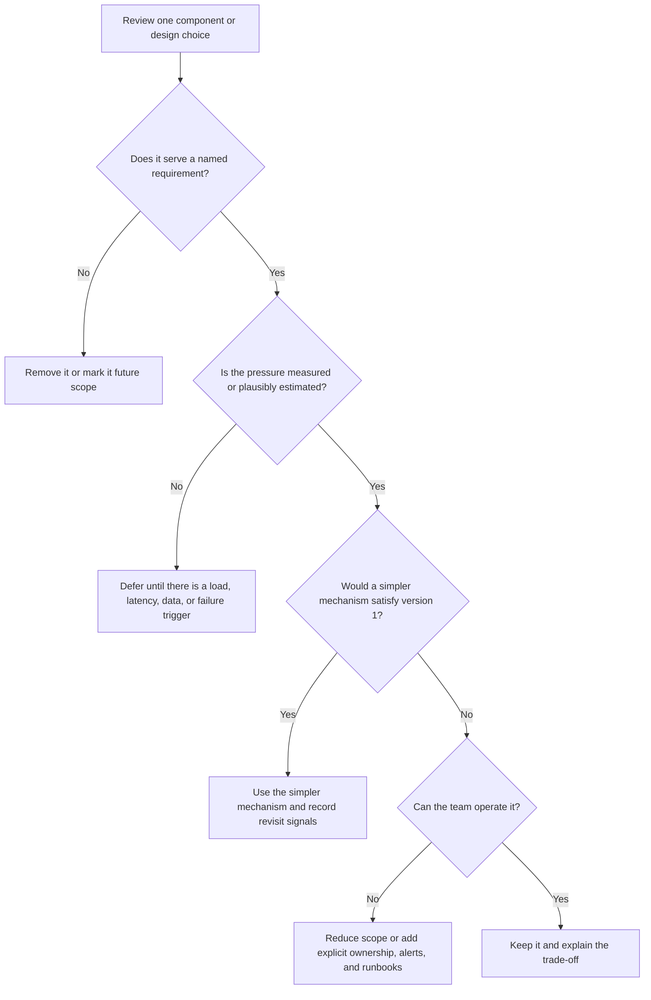

# Overengineering Checklist

## Purpose

Use this checklist to find designs that are more complex than the requirements
justify. A design is overengineered when it adds components, scale mechanisms,
service boundaries, or operating procedures before they solve a named problem.

The goal is not to make every design small. The goal is to make complexity earn
its place.

## When This Matters

Use this page when:

- a diagram has many boxes but the requirements are still unclear;
- the design starts with future-scale infrastructure before estimating load;
- the team cannot explain who will operate each component;
- a reviewer asks why a cache, queue, stream, replica, shard, scheduler, or
  service split exists;
- version 1 looks as expensive to build and operate as the mature system.

## Quick Diagnostic

| Signal | Likely Problem | Better Move |
| --- | --- | --- |
| The design has components without named requirements | Unnecessary components | Remove or defer each component until it maps to a workflow, bottleneck, failure mode, or operating need |
| The answer starts with sharding, multi-region, or event streaming before load estimates | Premature scaling | Estimate traffic, data size, write contention, latency targets, and growth triggers first |
| Requirements use words such as real-time, scalable, reliable, or secure without targets | Unclear requirements | Turn vague qualities into workflow-specific constraints and acceptance thresholds |
| Every feature gets its own service, datastore, queue, and dashboard | Unjustified operational burden | Start with fewer deployable units and name the owner, alert, runbook, and failure mode for each added part |
| A future migration concern dominates the version 1 design | Design for an imagined future | State the reversible choice now and the evidence that would justify migration later |

## Diagnostic Flow



Use the flow one component at a time. A system can have one justified advanced
part and three unnecessary ones.

## Questions To Ask

### Requirements

- What user workflow breaks if this component is removed?
- Which functional or non-functional requirement does it satisfy?
- Is the requirement current, or is it a future assumption?
- What target makes the requirement concrete: latency, throughput, freshness,
  availability, recovery time, data retention, or abuse limit?
- What is explicitly out of scope for version 1?

### Components

- Does each component have one clear responsibility?
- Is there a simpler option: direct call, database table, scheduled job, queue,
  indexed read, or manual review?
- Does the component create a new source of truth?
- Does it require new deployment, monitoring, permissions, backup, or incident
  response work?
- Can the design still solve the core problem if the component is removed?

### Scale

- What is the estimated read rate, write rate, data size, fanout, or hot-key
  pressure?
- Which part saturates first?
- What metric would prove the bottleneck exists?
- What threshold would justify replicas, caching, partitioning, sharding,
  batching, streaming, or multi-region deployment?
- Is the proposed scale mechanism needed at launch or only after growth?

### Operations

- Who owns the component when it pages?
- What alert proves it is unhealthy?
- What dashboard or log lets an operator debug one failed user workflow?
- What runbook action is expected after the alert?
- What new failure mode does the component introduce?
- What cost does it add in infrastructure, testing, deployment, and support?

## Decision Guidance

| Choice | Use When | Avoid When |
| --- | --- | --- |
| Keep the component | It directly satisfies a named requirement, simpler options fail, and operating ownership is clear | It is present because it is common in reference architectures |
| Defer the component | The pressure is plausible but not needed for version 1 | Deferral would create data loss, unsafe security behavior, or a migration that is clearly more expensive than building it now |
| Replace with a simpler mechanism | A single database, transaction, scheduled job, queue, or manual workflow meets the current need | The simpler mechanism cannot meet correctness, availability, latency, or recovery requirements |
| Add a revisit signal | The future need is real but evidence is missing | Nobody will measure the signal or act on it |
| Split the service | Ownership, scale, reliability, or data lifecycle differs enough to justify a boundary | The split only mirrors nouns in the product domain |

Complexity is justified when removing it would violate correctness, security,
availability, recovery, or a committed user experience. In that case, keep the
component and make the cost visible instead of pretending the simpler design is
free.

## Common Overengineering Patterns

### Component Collection

The design lists an API gateway, cache, queue, stream, search cluster, multiple
databases, workers, and analytics pipeline before explaining the workflow.

Fix it by writing the read path and write path first. Add a component only when
the path needs it.

### Premature Scaling

The design starts with sharding, global replication, or autoscaling groups
without estimating traffic, data size, or contention.

Fix it by naming the first likely bottleneck and the measurement that would
justify a scaling move.

### Unclear Requirement Expansion

The prompt asks for basic reservations, but the design adds recommendations,
fraud detection, advanced search, and real-time collaboration.

Fix it by separating version 1, explicit non-goals, and future features.

### Unjustified Operational Burden

The design adds infrastructure that needs separate dashboards, alerts, backups,
schema migrations, replay tools, and on-call knowledge, but no one names the
owner or runbook.

Fix it by either removing the component or writing the operational contract
alongside the architecture decision.

### Perfect Platform Thinking

The answer builds a general framework for many future products instead of the
small system in the prompt.

Fix it by solving one concrete workflow and recording the extension point that
would be cheapest to change later.

## Trade-Offs

Simplifying a design has trade-offs:

- Fewer components can mean more work in one service until a real boundary
  appears.
- A single database may need careful schema and transaction design before a
  later split.
- Manual review can be acceptable for rare events, but it must have a queue,
  owner, and service target if users are waiting.
- Deferring cache, sharding, or streaming can make launch easier, but the design
  should still record the measurement that triggers revisiting the choice.

Adding complexity also has trade-offs:

- More services create more network failure, deployment coordination, and
  authorization boundaries.
- More datastores create synchronization, backup, migration, and source-of-truth
  questions.
- More asynchronous paths create retry, ordering, duplicate work, and repair
  behavior.
- More operational surfaces create more dashboards, alerts, runbooks, and cost.

Neither side is always correct. The useful answer explains why this scope needs
this amount of complexity now.

## Original Examples

### Court Booking System

Prompt: design a small city sports court booking system.

Overengineered first draft:

```text
Use user, court, booking, payment, notification, analytics, and search services.
Write every booking event to a stream. Cache court availability. Shard bookings
by neighborhood. Deploy active-active across regions.
```

Checklist findings:

- Unclear requirements: the draft does not say whether version 1 needs payments,
  search, analytics, or multi-region availability.
- Unnecessary components: search and analytics do not support the core booking
  workflow yet.
- Premature scaling: sharding and active-active deployment appear before traffic,
  booking volume, contention, or availability targets.
- Operational burden: seven services, a stream, a cache, shards, and multi-region
  failover all need monitoring and repair paths.

Smaller version 1:

```text
Residents browse courts, view available slots, reserve one slot, cancel a
reservation, and receive a reminder. Staff can block a court for maintenance.
One service and one relational database own courts, slots, reservations, users,
and staff audit events. Booking uses a transaction or conditional update so two
users cannot reserve the same slot. Reminder delivery can use a simple queue or
scheduled job because it does not block confirmation.
```

Revisit signals:

- Add cache when measured availability reads exceed the database latency target,
  such as p95 above 300 ms for a sustained week, and stale results are
  acceptable.
- Add search when indexed filters still leave more than 10% of court lookups
  ending in no booking attempt.
- Add service boundaries when staff tools, booking traffic, or notification
  delivery need independent ownership or scaling.
- Add regional failover when downtime targets justify the cost and correctness
  work.

### Support Triage

Prompt: route customer support tickets to the right team.

The complex design adds a machine learning classifier, event stream, workflow
engine, rule database, custom dashboard, and replay service. The current
requirement is only to handle 300 tickets per day with three support teams.

A simpler design can start with:

- a ticket table with status, category, priority, owner, and history;
- a small set of editable routing rules;
- a background job that assigns unowned tickets every minute;
- a manual override for supervisors;
- metrics for unassigned ticket age, reassignment count, and rule failures.

The advanced classifier becomes justified after manual categories miss the
service target, such as p95 first assignment above 30 minutes, or routing errors
exceed an agreed threshold with enough labeled history to evaluate the model.

## Checklist

Before accepting a design, confirm:

- Every component maps to a named requirement, bottleneck, failure mode, or
  operating need.
- Vague requirements have been replaced with workflow-specific targets.
- Version 1 is smaller than the full future system.
- Scale mechanisms are tied to estimates or revisit thresholds.
- Service boundaries are justified by ownership, data lifecycle, reliability,
  deployment, or scale pressure.
- Caches, queues, streams, replicas, shards, and workers have clear failure and
  repair behavior.
- Operational burden is visible: alerts, dashboards, runbooks, ownership, and
  cost are named for advanced components.
- The design states at least one rejected simpler alternative.
- Future complexity has a trigger instead of being built by default.

## Review Template

```text
Component or decision:
Requirement it serves:
Simpler alternative:
Why the alternative is insufficient:
New failure or operating burden:
Metric or signal that justifies it:
Keep, replace, or defer:
```

## Related Pages

- [System design rubric](system-design-rubric.md)
- [Self-review checklist](self-review-checklist.md)
- [Common mistakes](common-mistakes.md)
- [Component selection map](../components/)
- [Scale estimation](../method/scale-estimation.md)
- [Bottleneck analysis](../scalability/bottleneck-analysis.md)
- [Cost analysis](../operations/cost-analysis.md)
- [Failure-mode analysis](../reliability/failure-mode-analysis.md)
