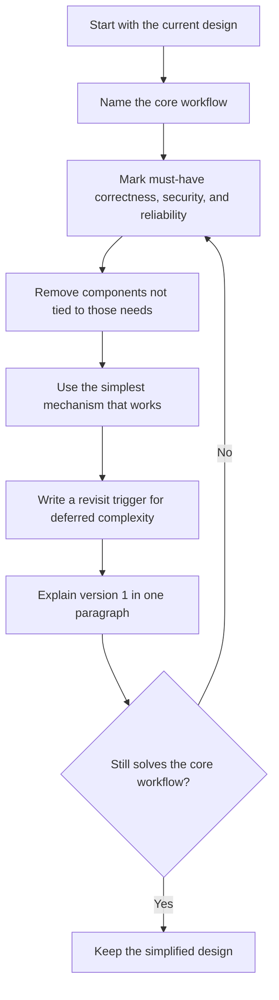

# Simplification Checklist

## Purpose

Use this checklist to turn an oversized system design into a practical version
1. It helps you keep the core user workflow, remove unsupported complexity, and
write clear revisit signals for what should change at larger scale.

Simplification is not the same as ignoring requirements. A simpler design still
has to protect correctness, security, failure behavior, and the user promise.

## When This Matters

Use this page when:

- the first diagram has more components than requirements;
- version 1 and the future system are mixed together;
- a cache, queue, stream, shard, replica, scheduler, search system, or service
  split is present without a trigger;
- the design is hard to explain in two minutes;
- you found issues in the [common mistakes catalog](common-mistakes.md) or the
  [overengineering checklist](overengineering-checklist.md).

## Questions To Ask

- What is the smallest workflow that delivers user value?
- Which actors and actions are required on day one?
- Which data must be correct immediately, and which data can lag?
- Which component can be replaced by a database table, transaction, direct call,
  scheduled job, or manual operation?
- What risk appears if the component is removed?
- What metric, volume, incident, or team boundary would justify adding it later?
- What can be explicitly marked out of scope?

## Simplification Loop



The loop is useful after a self-review or mock interview. Run it once before
adding any component that was not in the original requirement.

## Concrete Simplification Moves

| Complex Choice | Version 1 Move | Revisit When |
| --- | --- | --- |
| Many microservices | Use one deployable system with clear internal modules | One module has a distinct owner, release cadence, data lifecycle, or scale profile |
| Dedicated search cluster | Use indexed database queries and narrow filters | Query latency or relevance fails a measured target after indexed reads are tuned |
| Event stream for every write | Use a direct call, or use a queue, database outbox, or table-backed worklist only when async durability is already required | Consumers need retained history, replay, many independent subscriptions, or ordering guarantees |
| Cache in front of every read | Read from the source with indexes and pagination | Measured read latency, source load, or repeated computation exceeds the target and stale data is acceptable |
| Sharding at launch | Keep one logical database and design clean entity keys | Data size, write contention, tenant isolation, or hot partitions exceed a stated threshold |
| Multi-region active-active | Start in one region with backups and a recovery plan | Availability or recovery targets justify cross-region consistency, failover, and operating cost |
| Fully automated admin tooling | Start with a documented manual operation for rare, low-risk cases | Manual work becomes frequent, risky, slow, or audit-sensitive |
| Custom workflow engine | Use explicit statuses and a small state transition table | Many teams need configurable workflows with audit, rollback, and migration support |
| Machine learning ranking | Use rules, filters, or recency ordering | There is enough labeled data and a measured quality gap that rules cannot close |
| Real-time collaboration | Use refresh, polling, or simple notifications | Users need simultaneous editing, presence, or sub-second shared state |

## Version 1 Versus 10x Scale

Separate what you will build now from what you would change after growth.

| Area | Practical Version 1 | 10x Scale Direction |
| --- | --- | --- |
| Requirements | One core workflow, named users, clear non-goals | More workflows, tenant differences, stricter service targets |
| Data | One source of truth and simple ownership | Partitioning, archival, derived stores, data lifecycle automation |
| Reads | Indexed source reads, pagination, bounded queries | Caches, read replicas, search systems, precomputed views |
| Writes | Transactions or conditional writes around critical conflicts | Queues, outbox, batching, backpressure, partition-aware writes |
| Services | One deployable service or a small number of owned boundaries | Split where ownership, reliability, scale, or data lifecycle differs |
| Reliability | Timeouts, retries where safe, backups, basic repair path | Failover automation, replay, reconciliation, regional recovery targets |
| Operations | A few metrics, logs, alerts, and manual runbooks | SLOs, dashboards by workflow, automated remediation, capacity planning |
| Cost | Prefer fewer managed surfaces and simpler operations | Optimize hotspots after usage and cost drivers are visible |

Do not put the 10x design in the version 1 column just because it sounds more
complete. Use the 10x column to show that you understand the future without
building it before the evidence exists.

## Decision Guidance

### Keep Complexity When

- removing it would break correctness, security, or a committed availability
  target;
- the simpler option cannot meet the latency, throughput, freshness, retention,
  or recovery requirement;
- migration later would create unacceptable data loss or user disruption;
- the team has clear ownership, monitoring, runbooks, and cost budget.

### Remove Or Defer Complexity When

- the component exists only because it is common in architecture diagrams;
- no user workflow changes if it is removed;
- no one can name the metric that would prove it is needed;
- it creates a second source of truth without a consistency plan;
- it adds on-call work before the product value is proven.

### Replace Complexity When

- a transaction can replace a distributed workflow;
- a table-backed worklist can replace a new queue for low-volume owned work;
- a direct call can replace async messaging when the user needs the result now;
- an indexed query can replace a search system for simple filters;
- a documented manual step can replace automation for rare operational cases.

## Trade-Offs

Simplification accepts some constraints:

- One service can become crowded if modules are not kept clear.
- One database can become a bottleneck if access patterns grow faster than
  expected.
- Manual operations can become support toil if volume increases.
- Deferring a split can make future migration work real.
- Fewer components reduce operating burden but may concentrate failure impact.

The answer should name these trade-offs. A good simplified design says both
what it removes and what risk it accepts by removing it.

## Common Mistakes While Simplifying

- Removing reliability or security because they look like extra work.
- Treating every future requirement as out of scope without naming revisit
  triggers.
- Replacing a queue or workflow with a manual step when users are waiting.
- Keeping hidden complexity in vague phrases such as "we can scale later."
- Removing observability, leaving no signal for whether version 1 works.
- Confusing "small" with "unclear"; version 1 still needs explicit data,
  workflow, and failure behavior.

Use the [common mistakes catalog](common-mistakes.md) when the simplified answer
still contains premature microservices, unjustified streams, vague consistency,
missing failure modes, or cache-heavy reasoning.

## Original Example: Team Lunch Ordering

Initial design:

```text
Employees order lunch from restaurants. Use separate services for users,
menus, carts, orders, payments, notifications, analytics, and recommendations.
Use a stream for all state changes, cache menus, shard orders by office, and
build an admin dashboard for restaurant onboarding.
```

Simplified version 1:

```text
Employees choose from a small set of approved menus, place an order before the
daily cutoff, and receive a confirmation. Office admins can upload menus and
close ordering for the day. One service and one relational database own users,
menus, orders, cutoff windows, and admin audit events. Order placement uses a
transaction so each employee has at most one active order per day. A scheduled
job sends reminder emails before cutoff and a summary to admins after cutoff.
```

Concrete moves:

- Remove recommendations until there is enough order history and a measured
  discovery problem.
- Replace the event stream with a scheduled summary job because no consumer
  needs replay or retained event history.
- Keep menu reads in the database until menu latency or database load exceeds a
  target.
- Skip sharding because one office and daily order volume do not create a data
  size or write contention problem.
- Use a simple admin upload workflow instead of a full onboarding platform.

Minimal version 1 signals:

- order placement failure rate;
- cutoff summary job failures;
- reminder email delivery failures;
- orders submitted after cutoff.

Version 1 versus 10x:

| Decision | Version 1 | 10x Revisit Signal |
| --- | --- | --- |
| Service boundary | One service with menu, order, and admin modules | Split restaurants or notifications when ownership and release cadence diverge |
| Menu reads | Indexed database reads | Cache when p95 menu load stays above 300 ms for a week under measured traffic |
| Order events | Scheduled job and audit table | Stream when finance, analytics, and restaurant systems need replayable events |
| Restaurant onboarding | Manual admin upload | Build self-service onboarding when setup takes longer than one business day or misses launch commitments |
| Data partitioning | One orders table keyed by office and date | Partition when retention, query volume, or office isolation requires it |

## Original Example: Incident Notes

Prompt: help on-call engineers write notes during incidents.

Practical version 1:

- create an incident;
- append timestamped notes;
- mark severity and owner;
- link alerts, dashboards, and follow-up tasks;
- export a summary after resolution.

Deferred from version 1:

- live multi-cursor editing;
- automatic root-cause classification;
- cross-region active-active storage;
- custom workflow scripting;
- long-term analytics warehouse.

Why this is still useful:

- The core problem is capturing accurate notes during an incident.
- A single source of truth with append-only notes protects auditability.
- Polling every few seconds is acceptable before true collaborative editing is
  required.
- Operators can notice value before the system becomes another incident
  platform to operate.

10x signals:

- Add real-time collaboration when simultaneous editors frequently overwrite or
  miss each other's updates.
- Add analytics when teams need trend reports across many resolved incidents.
- Add regional recovery when incident notes must remain writable during a full
  regional outage.

## Checklist

Before finishing a simplified design, confirm:

- The core workflow is stated in one or two sentences.
- Version 1 users, actions, and non-goals are explicit.
- Every kept component has a named requirement or risk.
- Every removed component has either a reason or a revisit trigger.
- The design preserves correctness, security, failure handling, and observability.
- Version 1 and 10x scale are separated.
- Concrete simplification moves are listed, not only a vague promise to simplify.
- At least one simpler alternative was considered and either chosen or rejected.
- Related common mistakes have been checked.

## Review Template

```text
Core workflow:
Version 1 must include:
Version 1 explicitly excludes:
Components to keep:
Components to remove:
Simpler replacement:
Risk accepted by simplifying:
Metric or event that triggers 10x design:
Common mistake to re-check:
```

## Related Pages

- [Common mistakes](common-mistakes.md)
- [Overengineering checklist](overengineering-checklist.md)
- [Self-review checklist](self-review-checklist.md)
- [System design rubric](system-design-rubric.md)
- [Requirement discovery](../method/requirement-discovery.md)
- [Failure-mode analysis](../reliability/failure-mode-analysis.md)
- [Component selection map](../components/)
- [Scale estimation](../method/scale-estimation.md)
- [Bottleneck analysis](../scalability/bottleneck-analysis.md)
- [Cost analysis](../operations/cost-analysis.md)
