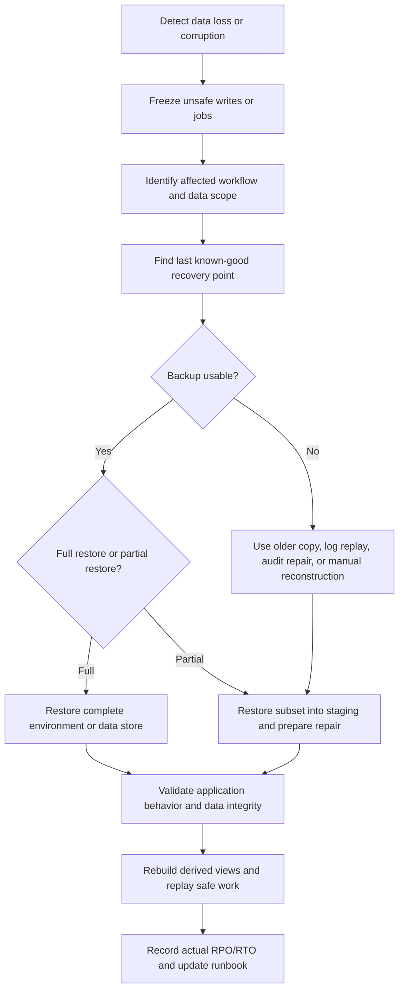

# Backup and Restore Recovery

Backup and restore recovery is the operational plan for using recovery copies to
return a workflow to a known-good state. It is different from merely having
backups. The recovery plan names what to restore, how to validate it, how to
handle corrupted backups, when partial restore is safer than full restore, and
which operator runbook controls the work.

Use this page when a design needs to prove that important data can be recovered
under real incident pressure.

## Purpose

Restore-focused recovery answers:

- Which workflow is broken and which data must be recovered?
- Which backup, log, event stream, object copy, or audit history is safe to use?
- How much data loss is acceptable, and how long can recovery take?
- How is the restored data validated before users or workers depend on it?
- What happens if the newest backup is corrupted or incomplete?
- When should operators perform a partial restore instead of a full rollback?
- Which runbook steps, approvals, and evidence are required?

A restore plan should return the system to a usable, explainable state. It
should not only copy bytes back into a database.

## When This Matters

This matters when:

- data loss, deletion, bad migration, bad import, or corruption affects an
  authoritative workflow;
- backups exist but restore time and validation are untested;
- a standby or replica may contain the same bad data as production;
- operators need to recover one tenant, account, table, file set, or workflow;
- recovery requires coordination across databases, object storage, queues,
  caches, search indexes, or downstream side effects;
- support and incident response need a shared runbook.

For a small system, the runbook may be short. It still needs a tested restore
target, validation steps, and an owner.

## Questions To Ask

Start with incident scope:

- What changed incorrectly, disappeared, or became unavailable?
- Which user-visible workflow is affected?
- Which data is authoritative, audit, derived, temporary, or external?
- Is the problem still spreading?
- What is the last known-good point?
- Which recent valid writes must be preserved?

Then choose the recovery path:

- Which backup frequency and retention window can meet the RPO?
- Which restore process can meet the RTO?
- Can the restore be tested in isolation before production repair?
- Is a partial restore safer than a full restore?
- Which caches, indexes, queues, and side effects need reconciliation?
- Who approves the restore and who validates success?

## Restore Recovery Flow



## Decision Guidance

### Restore Testing

Restore testing proves the recovery path works before the incident.

Test at several levels:

- technical restore: the backup can be loaded, decrypted, and opened;
- data validation: row counts, object counts, checksums, constraints, and
  sample records match expectations;
- application validation: the service can read restored data and perform safe
  representative queries;
- workflow validation: a user or operator path works against restored state;
- reconciliation validation: derived views, queues, and side effects can be
  brought back into agreement.

Record actual time, data volume, steps used, gaps found, and runbook changes.
The measured restore time is part of the RTO evidence.

### Corrupted Backups

A corrupted backup is a copy that cannot be restored or restores to bad state.
The corruption may come from storage damage, incomplete backup jobs, schema
mismatch, bad application writes, migration bugs, accidental deletion, or
credentials that allowed production damage to delete backups too.

Design responses:

- keep multiple recovery points and retention long enough to predate delayed
  discovery;
- validate backup creation and restore, not only job completion;
- monitor data invariants that reveal logical corruption;
- isolate backup permissions from normal production write permissions;
- protect backup metadata, encryption keys, and object manifests;
- rehearse fallback to an older backup plus log replay or audit repair;
- decide when manual reconstruction is safer than restoring bad data.

If every retained backup contains the same logical corruption, recovery becomes
repair and reconciliation, not simple restore.

### Partial Restore

Partial restore recovers a subset of data while preserving valid recent work
elsewhere. It is useful when the incident affects one tenant, account, table,
folder, object prefix, or workflow.

Use partial restore when:

- full rollback would discard too much valid work;
- the affected scope can be identified clearly;
- relationships and side effects can be reconciled;
- operators can validate the repaired subset before release;
- the RTO is shorter than a full restore.

Partial restore steps usually include:

1. Restore the relevant backup into an isolated environment.
2. Extract the affected rows, files, or events.
3. Compare restored state with current valid state.
4. Generate a reviewed repair plan.
5. Apply the repair with audit logging.
6. Rebuild derived views and clear stale caches.
7. Reconcile queued work and external side effects.

Partial restore is powerful but risky. If the scope is uncertain or the
relationships are too tangled, a full restore or forward repair may be safer.

### Backup Frequency

Backup frequency should follow the RPO for the workflow and the available repair
mechanisms.

Examples:

- A booking workflow with zero acknowledged loss may need frequent recovery
  points plus durable logs or replication.
- A dashboard that can be regenerated may need source-data backup more than
  backup copies of every rendered report.
- Uploaded files may need object versioning or copy cadence aligned with file
  metadata backups.
- Audit history may need longer retention than ordinary current-state rows.

Frequency alone does not solve recovery. Restore speed, validation, corruption
detection, and operator readiness determine whether the backup can meet the
RTO.

Use [Backups and restore](../data/backups-and-restore.md) for the data-design
side of backup scope and [RPO and RTO](rpo-rto.md) for target setting.

### Operator Runbooks

An operator runbook turns recovery into repeatable action.

A restore runbook should include:

- incident entry criteria;
- owner and approval path;
- stop-the-bleeding steps, such as pausing imports or disabling unsafe writes;
- how to choose the recovery point;
- commands or procedures for restore into isolation;
- validation checklist before production repair;
- partial restore or full restore decision criteria;
- communication notes for support and users;
- rollback or abort criteria;
- post-restore reconciliation and monitoring;
- evidence to record for actual RPO, actual RTO, and follow-up work.

The runbook should be rehearsed. A runbook that has never been executed is a
draft, not a recovery capability.

### Reconciliation After Restore

Restoring authoritative data rarely finishes the incident. The rest of the
system may have observed old, missing, or incorrect state.

Check:

- search indexes and caches;
- queues, outbox rows, and scheduled jobs;
- analytics tables and reports;
- object storage metadata;
- external webhooks, notifications, payments, or partner calls;
- user-visible status fields such as `pending`, `retrying`, or `needs_review`;
- audit logs and support notes.

Reconciliation should preserve idempotency. Do not replay side effects blindly
after restore.

## Trade-Offs

Restore recovery choices trade data preservation, downtime, and repair risk.

- Full restore is simpler to reason about, but can discard valid work that
  happened after the restore point.
- Partial restore preserves more current state, but requires careful scoping and
  reconciliation.
- Frequent backups reduce the recovery point gap, but increase validation and
  storage work.
- Older backups may predate corruption, but require more replay and manual
  repair.
- Automation can reduce RTO, but restore operations still need approvals,
  audit, and abort criteria.
- Keeping the system read-only during recovery protects data, but can extend
  user-visible degradation.

Choose the path that returns the critical workflow to a known-good state with
the least additional damage.

## Common Mistakes

- Treating backup job success as restore readiness.
- Restoring directly into production before validating the backup.
- Using the newest backup without checking whether it contains corruption.
- Performing full rollback when a scoped partial repair would preserve valid
  work.
- Forgetting caches, search indexes, queues, and external side effects after
  restoring the database.
- Leaving restore authority, approval, and communication undefined.
- Measuring only restore copy time and ignoring detection, decision, validation,
  and reconciliation.
- Replaying notifications, webhooks, or payments without idempotency checks.

## Example

A neighborhood permit system stores applications, review decisions, attachment
metadata, uploaded files, public search documents, and partner webhook state.

Incident:

```text
A bulk cleanup job deletes attachment metadata for one permit district at
14:20. Uploaded files still exist in object storage. Review decisions and
applications are intact.
```

Restore-focused recovery plan:

| Step | Decision | Reason |
| --- | --- | --- |
| Stop spread | Disable the cleanup job and block metadata deletion | Prevent the incident from expanding |
| Scope | Identify affected district and deletion time from audit events | Avoid full-system rollback |
| Recovery point | Restore the 14:15 database backup into isolation | Last known-good point before deletion |
| Partial restore | Extract only affected attachment metadata rows | Preserve valid permit work after 14:20 |
| Validation | Compare restored metadata to object storage files and sample permit pages | Proves restored rows point to real files |
| Repair | Apply reviewed insert repair with audit record | Keeps production current state intact |
| Reconciliation | Rebuild permit search documents and retry partner webhook events that reference attachments | Derived systems catch up safely |
| Evidence | Record actual lost work, restore duration, validation results, and runbook gaps | Improves future drills |

The system does not restore the entire database because that would discard valid
reviews and new applications submitted after 14:20. It uses backup data as an
input to a targeted repair.

## Checklist

Before approving restore-focused recovery, confirm:

- The affected workflow and authoritative data are named.
- Backup frequency and retention can meet the workflow RPO.
- Restore testing includes technical, data, application, and workflow
  validation.
- Corrupted backups have detection, retention, and fallback plans.
- Partial restore criteria are defined for scoped incidents.
- Full restore criteria are defined for broad or uncertain incidents.
- Operator runbooks include owner, approval, stop-the-bleeding, restore,
  validation, communication, abort, and reconciliation steps.
- Derived views, caches, queues, object metadata, and external side effects have
  post-restore reconciliation paths.
- Restore operations are auditable and access-controlled.
- Actual RPO, actual RTO, drill results, and runbook gaps are recorded.

## Related Pages

- [Reliability](index.md)
- [RPO and RTO](rpo-rto.md)
- [Failure-mode analysis](failure-mode-analysis.md)
- [Failover](failover.md)
- [Graceful degradation](graceful-degradation.md)
- [Backups and restore](../data/backups-and-restore.md)
- [Schema evolution](../data/schema-evolution.md)
- [Operational vs analytical data](../data/operational-vs-analytical-data.md)
- [Design review checklist](../method/design-review-checklist.md)
