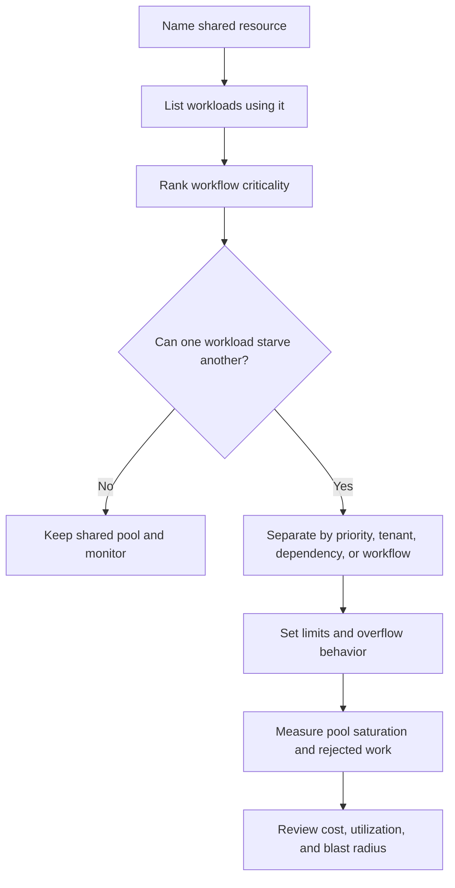

# Bulkheads

Bulkheads isolate resources so one failing workflow, tenant, dependency, or
worker pool cannot consume capacity needed by everything else. The goal is to
turn one overload or failure into a contained problem instead of a full-system
incident.

Use this page when several workloads share the same service, queue, database,
connection pool, cache, thread pool, rate limit, or operator process.

## Purpose

Bulkhead design answers:

- Which workloads should not be able to starve each other?
- Which shared resource fails first during overload?
- Which tenant, customer, region, priority, or workflow needs isolation?
- What limit contains the blast radius?
- What happens when one isolated pool is full?
- Which metrics show that isolation is working?
- What operational cost does the separation add?

A bulkhead is not only a deployment pattern. It can be a queue, connection pool,
rate limit, database schema, worker group, tenant partition, feature flag, or
operational runbook boundary.

## When This Matters

Bulkheads matter when:

- high-priority and low-priority work share the same capacity;
- one tenant can generate enough traffic to hurt others;
- one dependency can make all request handlers block;
- background jobs can starve user-facing requests;
- retries or imports can flood a shared queue;
- an admin action can consume database, cache, or worker capacity needed by
  normal traffic;
- support teams need to repair one workflow without pausing everything.

Bulkheads matter less when a system has one small workload, one trusted tenant,
and simple capacity that is easy to scale manually.

## Questions To Ask

Start with shared resources:

- Which request paths, queues, workers, databases, caches, and external
  dependencies share capacity?
- Which workload is most likely to spike or get stuck?
- Which workflow is most important to protect?
- Which tenant or customer should not affect others?
- Which resource limit should be enforced first?
- What should callers see when their isolated pool is full?

Then define containment:

- Should work be separated by priority, tenant, dependency, region, or workflow?
- Is the limit hard, soft, or burstable?
- Who can override the limit during an incident?
- Which metric proves that only one pool is affected?
- What is the cost of unused reserved capacity?

## Bulkhead Decision Flow

## Decision Guidance

### Pool Separation

Pool separation assigns different workloads to different capacity pools.

Common pools:

- request handler pools;
- database connection pools;
- worker pools;
- queue partitions or topics;
- thread pools;
- API client pools per dependency;
- cache or object-storage namespaces;
- deployment groups for high-risk workloads.

Useful separations:

| Separate By | Use When | Watch For |
| --- | --- | --- |
| Priority | Critical user actions compete with low-priority work | Low-priority starvation |
| Dependency | One slow provider can block unrelated calls | Too many tiny pools |
| Workflow | Reads, writes, imports, exports, or notifications stress different resources | Operational complexity |
| Tenant | One tenant can overload shared capacity | Fairness and capacity waste |
| Region | Local incident should not consume global capacity | Failover and data locality |

Pool separation works when each pool has clear limits and overflow behavior. A
separate queue without worker limits can still overload the same database.

### Tenant Isolation

Tenant isolation prevents one tenant, customer, account, or partner from
consuming resources needed by others.

Isolation options:

- per-tenant rate limits;
- per-tenant queue limits;
- per-tenant worker concurrency;
- per-tenant storage quotas;
- per-tenant cache keys and eviction controls;
- separate high-risk tenants into dedicated pools;
- separate operational dashboards and alerts by tenant.

Use stronger isolation when tenants have very different traffic patterns,
contractual expectations, data sensitivity, or support needs. Use lighter
isolation when all tenants are small and the operational cost of separation
would exceed the risk.

Tenant isolation should also preserve security boundaries. A degraded mode,
cache fallback, or repair tool must not leak data across tenants.

### Resource Limits

Resource limits make isolation enforceable.

Common limits:

- maximum concurrent requests;
- maximum database connections;
- queue depth and queue age thresholds;
- worker concurrency;
- memory and CPU quotas;
- per-tenant or per-key request rates;
- file size, batch size, and import row count;
- retry budgets.

Good limits define overflow behavior:

- reject with a clear retryable response;
- queue within a bounded depth;
- shed low-priority work;
- slow the caller with backpressure;
- route to manual review;
- switch to read-only or degraded mode.

A limit without overflow behavior only moves the incident to the next component.

### Blast-Radius Reduction

Blast radius is the amount of system, user, tenant, data, or operational work
affected by a failure.

Reduce blast radius by:

- isolating optional work from critical work;
- separating batch imports from user-facing APIs;
- isolating slow dependency calls from unrelated request handlers;
- using tenant quotas and per-tenant queues;
- limiting admin bulk actions;
- placing risky migrations or backfills behind throttles;
- designing runbooks that can pause one workflow without stopping all traffic.

Blast-radius reduction is not free. More isolation means more pools to size,
monitor, tune, and debug.

## Trade-Offs

Bulkheads trade utilization for containment.

- Separate pools reduce cross-workload failure, but reserved capacity can sit
  idle.
- Tenant isolation protects fairness, but can make large tenants hit limits
  while unused capacity exists elsewhere.
- Strict limits protect dependencies, but may reject work during short spikes.
- More queues and worker groups improve isolation, but add operational knobs and
  dashboards.
- Shared pools are simpler and efficient, but one failure can consume all
  capacity.

Use bulkheads where the failure impact justifies the extra operational surface.
For version 1, a few important limits may be enough.

## Common Mistakes

- Separating queues but sharing the same saturated database connection pool.
- Giving batch jobs and user requests the same worker pool.
- Letting one tenant consume all shared retry or queue capacity.
- Creating many pools without dashboards or owners.
- Setting limits without defining rejected, queued, or degraded behavior.
- Assuming autoscaling replaces isolation.
- Isolating compute but not external API quotas.
- Forgetting operator bulk actions as a source of overload.

## Example

A city permit system supports resident submissions, staff review, nightly
report exports, and partner webhooks.

Bulkhead design:

| Risk | Bulkhead | Blast-Radius Reduction |
| --- | --- | --- |
| Nightly exports consume worker capacity | Export jobs use a separate low-priority worker pool | Residents can still submit permits |
| Partner webhook endpoint is slow | Webhook delivery has its own queue and retry budget | Staff review is not delayed by partner retries |
| Large contractor submits many applications | Per-account submission rate and queue limits | One contractor cannot starve neighborhood residents |
| Search indexing falls behind | Index workers are separate from approval workers | Staff can keep approving from the database view |
| Admin bulk update is expensive | Bulk update has a concurrency limit and audit trail | Normal permit reads and writes keep capacity |

During a webhook provider incident, the webhook queue may grow and eventually
pause low-priority retries. Resident submissions and staff approvals continue
because their request handlers, worker capacity, and retry budgets are separate.
Operators can see that the partner delivery pool is unhealthy without declaring
the entire permit system down.

## Checklist

Before approving bulkhead design, confirm:

- Shared resources and competing workloads are named.
- Pool separation protects critical workflows from lower-priority work.
- Tenant isolation prevents one tenant or partner from harming others.
- Resource limits are explicit and have overflow behavior.
- Blast-radius reduction is tied to a concrete failure mode.
- Retries, queues, and background jobs cannot consume all critical capacity.
- External API quotas and slow dependencies have separate limits where needed.
- Operators can see saturation, rejections, queue age, tenant pressure, and pool
  health.
- The isolation design does not bypass authorization or tenant data boundaries.
- The added pools and limits are worth their monitoring and tuning cost.

## Related Pages

- [Reliability](index.md)
- [Failure-mode analysis](failure-mode-analysis.md)
- [Graceful degradation](graceful-degradation.md)
- [Circuit breakers](circuit-breakers.md)
- [Retries](retries.md)
- [Timeouts](timeouts.md)
- [Capacity estimation](../scalability/capacity-estimation.md)
- [Design review checklist](../method/design-review-checklist.md)
