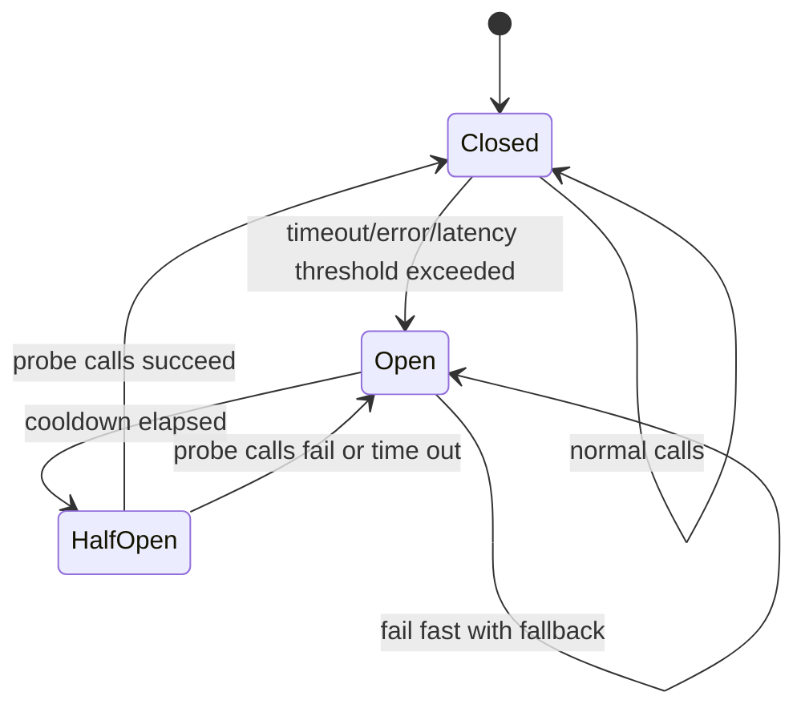

# Circuit Breakers

Circuit breakers stop calls to a dependency that is failing or too slow, then
probe carefully before sending normal traffic again. They protect callers,
worker pools, and dependencies from repeated doomed attempts.

Use this page when a dependency failure could create cascading latency, retry
storms, resource exhaustion, or user-facing errors that a controlled fallback
could handle better.

## Purpose

Circuit breaker design answers:

- Which dependency or operation should fail fast when unhealthy?
- What signal opens the breaker?
- What response, fallback, or degraded mode should callers receive?
- How does the breaker protect the dependency from more load?
- When is it safe to try half-open recovery?
- What alert tells operators that the breaker is open too often or too long?
- Which workflows should not use a fallback because correctness requires the
  real dependency?

A circuit breaker is not a replacement for timeouts or retries. It uses their
signals to decide when continuing to call a dependency is making reliability
worse.

## When This Matters

Circuit breakers matter when:

- many callers depend on the same slow or failing service;
- retries are amplifying a dependency incident;
- worker threads or connection pools fill while waiting for a dependency;
- an optional feature can be skipped or degraded;
- a known unhealthy dependency should receive fewer calls while it recovers;
- operators need a clear incident signal instead of scattered timeout errors.

They matter less for rare calls, one-off batch jobs, or dependencies where
failing fast would be more harmful than waiting.

## Questions To Ask

Start with the dependency boundary:

- Which caller operation uses the dependency?
- Is the dependency required for correctness or optional for enrichment?
- What timeout, error rate, latency, or saturation signal proves the dependency
  is unhealthy?
- What should the caller do while the breaker is open?
- What stale, cached, partial, queued, or read-only behavior is acceptable?
- How will operators know whether the dependency or the caller is at fault?

Then define recovery:

- How long should the breaker stay open before probing?
- How many test calls are allowed in half-open state?
- What success signal closes the breaker?
- What failure signal reopens it?
- What alert, dashboard, and runbook explain the state change?

## Circuit Breaker Flow

## Decision Guidance

### Failing Fast

Failing fast means returning quickly instead of waiting on a dependency that is
known to be unhealthy. It protects caller capacity and gives the dependency room
to recover.

Good fail-fast cases:

- optional enrichment such as recommendations, previews, or non-critical
  metadata;
- background fanout where work can be retried later;
- reads that can use stale cached data with a timestamp;
- partner calls that are already returning rate limits or overload errors;
- dependencies that are timing out and filling caller pools.

Bad fail-fast cases:

- source-of-truth writes where pretending success would corrupt state;
- permission, payment, or safety checks that must be real before success;
- destructive actions that require explicit confirmation;
- workflows where no honest degraded response exists.

Fail fast with a clear state: degraded, queued, pending, temporarily
unavailable, or retry later. Do not fail fast into fake success.

### Protecting Dependencies

Circuit breakers protect dependencies by reducing traffic when calls are
unlikely to succeed. This matters during overload because repeated attempts can
turn a recoverable incident into sustained saturation.

Protection decisions:

- open the breaker on a mix of timeout rate, error rate, and latency, not a
  single unlucky request;
- keep per-dependency breaker state separate so one failing dependency does not
  disable unrelated work;
- use bounded retries behind the breaker, not retries that ignore open state;
- combine the breaker with concurrency limits or queue rate limits when backlog
  pressure is the real problem;
- emit metrics for open state, rejected calls, fallback usage, and probe
  outcomes.

A breaker should reduce load on the dependency and the caller. If it only hides
errors while work keeps piling up elsewhere, it is not containing the failure.

### Half-Open Recovery

Half-open state is the cautious recovery mode. After a cooldown, the caller sends
a small number of probe calls to see whether the dependency is healthy enough
for normal traffic.

Half-open design should define:

- cooldown duration before probing;
- maximum concurrent probes;
- success threshold to close the breaker;
- failure threshold to reopen the breaker;
- whether probes use normal user traffic or synthetic health calls;
- whether expensive or risky operations are excluded from probes.

Half-open recovery should be gradual. Closing the breaker after one lucky
success can flood the dependency and cause another failure. Keeping it open
after recovery can unnecessarily degrade users.

### Fallback Behavior

A fallback is the behavior callers receive while the breaker is open. It should
be honest, bounded, and safe for the workflow.

Fallback options:

| Fallback | Use When | Watch For |
| --- | --- | --- |
| Stale cache | Reads can tolerate old data | Label age and avoid stale writes |
| Partial response | Optional fields are unavailable | Make missing fields explicit |
| Queue for later | Side effect can happen after success | Expose pending or retrying state |
| Read-only mode | Writes are unsafe during dependency failure | Explain what users can still do |
| Clear failure | Correctness needs the dependency | Preserve idempotency and repair data |

Fallbacks must not violate the product promise. If a booking service is down,
do not tell the user a room is reserved unless the source-of-truth reservation
has actually been created.

### Alerting

Circuit breaker alerting should help operators answer:

- Which breaker opened?
- Which dependency or operation is protected?
- What threshold opened it?
- How many calls are failing fast?
- Which fallback is being served?
- How long has the breaker been open?
- Are half-open probes succeeding or failing?
- Is user impact getting better or worse?

Useful signals:

- breaker state transitions;
- open duration;
- rejected or short-circuited call count;
- fallback response count;
- dependency timeout, error, latency, and saturation metrics;
- half-open probe success and failure count;
- retry volume after the breaker opens.

Page on sustained open state, rapid flapping, or fallback volume that indicates
user impact. Do not page on every single open event for a low-risk optional
feature unless it affects a critical workflow.

## Trade-Offs

Circuit breakers trade availability, correctness, and operational complexity.

- Opening early protects capacity, but can degrade users during a short blip.
- Opening late avoids unnecessary degradation, but can allow cascading failure.
- Stale-cache fallback improves read availability, but risks showing outdated
  state.
- Queue-for-later fallback preserves the user's flow, but creates delayed work
  that needs retry and repair.
- Half-open probes speed recovery, but poorly controlled probes can restart the
  incident.
- Alerting on breaker state improves visibility, but noisy breaker alerts can
  hide the real dependency incident.

Use a circuit breaker when the protected workflow and fallback behavior are
clear. A breaker without a safe fallback often just changes the error shape.

## Common Mistakes

- Adding a breaker before setting timeouts.
- Opening the breaker on one failure instead of a meaningful threshold.
- Sharing one breaker across unrelated dependencies or operations.
- Returning fake success while the dependency is unavailable.
- Letting retries ignore open breaker state.
- Forgetting half-open limits and flooding the dependency after cooldown.
- Alerting only on dependency errors and missing fallback volume.
- Keeping breaker state invisible to support and operators.
- Using stale fallback data without age or source labels.

## Example

A neighborhood permit system shows permit applications with optional contractor
recommendations. The permit record must come from the primary database, but
recommendations come from a separate service that sometimes becomes slow.

Circuit breaker design:

| Decision | Choice | Reason |
| --- | --- | --- |
| Protected dependency | Recommendation service called by the permit detail API | It is optional and can become slow |
| Open signal | Timeout and 5xx rate above threshold over a short rolling window | One failure should not open the breaker |
| Fail-fast behavior | Skip the recommendation call while open | Protects API request threads and the recommendation service |
| Fallback | Return permit details with `recommendations_unavailable` and a timestamp | User can still inspect the permit |
| Half-open recovery | Allow a small number of recommendation probes after cooldown | Tests recovery without flooding the service |
| Alerting | Alert when open state lasts beyond the user-impact threshold or fallback volume is high | Operators see sustained degradation, not one transient blip |

The breaker is not used for the permit approval write path. Approval must update
the source-of-truth database, so failing fast into a fake approved state would
be incorrect. For that workflow, a clear error or pending state is safer than a
fallback.

## Checklist

Before approving a circuit breaker design, confirm:

- The protected dependency and caller workflow are named.
- Timeouts exist before breaker thresholds depend on timeout signals.
- Open thresholds use error rate, timeout rate, latency, saturation, or a clear
  dependency health signal.
- Failing fast protects caller capacity and dependency recovery.
- Fallback behavior is honest and safe for the workflow.
- Required correctness checks do not return fake success.
- Half-open recovery has cooldown, probe limit, success threshold, and failure
  threshold.
- Retries respect breaker state and do not create retry storms.
- Operators can see breaker state, open duration, fallback volume, rejected
  calls, probe outcomes, and dependency health.
- Alerts distinguish brief optional degradation from sustained critical user
  impact.

## Related Pages

- [Reliability](index.md)
- [Timeouts](timeouts.md)
- [Retries](retries.md)
- [Failure-mode analysis](failure-mode-analysis.md)
- [Synchronous vs asynchronous communication](../communication/sync-vs-async.md)
- [Capacity estimation](../scalability/capacity-estimation.md)
- [Design review checklist](../method/design-review-checklist.md)
