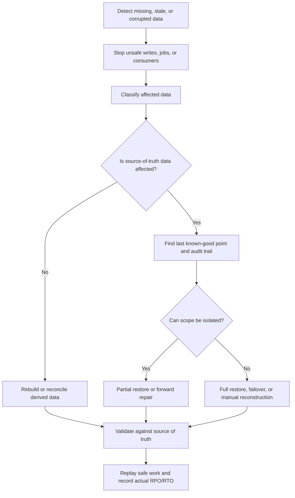

# Data Loss Scenarios

Data loss is not only a disk failure. It can come from a bad migration, an
accidental delete, a missing queue message, replication lag, corrupted derived
state, or a restore that silently omits part of the workflow. A useful design
names likely loss scenarios before deciding whether to prevent, detect, restore,
replay, rebuild, or manually repair.

Use this page when a system stores authoritative data, processes durable
background work, uses replicas, runs migrations, or depends on derived views
that can drift away from the source of truth.

## Purpose

Data loss scenario planning answers:

- Which data can disappear, become stale, be overwritten, or become corrupted?
- Which user workflow is harmed by the loss?
- Which data is authoritative, audit, derived, temporary, or external?
- What detects the loss before users or operators find it manually?
- Which recovery strategy is safest for each scenario?
- How do operators preserve recent valid work while repairing bad state?
- What should be prevented in version 1 instead of repaired later?

The goal is to make recovery strategy specific. "We have backups" is not enough
unless the scenario says which backup, what restore point, what validation, and
what reconciliation follow.

## When This Matters

This matters when:

- user actions are acknowledged before multiple systems agree;
- migrations, imports, cleanup jobs, or admin tools can touch many records;
- queues, streams, or workers carry important state transitions;
- replicas, caches, search indexes, or reports can lag or diverge;
- corruption can spread into backups or derived data;
- manual repair would be expensive, risky, or hard to audit.

For a small system, start with the highest-impact source-of-truth workflow and
the most likely operator mistake.

## Questions To Ask

Start with the data:

- Which records must never disappear silently?
- Which data can be rebuilt from another source?
- Which side effects need durable intent before execution?
- Which migrations or jobs can modify many records?
- Which caches, replicas, and indexes can show stale or incorrect data?
- Which delete, retention, and privacy rules constrain recovery?

Then choose strategy:

- Can the scenario be prevented with constraints, permissions, or staging?
- Which metric, audit event, or reconciliation check detects it?
- Is restore, replay, rebuild, forward repair, or manual review safest?
- What should be paused while repair is happening?
- How is recovery validated before the workflow is considered healthy?

## Data Loss Response Flow



## Scenario Catalog

### Accidental Deletion

Accidental deletion happens when a user, operator, script, retention job, or
admin tool removes data that should still exist.

Common causes:

- bulk delete without a dry run;
- retention policy applied to the wrong tenant or status;
- admin UI deletes a parent and cascades unexpectedly;
- object storage cleanup removes files still referenced by metadata;
- support action lacks approval or audit.

Recovery strategies:

- stop the deleting process and revoke unsafe access;
- identify affected records from audit logs, change records, or object
  manifests;
- prefer partial restore or forward repair when the scope is clear;
- restore related metadata and files together;
- rebuild derived indexes after authoritative records are repaired;
- notify support if users saw missing records.

Prevention:

- require soft delete or tombstones for risky objects;
- add dry-run mode and affected-count review for bulk jobs;
- enforce scoped permissions for destructive actions;
- keep audit events for who deleted what, when, and why.

### Bad Migrations

Bad migrations lose or corrupt data while changing schema, backfilling rows,
renaming fields, enforcing constraints, or moving data between owners.

Common causes:

- destructive rename or drop in one deploy;
- backfill script overwrites good values with defaults;
- new required field rejects old writer traffic;
- constraint cleanup deletes valid records;
- migration changes event or export format without hidden consumers updated.

Recovery strategies:

- stop or pause the migration quickly;
- determine which migration step is reversible;
- use audit history, old columns, backup snapshots, or dual-written data to
  reconstruct values;
- roll forward with a repair script when rollback would lose valid new writes;
- restore from backup only when repair cannot preserve correctness;
- compare old and new shape before cutting over again.

Prevention:

- use expand/contract migrations;
- batch backfills with progress, pause, and retry controls;
- keep old shape until comparison checks pass;
- rehearse rollback before the destructive cleanup step.

### Queue Loss

Queue loss happens when work that should be durable disappears, expires, is
acknowledged too early, or is moved to a dead-letter path without repair.

Common causes:

- worker acknowledges before the side effect or durable state change is safe;
- queue retention expires messages during an outage;
- producer writes to the queue but not to a durable outbox;
- dead-letter queue is ignored until messages are deleted;
- consumer bug drops an event as "already processed" incorrectly.

Recovery strategies:

- stop consumers if they are dropping or misprocessing work;
- replay from a durable outbox, event log, audit table, or source-of-truth
  query;
- move dead-letter messages through a reviewed repair path;
- rebuild derived state from authoritative records;
- use idempotency keys so replay does not duplicate side effects;
- measure missing, duplicated, and replayed work.

Prevention:

- store intent before publishing important work;
- acknowledge only after safe processing or durable retry state;
- monitor queue age, retry count, dead-letter count, and retention risk;
- keep replay identifiers and processed-event records.

### Replication Delay

Replication delay becomes data loss from the user's point of view when reads,
failover, or restore decisions use a replica that is behind the source of truth.
The data may exist somewhere, but the workflow can act as if it does not.

Common causes:

- failover promotes a replica without checking lag;
- read-after-write traffic goes to a stale replica;
- reporting or search reads lag without a freshness label;
- backup or export reads from a delayed follower;
- clients retry through another region before prior writes replicate.

Recovery strategies:

- route critical reads to the primary or to a replica with bounded lag;
- pause writes or enter read-only mode before promoting a stale replica;
- reconcile missing records from logs or the old primary if available;
- mark stale derived views as delayed and rebuild after replication catches up;
- audit which users saw stale or missing data.

Prevention:

- monitor replica lag and include it in failover gates;
- define freshness requirements per workflow;
- use read-your-writes behavior where users expect immediate confirmation;
- avoid using stale replicas for irreversible decisions.

### Corruption

Corruption means data exists but is wrong, incomplete, inconsistent, or unsafe to
trust. Corruption can be harder than deletion because it may spread into
backups, replicas, caches, and reports before anyone notices.

Common causes:

- application bug writes impossible states;
- bad import maps fields incorrectly;
- partial failure updates one store but not another;
- derived index no longer matches the source of truth;
- backup contains already-corrupted records;
- manual repair creates inconsistent relationships.

Recovery strategies:

- stop the writer or job that is producing bad data;
- identify the first bad timestamp or version;
- choose an older backup, audit repair, log replay, or forward fix;
- repair authoritative data before rebuilding derived views;
- validate invariants and sample affected workflows;
- keep evidence of corrupted records, repair decisions, and user impact.

Prevention:

- enforce invariants close to the source of truth;
- monitor impossible state transitions and source-versus-derived drift;
- test restore and corruption detection, not only backup creation;
- separate backup permissions from production mutation permissions.

## Recovery Strategies

| Strategy | Use When | Watch For |
| --- | --- | --- |
| Prevent | Loss would be hard or impossible to repair | Added constraints, permissions, or workflow friction |
| Restore | A known-good recovery point exists and broad rollback is acceptable | Lost valid writes after the restore point |
| Partial restore | Scope is clear and recent valid work should be preserved | Relationship, cache, and side-effect reconciliation |
| Replay | Durable logs, outbox rows, or event history can recreate work | Duplicate side effects without idempotency |
| Rebuild | Data is derived from authoritative records | Source-of-truth quality and rebuild time |
| Forward repair | Bad state can be corrected without rolling back | Repair script review, audit trail, and validation |
| Manual review | Automated repair is unsafe or low-volume | Ownership, audit, consistency, and user communication |

The same incident may need more than one strategy. For example, recover deleted
metadata from backup, rebuild search from the repaired records, and replay
queued notifications with idempotency checks.

## Trade-Offs

Data loss recovery trades correctness, downtime, freshness, and operational
risk.

- Restoring a whole database is simple to explain, but may discard valid recent
  work.
- Partial restore preserves valid work, but needs careful scoping and
  reconciliation.
- Replay can recover missed work, but only if events and side effects are
  idempotent.
- Rebuilding derived data is safer than restoring stale indexes, but may take
  longer.
- Prevention reduces incident risk, but can slow operations or add review steps.
- Manual repair can be safest for rare cases, but only with owners, audit, and
  validation.

Choose the strategy that protects the source of truth first, then repair derived
views and side effects.

## Common Mistakes

- Treating every data problem as a full restore.
- Restoring corrupted data because it is the newest backup.
- Replaying queue messages without idempotency or duplicate detection.
- Promoting a replica without checking lag and fencing the old primary.
- Rebuilding derived data from a corrupted source.
- Letting cleanup jobs run without dry runs, limits, or audit trails.
- Migrating schema in one destructive step.
- Declaring recovery complete before caches, indexes, queues, reports, and
  users are reconciled.

## Example

A neighborhood permit system stores permit applications, reviewer decisions,
attachment metadata, uploaded files, search documents, and partner webhook
delivery state.

Incident:

```text
A cleanup job deletes attachment metadata for closed permits, but a filter bug
also deletes metadata for 300 active permits. Uploaded files remain in object
storage. Search still shows the permits, but attachment previews fail.
```

Recovery plan:

| Step | Action | Why |
| --- | --- | --- |
| Stop spread | Disable the cleanup job and block attachment metadata deletion | Prevent more loss |
| Scope | Use audit events and job logs to list affected active permits | Enables partial restore |
| Source check | Verify uploaded files still exist for affected metadata rows | Confirms metadata repair is enough |
| Recover | Restore metadata rows from an isolated backup into a reviewed repair script | Preserves new valid permit decisions |
| Reconcile | Rebuild search documents and retry partner webhook updates that reference attachments | Derived systems catch up |
| Validate | Sample permit pages, object links, audit history, and support lookup | Proves workflow health |
| Prevent | Add dry-run counts, status filters, and approval for future cleanup jobs | Reduces repeat risk |

This is not a full database restore because the source-of-truth permit decisions
after the bad cleanup are valid and should be preserved.

## Checklist

Before approving data loss handling, confirm:

- Accidental deletion scenarios include audit, dry-run, soft-delete, or partial
  restore controls.
- Bad migration scenarios use compatible rollout, backfill validation, rollback,
  or forward repair.
- Queue loss scenarios have durable intent, replay, dead-letter repair, and
  idempotency.
- Replication delay scenarios define freshness, lag monitoring, and failover
  gates.
- Corruption scenarios include detection, retention, last known-good point, and
  repair strategy.
- Each scenario names the affected workflow and authoritative data.
- Recovery strategies distinguish restore, partial restore, replay, rebuild,
  forward repair, and manual review.
- Derived views, caches, indexes, reports, queues, and side effects are
  reconciled after source-of-truth repair.
- Operators can observe loss signals, recovery progress, and actual RPO/RTO.
- Runbooks define owner, approval, stop-the-bleeding steps, validation, and user
  or support communication.

## Related Pages

- [Reliability](index.md)
- [Failure-mode analysis](failure-mode-analysis.md)
- [Backup and restore recovery](backup-and-restore-recovery.md)
- [Disaster recovery](disaster-recovery.md)
- [RPO and RTO](rpo-rto.md)
- [Backups and restore](../data/backups-and-restore.md)
- [Schema evolution](../data/schema-evolution.md)
- [Idempotency](../communication/idempotency.md)
- [Design review checklist](../method/design-review-checklist.md)
