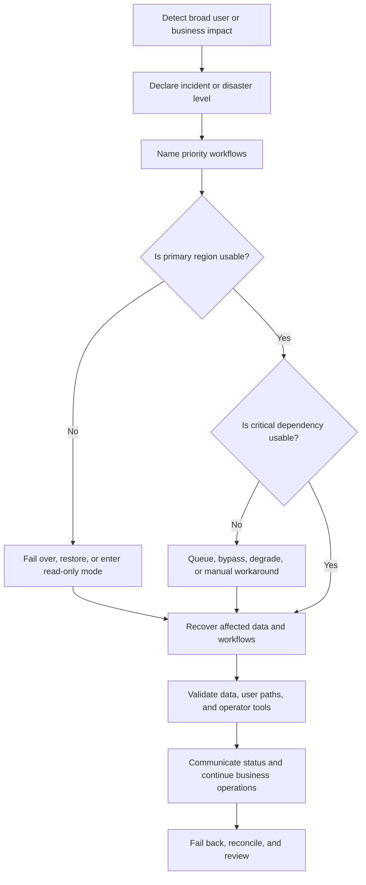

# Disaster Recovery

Disaster recovery is the plan for keeping a critical workflow usable when a
large part of the system, operating environment, or organization cannot function
normally. It covers more than restoring a database. It names business priorities,
regional and dependency failures, data recovery, communication paths, runbooks,
and the minimum service the organization can safely provide during disruption.

Use this page when a design needs to explain what happens during regional
outages, provider failures, severe data incidents, or operational events that
normal retries and failover cannot fully hide.

## Purpose

Disaster recovery planning answers:

- Which business workflows must continue first?
- Which regions, providers, control planes, data stores, and operator tools can
  fail?
- What degraded service is acceptable during a disaster?
- What data must be recovered before the system can accept writes?
- Which dependencies can be bypassed, queued, replaced, or paused?
- Who declares the disaster, runs the recovery, and communicates status?
- What evidence proves the system is safe to return to normal operation?

The goal is not to keep every feature online. The goal is to preserve the
outcomes that matter most while avoiding data corruption and unsafe promises.

## When This Matters

Disaster recovery matters when:

- a regional failure can take down critical reads or writes;
- a major dependency outage can block user workflows or operator repair;
- the system must recover data after deletion, corruption, or replication
  failure;
- manual support, business operations, or legal obligations continue during an
  incident;
- a design uses failover, backups, queues, object storage, or external services
  whose recovery paths must work together.

For a small system, a disaster recovery plan can be short and manual. It should
still define priority workflows, data recovery, owners, and communication.

## Questions To Ask

Start with business continuity:

- Which user or business outcome must continue first?
- What is the minimum acceptable service during a disaster?
- Which actions can be read-only, queued, delayed, or disabled?
- Which customers, tenants, regions, or workflows have different priority?
- What support process exists if the product UI is unavailable?

Then test the architecture:

- What if the primary region is unavailable?
- What if a provider dependency is unavailable or returns ambiguous results?
- What if backups exist but the newest copy is corrupted?
- What if the team cannot use the normal deployment, monitoring, or secrets
  control plane?
- What data must be reconciled before accepting writes again?
- What runbook, dashboard, and approval path guides each step?

## Disaster Recovery Flow



## Decision Guidance

### Regional Failure

Regional failure means the normal location for compute, storage, network, or
control plane access is unavailable or unsafe to use. The design should separate
traffic movement from data safety.

Decisions to make:

- which workflows move to another region;
- whether the alternate region is active, warm, cold, or restore-only;
- whether writes are allowed immediately or only after data validation;
- how DNS, service discovery, load balancers, and clients find the new path;
- what prevents split-brain writes between old and new regions;
- how operators know whether the old region is fenced or still accepting work.

Regional recovery can be staged. Read-only access may return before writes.
Support lookup may return before bulk exports. A clear staged plan is often
safer than trying to restore the full product at once.

### Dependency Failure

Dependency failure includes payment providers, identity providers, notification
services, search platforms, partner APIs, object storage, delivery networks, or
any external system needed for a workflow.

For each critical dependency, decide:

- whether the dependency is required before success;
- whether work can be queued safely;
- whether a manual workaround exists;
- whether an alternate provider or mode exists;
- how idempotency protects retries after ambiguous results;
- which user-visible state explains pending, degraded, or unavailable work;
- which contract, support, or escalation path is used during the incident.

Do not treat alternate providers as automatic safety. They need data mapping,
credentials, limits, observability, test traffic, and clear criteria for use.

### Data Recovery

Data recovery is the path back to trustworthy state after loss, corruption, or
ambiguous failover.

Key decisions:

- RPO and RTO for each priority workflow;
- authoritative data versus derived data;
- backup, restore, replay, or rebuild path;
- corruption detection and last known-good recovery point;
- partial restore versus full restore;
- reconciliation for caches, indexes, queues, files, reports, and side effects;
- audit evidence needed for support and post-incident review.

Use [Backup and restore recovery](backup-and-restore-recovery.md) for the
restore runbook details and [RPO and RTO](rpo-rto.md) for target setting.

### Runbooks

A disaster recovery runbook coordinates technical recovery and business
continuity.

It should include:

- declaration criteria and severity;
- incident commander and backup owner;
- priority workflow list;
- regional, dependency, and data recovery paths;
- communication channels for users, support, leadership, and partners;
- approval rules for failover, restore, manual workaround, and failback;
- validation checks before accepting traffic or writes;
- dashboards, logs, traces, and identifiers needed during recovery;
- abort criteria and rollback steps;
- evidence to capture for actual RPO, actual RTO, user impact, and follow-up.

Runbooks should be rehearsed under realistic constraints. A plan that assumes
the usual chat, deployment, secrets, or monitoring tools are always available
may fail during the event it is meant to handle.

### Business Continuity

Business continuity defines how the organization keeps serving users when the
software system is degraded or unavailable.

Examples:

- support can look up the last known state from a read-only view;
- staff can record urgent requests in a controlled manual intake process;
- users can see a status page and avoid repeated submissions;
- finance or operations can pause settlement until data is reconciled;
- partner updates can be queued and replayed after recovery;
- leadership knows which workflows are intentionally disabled.

Manual workarounds need the same design discipline as software paths: ownership,
authorization, audit trail, reconciliation, and a clear stop point. A spreadsheet
or support form can become a source of corruption if it is not reconciled back
to the source of truth.

## Trade-Offs

Disaster recovery trades continuity, correctness, cost, and organizational
complexity.

- Hot standby can reduce recovery time, but costs more and requires constant
  testing.
- Cold restore is cheaper, but may not meet short RTO targets.
- Allowing writes during degraded mode preserves workflow availability, but can
  create conflict or reconciliation risk.
- Read-only mode protects data, but may block urgent user actions.
- Alternate dependencies can reduce provider risk, but add integration,
  testing, and operational complexity.
- Manual business continuity keeps service moving, but creates audit and
  reconciliation work.

Choose the simplest disaster recovery plan that protects the priority workflow
and data. Do not build a multi-region active system when a tested restore and
manual workaround meet the actual risk.

## Common Mistakes

- Calling ordinary backups a disaster recovery plan.
- Planning regional failover without data validation or split-brain prevention.
- Treating every feature as equally critical.
- Forgetting provider dependencies, identity, DNS, deployment, secrets, or
  observability control planes.
- Letting manual workarounds bypass authorization and audit.
- Failing back automatically before data is reconciled.
- Testing happy-path failover but not corrupted data, stale clients, or
  dependency outage.
- Leaving user, support, partner, and leadership communication undefined.

## Scenario

A neighborhood clinic platform supports appointment booking, staff scheduling,
SMS reminders, attachment uploads, and public availability search.

Disaster:

```text
The primary region is unreachable during a storm. The SMS provider is also
experiencing high timeout rates. Clinics are open and staff still need today's
schedule.
```

Recovery decisions:

| Concern | Decision | Reason |
| --- | --- | --- |
| Priority workflow | Staff schedule lookup and urgent appointment intake recover first | Clinics need today's operational view |
| Regional failure | Move read traffic to warm standby; keep booking writes disabled until replication lag and fencing are verified | Prevents split-brain appointments |
| Dependency failure | Queue reminder sends and show reminder delivery as delayed | SMS is useful but not required to see the appointment |
| Data recovery | Validate standby appointment records, audit history, and attachment metadata before staff use | Staff should not act on incomplete records |
| Business continuity | Support can record urgent walk-in requests with a manual intake form owned by the incident commander | Keeps clinic operations moving with a reconciliation owner |
| Runbook | Incident commander approves write enablement only after schedule lookup, conflict checks, and queue health pass | Avoids rushing into unsafe writes |
| Communication | Status page says booking changes are temporarily limited; staff channel explains manual intake and reconciliation timing | Users and staff receive different actionable information |

After the primary region recovers, the team does not immediately fail back.
Operators reconcile manual intake records, queued reminders, and standby writes,
then choose whether to keep the standby as primary or move back during a
controlled window.

## Checklist

Before approving disaster recovery design, confirm:

- Priority workflows and minimum acceptable service are named.
- Regional failure behavior includes traffic movement, data validation,
  split-brain prevention, and failback criteria.
- Dependency failure behavior includes queueing, degradation, manual
  workaround, alternate provider, or clear unavailability.
- Data recovery ties RPO, RTO, backup, restore, replay, rebuild, and
  reconciliation to each priority workflow.
- Runbooks include declaration criteria, owners, approvals, validation,
  communication, abort criteria, and evidence capture.
- Business continuity covers support, manual operations, partner communication,
  and reconciliation back to the source of truth.
- Degraded or manual paths preserve authorization, audit, privacy, and tenant
  boundaries.
- Operators can observe recovery state, dependency health, queue age, data
  drift, stale clients, and user impact.
- Failback is planned and does not assume the old primary is safe automatically.
- The plan has been rehearsed, and actual RPO/RTO from drills is recorded.

## Related Pages

- [Reliability](index.md)
- [RPO and RTO](rpo-rto.md)
- [Failover](failover.md)
- [Backup and restore recovery](backup-and-restore-recovery.md)
- [Graceful degradation](graceful-degradation.md)
- [Failure-mode analysis](failure-mode-analysis.md)
- [Backups and restore](../data/backups-and-restore.md)
- [Idempotency](../communication/idempotency.md)
- [Design review checklist](../method/design-review-checklist.md)
