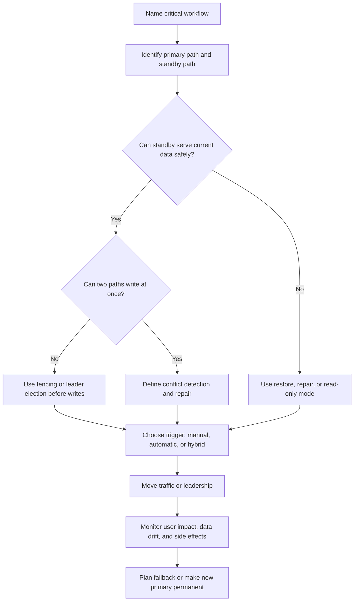

# Failover

Failover moves traffic, leadership, or work from an unhealthy primary path to a
standby or alternate path. It can reduce outage time, but it can also create
split-brain writes, stale routing, lost in-flight work, and confusing recovery
unless the design names what is allowed to move and what must stay consistent.

Use this page when a system needs to survive instance, zone, region, database,
leader, queue, or dependency failure without turning the recovery mechanism into
the next incident.

## Purpose

Failover design answers:

- Which workflow needs a standby path?
- What failure signal proves the primary path should stop receiving traffic?
- Which component owns the decision to fail over?
- What data loss, duplicate work, stale read, or split-brain risk is acceptable?
- How quickly must traffic move, and how much manual confirmation is allowed?
- What should users, callers, and operators see during the transition?
- How will the system fail back after the primary path recovers?

Failover is not only a routing decision. It is a data, ownership, observability,
and runbook decision.

## When This Matters

Failover matters when:

- a critical workflow has a recovery-time objective shorter than manual rebuild
  or restore;
- a single instance, zone, region, database node, queue, or leader would stop
  important user work;
- a standby system can continue safely with the data it has;
- the system needs leader election for exactly one writer or coordinator;
- DNS, load balancers, service discovery, or clients cache routing decisions;
- operators need a rehearsed path for regional, database, or dependency
  incidents.

It matters less for a small version 1 system where a short outage is acceptable
and manual recovery is simpler than continuously operating a standby path.

## Questions To Ask

Start with the workflow and data:

- Which user action must continue during the failure?
- Which state change is the source of truth?
- Can the standby path write safely, or should it serve read-only traffic?
- What happens to in-flight requests when traffic moves?
- What is the maximum tolerable stale data or lost work?
- Which side effects must not run twice after failover?

Then define operation:

- Which health signal triggers failover?
- Who can approve manual failover, and when is automatic failover safe?
- How do clients discover the new endpoint or leader?
- What stops the old primary from accepting writes?
- Which metrics prove the new path is healthy?
- What is the failback plan after repair?

## Failover Decision Flow

## Decision Guidance

### Active/Passive

Active/passive failover keeps one path serving traffic while another path waits
as standby. The passive path may be warm enough to take traffic quickly, or cold
enough that operators must start capacity and restore data before use.

Use active/passive when:

- one writer or primary region is simpler to reason about;
- the standby can lag slightly without violating user expectations;
- the cost of duplicate active capacity is not justified;
- manual confirmation is acceptable for rare high-impact incidents;
- the main risk is unavailable service, not global load distribution.

Design decisions:

- whether the passive path is cold, warm, or hot standby;
- how data reaches the standby path;
- what lag is acceptable before promotion;
- whether failover is automatic, manual, or operator-approved automation;
- what fencing prevents the old primary from accepting writes after promotion.

Active/passive is usually easier to operate than active/active, but recovery is
only as good as the promotion procedure and the standby data. A standby that is
never tested is an assumption, not a recovery plan.

### Active/Active

Active/active failover lets more than one path serve traffic at the same time,
often across zones, regions, or clusters. It can improve capacity and reduce
outage impact, but it forces the design to answer how writes, sessions, caches,
and conflicts behave when paths are independent.

Use active/active when:

- users are naturally distributed across regions or cells;
- read and write traffic can be routed to a local owner;
- the data model has clear partition ownership or conflict rules;
- the product can tolerate eventual convergence where needed;
- operating two active paths is worth the complexity.

Be careful when:

- the same object can be written from multiple places;
- uniqueness constraints span regions or partitions;
- clients can retry the same command through a different active path;
- caches or search indexes can show different versions;
- side effects such as email, payment, or webhooks can be triggered twice.

Active/active should not be treated as "automatic reliability." It is a
consistency and conflict-management choice.

### Leader Failover

Leader failover promotes a new coordinator, primary database node, scheduler, or
writer after the old leader is unhealthy. The core risk is split brain: two
leaders both believe they own the same work.

Use leader failover when:

- exactly one component should schedule jobs, assign sequence numbers, accept
  writes, or coordinate membership;
- a replica or follower can be promoted;
- the system has a reliable way to decide which leader is current;
- in-flight work can be retried, reconciled, or fenced.

Design decisions:

- leader election signal and quorum;
- fencing token, epoch, lease, or term that old leaders cannot reuse;
- promotion criteria and cooldown;
- what happens to work assigned by the old leader;
- which clients must refresh leader location;
- how operators detect flapping leaders.

Leader failover should prefer clear unavailability over two writers for the same
state. If the system cannot prove the old leader is fenced, accepting writes on
the new leader may create harder recovery work than the original outage.

### DNS Failover

DNS failover changes name resolution so clients reach another endpoint, region,
or load balancer. It is attractive because many clients already use names, but
DNS is not an immediate control plane.

Use DNS failover when:

- coarse traffic movement is enough;
- clients can tolerate propagation delay;
- endpoints are independently healthy;
- cached records and long-lived connections are understood;
- the failover target can handle the shifted traffic.

DNS failover risks:

- clients, resolvers, or proxies may cache records longer than expected;
- existing connections may stay pinned to the old path;
- low TTLs increase lookup traffic but do not guarantee instant movement;
- traffic may split between old and new paths during transition;
- failback can be as disruptive as failover.

DNS failover works best as part of a broader routing plan that includes load
balancer health, service discovery, connection draining, and clear operator
visibility.

### Failover Risks

Failover risk comes from the difference between moving traffic and preserving
correct behavior.

Common risks:

| Risk | What Goes Wrong | Design Response |
| --- | --- | --- |
| Split brain | Old and new primaries both accept writes | Fence the old primary before promotion |
| Data loss | Standby is missing recent committed work | Define acceptable lag, replication health, and recovery point |
| Duplicate side effects | Retried work sends, charges, or publishes twice | Use idempotency keys and durable side-effect records |
| Stale clients | Clients keep using old endpoints or leaders | Use short enough discovery refresh, connection draining, and clear errors |
| Capacity shock | Standby cannot handle full traffic | Pre-provision, autoscale with headroom, or fail over gradually |
| Hidden partial failure | Health check passes while real workflow fails | Use workflow-level health and synthetic checks |
| Unsafe failback | Primary returns and accepts traffic with stale state | Reconcile, rebuild, or make the promoted standby the new primary |

The safest failover design may intentionally degrade, pause writes, or require
operator approval when automatic movement would risk data correctness.

## Trade-Offs

Failover trades recovery speed, consistency, cost, and operational complexity.

- Automatic failover reduces response time, but can trigger on noisy signals and
  cause repeated movement during a partial incident.
- Manual failover gives operators control, but depends on clear runbooks,
  practiced judgment, and acceptable recovery time.
- Active/passive keeps write ownership simple, but standby capacity and data
  freshness must be maintained.
- Active/active improves locality and availability, but requires partitioning,
  conflict rules, and side-effect deduplication.
- DNS failover is widely compatible, but slow caches and long-lived connections
  make it imprecise.
- Leader failover keeps one coordinator, but election, fencing, and client
  refresh behavior must be correct.

Choose the simplest failover pattern that meets the workflow recovery objective
without creating a larger consistency or repair problem.

## Common Mistakes

- Treating failover as a load balancer setting instead of a data decision.
- Promoting a standby without knowing replication lag.
- Allowing the old primary to keep accepting writes after promotion.
- Building active/active writes without conflict rules.
- Depending on DNS for instant traffic movement.
- Testing only component health instead of workflow success.
- Forgetting in-flight requests, retries, and duplicate side effects.
- Planning failover but not failback.
- Never rehearsing the runbook until a real incident.

## Example

A neighborhood permit system lets residents submit applications and staff review
them. The application database is primary in one region, with a warm standby in
another region. Search, notifications, and exports are derived from the permit
records.

Failover decisions:

| Concern | Decision | Reason |
| --- | --- | --- |
| Pattern | Active/passive database with warm standby | One primary writer keeps permit status transitions simple |
| Trigger | Operator-approved automatic recommendation after workflow checks fail | Avoids failover on one noisy host check |
| Promotion | Standby can accept writes only after the old primary is fenced | Prevents split-brain permit approvals |
| DNS | Public API name moves to the standby load balancer, with clients expected to retry failed connections | DNS may not move every client immediately |
| In-flight work | Permit submissions use idempotency keys and return `pending` when outcome is unknown | Duplicate retries do not create duplicate applications |
| Derived systems | Search and exports can lag during failover | Permit records remain the source of truth |
| Failback | Reconcile primary and standby, then either keep the standby as primary or move during a maintenance window | Avoids unsafe automatic return to stale state |

During failover, residents may see a short pending state for submissions. Staff
review remains read-only until the new primary is confirmed writable and the old
primary is fenced. Notifications retry later from durable permit events, so a
promotion does not send duplicate messages for the same status change.

## Checklist

Before approving failover design, confirm:

- The critical workflow and source-of-truth state are named.
- The selected pattern is active/passive, active/active, leader failover, DNS
  failover, or a clear combination.
- Failover triggers use workflow health, not only process or host health.
- The design names who or what approves failover.
- Standby capacity and data freshness are known.
- Split-brain prevention, fencing, or conflict repair is defined.
- In-flight requests, retries, and duplicate side effects are handled with
  idempotency or reconciliation.
- DNS, service discovery, connection draining, and client refresh behavior are
  understood.
- Operators can observe failover state, replication lag, rejected traffic,
  stale clients, side-effect retries, and user impact.
- Failback is planned and does not assume the old primary is automatically safe.
- The runbook has been rehearsed in a non-production or controlled environment.

## Related Pages

- [Reliability](index.md)
- [Failure-mode analysis](failure-mode-analysis.md)
- [Timeouts](timeouts.md)
- [Retries](retries.md)
- [Circuit breakers](circuit-breakers.md)
- [Graceful degradation](graceful-degradation.md)
- [Bulkheads](bulkheads.md)
- [Transactions](../data/transactions.md)
- [Database read scaling](../scalability/database-read-scaling.md)
- [Idempotency](../communication/idempotency.md)
- [Design review checklist](../method/design-review-checklist.md)
