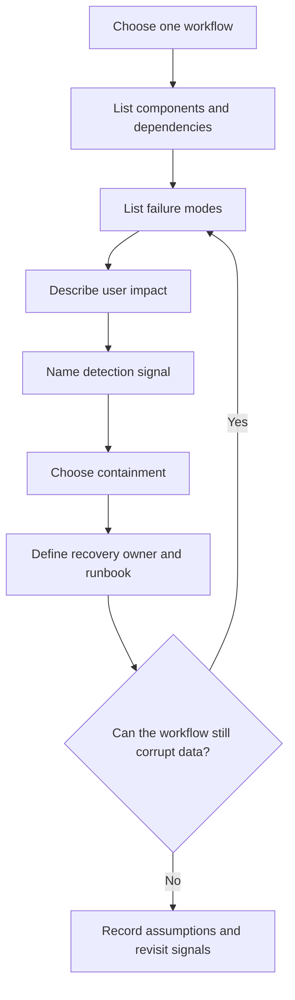

# Failure-Mode Analysis

Failure-mode analysis is a repeatable way to ask what can break, how users
notice, how operators detect it, and how the system recovers. It turns
reliability from a vague goal into a reviewable checklist.

Use this page when a design has a critical workflow, a new dependency, a queue,
a cache, a database write path, a migration, or any component whose failure
could create incorrect user-visible behavior.

## Purpose

A failure-mode analysis should answer:

- Which component, dependency, data path, or operator action can fail?
- What does the user see when it fails?
- What data can be lost, duplicated, corrupted, delayed, or shown stale?
- What detects the problem before or after users report it?
- What contains the blast radius?
- What recovery action returns the workflow to a known-good state?
- Who owns the alert, runbook, and repair?

The output does not need to be long. It needs to be specific enough that a
reviewer can tell whether the design assumes perfect infrastructure.

## When This Matters

Run this analysis when:

- a user workflow crosses more than one component;
- a write path triggers side effects such as email, payment, search indexing, or
  downstream updates;
- the system uses caches, replicas, queues, streams, scheduled jobs, or batch
  imports;
- an external dependency can be slow, unavailable, rate limited, or ambiguous;
- data loss, duplicate work, or stale reads would harm users;
- operators need to detect and repair partial failure.

For a simple version 1 design, analyze only the highest-impact workflow. For a
larger design, repeat the table per workflow or per state transition.

## Questions To Ask

Start with the critical path:

- What must happen before the user sees success?
- Which step is the durable source-of-truth change?
- Which steps are derived, retryable, or repairable?
- Which component is most likely to be overloaded first?
- Which dependency can fail outside your control?
- Which state can become stuck or inconsistent?

Then ask what evidence exists:

- Which log line, metric, trace, audit event, or queue state proves the problem?
- Which identifier lets an operator debug one affected user or object?
- Which alert should fire before the impact becomes broad?
- Which dashboard tells whether the system is recovering?

## Analysis Flow

## Reusable Table

Copy this table into a design doc or walkthrough review. Fill one row per
failure mode.

| Workflow or Asset | Failure Mode | User Impact | Detection Signal | Containment | Recovery / Owner |
| --- | --- | --- | --- | --- | --- |
|  | Component failure, dependency failure, data loss, overload, or operator mistake | What the user, caller, or downstream consumer sees | Metric, log, trace, audit event, synthetic check, queue age, or support signal | Timeout, retry limit, fallback, read-only mode, circuit breaker, rate limit, isolation, or pause | Automated recovery, runbook, reconciliation, restore, rollback, or named owner |

Keep each cell concrete. "Service down" is less useful than "appointment write
API returns 503 before the database commit; no appointment is created."

## Failure Categories

### Component Failures

Component failures happen inside the system boundary: API instances crash,
workers stop polling, caches evict keys, schedulers skip jobs, or a database
node becomes unavailable.

For each component, ask:

- Is the component on the synchronous user path or a background path?
- Can another instance take over safely?
- What happens to in-flight work when it stops?
- Does the component own durable state or derived state?
- Which health check proves it can serve real traffic?

Design response examples:

- return a clear error before the source-of-truth write;
- retry background jobs with limits and dead-letter handling;
- make workers idempotent so a restarted job can run again;
- serve stale-but-labeled cached reads only when the workflow allows it;
- isolate one worker pool from another when a failure should not spread.

### Dependency Failures

Dependency failures happen across a boundary: another service times out, an
external API rate limits calls, a payment provider returns an ambiguous result,
or a partner webhook endpoint is unavailable.

For each dependency, ask:

- Is the dependency required before success is returned?
- Can the system continue in a degraded mode?
- Who owns retries: caller, queue worker, or dependency?
- What is the timeout budget?
- How are ambiguous results reconciled?
- What data should be stored before calling the dependency?

Design response examples:

- store a pending state before calling a slow dependency;
- use timeouts shorter than the caller's deadline;
- retry only safe, idempotent operations;
- route repeated dependency failures to review or reconciliation;
- pause non-critical fanout instead of blocking the critical workflow.

### Data Loss And Corruption

Data failures include accidental deletion, bad migrations, missed events, lost
queue messages, corrupt backups, stale replicas, and derived views that no
longer match the source of truth.

For each data path, ask:

- What is the authoritative record?
- Which data can be rebuilt from another source?
- Which operation needs an audit trail?
- What is the maximum tolerable lost work?
- How often are restores tested?
- How does the system detect drift between source-of-truth and derived data?

Design response examples:

- keep audit records for important state changes;
- test restore procedures, not only backup creation;
- reconcile search indexes, caches, or reporting tables from the source of
  truth;
- use migrations with rollback or forward-fix plans;
- avoid acknowledging success before the durable write that matters.

### Overload

Overload happens when legitimate or abusive traffic exceeds a component's
capacity. It can appear as high latency, queue growth, database lock contention,
thread pool exhaustion, memory pressure, or a downstream dependency being
overwhelmed by retries.

For each overload path, ask:

- What resource runs out first?
- What is the user-visible failure mode?
- Which callers should be slowed, rejected, or queued?
- Which work is low priority and can be shed?
- Are retries making the overload worse?
- Which metric shows recovery rather than continued backlog growth?

Design response examples:

- set request timeouts and retry limits;
- apply rate limits, quotas, or admission control;
- shed non-critical work before critical writes fail;
- separate worker pools or queues by priority;
- add backpressure when queue age or dependency latency rises.

### Operator Detection

Operator detection is the difference between "users will complain" and "the team
can find and repair the issue." Detection should point to a workflow, not only a
host or container.

For each high-impact failure, define:

- alert condition and threshold;
- dashboard panel or query;
- log fields and correlation identifiers;
- trace span or audit event needed for one affected request;
- runbook entry and escalation owner;
- repair command, reconciliation job, rollback, or restore path.

Useful signals include:

- error rate and latency on the critical path;
- queue age, retry count, and dead-letter count;
- dependency timeout and rate-limit counts;
- cache hit rate plus stale read indicators;
- source-of-truth versus derived-data drift;
- successful restore test age;
- number of user objects stuck in `pending`, `retrying`, or `needs_review`.

## Example

A neighborhood clinic lets residents request same-day vaccine appointments.
Appointment creation is the critical workflow; reminder delivery is important
but can be delayed.

| Workflow or Asset | Failure Mode | User Impact | Detection Signal | Containment | Recovery / Owner |
| --- | --- | --- | --- | --- | --- |
| Appointment API | API instance crashes before database commit | User sees an error; no appointment exists | API 5xx rate and trace ending before `appointment_created` audit event | Load balancer removes unhealthy instance; client may retry with an idempotency key | API owner confirms no durable row exists and watches error budget |
| Reminder sender | Notification provider times out after accepting the message | User may receive a reminder while the system thinks it failed | Provider timeout count plus duplicate send guard hits | Store notification attempt with idempotency key; retry with backoff and max attempts | Worker owner reconciles provider receipt status and marks attempt sent or failed |
| Schedule database | Bad staff edit removes a confirmed slot | Resident loses visible confirmation or staff sees conflicting capacity | Audit log deletion event, support lookup by appointment ID, schedule mismatch check | Restrict destructive edits and keep status history | Operations restores slot state from audit history and contacts affected resident |
| Search cache | Cached availability is stale after staff closes a clinic day | Resident sees an available slot that cannot be booked | Booking conflict count and cache age metric | Treat cache as advisory; validate capacity in the database before confirmation | Cache owner invalidates clinic-day key and checks conflict rate |
| Booking queue | Reminder jobs pile up during traffic spike | Confirmed users get late reminders | Queue age, retry count, worker saturation | Scale workers within limits; shed low-priority digest jobs | Worker owner drains backlog and reports late-reminder count |

This table makes the design easier to review because it names who is affected,
what signal detects the problem, and which recovery path exists.

## Trade-Offs

Failure-mode analysis should lead to proportional responses. Not every failure
needs the most automated or expensive mitigation.

- Retry vs shed load: retries help transient dependency failures, but they can
  worsen overload. Shed, queue, or reject low-priority work when the limiting
  resource is already saturated.
- Automate repair vs manual runbook: automation is useful for frequent,
  well-understood recovery. Manual runbooks are acceptable for rare or risky
  repair paths if ownership, audit logs, and rollback steps are clear.
- Fail closed vs degrade: fail closed when continuing could corrupt data,
  violate authorization, or create unsafe side effects. Degrade when the system
  can preserve the core workflow with honest stale, partial, or delayed
  behavior.
- Detect deeply vs reduce alert noise: more metrics and alerts can improve
  diagnosis, but noisy alerts train operators to ignore them. Alert on
  user-impacting symptoms and keep detailed signals available for investigation.
- Prevent vs reconcile: prevention is better for irreversible harm such as
  double spending or destructive deletion. Reconciliation is often simpler for
  derived views, notifications, analytics, and other rebuildable state.

Choose the response that matches the user impact, data risk, frequency, and
operational cost of the failure mode.

## Checklist

Before finishing a failure-mode analysis, confirm:

- The analyzed workflow is named.
- Component failures include crashes, unhealthy instances, worker stops, and
  stateful component behavior.
- Dependency failures include timeouts, rate limits, ambiguous results, and
  unavailable downstream systems.
- Data loss and corruption include accidental deletion, bad migration, missed
  events, stale derived data, and restore readiness where relevant.
- Overload includes the resource that runs out first and how the system sheds,
  queues, or rejects work.
- Operator detection includes metrics, logs, traces, audit events, identifiers,
  alerts, dashboards, and runbooks where the risk justifies them.
- Containment protects the source of truth before preserving convenience
  features.
- Recovery names automated behavior, manual repair, reconciliation, rollback, or
  restore.
- User-visible degraded behavior is honest and does not hide stale or partial
  state.
- Open assumptions have revisit signals.

## Common Mistakes

- Listing failures without user impact.
- Saying "retry" without timeouts, limits, backoff, or idempotency.
- Treating an external dependency as if it is always available.
- Monitoring host health but not workflow success.
- Forgetting stale derived data when caches or search indexes are used.
- Assuming backups are useful without restore tests.
- Leaving manual repair ownerless.
- Fixing overload by adding retries that increase load.

## Related Pages

- [Reliability](index.md)
- [Design review checklist](../method/design-review-checklist.md)
- [System design process](../method/system-design-process.md)
- [Retries and backoff](../communication/retries-and-backoff.md)
- [Idempotency](../communication/idempotency.md)
- [Synchronous vs asynchronous communication](../communication/sync-vs-async.md)
- [Transactions](../data/transactions.md)
- [Capacity estimation](../scalability/capacity-estimation.md)
- [Operations](../operations/)
