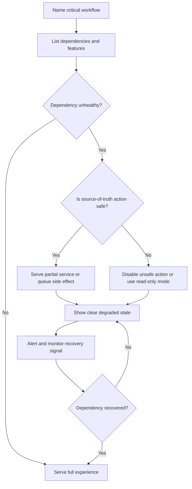

# Graceful Degradation

Graceful degradation is the practice of keeping the most important workflow
honest and usable when the full system is not healthy. Instead of failing
everything, the system serves a reduced experience, disables unsafe work, or
shows clear pending state.

Use this page when a design has optional dependencies, derived views, expensive
features, background side effects, or user interfaces that can still provide
value during partial failure.

## Purpose

Graceful degradation answers:

- Which workflow must keep working during partial failure?
- Which features can be disabled without corrupting data?
- Which fallback content is safe to show?
- Which user-visible state explains what changed?
- Which actions should become read-only, queued, hidden, or temporarily
  unavailable?
- What should operators monitor while the degraded mode is active?
- What signal restores the full experience?

The goal is not to pretend everything is fine. The goal is to preserve the core
promise while being clear about what is missing or delayed.

## When This Matters

Graceful degradation matters when:

- an optional dependency can fail without invalidating the core workflow;
- reads can tolerate stale or partial data;
- writes are unsafe but reads can continue;
- background work such as notifications, exports, or indexing can lag;
- a public page, admin view, or support workflow should remain useful during an
  incident;
- a circuit breaker, timeout, or failover path needs a user-facing response.

It is less useful when correctness depends on a real-time dependency and no
safe fallback exists. In that case, return a clear failure or pending state.

## Questions To Ask

Start with the user experience:

- What is the one action users still need most?
- What can be removed from the page or API response during an incident?
- What stale data can be shown safely, and how should its age be labeled?
- What actions must be disabled to protect the source of truth?
- What should the user see when work is queued for later?
- Which support or operator path remains available?

Then define system behavior:

- Which dependency failure triggers degraded mode?
- Which features are non-critical?
- How is degraded mode detected, entered, and exited?
- What data is recorded for delayed or skipped work?
- What metrics show whether degradation is helping or hiding the issue?

## Degradation Flow

## Decision Guidance

### Partial Service

Partial service keeps the critical workflow available while non-critical work is
reduced or delayed.

Good candidates:

- create the source-of-truth request but delay notifications;
- show the main record while hiding recommendations;
- accept uploads but delay scanning or preview generation;
- let staff view schedules while exports are unavailable;
- process checkout but delay receipt email if payment confirmation is durable.

Bad candidates:

- confirming a booking without durable capacity reservation;
- showing an approval as complete while required fraud or authorization checks
  are unavailable;
- accepting destructive writes during data-store uncertainty;
- hiding a failed payment behind a successful order state.

Partial service should protect correctness first and convenience second.

### Fallback Content

Fallback content is substitute data or UI when the preferred dependency is not
available.

Useful fallback content:

- cached data with a timestamp;
- default sort order when ranking is unavailable;
- text-only preview when image processing is down;
- static help content when search is unavailable;
- "last updated" dashboard snapshots;
- explicit `pending`, `retrying`, or `temporarily unavailable` states.

Fallback content should be labeled when freshness or completeness matters. Do
not show stale data as if it were live.

### Disabling Non-Critical Features

Feature disabling is safer than broad outage when the disabled feature is not
essential to the workflow.

Disable or hide:

- recommendations and personalization;
- autocomplete and search suggestions;
- analytics widgets and dashboards;
- exports, reports, and thumbnails;
- low-priority notifications;
- expensive admin bulk actions;
- optional partner integrations.

Keep or prioritize:

- source-of-truth reads and writes that define the main workflow;
- authentication and authorization checks;
- user-visible status for pending work;
- support lookup and repair tools;
- audit records for risky actions.

The disabled feature should have a clear re-enable signal. Manual feature flags
are acceptable when operators know who owns them and what metric proves recovery.

### User Experience Trade-Offs

Graceful degradation is a product decision as much as a technical decision.

User experience choices:

- Explain what changed when the missing feature affects user decisions.
- Avoid alarming language for optional features.
- Avoid hiding failures when users need to act.
- Prefer read-only mode over broken editing.
- Show pending state for delayed work.
- Preserve user input when possible so users do not repeat work.
- Make support and operator state match what users see.

For APIs, degraded mode should be visible through fields, status codes, headers,
or response metadata. A caller should be able to tell the difference between
"complete," "partial," "pending," and "failed."

## Trade-Offs

Graceful degradation trades completeness, correctness, and trust.

- Serving stale data improves availability, but can mislead users if freshness
  matters.
- Disabling optional features protects core workflows, but may reduce revenue,
  engagement, or operator convenience.
- Queuing side effects keeps the user moving, but creates delayed work that
  needs retries, idempotency, and repair.
- Read-only mode prevents bad writes, but can block urgent changes.
- Showing detailed degraded state improves trust, but too much incident detail
  can confuse users or expose operational internals.

Use degradation when the reduced experience is still truthful. If the fallback
would make users believe something happened when it did not, fail clearly
instead.

## Common Mistakes

- Calling any fallback graceful even when it hides data corruption.
- Serving stale data without timestamp or freshness warning.
- Disabling the wrong feature and blocking the critical workflow.
- Returning success for work that was only queued when users expect completion.
- Forgetting to monitor fallback volume and degraded-mode duration.
- Letting disabled features stay disabled after recovery.
- Making the UI degraded but leaving APIs to pretend responses are complete.
- Skipping audit records for actions taken during incidents.

## Examples

### Permit Detail Page

A neighborhood permit system shows permit applications, reviewer notes, document
attachments, contractor recommendations, and status history.

| Failure | Degraded Behavior | Why It Is Safe |
| --- | --- | --- |
| Recommendation service down | Hide recommendations and show permit details normally | Recommendations are optional enrichment |
| Search index stale | Show direct permit lookup and label search results as delayed | Permit record still comes from the database |
| Attachment preview worker down | Allow downloads but hide generated previews | Preview is convenience, not source of truth |
| Approval database unavailable | Disable approve/reject actions and keep the page read-only | Approval must be durable and audited |

The page remains useful because users can still inspect the permit. It does not
pretend an approval succeeded when the source-of-truth write cannot be made.

### Clinic Appointment Reminder

A clinic appointment system confirms bookings in the database, then sends SMS
reminders in the background.

If the SMS provider is unavailable:

- appointment booking continues after the durable booking write;
- reminder state becomes `retrying`;
- the confirmation page says the appointment is booked and reminder delivery is
  delayed;
- staff can see reminders that need review;
- workers retry with backoff and idempotency keys.

This is graceful degradation because the appointment itself remains correct and
the delayed side effect is visible and repairable.

## Checklist

Before approving graceful degradation, confirm:

- The critical workflow is named.
- Partial service preserves source-of-truth correctness.
- Fallback content is safe, labeled, and bounded by freshness expectations.
- Non-critical features are explicitly identified and can be disabled.
- Unsafe writes become read-only, pending, or clearly unavailable.
- Users can distinguish full, partial, pending, and failed states.
- Queued side effects have idempotency, retries, max attempts, and repair paths.
- Operators can see degraded-mode entry, duration, fallback volume, disabled
  feature state, and recovery signals.
- Re-enable criteria are defined.
- The degraded mode does not bypass authorization, audit, or tenant boundaries.

## Related Pages

- [Reliability](index.md)
- [Failure-mode analysis](failure-mode-analysis.md)
- [Timeouts](timeouts.md)
- [Circuit breakers](circuit-breakers.md)
- [Retries](retries.md)
- [Idempotency](../communication/idempotency.md)
- [Synchronous vs asynchronous communication](../communication/sync-vs-async.md)
- [Design review checklist](../method/design-review-checklist.md)
