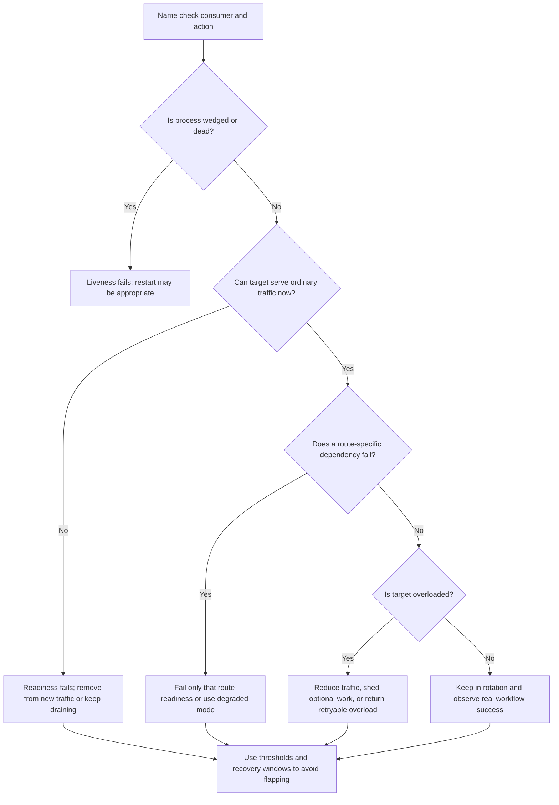

# Health Checks

Health checks are signals that tell automation whether a process is alive,
ready for traffic, draining, overloaded, or unable to serve a specific
workflow. They are reliability controls, not just endpoints that return
`200 OK`.

A good health-check design separates liveness from readiness, keeps dependency
checks scoped to the workflow they affect, and avoids false positives that send
traffic to broken instances or remove healthy capacity during a shared
dependency incident.

## Purpose

Use this guide to decide:

- which checks prove a service is alive versus ready;
- when a dependency should affect global readiness, route readiness, degraded
  mode, or only observability;
- how load balancers should add, remove, drain, and re-add targets;
- how false positives and false negatives create outages;
- what operators should measure when health checks change state.

The output should be a small set of health states that match real traffic
behavior, deployment behavior, and failure handling.

## When This Matters

Health-check design matters when:

- a load balancer, orchestrator, scheduler, service discovery system, or deploy
  tool decides where traffic goes;
- new instances need warm-up before they can serve real requests;
- instances need to stop receiving new work before shutdown;
- one dependency is required for one route but not for every route;
- false unhealthy signals can remove too much capacity;
- false healthy signals can route users to cold, wedged, misconfigured, or
  partially broken targets;
- operators need to distinguish process failure from dependency failure and
  overload.

It matters less for a single manual prototype with no automated routing, but
even then the design should explain how operators know the process can serve
the critical workflow.

## Questions To Ask

- Who consumes the check: load balancer, orchestrator, deploy tool, operator,
  synthetic monitor, or another service?
- What action does the consumer take when the check fails?
- Is the check proving process liveness, startup warm-up, traffic readiness,
  route readiness, dependency availability, overload, or drain state?
- Which user workflows should keep working when one dependency is down?
- What dependencies are required for all traffic, and which are route-specific
  or optional?
- What is safer during a shared dependency outage: remove this instance, serve a
  degraded response, or keep it in rotation?
- How many failed checks and how much time should pass before traffic changes?
- How does an instance return to service without flapping?
- Which metrics prove that health-check behavior improved user outcomes?

## Decision Guidance

### Separate Liveness From Readiness

Liveness answers: "Should this process be restarted because it is wedged or
dead?"

Readiness answers: "Should this process receive new traffic now?"

Do not use one endpoint for both. A service can be alive but not ready during
startup, warm-up, configuration load, migration guard checks, dependency
recovery, overload, or shutdown drain.

Example shape:

```text
/livez: process event loop responds and critical threads are not wedged.
/readyz: instance has loaded config, warmed required local state, and is not
         starting, draining, or overloaded.
/readyz/checkout: checkout can reach the authoritative inventory and payment
                  paths well enough to complete the workflow.
```

If `/livez` fails, a restart may help. If `/readyz` fails, routing should stop
new traffic while the process may continue finishing work or recovering.

### Make Readiness Match Real Traffic

A readiness check should be close enough to real traffic to catch meaningful
breakage, but not so deep that every minor dependency issue removes all
targets.

Readiness should include:

- required configuration and secrets loaded;
- compatible schema or migration guard passed;
- local warm-up complete where needed;
- required connection pools initialized;
- shutdown drain flag not set;
- overload flag not set when the target cannot safely accept new work.

Readiness should not blindly include:

- every downstream service, cache, queue, search index, or analytics pipeline;
- optional dependencies with a degraded response;
- slow deep queries that add load during incidents;
- checks that mutate data or consume scarce capacity;
- network calls with longer timeouts than user requests.

If the check is too shallow, users get routed to targets that cannot serve real
work. If it is too deep, a shared dependency incident can make every target
unready and create a total outage.

### Scope Dependency Checks To The Workflow

Dependency checks are useful only when their failure maps to a routing or
degraded-mode decision.

Use global readiness for dependencies that every routed request needs:

```text
Config service unavailable before startup: not ready.
Primary database unreachable for all commands: not ready or read-only mode,
depending on the product promise.
```

Use route readiness when a dependency affects only one workflow:

```text
/readyz/search: search index reachable or stale browse mode enabled.
/readyz/checkout: inventory write path and payment provider are usable enough
                   for checkout traffic.
```

Route-specific readiness is useful only when the routing layer can act on it
per route or route group. If routing cannot do that, the application should use
degraded mode, route-level errors, or feature flags instead of pretending one
global readiness state can represent every workflow.

Use observability-only checks for optional or asynchronous work:

```text
Analytics pipeline down: service remains ready, dashboard shows lag, and
analytics jobs retry later.
```

The question is not "is the dependency healthy?" The question is "what should
traffic do because this dependency is unhealthy?"

### Design For False Positives And False Negatives

Health checks can be wrong in two directions.

| Mistake | Meaning | Impact | Design Response |
| --- | --- | --- | --- |
| False healthy | Check passes while real traffic fails | Users hit broken targets | Add readiness conditions that match critical routes |
| False unhealthy | Check fails while target can serve useful traffic | Capacity disappears and incidents widen | Remove optional dependencies from global readiness |
| Flapping | Check alternates healthy and unhealthy | Traffic churn, retries, and unstable deploys | Use thresholds, hysteresis, and stable recovery windows |
| Slow check | Check times out under load | Healthy targets leave rotation during pressure | Keep checks cheap and bounded |
| Shared dependency check too deep | Every target fails together | Load balancer has no healthy targets | Route-specific checks or degraded mode |

Choose thresholds intentionally:

```text
Remove target after 3 failed readiness checks over 30 seconds.
Re-add only after 5 consecutive successful checks and warm-up completion.
```

The numbers should match the blast radius of a bad decision. A small internal
worker can recover aggressively; a public checkout target may need more stable
evidence before traffic shifts.

### Coordinate With Load Balancer Behavior

Load balancers act on health checks. The page should define the behavior, not
only the endpoint.

Design decisions:

- which health state removes a target from new traffic;
- how existing requests drain;
- whether long-lived connections are closed, allowed to finish, or asked to
  reconnect;
- how slow start or warm-up limits traffic when a target returns;
- whether route-specific checks affect all routes or only a route group;
- what happens when all targets are unhealthy;
- how overloaded targets reduce traffic instead of only passing or failing.

The all-target-unhealthy case is a product and operations decision. Some
systems fail closed to avoid unsafe writes, some fail open for stale read-only
traffic, and some route only to a degraded endpoint. Do not let the load
balancer default choose this behavior accidentally.

Example:

```text
During deploy, instance sets draining=true.
Load balancer stops new requests after /readyz fails.
In-flight requests have 30 seconds to finish.
The instance exits only after drain completes or the shutdown budget expires.
```

Load balancer retries also need care. Retrying an idempotent read on another
target may be safe. Retrying a non-idempotent command can duplicate side effects
unless the command has an idempotency key or operation record.

### Treat Overload As A Health State

An instance can be alive and correctly configured but unable to accept more
work. Treat overload as readiness, traffic weighting, or load-shedding input
rather than waiting for crashes.

Useful overload signals:

- request concurrency above a target;
- event loop, worker pool, or thread pool saturation;
- database pool wait time;
- queue production backlog;
- memory pressure or garbage collection pauses;
- p95 or p99 latency above a route-specific target;
- downstream timeout or rate-limit spike.

Responses include removing the target from new traffic, lowering its weight,
returning `503` or `429` with retry hints, serving degraded responses, or
shedding optional work. Pick the response that protects the critical workflow
without pretending the target is dead.

## Health Check Flow



Use this flow for each health-check consumer. A load balancer, orchestrator, and
human dashboard may need different checks because they take different actions.

## Original Example

A city library reservation API runs three stateless instances behind a load
balancer. Users can search tools, reserve available tools, and receive reminder
emails.

Health-check design:

| Check | Meaning | Consumer Action |
| --- | --- | --- |
| `/livez` | Process loop responds and worker threads are not wedged | Orchestrator restarts only after repeated liveness failure |
| `/readyz` | Config loaded, schema compatible, DB pool initialized, not draining | Load balancer sends ordinary traffic only to ready targets |
| `/readyz/search` | Search index is reachable or stale browse mode is enabled | Search route stays available with degraded stale results |
| `/readyz/reserve` | Reservation database write path is usable | Reservation route is removed or fails closed if unavailable |
| Drain flag | Instance is shutting down | Stop new traffic and finish in-flight reservations |

Failure handling:

- if reminder email provider is down, the API remains ready because reminders
  can queue and retry later;
- if the reservation database is unavailable, reservation readiness fails
  because the system cannot safely confirm tool inventory;
- if the search index is down, search serves a stale catalog with a timestamp
  instead of making every instance globally unready;
- if one instance has high database pool wait while peers are normal, the load
  balancer lowers traffic to that instance and operators inspect per-target
  metrics;
- a target is removed only after three failed readiness checks and re-added
  after five successful checks plus warm-up.

Interview answer shape:

```text
Consumer: load balancer and orchestrator.
Liveness: process-local only; restart when wedged.
Readiness: config, schema, warm-up, drain, and overload state.
Dependencies: global only for all-route requirements; route-specific otherwise.
Load balancer behavior: remove after stable failure, drain, slow-start return.
All unhealthy: fail closed for unsafe writes, degraded/stale for safe reads.
Observability: health transitions, per-target traffic, route success, and
dependency pressure.
```

Rejected for version 1:

- one global `/health` endpoint that checks every dependency;
- liveness tied to the email provider, because restarting the API will not fix
  a provider outage;
- load balancer retries for reservation writes without idempotency keys.

This design keeps useful traffic flowing during partial failure while avoiding
false healthy signals for the reservation path.

## Trade-Offs

| Choice | Benefit | Cost Or Risk |
| --- | --- | --- |
| Shallow liveness | Avoids restarts during dependency incidents | Does not prove the service can serve users |
| Real readiness | Catches cold or misconfigured instances | Must stay cheap and bounded |
| Deep global dependency checks | Catch more broken paths | Can remove all capacity during shared dependency trouble |
| Route readiness | Preserves unaffected routes | More endpoints and routing policy |
| Stable failure thresholds | Reduce flapping | Slower removal of truly bad targets |
| Fast failure thresholds | Remove bad targets quickly | Higher false-unhealthy risk |
| Drain before shutdown | Protects in-flight work | Slower deploys and scale-down |
| Overload readiness | Protects saturated targets | Can reduce capacity if thresholds are too aggressive |

## Failure Modes

| Failure Mode | Impact | Design Response | Signal |
| --- | --- | --- | --- |
| Liveness includes a dependency | Restart loop during dependency outage | Keep liveness process-local | Restart count, same dependency error |
| Readiness says ready too early | Cold targets receive traffic | Startup gates and warm-up completion | Ready-before-warm metric, deploy error spike |
| Readiness checks every dependency | All targets leave rotation | Route readiness and degraded modes | All-target unhealthy event |
| Check timeout exceeds user timeout | Routing lags behind real failure | Keep checks cheap with short budgets | Health-check latency, stale target state |
| Flapping target | Traffic churn and retry amplification | Consecutive-failure and recovery windows | Repeated add/remove events |
| Draining missing | Deploy drops in-flight requests | Readiness removal before shutdown | Reset connections, deploy-time 5xx |
| Load balancer retries unsafe command | Duplicate side effect | Retry only idempotent work or require idempotency keys | Duplicate operation records |

## Common Mistakes

- Using one `/health` endpoint for liveness, readiness, dependencies, and
  operator status.
- Treating "process is up" as proof that user workflows can succeed.
- Restarting services because a shared dependency is down.
- Including optional dependencies in global readiness.
- Making checks slow, mutating, or more expensive than normal traffic.
- Letting health checks flap without thresholds or recovery windows.
- Forgetting warm-up and connection draining during deploys.
- Looking only at service-level health instead of per-target and per-route
  outcomes.
- Allowing direct target access to bypass load balancer policy and health
  routing.
- Exposing detailed dependency names, versions, secrets, or internal topology
  on public health endpoints.

## Checklist

Before relying on health checks, confirm:

- [ ] Each check has a named consumer and action.
- [ ] Liveness is process-local and does not depend on external systems.
- [ ] Readiness proves the instance can serve ordinary traffic now.
- [ ] Startup warm-up and shutdown drain are separate from liveness.
- [ ] Dependency checks are global only when the dependency is required for all
      routed traffic.
- [ ] Route-specific dependencies use route readiness or degraded mode.
- [ ] Optional async dependencies remain observable without removing all
      traffic.
- [ ] False healthy and false unhealthy cases are named.
- [ ] Failure thresholds, recovery thresholds, and timeouts are documented.
- [ ] Load balancer behavior covers target removal, re-addition, draining,
      all-target-unhealthy behavior, and retries.
- [ ] Overload behavior says whether to reduce weight, fail readiness, shed
      work, or return retryable errors.
- [ ] Public health endpoints expose only minimal status, while detailed
      dependency diagnostics are authenticated, internal, or operator-only.
- [ ] Metrics include health-check state, transitions, latency, target traffic,
      target errors, per-route success, dependency status, and direct-target
      access.

## Related Pages

- [Reliability overview](./)
- [Failure-mode analysis](failure-mode-analysis.md)
- [Graceful degradation](graceful-degradation.md)
- [Failover](failover.md)
- [Load balancer component](../components/load-balancer.md)
- [Load balancing](../scalability/load-balancing.md)
- [Stateless services](../scalability/stateless-services.md)
- [Availability requirements](../requirements/availability.md)
- [Observability basics](../operations/observability-basics.md)
