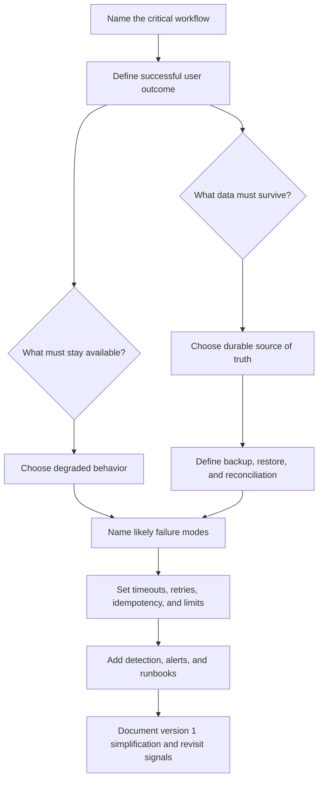

# Reliability

Reliability is the discipline of deciding what should happen when parts of a
system fail, slow down, return ambiguous results, or lose state. A reliable
design does not pretend that every dependency is healthy. It names the important
workflows, protects their data, explains degraded behavior, and gives operators
a path to recovery.

Use this section when a design needs to move beyond the happy path. The goal is
not to make every feature equally available. The goal is to decide which user
outcomes must keep working, which data must survive, which failures can be
tolerated temporarily, and which failures need repair.

## Purpose

Reliability design answers questions such as:

- Which workflows must remain available during partial failure?
- Which records must be durable after crashes, retries, bad deploys, or
  accidental deletion?
- How quickly must the system recover, and how much work can be lost?
- What should users see when the complete experience is unavailable?
- Which dependencies can fail without corrupting the source of truth?
- How will operators detect, diagnose, and repair stuck or inconsistent state?
- What does the system do when a request succeeds but the response is lost?

Reliability is not a single component. It is a set of decisions across APIs,
storage, queues, caches, background workers, deployment, observability, and
operator runbooks.

## When This Matters

Reliability work matters when:

- users depend on a workflow being available during incidents;
- losing, duplicating, or corrupting data would create user harm;
- a request crosses service, network, region, or vendor boundaries;
- background work can retry, stall, or produce duplicate side effects;
- caches, replicas, or queues can return stale or partial results;
- operators need to recover from bad deploys, data mistakes, or dependency
  outages;
- an architecture diagram currently shows only the happy path.

For a small internal prototype, reliability may be a short set of notes. For a
public system that accepts money, bookings, identity changes, medical records,
or administrative actions, reliability decisions should be explicit before
launch.

## Questions To Ask

Start with the user workflow:

- What action is the user trying to complete?
- What must be true before success is returned?
- What can happen later without surprising the user?
- What data is the durable source of truth?
- What can be recomputed, re-sent, or reconciled?
- What should be disabled, hidden, cached, or made read-only during an outage?
- What will an operator look at first when one user reports a wrong result?

Then test the design against failure:

- What if the database is slow, unavailable, or returns an error after a write?
- What if a downstream API times out after completing the side effect?
- What if a queue delivers the same job twice?
- What if a worker crashes halfway through a multi-step operation?
- What if a cache serves stale data after the source of truth changes?
- What if a restore is needed but the latest backup is corrupt?

## Reliability Decision Flow



## Decision Guidance

### Availability

Availability is about whether a user can complete an important workflow when
parts of the system are unhealthy. Do not describe availability only as a
percentage. Tie it to a workflow:

- residents can submit emergency repair requests;
- reviewers can approve permits already in the queue;
- coordinators can view the latest known schedule;
- users can read receipts even if new notifications are delayed.

Different workflows can have different availability targets. A public status
page may stay available while exports are paused. A checkout flow may reject new
orders rather than accept orders that cannot be fulfilled. A reporting dashboard
may show the last refreshed data with a clear timestamp.

### Durability

Durability is about whether important data survives failures. The durable source
of truth should be clear before adding caches, replicas, indexes, queues, or
derived views.

Ask:

- Which records must never disappear silently?
- Which state transitions need audit history?
- Which side effects need idempotency keys or deduplication records?
- Which data can be rebuilt from logs or events?
- Which deletion, retention, and restore rules apply?

A durable design also considers bad writes. Backups help only if restores are
tested, corrupted data is detected, and operators know how to repair partial
state.

### Recovery

Recovery is the path back to a known-good state. It includes automated retries,
operator repair, data reconciliation, rollback, restore, and user-visible
status. Recovery should be designed around concrete failure modes, not vague
confidence that someone can fix it later.

Useful recovery decisions include:

- retry limits and backoff for transient failures;
- dead-letter or quarantine paths for poison jobs;
- runbooks for stuck workflows and partial side effects;
- restore tests for critical backups;
- reconciliation jobs that compare source-of-truth state with derived state;
- user-visible states such as `pending`, `retrying`, `failed`, or `needs
  review`.

### Degraded Mode

Degraded mode is a deliberate partial experience when the full system is
unavailable. It is better to serve reduced, honest behavior than to fail
silently or pretend stale data is current.

Examples:

- accept repair requests but delay non-critical email notifications;
- show cached schedule data with a timestamp while live search is down;
- make an admin dashboard read-only during a database failover;
- disable recommendations while keeping direct product lookup available;
- queue uploads for later processing while showing processing status.

Good degraded behavior protects the critical workflow, tells users what changed
when appropriate, and avoids corrupting durable state.

### Incomplete Happy-Path Diagrams

A diagram that only shows the successful request path is not design-ready. It
may be useful as a first sketch, but reliability review should add the missing
paths:

- timeouts and cancellation;
- retries with maximum attempts and jitter;
- duplicate requests, duplicate messages, and idempotency behavior;
- partial failure between durable writes and side effects;
- cache or replica staleness;
- queue backlog, poison messages, and dead-letter handling;
- failover, restore, or manual repair;
- monitoring signals and operator entry points.

If the diagram cannot explain what happens when a dependency is slow or
unavailable, the design is still incomplete.

## Trade-Offs

Reliability choices usually trade simplicity, cost, latency, and user
experience.

- More retries can improve success during transient failure, but can amplify
  overload or duplicate side effects.
- Stronger durability can reduce data loss, but may increase write latency and
  operational cost.
- Active failover can reduce outage time, but adds consistency, routing, and
  testing complexity.
- Graceful degradation can preserve core workflows, but requires product
  decisions about which features are safe to disable.
- Manual repair can be acceptable for rare failures, but it needs runbooks,
  audit trails, and clear ownership.

Choose the simplest reliability mechanism that protects the workflow and data at
risk. Add more complexity when the failure impact, recovery objective, or
operational evidence justifies it.

## Common Mistakes

- Saying "make it highly available" without naming the workflow.
- Treating durability as solved because a database is used.
- Adding retries without timeouts, jitter, idempotency, or attempt limits.
- Letting background workers create side effects that cannot be deduplicated.
- Ignoring user-visible state for stuck or partially completed workflows.
- Assuming a backup is useful without testing restore.
- Building active/active failover before defining consistency and repair.
- Drawing only the happy path and calling the architecture complete.

## Example

A neighborhood clinic lets residents request same-day vaccine appointments.

Version 1 critical workflow:

- residents submit appointment requests;
- staff confirm available slots;
- residents receive confirmation;
- staff can see the schedule during the clinic day.

Reliability decisions:

| Concern | Decision | Trade-Off |
| --- | --- | --- |
| Availability | Keep appointment submission and staff schedule reads available before reminder delivery | Residents may receive delayed reminders during notification outages |
| Durability | Store appointment requests and status changes in the primary database before sending notifications | Confirmation response waits for the durable write |
| Recovery | Retry notification jobs with backoff, then move repeated failures to staff review | Staff need a small repair queue |
| Degraded mode | If reminder delivery is down, continue booking and show "confirmed, reminder pending" | User messaging must be clear |
| Incomplete diagram fix | Add timeout, retry, duplicate request, notification failure, and staff repair paths to the design | The diagram is larger, but it explains incident behavior |

A happy-path-only design might show:

```text
Resident -> API -> Database -> Notification service -> Resident
```

That sketch hides the main risks. A reliability-ready version explains what
happens if the notification service times out after sending, if a resident
submits twice, if the database write succeeds but the API response is lost, and
how staff find appointments that need manual follow-up.

## Reliability Pages

Current related pages:

- [Failure-mode analysis](failure-mode-analysis.md)
- [Retries and backoff](../communication/retries-and-backoff.md)
- [Idempotency](../communication/idempotency.md)
- [Synchronous vs asynchronous communication](../communication/sync-vs-async.md)
- [Transactions](../data/transactions.md)
- [Database read scaling](../scalability/database-read-scaling.md)
- [Design review checklist](../method/design-review-checklist.md)
- [Operations](../operations/)

Planned pages in this section:

- `docs/reliability/timeouts.md`
- `docs/reliability/retries.md`
- `docs/reliability/circuit-breakers.md`
- `docs/reliability/graceful-degradation.md`
- `docs/reliability/bulkheads.md`
- `docs/reliability/health-checks.md`
- `docs/reliability/failover.md`
- `docs/reliability/backup-and-restore-recovery.md`
- `docs/reliability/disaster-recovery.md`
- `docs/reliability/rpo-rto.md`
- `docs/reliability/data-loss-scenarios.md`

## Checklist

Before calling a design reliable, confirm:

- The critical workflow and successful user outcome are named.
- Availability is tied to user-visible behavior, not only a percentage.
- Durable data, derived data, and rebuildable data are distinguished.
- Recovery paths include retries, reconciliation, repair, rollback, or restore
  where relevant.
- Degraded mode is explicit for non-critical dependencies or features.
- Timeouts, retries, duplicate handling, and idempotency are defined where a
  request crosses a boundary.
- Backups and restore paths are tested for important data.
- Operators have logs, metrics, alerts, identifiers, and runbooks for the
  highest-impact failures.
- Diagrams include failure and recovery paths, not only successful calls.
- Version 1 keeps reliability mechanisms proportional to the risk.

## Related Pages

- [System design process](../method/system-design-process.md)
- [Requirement discovery](../method/requirement-discovery.md)
- [Functional vs non-functional requirements](../method/functional-vs-nonfunctional-requirements.md)
- [Scale estimation](../method/scale-estimation.md)
- [Trade-off vocabulary](../method/tradeoff-vocabulary.md)
- [Communication](../communication/)
- [Scalability](../scalability/)
- [Glossary](../glossary.md)

Return to the [documentation index](../).
