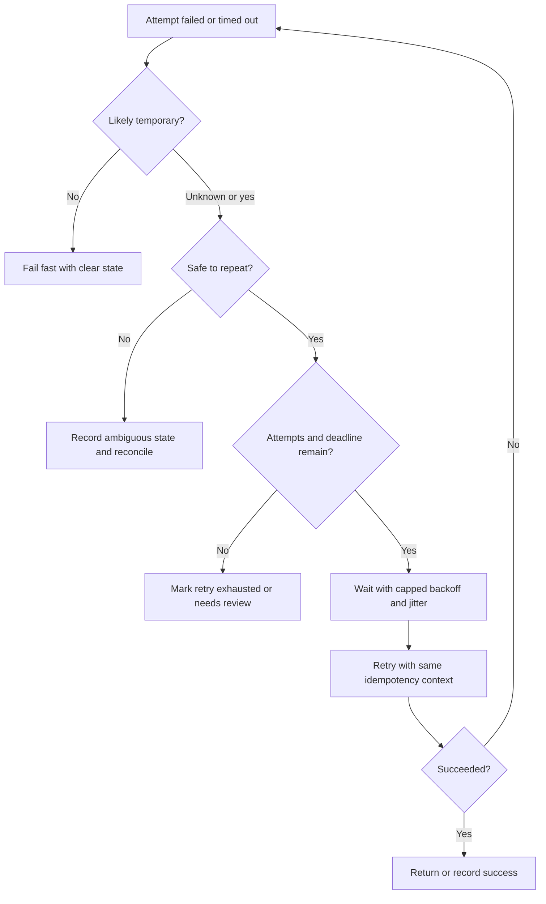

# Retries

Retries are a reliability tool for temporary uncertainty. They can hide brief
network failures, smooth over a restarting dependency, and let background work
finish later. They can also duplicate side effects, amplify overload, and make a
partial outage worse.

Use this page when a design says "just retry" and needs to prove that repeated
attempts are safe, bounded, observable, and tied to the workflow's timeout
budget.

## Purpose

Retry design answers:

- Which failures are temporary enough to retry?
- Which operations are safe to repeat?
- What idempotency key or dedupe rule protects the business action?
- How many attempts are allowed before the workflow changes state?
- How do backoff and jitter prevent synchronized retry spikes?
- What duplicate side effects could happen if the retry boundary is wrong?
- How do operators see retry pressure before it becomes an incident?

Retries should reduce user-visible failure during recovery. They should not
hide permanent errors or create a second workload that harms the dependency.

## When This Matters

Retries matter when:

- a command crosses a service, network, queue, or provider boundary;
- a timeout leaves the caller unsure whether work happened;
- background jobs can fail and run again;
- clients or workers can repeat the same request;
- duplicate side effects could charge money, reserve capacity, send messages,
  publish webhooks, or append audit records twice;
- a dependency can become slow or overloaded under retry pressure.

Pure reads are often safer to retry than writes, but even reads need deadlines,
attempt limits, and overload protection.

## Questions To Ask

Start with the operation:

- What is the user or business action?
- Is it a read, a source-of-truth write, a derived update, or an external side
  effect?
- What changes if the operation runs twice?
- What response should a duplicate attempt receive?
- Which timeout or error means "unknown" instead of "failed"?
- What state is recorded when attempts are exhausted?

Then define the retry policy:

- Which errors are retryable?
- What is the per-attempt timeout?
- What is the total deadline across all attempts?
- How many attempts are allowed?
- What backoff and jitter spread attempts over time?
- Which metrics show attempt count, duplicate suppression, retry exhaustion,
  and dependency saturation?

## Retry Decision Flow

## Decision Guidance

### Safe Retries

A retry is safe when repeating the attempt cannot create a second business
result or harmful side effect. Safety usually comes from the data model, not the
transport.

Safe retry patterns:

- reads that do not mutate state;
- commands with a stable idempotency key;
- writes protected by a unique business constraint;
- event handlers that record processed event IDs;
- derived-state updates that upsert by source entity and version;
- side effects that have a durable send, call, or delivery record.

Unsafe retry examples:

- sending an SMS each time the worker retries;
- capturing a payment with a new provider key after a timeout;
- decrementing inventory without tying the decrement to one reservation;
- appending audit entries with no stable event ID when duplicates matter;
- creating a shipment or entitlement before the source-of-truth attempt exists.

If a command is not safe to repeat, add idempotency, reconciliation, or manual
review before adding automatic retries.

### Idempotency

Idempotency means repeated attempts for the same intended operation produce one
business result. It is the main tool that makes retries safe.

For retryable commands, define:

- who creates the idempotency key;
- the key scope, such as user, account, entity, workflow, or provider attempt;
- where the key and first result are stored;
- how duplicate attempts return the prior result or current state;
- how key conflicts are rejected when the same key is reused for different
  work;
- how long keys are retained for retry, replay, and support windows.

For background jobs and events, define:

- the stable job or event identity;
- the processed-event or side-effect record;
- whether replay rebuilds state without repeating irreversible side effects;
- which duplicate suppression metric operators can inspect.

Retries without idempotency are guesses. They may work during testing and fail
under real timeouts.

### Duplicate Side Effects

Side effects leave the source-of-truth boundary: payment, email, SMS, webhooks,
shipping, entitlement grants, file exports, search updates, or calls to partner
systems.

To avoid duplicate side effects:

- persist the business attempt before the first external call;
- reuse the same operation key on every retry;
- record provider request IDs, response IDs, and terminal states;
- treat timeouts as ambiguous until reconciled;
- dedupe sends by recipient, source event, version, and message type;
- make rebuildable side effects upsert by stable object ID;
- expose `pending`, `retrying`, `failed`, `sent`, `completed`, or
  `needs_review` states where users or operators care.

A retry policy is incomplete if it only retries the API call and ignores what
the receiver may have already done.

### Maximum Attempts

Every retry policy needs a maximum attempt count and a total deadline.

Use fewer attempts when:

- the request is user-facing;
- the operation is expensive;
- the dependency is already saturated;
- duplicate side effects are hard to repair;
- the error is likely permanent.

Use more attempts when:

- the work is asynchronous and durable;
- the operation is idempotent;
- the dependency commonly has short transient failures;
- delayed completion is acceptable;
- exhausted work has a dead-letter, reconciliation, or manual repair path.

After max attempts, store the final state. Silent drops make reliability worse
because operators cannot tell what failed or whether repair is safe.

### Jitter And Backoff

Backoff waits between attempts so a dependency has time to recover. Jitter adds
randomness so many callers do not retry at the same instant.

Common policy shape:

| Attempt | Delay Before Attempt | Notes |
| --- | --- | --- |
| 1 | none | First try within the workflow budget |
| 2 | short delay with jitter | Handles brief network or process restart |
| 3 | longer capped delay with jitter | Gives dependency time to recover |
| 4+ | background-only when useful | User-facing requests usually need a clear result sooner |

Backoff and jitter should fit inside the total deadline. A background workflow
can wait minutes. An interactive request may only have room for one short retry
before returning a clear timeout, pending state, or degraded response.

### Retry Storms

A retry storm happens when many callers retry during the same failure and create
more traffic than the original workload.

Common causes:

- no jitter;
- no max attempts;
- the same retry schedule in every client;
- retries at several layers without a shared budget;
- queues releasing a backlog too quickly;
- clients ignoring overload, rate-limit, or retry-after signals;
- retries continuing after cancellation or caller timeout.

Storm containment:

- cap attempts and total deadlines;
- use jittered backoff;
- respect dependency overload signals;
- stop retrying when the caller no longer needs the result;
- add concurrency limits or queue rate limits;
- fail fast or degrade for optional dependencies during known incidents;
- alert on retry rate, retry exhaustion, dependency saturation, and queue age.

Retries are useful during recovery only if they leave capacity for normal work.

## Trade-Offs

Retries trade success rate, latency, load, and operational clarity.

- A retry can hide a transient failure, but it adds latency to the caller.
- More attempts can improve completion, but can waste capacity during overload.
- Background retries protect user latency, but require durable job state and
  repair tools.
- Jitter makes recovery smoother, but individual completion timing becomes less
  predictable.
- Strict idempotency prevents duplicate side effects, but adds storage, key
  scope, and conflict-handling decisions.
- Failing fast can protect a dependency, but users may see more immediate
  failures during short incidents.

Use retries for temporary uncertainty. Use clear failure, degraded mode, or
manual review when the result is permanent, unsafe to repeat, or ambiguous.

## Common Mistakes

- Retrying every error, including validation and authorization failures.
- Retrying commands without an idempotency key or unique business constraint.
- Generating a new idempotency key for each attempt.
- Treating a timeout as proof that the receiver did nothing.
- Allowing infinite retries.
- Using backoff without jitter.
- Retrying at the browser, gateway, service client, and worker without a shared
  budget.
- Retrying optional work after the user-visible workflow already failed.
- Dropping exhausted work without a state, alert, or repair path.
- Measuring final failures but not retry rate and duplicate suppression.

## Example

A community clinic sends appointment reminders after residents book vaccine
slots. Booking is the source-of-truth workflow. Reminder delivery can happen
later, but residents should not receive repeated reminder messages for the same
appointment.

Retry policy:

| Design Choice | Decision | Reason |
| --- | --- | --- |
| Safe retry boundary | Reminder send is keyed by `appointment_id + reminder_type + scheduled_for` | One appointment reminder should produce one message per channel |
| Idempotency storage | Store a reminder attempt before calling the provider | A timeout after provider receipt can be reconciled |
| Retryable errors | Provider timeout, temporary unavailable, rate limit with retry hint | These may recover with time |
| Non-retryable errors | Invalid phone number, opted-out recipient, malformed request | Retrying will not fix the input |
| Max attempts | Stop after a small fixed number for near-term reminders | Late reminders lose value and consume capacity |
| Jitter | Add random delay to each retry | Many reminders should not retry together after a provider incident |
| Exhausted state | Mark `needs_review` with last error and attempt count | Operators can inspect whether repair is useful |

If the provider times out after accepting the reminder, the worker retries with
the same send key. If a duplicate attempt arrives later, the worker sees the
existing send record and does not send a second message. If many provider calls
receive rate limits, workers slow down and spread retries instead of sending the
whole backlog again immediately.

## Checklist

Before approving retry design, confirm:

- Retryable and non-retryable errors are separated.
- Each retried attempt has a per-attempt timeout and total deadline.
- Commands and side effects have idempotency keys, unique constraints, or
  dedupe records.
- Duplicate side effects are named and guarded.
- Max attempts and exhausted states are defined.
- Backoff is capped and includes jitter.
- Retry behavior stops when cancellation or caller deadline makes the result
  useless.
- Retry storms are contained with budgets, concurrency limits, rate limits, or
  fail-fast behavior.
- Operators can see retry rate, duplicate suppression, retry exhaustion,
  dependency saturation, queue age, and repair state.
- Manual reconciliation exists for ambiguous provider or payment-style results.

## Related Pages

- [Reliability](index.md)
- [Timeouts](timeouts.md)
- [Failure-mode analysis](failure-mode-analysis.md)
- [Communication retries and backoff](../communication/retries-and-backoff.md)
- [Idempotency](../communication/idempotency.md)
- [Synchronous vs asynchronous communication](../communication/sync-vs-async.md)
- [Outbox pattern](../communication/outbox-pattern.md)
- [Design review checklist](../method/design-review-checklist.md)
