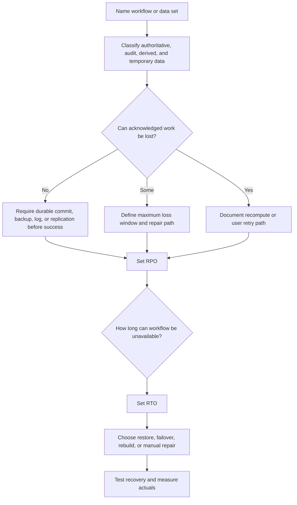

# RPO and RTO

Recovery Point Objective (RPO) and Recovery Time Objective (RTO) turn vague
recovery goals into design constraints. RPO asks how much work the system can
lose or need to recreate. RTO asks how long the workflow can be unavailable or
degraded before the impact is unacceptable.

Use this page when a design needs backup, restore, failover, disaster recovery,
or manual repair decisions that are proportional to real user and business
impact.

## Purpose

RPO and RTO design answers:

- Which workflow or data set is being protected?
- How much completed or acknowledged work can be lost?
- How long can the workflow be unavailable, read-only, delayed, or degraded?
- Which recovery mechanism can meet those limits?
- Which data can be rebuilt, reconciled, or manually re-entered?
- What evidence proves recovery targets are being met?
- What version 1 simplification is acceptable?

Do not set one RPO or RTO for the whole system unless every workflow has the
same impact. Most systems need different targets for different actions.

## When This Matters

RPO and RTO matter when:

- users create records, reservations, payments, approvals, identity changes, or
  other state that should not silently disappear;
- backups, replicas, logs, queues, or object storage are part of the recovery
  plan;
- failover could continue service with stale data;
- derived systems such as search, reports, recommendations, or notifications can
  be rebuilt after the source of truth is safe;
- operators need to choose between restore, failover, reconciliation, manual
  repair, or accepting temporary degraded mode.

For a small prototype, RPO and RTO may be rough statements. For a production
workflow, they should be specific enough to test in a recovery drill.

## Questions To Ask

Start with user impact:

- What does the user believe succeeded?
- Which durable state proves success?
- What work would be painful, expensive, unsafe, or impossible to recreate?
- How long can users tolerate clear unavailability?
- Is read-only mode acceptable while writes recover?
- Which work can be delayed without breaking the product promise?

Then connect targets to mechanisms:

- What backup frequency, replication lag, log retention, or queue durability
  supports the RPO?
- What restore, failover, rebuild, or runbook path supports the RTO?
- How often is the path tested?
- Which metric shows actual recovery point and actual recovery time?
- What should be done if the mechanism cannot meet the target?

## RPO/RTO Decision Flow

## Decision Guidance

### Recovery Point Objective

RPO is the maximum amount of data, work, or state change the system can lose or
need to recreate after a failure.

Examples:

- zero acknowledged appointment bookings lost;
- at most five minutes of analytics events lost;
- no more than one hour of draft edits missing from auto-save;
- search index can lose its latest derived updates if it can be rebuilt from
  the database;
- notification delivery attempts can be replayed from durable outbox records.

An RPO is not only a backup interval. It depends on when success is acknowledged,
where the authoritative record is written, how replicas lag, whether logs are
durable, and how repair is performed.

Lower RPO usually requires more cost or complexity:

- synchronous durable writes before user success;
- write-ahead logs or event logs retained long enough for replay;
- frequent backups plus tested restore;
- replication with monitored lag;
- reconciliation tools for partial side effects.

For derived data, the RPO may be looser because the source of truth can rebuild
it. For user-visible source-of-truth data, the RPO should be tied to what users
were told succeeded.

### Recovery Time Objective

RTO is the maximum acceptable time to restore a workflow to an agreed state
after a failure. The agreed state might be full service, read-only service,
degraded service, or a manual workaround.

Examples:

- permit submission must accept new requests within fifteen minutes;
- staff schedule lookup can be read-only for one hour;
- monthly reports can be unavailable until the next business day;
- search suggestions can stay disabled during an incident;
- a corrupted export can be regenerated within four hours.

An RTO is not the same as mean time to repair. It is a target for user and
business impact. The runbook must fit inside it, including detection, decision
time, restore or failover, validation, and communication.

Lower RTO usually requires:

- faster detection and escalation;
- pre-provisioned standby capacity;
- rehearsed failover or restore runbooks;
- smaller restore units;
- automation for safe, repeatable steps;
- clear criteria for degraded mode and failback.

### Matching Targets To Workflows

Different workflows deserve different targets.

| Workflow | Example RPO | Example RTO | Design Implication |
| --- | --- | --- | --- |
| Confirm a clinic appointment | Zero acknowledged confirmations lost | Restore writes within 30 minutes | Commit booking before success; keep audit history and tested restore |
| Send reminder notifications | No durable reminder intent lost; sends can be delayed | Resume worker processing within 2 hours | Store reminder intent in an outbox or durable queue |
| Search appointment availability | Can rebuild from booking database | Restore within several hours | Treat search as derived and label stale results |
| Generate monthly clinic report | Can regenerate from source records | Next business day | Avoid expensive hot standby for reports |
| Save staff audit actions | No accepted audit action lost | Queryable during repair or within 1 hour | Keep append-only audit records and include them in restore drills |

This table keeps recovery design proportional. It would be wasteful to give a
monthly report the same target as appointment confirmation, and unsafe to give a
confirmed booking the same target as a rebuildable search index.

### Backup, Restore, And Disaster Recovery

Backups, restore procedures, and disaster recovery plans are mechanisms for
meeting RPO and RTO. They are not targets by themselves.

Use backup and restore planning to answer:

- how often recovery copies are created;
- whether backups include authoritative data, audit history, object storage,
  indexes, and configuration;
- how long restore takes for the amount of data that exists now;
- whether corrupted data can be detected before backup copies all contain it;
- whether partial restore can repair one tenant, account, or table without a
  full-system rollback.

Use disaster recovery planning to answer:

- what happens when a region, provider dependency, or control plane is
  unavailable;
- which workflows move, pause, or degrade;
- who approves failover and failback;
- how business communication and support work during recovery;
- what evidence proves the recovered system is safe to use.

Dedicated pages for [backup and restore recovery](backup-and-restore-recovery.md)
and [disaster recovery](disaster-recovery.md) expand these topics as their
tickets land. Until then, use this page to set the targets those mechanisms must
meet.

### Measuring Recovery

Recovery targets should be tested against actual behavior.

Useful measurements:

- last successful backup time;
- last successful restore drill time;
- measured restore duration for representative data volume;
- replica lag or log replay lag;
- queue age for durable background work;
- number of objects stuck in `pending`, `retrying`, or `needs_review`;
- time from incident detection to operator acknowledgement;
- time from failover start to validated user workflow;
- count of records reconciled after recovery.

Track both target and actual. A stated RTO of thirty minutes is not credible if
the last restore drill took two hours.

## Trade-Offs

RPO and RTO targets trade reliability, cost, latency, and operational
complexity.

- Lower RPO reduces data loss, but can require synchronous writes, more durable
  logs, more frequent backups, or more complex replication.
- Lower RTO reduces outage duration, but can require standby capacity,
  automation, rehearsed runbooks, and stronger monitoring.
- Per-workflow targets improve cost discipline, but require product and
  engineering teams to agree on impact.
- Read-only or degraded recovery may meet user needs faster than full recovery,
  but users and operators must understand the limits.
- Restore from backup is simpler than active failover for many systems, but it
  may not meet short RTO targets.

Choose targets that match user harm. Do not pay for near-zero recovery targets
on rebuildable data, and do not accept loose targets for acknowledged critical
state.

## Common Mistakes

- Saying "no data loss" without naming which acknowledged work cannot be lost.
- Setting one RPO and one RTO for every workflow.
- Treating backup frequency as proof that restore will meet the target.
- Ignoring detection and decision time in the RTO.
- Giving derived data the same recovery target as authoritative data.
- Failing over to a standby without checking whether its data meets the RPO.
- Keeping backups but not testing partial restore, corruption detection, or
  runbooks.
- Letting support, audit, and user communication fall outside the recovery plan.

## Scenarios

### Clinic Appointment Booking

A clinic appointment system stores appointment requests, slot assignments,
status history, reminder jobs, and search views.

| Asset Or Workflow | RPO | RTO | Recovery Choice |
| --- | --- | --- | --- |
| Confirmed appointment | Zero acknowledged confirmations lost | Restore booking writes within 30 minutes | Durable database write before success, audit history, restore drill |
| Reminder job | No durable reminder intent lost | Resume sending within 2 hours | Outbox or durable queue with retry state |
| Search view | Can rebuild from appointments | Restore within 4 hours | Rebuild index after source-of-truth recovery |
| Staff report | Can regenerate from source records | Next business day | Batch regeneration, no hot standby |

The design should not acknowledge a confirmed appointment until the durable
booking write succeeds. If the reminder provider is down, the appointment still
meets its RPO because reminder intent is stored and can be retried. If search is
stale, staff can fall back to direct appointment lookup.

### Neighborhood Permit System

A permit system accepts applications, stores reviewer decisions, sends partner
webhooks, and builds public search pages.

| Failure | RPO/RTO Decision | Consequence |
| --- | --- | --- |
| Database node fails after accepting applications | RPO for acknowledged applications is zero; RTO for new submissions is 45 minutes | Promote or restore only after confirming committed application records |
| Partner webhook delivery is unavailable | RPO is no lost webhook intent; RTO is same-day delivery | Store webhook events durably and replay later |
| Public search index corrupts | RPO can be rebuilt from applications; RTO is several hours | Rebuild index instead of restoring whole system |
| Regional outage affects staff review | RTO may be read-only access first, writes later | Failover plan can prioritize inspection before approval writes |

These targets help reviewers decide which data needs synchronous durability and
which data can recover through replay or rebuild.

## Checklist

Before approving RPO/RTO design, confirm:

- Each target is tied to a named workflow or data set.
- RPO defines maximum lost, stale, or manually recreated work.
- RTO defines maximum unavailable, degraded, read-only, or delayed time.
- Authoritative, audit, derived, temporary, and external data are separated.
- Acknowledged user success is consistent with the chosen RPO.
- Backup frequency, replication lag, logs, queues, and restore paths can meet
  the RPO.
- Detection, decision, restore, failover, validation, and communication fit
  inside the RTO.
- Concrete scenarios show what happens to critical, delayed, and rebuildable
  work.
- Operators can measure actual recovery point and actual recovery time.
- Backup, restore, disaster recovery, and failback plans are tested rather than
  assumed.

## Related Pages

- [Reliability](index.md)
- [Failure-mode analysis](failure-mode-analysis.md)
- [Failover](failover.md)
- [Graceful degradation](graceful-degradation.md)
- [Timeouts](timeouts.md)
- [Retries](retries.md)
- [Backups and restore](../data/backups-and-restore.md)
- [Backup and restore recovery](backup-and-restore-recovery.md)
- [Disaster recovery](disaster-recovery.md)
- [Data overview](../data/)
- [Design review checklist](../method/design-review-checklist.md)
