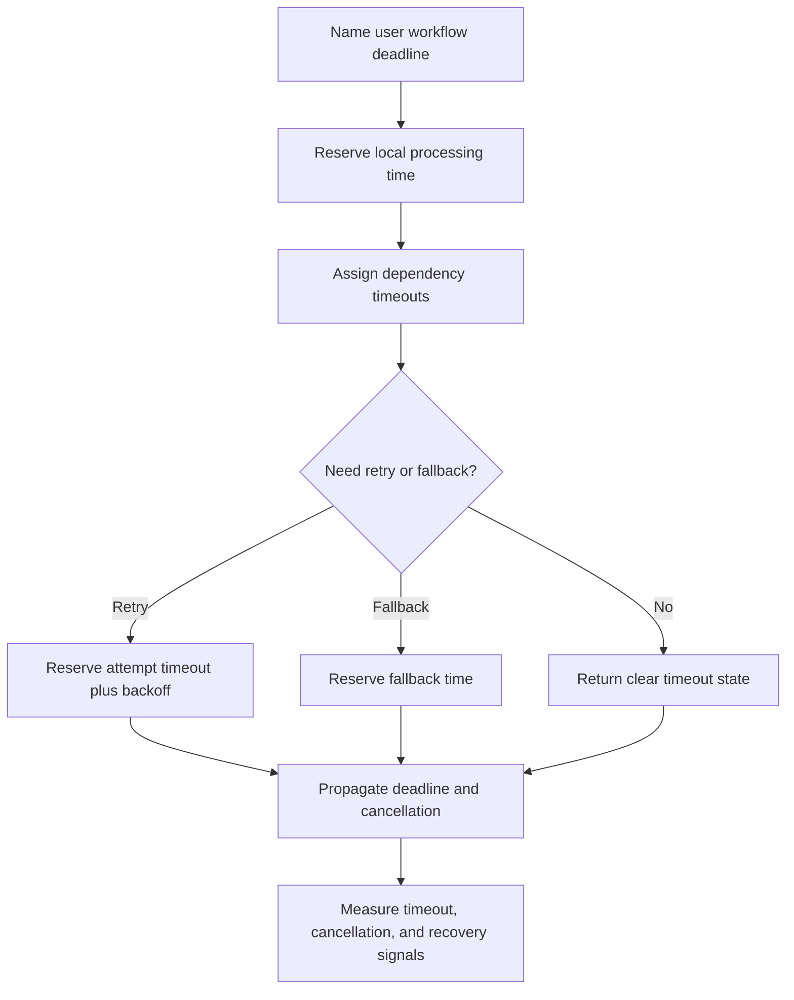

# Timeouts

Timeouts are limits on how long a caller, server, worker, or workflow waits
before it stops expecting a result. They are one of the simplest ways to contain
failure, but only when they are tied to a budget, cancellation behavior, and a
clear user or operator outcome.

Use this page when a design calls another service, waits on storage, performs
background work, or has any dependency that can become slow instead of clearly
failing.

## Purpose

Timeout design answers:

- How long can the user, caller, or workflow wait?
- Which step owns the total deadline?
- How much time does each downstream dependency get?
- What happens when a dependency is slow but not failed?
- Does the server keep working after the client has given up?
- How does cancellation stop wasted work?
- Which timeout should trigger retry, fallback, degraded mode, or repair?

A timeout is not just a number. It is a contract for failure containment.

## When This Matters

Timeouts matter when:

- a synchronous request crosses a service, network, database, or provider
  boundary;
- a slow dependency can consume worker threads, connections, memory, or queue
  capacity;
- user-facing latency has a deadline;
- retries need per-attempt limits and a total budget;
- background work can hang forever without becoming visible;
- cancellation should stop work that no longer has a useful caller.

Timeouts matter less for short local operations that cannot block external
resources, but even then a workflow-level deadline can prevent stuck jobs.

## Questions To Ask

Start with the workflow:

- What is the maximum useful wait for the user or business process?
- What must finish before success is returned?
- Which dependencies are optional and can be skipped or degraded?
- Which call is most likely to become slow under load?
- What happens if the client disconnects or navigates away?
- What state should be recorded when time runs out?

Then assign budgets:

- What is the total deadline?
- How much time is reserved for application logic, database work, and external
  calls?
- How much slack remains for retries or fallback?
- Which lower-level timeout must be shorter than the caller's timeout?
- Which metrics show timeout rate, cancellation rate, and wasted work?

## Timeout Budget Flow

## Decision Guidance

### Timeout Budgets

A timeout budget starts with the total time a workflow can use, then divides it
among local work, dependency calls, retries, and fallback.

Example budget for a user-facing schedule lookup:

| Step | Budget |
| --- | --- |
| Total request deadline | 900 ms |
| Authentication and routing | 80 ms |
| Primary database read | 250 ms |
| Optional recommendation call | 150 ms |
| Fallback formatting and response | 120 ms |
| Slack for network variance | 300 ms |

The optional recommendation call must time out before the total request deadline
so the service can still return the schedule. A dependency timeout that is equal
to or longer than the caller deadline leaves no room for fallback.

Good budget design:

- starts from user or workflow needs, not library defaults;
- gives critical decisions more time than optional side effects;
- keeps downstream timeouts shorter than upstream deadlines;
- leaves slack for response formatting and cleanup;
- defines what state is returned or recorded when time expires.

### Cascading Failures

A cascading failure happens when one slow component causes callers to wait,
retry, consume resources, and make other components slow. Missing or overly long
timeouts are a common cause.

Risk signals:

- many requests waiting on the same dependency;
- thread pools, database connections, or worker slots filling up;
- retries starting before the dependency has recovered;
- queues growing because workers are stuck on slow calls;
- clients timing out while servers continue work.

Containment options:

- short per-attempt timeouts for slow dependencies;
- total deadlines across all attempts;
- fail-fast behavior when a dependency is known unhealthy;
- bounded concurrency for calls to one dependency;
- cancellation propagation when callers give up;
- degraded responses for optional features.

Timeouts should turn unbounded waiting into a bounded failure path.

### Slow Dependencies

Slow dependencies are harder than obvious errors because the caller must decide
when waiting is no longer useful.

For each slow dependency, decide:

- Is this dependency required for correctness?
- Can stale data, cached data, or partial data be returned?
- Should the system retry, degrade, queue the work, or fail clearly?
- Does the dependency expose retry-after, rate-limit, or overload signals?
- What metric separates normal tail latency from incident behavior?

Do not hide a slow required dependency behind a fake success. If the source of
truth cannot confirm a booking, payment, permission change, or destructive
action before the deadline, return a clear pending or failed state.

### Client And Server Timeouts

Client and server timeouts should be coordinated.

Client-side timeouts:

- protect the caller's latency and resource usage;
- should include connect, read, and total request deadlines when the library
  supports them;
- should pass idempotency keys or request identifiers when retrying commands;
- should cancel work when the result is no longer useful.

Server-side timeouts:

- protect worker threads, request handlers, database connections, and queues;
- should stop or cancel downstream calls when the request deadline expires;
- should return a clear error, pending state, or degraded response;
- should record enough context for operators to diagnose the timeout.

The server should not keep doing expensive optional work after the client has
gone away unless that work is intentionally durable background work.

### Cancellation

Cancellation is the act of stopping work after a timeout, caller disconnect,
workflow deadline, or explicit user cancel. Without cancellation, timeouts only
move the problem: the caller gives up, but the server or worker keeps consuming
capacity.

Cancellation design should name:

- which operations are safe to stop immediately;
- which operations need cleanup or compensation;
- how cancellation is propagated through service calls;
- what happens to in-flight database transactions;
- whether a background job should stop, retry later, or mark `cancelled`;
- which metric shows work abandoned after caller timeout.

Cancellation is especially important for fanout calls and expensive queries. A
request that times out after starting ten downstream calls should not leave all
ten running without a reason.

## Trade-Offs

Timeouts trade completion chance, latency, and resource protection.

- Short timeouts protect callers and capacity, but can fail requests that would
  have succeeded with a little more time.
- Long timeouts reduce false failures, but can hold threads, connections, and
  user attention during an incident.
- Per-attempt timeouts make retries possible, but retries need a total deadline
  so they do not exceed the workflow budget.
- Aggressive cancellation saves resources, but can abandon work that needs
  cleanup or reconciliation.
- Degraded responses preserve availability, but can expose stale or partial
  state that must be labeled honestly.

Choose timeouts from the workflow's useful deadline and the dependency's
failure behavior. Defaults are rarely enough.

## Common Mistakes

- Setting one timeout value for every dependency.
- Giving a downstream call the same timeout as the upstream caller.
- Adding retries without per-attempt timeouts and a total deadline.
- Letting servers continue expensive work after clients disconnect.
- Treating timeout as success for a command with unknown outcome.
- Timing out optional work too late to return a fallback.
- Measuring only errors and ignoring timeout rate, latency percentiles, and
  cancellation rate.
- Using long background-job timeouts without stuck-job detection.

## Example

A community repair service lets residents request urgent home repairs. The
request page should respond quickly, but optional contractor recommendations can
be skipped.

Timeout decisions:

| Workflow Step | Timeout Decision | Reason |
| --- | --- | --- |
| Submit repair request | Total API deadline is short enough for an interactive page | User needs a clear accepted, failed, or pending response |
| Write request record | Database write gets most of the budget and must finish before success | The request record is the durable source of truth |
| Contractor recommendation | Optional service gets a smaller timeout | A recommendation is useful but should not block request creation |
| Confirmation notification | Background worker uses a longer per-job deadline with retry limits | Notification can happen after the user sees the request ID |
| Client disconnect | API cancels optional recommendation work but lets the durable write finish only if it is already committing | Avoid wasting capacity while preserving source-of-truth correctness |

If the recommendation service is slow, the API returns the repair request ID
without recommendations and records that recommendations are pending. If the
database write times out before a durable result is known, the API returns an
ambiguous `pending` state with a request token rather than telling the user the
repair was definitely scheduled.

## Checklist

Before finishing timeout design, confirm:

- The total workflow deadline is named.
- Per-dependency timeouts fit inside the caller's deadline.
- Required and optional dependencies have different timeout behavior.
- Slow dependencies have fallback, retry, fail-fast, pending, or repair paths.
- Cascading failure risks are contained by deadlines, concurrency limits, or
  degraded behavior.
- Client timeouts, server timeouts, and background job timeouts are coordinated.
- Cancellation behavior is defined for client disconnects, expired deadlines,
  downstream calls, and expensive work.
- Retried operations have per-attempt timeouts, max attempts, backoff, and a
  total budget.
- Ambiguous command outcomes use idempotency, reconciliation, or pending state.
- Operators can observe timeout rate, dependency latency, cancellation rate,
  retry exhaustion, queue age, and stuck work.

## Related Pages

- [Reliability](index.md)
- [Failure-mode analysis](failure-mode-analysis.md)
- [Retries and backoff](../communication/retries-and-backoff.md)
- [Idempotency](../communication/idempotency.md)
- [Synchronous vs asynchronous communication](../communication/sync-vs-async.md)
- [Capacity estimation](../scalability/capacity-estimation.md)
- [Design review checklist](../method/design-review-checklist.md)
