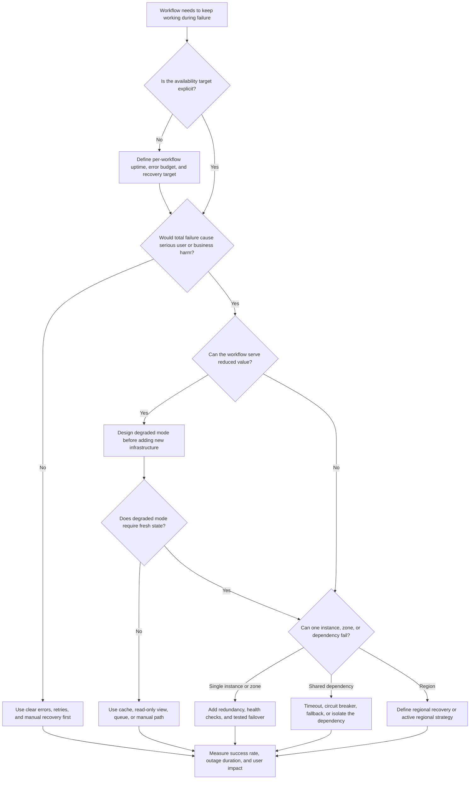

# Availability Requirements

Availability requirements define what should keep working when part of the
system is slow, broken, overloaded, or unreachable. Use this decision tree to
reason about uptime targets, degraded mode, redundancy, failover, regional
failure, and dependency failure before adding expensive reliability machinery.

Availability is not a single system-wide promise. A public read page, a payment
write, an admin export, and a background notification can each deserve a
different target and a different fallback.

## Purpose

Use this page to:

- turn vague words like reliable or always up into explicit uptime targets;
- decide which workflows should degrade instead of fail completely;
- identify when redundancy and failover are justified;
- separate single-instance, zone, regional, and dependency failure scenarios;
- name the observable signal that proves the system met or missed its promise.

## When This Matters

Availability matters when:

- users or callers need a workflow during partial outage;
- downtime causes lost revenue, safety risk, compliance exposure, or support
  load;
- a dependency can fail independently of your service;
- a single node, zone, database, queue, or external provider would stop a core
  path;
- the product can serve a reduced experience while repair is in progress;
- the team is considering multi-region design before naming the failure it must
  survive.

## Quick Decision

| If the workflow needs... | Start with... | Watch for... |
| --- | --- | --- |
| Clear reliability promise | Per-workflow uptime or error-budget target | One global target hides critical and non-critical paths |
| Partial service during outage | Degraded mode and user-visible fallback | Degraded behavior can create stale, incomplete, or manual work |
| Survival of one instance or zone | Redundant stateless instances and health checks | Redundancy does not help if the shared dependency is down |
| Fast recovery after one component fails | Automated failover with tested rollback | Failover can amplify incidents when state is ambiguous |
| Regional outage tolerance | Regional isolation or documented manual recovery | Multi-region design adds cost, data, and operational complexity |
| Dependency outage tolerance | Timeout, fallback, circuit breaker, queue, or manual path | Fallback can hide failures unless it is observable |

## Questions To Ask

- Which user workflow must remain available?
- What is the uptime target for that workflow, and over what time window?
- Which paths can return read-only, cached, queued, pending, or manual results?
- Which dependency failure should the system tolerate?
- What is the smallest failure domain that can break the workflow: process,
  host, zone, region, data store, queue, provider, or operator action?
- How quickly must the system detect failure and recover?
- What should users, operators, and downstream callers see during degraded mode?
- Which metric, alert, or support signal proves availability is being met?

## Decision Tree



Use the tree to identify the availability promise first. Then decide whether
the right response is degraded behavior, local redundancy, dependency
isolation, regional recovery, or a simpler manual process.

## Requirements Discovered

| Requirement | Why It Matters | Design Impact |
| --- | --- | --- |
| Uptime target | Names how often a workflow must succeed | Drives redundancy, operational response, and cost decisions |
| Recovery time | Names how quickly service must return after failure | May justify automated failover, runbooks, or manual recovery |
| Degraded mode | Defines useful behavior during partial failure | May justify read-only mode, cached view, queued write, or manual path |
| Failure domain | Identifies what can break independently | Guides instance, zone, region, and dependency isolation choices |
| Dependency failure behavior | Prevents one provider from blocking the whole path | May justify timeout, fallback, circuit breaker, or async handoff |
| Regional failure tolerance | Names whether a whole region outage is in scope | Drives regional data, routing, and recovery strategy |

## Options

| Option | Use When | Trade-Off |
| --- | --- | --- |
| Clear failure response with manual recovery | The workflow is low criticality or early version 1 | Simple and cheap, but users may wait for operator repair |
| Degraded mode | Reduced functionality is better than outage | Keeps core value available but can create stale or incomplete results |
| Redundant stateless instances | One process, host, or zone should not stop traffic | Improves service availability but may leave shared state as the limit |
| Automated failover | Recovery must be faster than manual intervention | Reduces downtime but adds testing, state, and rollback complexity |
| Dependency isolation | External or internal dependency failure should not cascade | Protects the core path but may return partial, pending, or delayed results |
| Regional recovery plan | A regional outage is rare but unacceptable | Lower complexity than active-active, but recovery is slower |
| Active multi-region service | The product promise requires regional outage tolerance | Higher availability ceiling but much higher data and operations complexity |

## Decision Guidance

### Define Availability Per Workflow

Avoid a single uptime target for the whole system. Different workflows create
different user harm when they fail.

Write the requirement like this:

```text
Browse equipment: 99.9% monthly success rate, read-only fallback allowed.
Reservation write: 99.5% monthly success rate, no silent acceptance during
uncertain state.
Reminder delivery: complete within 30 minutes after recovery; initial outage is
acceptable if retries are visible.
```

The target should include the workflow, measurement window, allowed degraded
behavior, and recovery expectation.

Also decide whether degraded responses count as successful. A cached read-only
catalog may count toward the browse target if it is labeled clearly. An
ambiguous reservation write should not count as successful until the source of
truth confirms the state.

### Design Degraded Mode Before Adding Regions

Degraded mode is often the first useful availability move. It can be cheaper
and clearer than making every dependency highly available.

Examples of degraded behavior:

- show cached read-only results with a visible last-updated time;
- accept requests into a durable queue and show pending status;
- disable optional recommendations while preserving checkout;
- route staff to a manual approval workflow during provider outage.

Degraded mode is a product decision as much as a technical decision. It must
say what users can still do, what they cannot do, and how operators detect the
system is degraded.

### Match Redundancy To The Failure Domain

Redundant API instances help when an instance fails. They do not help when the
database, queue, region, shared configuration, or required provider is down.

Before adding redundancy, name:

```text
Failure domain: <process, host, zone, database, queue, provider, or region>
Detection: <health check, metric, synthetic check, or operator signal>
Failover: <automatic, manual, or not supported>
Recovery test: <how the team proves this still works>
```

If the failure domain is not known, start with observability and a runbook
instead of adding more moving parts.

### Treat Failover As A Behavior To Test

Failover is not complete when a second component exists. The system must detect
the failed path, stop sending unsafe traffic to it, recover or reconcile state,
and return to normal without hiding data loss or duplicate work.

Automate failover when recovery must be fast and the state boundary is clear.
Use manual failover when the failure is rare, state is sensitive, or the team
needs human judgment to avoid making the incident worse.

### Be Explicit About Regional Failure

Regional failure tolerance is expensive because data, traffic routing, secrets,
queues, monitoring, and operational ownership all cross a larger boundary.

For version 1, it is often reasonable to write:

```text
Regional outage: out of scope for automatic failover. Restore service in a new
region from backup within the documented recovery target.
RTO: restore the core workflow within 4 hours.
RPO: accept up to 15 minutes of data loss for non-critical browse metadata; no
confirmed reservation may be silently lost.
```

Choose active multi-region only when the product promise, legal constraint, or
business impact justifies the complexity.

| Regional Strategy | Use When | Watch For |
| --- | --- | --- |
| Manual restore from backup | Regional outage is rare and recovery can take hours | Restore drills, backup freshness, and clear user communication |
| Active-passive region | Recovery must be faster but only one region serves writes | Promotion safety, data lag, DNS or routing delay, and rollback |
| Active-active regions | The workflow must survive regional failure with little interruption | Conflict handling, data placement, cost, and much harder operations |

## Trade-Offs

| Choice | Improves | Costs Or Risks |
| --- | --- | --- |
| Higher uptime target | More reliable user experience | Higher cost, on-call burden, testing, and design complexity |
| Degraded mode | Useful service during partial outage | Stale data, reduced functionality, and support explanation |
| Redundant instances | Survival of process, host, or zone failure | More deployment and capacity coordination |
| Automated failover | Shorter outage duration | Incorrect failover can cause split state, duplicate work, or hidden loss |
| Dependency fallback | Prevents cascading failure | Returns partial results and requires reconciliation or user messaging |
| Multi-region design | Tolerance for regional outage | Data consistency, routing, cost, and incident-response complexity |

## Failure Modes

| Failure Mode | Impact | Design Response | Observable Signal |
| --- | --- | --- | --- |
| Required database is unavailable | Reads and writes fail even with healthy API instances | Serve read-only cached view only if freshness allows; otherwise fail clearly | Database availability, endpoint success rate, fallback activation count |
| Optional provider times out | Core workflow slows or fails because optional work blocks it | Timeout quickly, use fallback, queue retry, or skip optional result | Provider timeout count, circuit state, degraded response rate |
| Dependency failure triggers retry storm | Healthy components overload while repeatedly calling a broken dependency | Use retry budgets, backoff, jitter, circuit breaker, and degraded response | Retry rate, request amplification, circuit-open count |
| Failover points traffic at stale or unsafe state | Users see incorrect data or duplicate writes | Use tested promotion rules, idempotency, and reconciliation checks | Failover event log, write conflicts, data repair queue |
| Regional outage removes the whole serving path | Users in all locations cannot complete the workflow | Restore from backup or route to a prepared secondary region per target | Regional health checks, DNS/routing change, recovery duration |
| Degraded mode is invisible to operators | The system appears healthy while users get reduced behavior | Emit explicit degraded-mode metrics, alerts, and support annotations | Degraded-mode duration, fallback rate, support ticket tags |

## Common Mistakes

- Saying "high availability" without naming the workflow and target.
- Giving every path the same uptime target.
- Adding redundant API instances while ignoring the shared database or provider.
- Designing failover but never testing it.
- Treating degraded mode as an error page instead of a useful reduced workflow.
- Promising regional tolerance without naming data replication, routing,
  recovery, and operations costs.
- Hiding dependency failures behind retries until the whole system overloads.

## Original Example

A neighborhood tool library lets members browse equipment, reserve pickup
windows, and receive reminders.

Availability requirements:

| Workflow | Target | Design Impact | Revisit When |
| --- | --- | --- | --- |
| Browse available tools | 99.9% monthly success rate | Serve a cached read-only catalog during database read trouble | Stale catalog views cause failed reservations or support calls |
| Reserve a pickup window | 99.5% monthly success rate | Keep writes on the source of truth; fail clearly if state is uncertain | Write outages exceed target or staff need a manual hold workflow |
| Send pickup reminders | Recover within 30 minutes | Queue reminders and retry after provider failure | Queue age exceeds 30 minutes or duplicate reminders appear |
| Staff cancellation | Available during business hours | Provide a manual support path if admin tooling is down | Manual cancellations become frequent or error-prone |

Walking this example through the tree: browsing can degrade to a cached
read-only view because stale listings are annoying but not final. Reservations
should not silently degrade because accepting a reservation without confirmed
state can double-book equipment. Reminder delivery can wait and retry after the
message provider recovers. Version 1 does not need active multi-region service;
it needs clear targets, dependency timeouts, a small cache for browsing, queued
reminders, and a tested restore procedure.

## Checklist

Before leaving availability discovery, confirm:

- Each important workflow has its own uptime or success-rate target.
- The measurement window and user-visible failure behavior are explicit.
- Degraded mode says what still works, what stops, and what users see.
- Redundancy maps to a named failure domain.
- Failover has detection, routing, state, rollback, and test expectations.
- Dependency failures have timeouts, fallbacks, circuit behavior, or async
  isolation where needed.
- Regional failure is either explicitly out of scope or has a recovery strategy.
- Metrics, alerts, logs, or support signals show outage duration and impact.
- Version 1 stays as simple as the current availability promise allows.

## Related Pages

- [Requirements map](./)
- [Latency requirements](latency.md)
- [Throughput requirements](throughput.md)
- [Requirement discovery](../method/requirement-discovery.md)
- [Trade-off vocabulary](../method/tradeoff-vocabulary.md)
- [System design process](../method/system-design-process.md)
- [Graceful degradation](../reliability/graceful-degradation.md)
- [Failover](../reliability/failover.md)
- [Timeouts](../reliability/timeouts.md)
- [Circuit breakers](../reliability/circuit-breakers.md)
- [Disaster recovery](../reliability/disaster-recovery.md)
- [RPO and RTO](../reliability/rpo-rto.md)
- [SLOs](../operations/slos.md)
- [Metrics](../operations/metrics.md)
- [Runbooks](../operations/runbooks.md)
