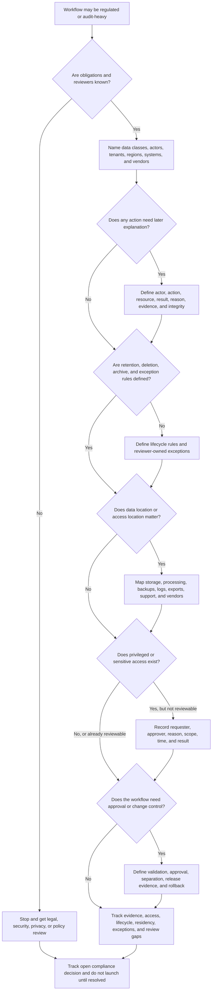

# Compliance Requirements

Compliance requirements describe the evidence, lifecycle, residency, access,
and review expectations that shape regulated or audit-heavy workflows. Use this
decision tree before choosing audit trails, retention rules, deletion behavior,
data residency boundaries, access records, approval flows, or change controls.

This page is design guidance, not legal advice. Laws, contracts, customer
commitments, and company policy may add obligations that engineers should not
guess. The design job is to make assumptions, evidence, owners, and review
points explicit enough that legal, security, privacy, product, and operations
reviewers can evaluate the workflow.

## Purpose

Use this page to:

- identify whether a workflow is regulated, customer-audited, policy-bound, or
  evidence-heavy;
- map auditability requirements to specific actions, actors, records, and
  review questions;
- define retention, deletion, exception, and legal-review boundaries;
- identify data residency constraints for primary data, backups, logs, exports,
  and support access;
- record access evidence for privileged, support, partner, service, and worker
  actions;
- keep version 1 compliant-enough for its actual obligations without inventing
  broad legal scope.

## When This Matters

Compliance requirements matter when:

- a workflow handles regulated, contractual, financial, safety, education,
  employment, healthcare, government, child-related, or enterprise-customer
  data;
- customers, auditors, internal reviewers, or policy owners may ask for proof
  of who did what, when, why, and with which approval;
- records must be retained, deleted, archived, placed on hold, exported, or
  corrected under explicit rules;
- data location, backup location, log location, support access, or vendor
  processing location matters;
- privileged access, break-glass access, impersonation, support views, exports,
  or admin changes need reviewable records;
- workflow changes require approvals, change history, separation of duties, or
  release evidence;
- the team is tempted to say "we will handle compliance later."

Skip this tree only when no law, contract, customer promise, policy, audit, or
regulated workflow applies. If that status is uncertain, stop and ask the right
reviewer instead of guessing.

## Quick Decision

| If the workflow has... | Start with... | Watch for... |
| --- | --- | --- |
| Unknown obligations | Named legal, security, privacy, or policy reviewer | Engineers inventing rules or ignoring required review |
| Audit-heavy actions | Actor, action, resource, result, reason, and tamper-resistance | No proof of who changed sensitive state |
| Retention requirement | Data class, retention period, owner, and deletion exception | Keeping everything forever or deleting required evidence |
| Deletion or correction request | Source-of-truth and derived-copy lifecycle | Backups, logs, exports, and partner copies outliving expectations |
| Data residency boundary | Storage, processing, backup, log, export, support, and vendor map | Logs or support tools crossing the boundary silently |
| Privileged access | Access record, approval, reason, scope, and review cadence | Admin views that bypass normal permissions without evidence |
| Regulated workflow | Approval, validation, change control, and evidence plan | Workflow correctness depending on undocumented manual steps |

Default to the smallest evidence and control set that satisfies the named
obligation. Add stronger controls when the reviewer, contract, audit, or risk
requires them.

## Questions To Ask

- Which law, contract, customer commitment, internal policy, or audit request
  applies to this workflow?
- Who is the named reviewer or owner for interpreting that obligation?
- Which data classes, users, tenants, regions, systems, vendors, and support
  paths are in scope?
- Which actions need auditability: create, approve, reject, export, delete,
  restore, impersonate, access, change permission, or change policy?
- What evidence must be retained, in what form, for how long, and who can read
  it?
- Which data should be deleted, anonymized, archived, retained-minimal, or held
  for review when lifecycle rules conflict?
- Where is data stored, processed, backed up, logged, exported, and accessed
  from?
- Which access records prove privileged or sensitive data access was allowed,
  scoped, reasoned, and reviewed?
- Which workflow steps need approval, separation of duties, validation, or
  change history?
- What should happen when the system cannot satisfy the compliance requirement
  automatically in version 1?

## Decision Tree



Use the tree to separate known obligations from engineering design choices. If
the obligation is unknown, the correct design action is review, not invention.

## Requirements Discovered

| Requirement | Why It Matters | Design Impact |
| --- | --- | --- |
| Obligation owner | Engineers should not interpret unclear legal or policy scope alone | Drives review gates, assumptions, and launch blockers |
| Auditability | Reviewers may need proof of sensitive actions and decisions | Drives audit events, correlation IDs, tamper-resistance, and access controls |
| Retention policy | Evidence and records may need defined lifetimes | Drives TTLs, archives, backups, legal-review exceptions, and cleanup jobs |
| Deletion and correction behavior | Lifecycle requests can conflict with evidence needs | Drives source/derived-store deletion, anonymization, holds, and requester expectations |
| Data residency | Data location may constrain storage, processing, logs, backups, and support | Drives region choice, vendor review, export limits, and operational access |
| Access records | Sensitive reads and privileged actions need accountability | Drives approval, reason capture, scoped access, periodic review, and break-glass controls |
| Regulated workflow controls | Some processes need validation and change evidence | Drives approvals, separation of duties, release evidence, runbooks, and rollback |

## Options

| Option | Use When | Trade-Off |
| --- | --- | --- |
| Stop for reviewer decision | Obligation, region, retention, or scope is unclear | Prevents unsafe guessing, but can block delivery |
| Minimal evidence record | Workflow is low risk but needs later explanation | Simple version 1, but limited investigation depth |
| Structured audit trail | Actions need durable accountability | Stronger evidence, but adds storage, privacy, and access-control work |
| Retention and archive policy | Records have different online and historical lifetimes | Lower cost and clearer lifecycle, but archive lookup is slower |
| Deletion with retained-minimal exception | Some evidence must remain after primary data removal | Balances lifecycle needs, but requires clear reviewer-approved fields |
| Residency boundary | Data must stay within approved locations or access paths | Reduces location risk, but limits vendors, support, and failover options |
| Access approval and review | Privileged reads or changes are sensitive | Improves accountability, but adds friction and operational workflow |
| Manual compliance step | Volume is low and judgment is required | Low automation cost, but slower and must be documented and auditable |

## Decision Guidance

### Use A Compact Answer Shape

In an interview or design review, summarize compliance requirements without
pretending to interpret law:

```text
The obligation owner is <reviewer>. The regulated workflow is <workflow>.
The system needs evidence for <actions>, retention/deletion rules for <data>,
residency boundaries for <copies and access paths>, and access records for
<privileged paths>. The main trade-off is <evidence or control> versus
<privacy, cost, latency, support speed, or operational complexity>.
```

This shape keeps the answer practical: owner, evidence, lifecycle, residency,
access, and trade-off.

### Name The Obligation And Owner

Start with the source of the requirement:

```text
Source: customer contract, internal policy, audit request, regulatory review,
or security/privacy requirement
Owner: legal, security, privacy, compliance, product, or operations reviewer
Scope: data classes, users, tenants, regions, systems, vendors, and dates
Open questions: assumptions that must be approved before launch
```

Do not write "must be compliant" as a requirement. Write the evidence, record,
lifecycle, access, or review behavior that the system must support. If nobody
can name the owner, keep the decision open and visible.

### Design For Auditability

Auditability answers "can a reviewer understand what happened later?"

For each audit-relevant action, define:

```text
Actor: <user, admin, support agent, service, worker, or integration>
Action: <create, approve, export, delete, access, impersonate, change policy>
Resource: <object, tenant, account, data class, or workflow>
Result: <allowed, denied, failed, queued, rolled back>
Time: <occurred at, decision time, or evidence window>
Reason: <ticket, policy, user request, workflow reason, or system reason code>
Evidence: <audit event, access record, approval, change summary, correlation ID>
Integrity: <append-only path, correction event, restricted writer, or export>
```

Audit records should be structured and minimal. They should not copy full
documents, raw payloads, secrets, or unnecessary personal data just because an
auditor may ask for proof later.

### Define Retention And Deletion Together

Compliance often creates tension between keeping evidence and removing data.
Do not hide the tension. Model it by data class.

Useful lifecycle table:

| Data Class | Retention | Deletion Behavior | Exception | Evidence |
| --- | --- | --- | --- | --- |
| Primary workflow record | Active workflow plus approved retention window | Delete or anonymize when no longer needed | Open dispute or reviewer-approved hold | Deletion job result |
| Audit event | Reviewer-approved evidence window | Retain minimal fields, then archive or delete | Security or policy investigation | Audit retention report |
| Export file | Short delivery window | Expire file and record request summary | None without approval | Export expiry event |
| Backup copy | Backup retention window | Reconcile after restore | Restore drill or incident recovery | Restore replay log |

Good requirement:

```text
Retain approval audit events for the policy-approved window. If a user deletion
request removes profile fields, keep only the reviewer-approved audit summary:
actor ID, action, resource ID, result, timestamp, and reason code.
```

Weak requirement:

```text
Keep compliance data forever.
```

### Map Data Residency Beyond The Primary Database

Data residency is broader than the main table. Map every copy and access path.

Include:

- primary databases and object stores;
- backups, replicas, archives, and restore staging;
- logs, metrics, traces, audit trails, analytics, and search indexes;
- exports, reports, spreadsheets, and support attachments;
- queues, caches, dead-letter stores, and derived views;
- vendor processing, webhooks, integrations, and managed services;
- support, admin, contractor, and break-glass access locations.

If residency matters and the location is unknown, stop for reviewer input. Do
not assume that derived logs, backups, or support tools inherit the same
boundary automatically.

### Record Access To Sensitive Data

Access records explain who viewed or changed sensitive data and why. They are
especially important for support, admin, break-glass, export, report, and
worker paths.

Access record fields:

| Field | Purpose |
| --- | --- |
| requester | Who asked for access |
| approver or policy | Who or what allowed it |
| actor | Who performed the action |
| target | User, tenant, account, resource, or data class |
| scope | Fields, records, time window, or command allowed |
| access window | When access starts, expires, or must be reviewed |
| reason | Ticket, incident, support case, or workflow reason |
| result | allowed, denied, expired, revoked, or failed |
| evidence link | request ID, trace ID, audit event, or approval ID |

Access to access records should itself be controlled. A broad dashboard of
privileged reads can reveal sensitive workflows even when the underlying data
is masked.

### Treat Regulated Workflows As State Machines

Regulated workflows often need more than audit logs. They may need explicit
states, approvals, validation, change history, and separation between requester
and approver.

Ask:

- Which state transitions need approval or review?
- Which fields are locked after approval?
- Which actions require two people or a different role?
- Which changes create a new version instead of mutating history?
- Which validation evidence proves the workflow followed the rule?
- Which release or configuration changes need approval before they affect the
  workflow?
- Which manual step is acceptable in version 1, and what evidence records it?

Tiny state-transition example:

```text
submitted -> under_review -> approved -> exported -> archived
```

The transition from `under_review` to `approved` might require a caseworker
role, reason code, eligibility version, timestamp, and audit event. The
transition from `approved` to `exported` might require export permission,
recipient scope, file expiry, and an export audit event.

Keep the first version understandable. A small state machine with clear audit
events is often safer than a broad policy engine nobody can explain.

## Trade-Offs

| Choice | Improves | Costs Or Risks |
| --- | --- | --- |
| Stronger audit trail | Better accountability and investigation | More storage, privacy review, and access-control work |
| Longer retention | More evidence for reviews and disputes | Higher storage, privacy, deletion, and breach impact |
| Shorter retention | Lower exposure and cost | Less history for audit, support, or incident review |
| Data residency boundary | Clearer location and vendor control | Less flexibility for failover, support, analytics, and tooling |
| Access approval | Better accountability for privileged work | Slower support and more operational workflow |
| Manual compliance review | Human judgment for rare or unclear cases | Slower path and risk of inconsistent execution |
| Automated workflow controls | Repeatable evidence and fewer missed steps | More state, permissions, test cases, and migration work |

## Failure Modes

| Failure Mode | Impact | Design Response | Observable Signal |
| --- | --- | --- | --- |
| Obligation is guessed by engineering | The design may miss a legal, policy, or customer requirement | Stop for named reviewer and record assumptions | Open compliance questions, missing reviewer approval |
| Audit trail lacks actor or reason | Sensitive action cannot be explained later | Add actor, action, resource, result, reason, and correlation fields | Audit review gaps, support investigation failures |
| Retention is undefined | Records live forever or disappear too early | Define retention, archive, deletion, exception, and owner | Records past retention, missing evidence, cleanup job gaps |
| Deletion misses derived copies | Requester expectation conflicts with logs, exports, backups, or partners | Track copies and run deletion, anonymization, expiry, or reconciliation jobs | Stale records, deletion job failures, restore replay count |
| Residency boundary is incomplete | Logs, backups, support tools, or vendors cross location expectations | Map all copies and access paths before launch | Unknown location inventory, vendor review gaps |
| Privileged access is not recorded | Admin or support reads cannot be reviewed | Record requester, approver, reason, scope, result, and expiry | Missing access records, broad admin queries |
| Regulated workflow can skip approval | Invalid state change reaches production records | Use state machine, role checks, validation, and audit events | Approval bypass count, invalid transition error, audit exception |
| Evidence store contains too much sensitive data | Compliance evidence becomes a privacy and breach risk | Store safe summaries, IDs, redacted values, and access controls | Sensitive-data scan hits, audit export restrictions |

## Common Mistakes

- Treating compliance as a legal checkbox instead of a design constraint.
- Saying "keep all records" without a retention owner or deletion exception.
- Auditing only writes while privileged reads, exports, and support access go
  unrecorded.
- Mapping residency for primary data but not logs, backups, analytics, exports,
  queues, caches, or support tools.
- Copying full payloads into audit records because it feels safer than choosing
  a minimal evidence summary.
- Building a complex policy engine before naming the regulated workflow states.
- Launching with an unresolved legal, policy, or customer assumption hidden in
  implementation notes.

## Original Example

A workforce training program lets applicants submit eligibility documents,
caseworkers approve benefits, program admins export monthly reports, and
auditors review approval history. The team does not choose legal obligations
itself; it records assumptions and sends them to the program policy owner and
privacy reviewer before launch.

Compliance requirements:

| Workflow | Compliance Need | Design Impact | Revisit When |
| --- | --- | --- | --- |
| Eligibility submission | Documents contain sensitive applicant data | Store documents with applicant scope, avoid raw payloads in logs, and record upload event summaries | New document type or reviewer asks for stricter handling |
| Benefit approval | Approval must be explainable later | Store approver, applicant, eligibility version, decision, reason code, timestamp, and request ID in an append-only audit trail | Audit review cannot answer why a decision changed |
| Monthly export | Reports can leave normal system controls | Require approved export role, field allowlist, expiration, requester proof, and export audit event | Export size, recipient list, or field scope grows |
| Retention and deletion | Applicant profile and evidence lifetimes differ | Delete or anonymize profile fields after approved lifecycle event, retain only policy-approved audit summary when required | Policy owner changes retention window |
| Data residency | Documents, backups, logs, and support access must stay within approved boundaries | Map primary store, object store, backups, logs, exports, and support access before launch | New vendor, region, or support team is added |
| Access records | Support and admin access must be reviewable | Record requester, approver, reason, scope, result, and expiry for privileged access | Break-glass path is used or access review finds gaps |

Walking this example through the tree: obligations and reviewers are named
first because the engineers should not invent policy. Approval actions need an
audit trail, but document payloads do not belong in audit records. Retention and
deletion rules differ by data class, so the design keeps minimal audit evidence
while removing or anonymizing profile fields when allowed. Residency includes
logs, backups, exports, and support access, not just the document store. Version
1 can use a small state machine, scoped access, append-only audit events,
export expiry, and a reviewer-owned retention table. It does not need a broad
compliance platform until additional regulated workflows appear.

Those choices map to concrete components: an audit table, a scoped admin view,
a deletion or anonymization worker, an export-expiry job, and a reviewer-owned
configuration table for retention assumptions.

## Checklist

Before leaving compliance discovery, confirm:

- The obligation source and named reviewer are recorded, or the workflow is
  blocked from launch until they are known.
- In-scope data classes, actors, tenants, systems, regions, vendors, support
  paths, and dates are listed.
- Auditability requirements name actor, action, resource, result, reason,
  timestamp, evidence, correlation, retention, and integrity expectations.
- Retention rules cover primary data, derived data, audit records, backups,
  logs, exports, and archives where relevant.
- Deletion, anonymization, archive, retained-minimal, hold, and exception paths
  are explicit.
- Data residency covers storage, processing, backups, logs, exports, analytics,
  support access, vendors, queues, caches, and restore staging where relevant.
- Access records cover privileged reads, support views, exports, break-glass,
  service access, worker actions, access windows, expiry, and review timing
  where relevant.
- Regulated workflows define states, approvals, validation, change history,
  separation of duties, and rollback or correction paths where needed.
- Evidence stores avoid secrets, raw payloads, unnecessary personal data, and
  broad access.
- Version 1 has a clear manual or automated path for every compliance control
  it claims to support.

## Related Pages

- [Requirements map](./)
- [Security requirements](security.md)
- [Privacy requirements](privacy.md)
- [Durability requirements](durability.md)
- [Operability requirements](operability.md)
- [Audit logs](../security/audit-logs.md)
- [Authorization](../security/authorization.md)
- [Access control models](../security/access-control-models.md)
- [Backups and restore](../data/backups-and-restore.md)
- [Data retention](../data/data-retention.md)
- [Operational vs analytical data](../data/operational-vs-analytical-data.md)
- [Logs](../operations/logs.md)
- [Runbooks](../operations/runbooks.md)
- [Incident response](../operations/incident-response.md)
