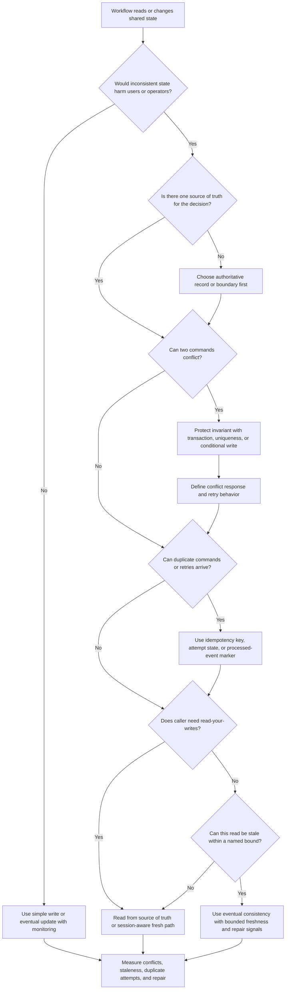

# Consistency Requirements

Consistency requirements define which reads and writes must agree, when stale
data is acceptable, and how conflicts should be handled. Use this decision tree
before choosing transactions, locks, conditional writes, read replicas,
eventual consistency, idempotency keys, or repair workflows.

Consistency is not one global switch. A product can require strict correctness
for a reservation write, read-your-writes behavior for a confirmation page, and
eventual consistency for search results or analytics. The goal is to protect
the workflows where incorrect state causes harm while keeping version 1 simple.

## Purpose

Use this page to:

- decide which data needs fresh reads or stronger write guarantees;
- name stale-read tolerance and read-your-writes expectations;
- identify conflicts such as lost updates, double booking, and duplicate
  commands;
- decide when transactions, uniqueness rules, conditional writes, locks,
  idempotency keys, or eventual consistency are justified;
- define what users and operators should see when consistency is temporarily
  weaker.

## When This Matters

Consistency matters when:

- two users can claim, reserve, approve, edit, or spend the same scarce thing;
- a user expects a write to appear immediately on the next screen;
- duplicate requests, retries, or event replays could create duplicate state;
- reads may come from caches, replicas, search indexes, or derived views;
- background workers update projections after the source of truth changes;
- conflicts need a product response instead of a generic error.

## Quick Decision

| If the workflow needs... | Start with... | Watch for... |
| --- | --- | --- |
| No conflicting successful writes | Transaction, uniqueness rule, or conditional write | More contention and explicit conflict handling |
| User sees their own write immediately | Read-your-writes path from source of truth or session-aware read | Higher read load or routing complexity |
| Stale list or search is acceptable | Eventual consistency with freshness label or rebuild path | Users may act on old information |
| Duplicate command safety | Idempotency key and stored result or attempt state | Key scope, retention, and conflict response |
| Derived view correctness | Source-of-truth write first, projection update later | Projection lag and replay/rebuild operations |
| Unclear conflict risk | Start with the simplest invariant and measure conflicts | Hidden lost updates if no conditional guard exists |

## Questions To Ask

- What bad outcome must never happen?
- Which record or invariant is authoritative for that decision?
- Can the user tolerate stale reads, and for how long?
- Does the user need read-your-writes behavior after a command succeeds?
- Which writes can conflict with each other?
- Can a retry, duplicate request, or replay repeat the same business action?
- Which data is source of truth, and which data is derived?
- What should the user see when a conflict is detected?
- Which metric or audit record shows stale reads, conflicts, duplicates, or
  repair work?

## Decision Tree



Use the tree to separate source-of-truth correctness from derived-read
freshness. Stronger consistency belongs where an invariant or user promise
requires it.

## Requirements Discovered

| Requirement | Why It Matters | Design Impact |
| --- | --- | --- |
| Freshness tolerance | Names how stale a read may be | Drives source read, cache, replica, or derived-view choice |
| Read-your-writes | Protects user trust after successful commands | May require primary reads, session routing, or status pages |
| Conflict rule | Names the invariant that competing writes must preserve | May justify transaction, uniqueness, conditional write, lock, or single writer |
| Transaction boundary | Defines which authoritative records must agree before success | Limits contention and makes retries understandable |
| Eventual consistency window | Makes delayed projection updates explicit | Requires freshness labels, lag metrics, rebuild, or repair |
| Idempotency boundary | Prevents retries and duplicates from creating extra state | Requires stable key, stored result, retention, and conflict response |

## Options

| Option | Use When | Trade-Off |
| --- | --- | --- |
| Direct source-of-truth read | The user needs fresh state now | Stronger correctness but more load on authoritative store |
| Cache, replica, or derived view | Stale reads are acceptable for this path | Faster or cheaper reads but freshness must be visible and bounded |
| Conditional write or uniqueness rule | One record or key can protect the invariant | Simple and strong, but conflicts must be handled clearly |
| Transaction | Several authoritative records must agree before success | Protects correctness but can add contention and retries |
| Idempotency key or attempt entity | Duplicate commands or ambiguous retries can happen | Safer retries but adds storage, retention, and conflict semantics |
| Eventual consistency with repair | Derived state can lag behind source truth | Better decoupling but needs lag, replay, and rebuild visibility |
| Manual review or reconciliation | Conflicts are rare and high judgment is needed | Lower automation but slower resolution and audit needs |

## Decision Guidance

### Name The Invariant First

Consistency choices should protect a product rule.

Good requirement:

```text
A tool can have only one approved reservation for the same pickup window.
```

Weak requirement:

```text
Use strong consistency for reservations.
```

After naming the invariant, find the smallest authoritative boundary that can
protect it. A uniqueness rule or conditional write is often simpler than a broad
transaction. A transaction is justified when several records must agree before
the system can safely return success.

### Decide Which Reads May Be Stale

A stale read is not always a bug. It is a bug when the workflow expected fresh
state.

Accept stale reads when:

- the page is informational, such as search, browse, ranking, or analytics;
- the user can refresh or continue safely;
- the response shows last-updated time or pending state when needed;
- the final command rechecks the source of truth before success.

Avoid stale reads when:

- the read grants access, spends balance, reserves scarce capacity, or confirms
  a lifecycle transition;
- the next user action would be unsafe if the value is old;
- support or operations need current state during repair.

Write the allowed stale window, such as "search results may lag by up to two
minutes, but reservation approval must recheck source-of-truth availability."

### Treat Read-Your-Writes As A User Promise

Read-your-writes means a user sees the effect of their own successful write in
later reads. Without it, users may retry, open support tickets, or create
duplicates because the system appears to have lost their action.

Use read-your-writes when:

- a confirmation page follows a write;
- the user edits a profile, permission, booking, or order and expects to see the
  new state;
- a caller immediately reads after a successful API command.

Implementation choices include source-of-truth reads, session-aware routing,
status pages, or explicit pending states. Pick the simplest choice that matches
the workflow.

### Design For Conflicts As Expected Outcomes

Conflicts are normal when users compete for scarce resources or update the same
state. The design should say what happens.

Classify the conflict before choosing machinery:

- lost update, where one edit overwrites another;
- scarce-resource invariant violation, such as double booking or overspend;
- duplicate command, where a retry repeats the same business action;
- mergeable edit, where concurrent changes can be combined safely.

Conflict responses can include:

- reject with the current state and ask the user to choose again;
- retry automatically only when the command is idempotent and safe;
- merge when product rules allow it;
- queue commands by key when serial order is required;
- send to manual review when correctness needs judgment.

Measure conflict rate. If conflicts become common, the requirement may justify
better UX, partitioning, reservation holds, or a different workflow.

### Use Eventual Consistency Deliberately

Eventual consistency is useful when derived state can lag behind authoritative
state. It is not a way to avoid defining correctness.

Good eventual-consistency requirement:

```text
The public tool search index may lag reservation changes by up to two minutes.
Reservation writes still check the authoritative reservation table before
success.
```

Weak requirement:

```text
Everything is eventually consistent.
```

Every eventual path needs a source of truth, lag signal, replay or rebuild path,
and user-visible behavior when stale state matters.

### Make Retries Idempotent

Retries and duplicate events are consistency risks when repeating a command can
create extra state. Add idempotency where a retry may cross a timeout,
connection reset, queue redelivery, or manual replay.

Define:

```text
Operation identity: <what makes this the same business action?>
Key scope: <user, account, entity, workflow, or global>
Stored result: <what duplicate callers receive>
Conflict response: <what happens if the same key is reused differently>
Retention: <how long retry or replay is supported>
```

Do not retry non-idempotent commands automatically.

Idempotency does not protect scarce-resource invariants by itself. A duplicate
reservation request should not create two reservations, but the first
reservation still needs a transaction, uniqueness rule, conditional write, lock,
or single-writer path to prevent another member from taking the same slot.

## Trade-Offs

| Choice | Improves | Costs Or Risks |
| --- | --- | --- |
| Fresh source-of-truth reads | Correct current state and user trust | More load and potentially higher latency |
| Stale reads from cache or replica | Lower latency or load | Users may see old data unless freshness is bounded |
| Transactions | Stronger multi-record correctness | Locking, retries, contention, and broader failure handling |
| Conditional writes | Simple invariant protection | Requires clear conflict response and retry path |
| Eventual consistency | Decoupling and scalable derived views | Lag, replay, rebuild, and user confusion if hidden |
| Idempotency | Safer retries and duplicate handling | Storage, retention, key-scope decisions, and conflict semantics |

## Failure Modes

| Failure Mode | Impact | Design Response | Observable Signal |
| --- | --- | --- | --- |
| Stale read drives unsafe action | User acts on old availability, permission, or balance | Recheck source of truth before irreversible command | Stale-read reports, source recheck failures, cache age |
| User cannot see their successful write | User retries or opens support case | Provide read-your-writes path, confirmation state, or pending status | Duplicate attempts, support tags, read-after-write miss count |
| Lost update overwrites another change | One user's edit silently replaces another | Use version check, conditional update, transaction, or merge flow | Version conflict count, overwrite repairs |
| Two commands violate a scarce-resource invariant | Double booking, overspend, duplicate approval, or quota breach | Use uniqueness, transaction, lock, or single-writer boundary | Conflict rate, constraint failures, compensating repairs |
| Eventual projection stops updating | Search, report, or cache diverges from source truth | Track lag, replay from source, rebuild projection, alert on age | Projection lag, rebuild duration, missing-event count |
| Late event regresses a derived projection | Old status or count overwrites newer source truth | Apply events with version, sequence, or source timestamp checks | Out-of-order event count, rejected stale update count, projection repair rate |
| Duplicate retry creates duplicate state | Extra reservation, charge, notification, or audit action | Use idempotency key, attempt entity, or processed-event marker | Duplicate key conflict, replay count, duplicate side-effect count |

## Common Mistakes

- Saying "consistent" without naming the invariant or stale-read tolerance.
- Requiring strict consistency for every read instead of ranking user harm.
- Reading from a replica after a write and surprising the user with stale state.
- Checking availability in one step but committing without a conditional guard.
- Retrying commands automatically before making them idempotent.
- Hiding conflicts as generic server errors.
- Treating eventual consistency as acceptable without lag and repair signals.

## Original Example

A neighborhood tool library lets members browse tools, reserve pickup windows,
edit contact details, and receive reminders.

Consistency requirements:

| Workflow | Consistency Need | Design Impact | Revisit When |
| --- | --- | --- | --- |
| Browse tools | Search results may be stale for two minutes | Use derived search or cache with freshness label | Failed reservations from stale results increase |
| Reserve pickup window | No two approved reservations for the same tool and window | Use transaction, uniqueness rule, or conditional write | Conflict rate or lock wait becomes high |
| Confirmation page | Member must see their own successful reservation | Read source of truth or show committed confirmation state | Read-after-write misses appear |
| Reminder send | Duplicate retries must not send repeated reminders | Store reminder intent and dedupe by reservation, version, and recipient | Duplicate-send reports or replay volume grows |
| Staff cancellation | Actor, reason, and status transition must agree | Commit cancellation and audit event in one boundary | Audit gaps or repair cases appear |

Walking this example through the tree: browsing can be eventually consistent
because the reservation command rechecks authoritative state before success. The
reservation write needs a stronger guarantee because double booking harms
members. The confirmation page needs read-your-writes behavior so the member
does not retry a successful reservation. Reminder delivery can be retried only
because one business reminder has a stable dedupe boundary.

Version 1 can use one database transaction or constrained write for
reservations, source-of-truth reads for confirmation, an eventually updated
search view, and idempotent reminder jobs. It does not need distributed
transactions or global serializability unless later requirements cross service
or region boundaries.

Contrast with a metrics dashboard: late counters and stale aggregates may be
acceptable if the chart names its freshness window and can rebuild from source
events. The same relaxed path would be wrong for approving a reservation,
granting access, or spending balance.

## Checklist

Before leaving consistency discovery, confirm:

- The invariant or stale-read tolerance is written in product language.
- Source-of-truth data and derived data are separated.
- Read-your-writes expectations are explicit for post-write workflows.
- Stale reads have a maximum age, label, source recheck, or safe fallback.
- Conflicting writes have a transaction, uniqueness rule, conditional write,
  lock, single-writer path, or manual review process.
- Conflict responses are user-visible and measurable.
- Eventual consistency includes lag, replay, rebuild, or repair signals.
- Idempotency keys or attempt records protect retryable commands and side
  effects.
- Version 1 uses the weakest guarantee that still protects the named invariant.

## Related Pages

- [Requirements map](./)
- [Availability requirements](availability.md)
- [Durability requirements](durability.md)
- [Transactions](../data/transactions.md)
- [Read and write patterns](../data/read-write-patterns.md)
- [Idempotency](../communication/idempotency.md)
- [Retries and backoff](../communication/retries-and-backoff.md)
- [Outbox pattern](../communication/outbox-pattern.md)
- [Data loss scenarios](../reliability/data-loss-scenarios.md)
