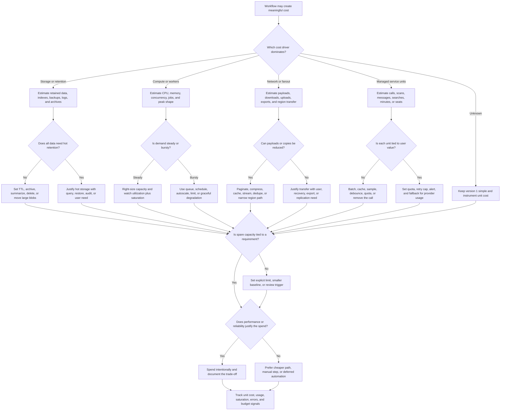

# Cost Requirements

Cost requirements describe which resources drive spend, which trade-offs are
acceptable, and which limits keep version 1 sustainable. Use this decision tree
before adding capacity, managed services, replicas, queues, caches, regions,
large exports, long retention windows, or expensive observability.

Cost is not just a finance concern. It changes architecture when storage,
compute, network transfer, provider calls, overprovisioned capacity, or tighter
performance targets create meaningful constraints. The goal is to spend
intentionally on user value and reliability, not to make every component as
cheap as possible.

## Purpose

Use this page to:

- identify the dominant cost driver for the workflow;
- separate storage, compute, network, managed-service, observability, and
  operational costs;
- decide which performance or reliability targets justify extra spend;
- avoid overprovisioning capacity without a requirement or headroom target;
- define quotas, retention limits, batching, caching, or manual workflows for
  version 1;
- name the metric that should trigger a cost review or architecture change.

## When This Matters

Cost requirements matter when:

- retained data, audit history, files, logs, traces, backups, or indexes grow
  over time;
- CPU, memory, workers, GPUs, batch jobs, or concurrency need dedicated
  capacity;
- large downloads, uploads, exports, replication, fanout, or cross-region
  traffic can create network cost;
- a managed service charges by request, record, message, seat, search, scan,
  minute, model call, or storage tier;
- the design keeps spare capacity for peak load, failover, retries, or launch
  windows;
- a stricter latency, availability, durability, or observability target would
  add capacity or duplicate data;
- users, tenants, partners, or internal jobs can create unbounded expensive
  work.

Skip this tree only when the cost is clearly tiny for version 1 and no single
actor can create unbounded work. Even then, record the revisit signal.

## Quick Decision

| If the main cost pressure is... | Start with... | Watch for... |
| --- | --- | --- |
| Stored data or history | Retention, archive, backup, and index rules | Keeping every raw record forever because cleanup has no owner |
| Compute or workers | Utilization, saturation, peak shape, and job priority | Idle capacity from sizing for rare peaks without a queue or limit |
| Network transfer | Payload size, fanout, region path, and export volume | Large repeated responses, cross-region copies, and retry storms |
| Managed service usage | Unit cost by call, record, message, scan, or minute | Hidden loops, retries, broad scans, or high-cardinality features |
| Overprovisioning | Headroom target tied to a user-visible requirement | Spare capacity that nobody can explain or verify |
| Cost/performance tension | The workflow where speed, freshness, or uptime earns spend | Optimizing cost by breaking the user promise |

Default to the smallest design that meets the current requirement with a clear
usage limit and review trigger. Spend more when the cost buys a named user,
reliability, security, privacy, or operational outcome.

## Questions To Ask

- Which workflow is expensive: reads, writes, imports, exports, files, jobs,
  reports, search, analytics, observability, or provider calls?
- Which resource dominates cost: storage, compute, memory, network, managed
  service units, licenses, or operational effort?
- How does cost grow per user, tenant, request, object, event, export, or day?
- Is there an explicit budget envelope, per-unit cost target, or cost per
  completed workflow that the design must stay within?
- Which data needs online retention, archive retention, backup retention, and
  deletion?
- Which capacity is needed for normal traffic, peak traffic, failover, deploys,
  retries, or background jobs?
- Can expensive work be delayed, batched, cached, summarized, sampled, capped,
  queued, or handled manually in version 1?
- Which tenant, user, key, or partner could create a disproportionate cost?
- What performance, availability, durability, privacy, or observability
  requirement justifies extra spend?
- What metric, budget threshold, or usage shape should trigger a review?

## Decision Tree



Use the tree to turn "we need to save money" or "cost might be high" into a
specific resource, limit, and trade-off. Cost requirements should not erase
user promises; they should make the cost of those promises visible.

## Requirements Discovered

| Requirement | Why It Matters | Design Impact |
| --- | --- | --- |
| Storage growth | Retention, backups, logs, and indexes can outgrow version 1 assumptions | Drives TTLs, archival, object storage, backup windows, and deletion plans |
| Compute shape | Steady, bursty, or scheduled work needs different capacity choices | Drives right-sizing, queues, worker pools, autoscaling, or manual runs |
| Network volume | Large payloads, exports, replication, and fanout can dominate spend | Drives pagination, compression, CDN, regional placement, or export limits |
| Managed-service unit cost | Per-call or per-record services can become expensive through loops or retries | Drives quotas, batching, caching, sampling, retry caps, and alerts |
| Headroom target | Spare capacity should map to peaks, failover, deploys, or recovery | Drives overprovisioning boundaries and capacity planning |
| Cost/performance trade-off | Faster or more reliable systems often cost more | Drives explicit latency, availability, durability, and budget decisions |
| Cost ownership | Someone must see and respond to spend changes | Drives dashboards, budget alerts, review cadence, and tenant attribution |

## Options

| Option | Use When | Trade-Off |
| --- | --- | --- |
| Keep one simple deployment and measure | Version 1 load is small and cost risk is low | Cheapest to operate, but needs clear usage and budget signals |
| Set product or tenant limits | One actor can create expensive work | Predictable spend, but some legitimate users need exceptions |
| Reduce retention or archive data | Old data is rarely used online | Lower storage and backup cost, but slower historical access |
| Move large blobs out of primary storage | Files or exports are large compared with metadata | Lower database pressure, but adds object lifecycle and access rules |
| Batch, cache, or debounce work | Repeated work produces little new value | Lower compute or provider spend, but may add staleness or delay |
| Queue bursty work | Peaks are much higher than average and final completion can wait | Smaller baseline capacity, but users need status and operators need backlog visibility |
| Add capacity for a target | Latency, availability, or recovery requirement justifies spend | Better user outcome, but idle headroom and operational surface increase |
| Use managed service | Team needs capability faster than building it | Lower build burden, but usage units, quotas, lock-in, and failure modes matter |
| Manual workflow | Demand is rare, high judgment, or not worth automating yet | Low system cost, but slower and creates operational work |

## Decision Guidance

### Find The Unit Cost

Cost requirements become useful when the team can name a unit:

```text
Cost grows per uploaded photo, per retained audit event, per search query, per
exported GB, per notification attempt, per active tenant, or per background job
minute.
```

The exact currency amount may change by vendor or environment, but the unit
shape still guides the design. If cost grows per retained record, start with
retention and archival. If it grows per external call, start with batching,
caching, retries, and quotas. If it grows per tenant, measure tenant skew
instead of looking only at global averages.

### Separate Storage, Compute, And Network

Different resources need different controls.

Storage questions:

- What is source of truth, derived, audit, backup, log, or archive data?
- How long is each class retained?
- Which data needs online query speed, and which can move to archive?
- Do indexes, search documents, thumbnails, or backups multiply the raw size?

Compute questions:

- Is the expensive work synchronous, asynchronous, scheduled, or retry-heavy?
- Is the load steady enough to right-size, or bursty enough to queue?
- Which job priority should be delayed first when capacity is constrained?
- Can one tenant or key consume most worker capacity?

Network questions:

- Are payloads paginated, compressed, cached, or streamed?
- Do exports, media, replication, or analytics copies cross regions?
- Does fanout multiply one user action into many downstream deliveries?
- Can retries during an outage multiply transfer and provider cost?

Do not solve all cost pressure with one tool. A cache may reduce repeated read
compute and network, but it does not fix retention cost. A queue may reduce
peak compute headroom, but it can increase storage, latency, and operational
work.

### Treat Managed Services As Trade-Offs

Managed services can be the right version 1 choice when they buy a capability
the team should not build from scratch. They still need cost requirements.

For each managed service, define:

```text
Purpose: <what user or operator outcome it supports>
Unit: <request, message, scan, document, minute, GB, seat, or tenant>
Limit: <quota, rate limit, retention, sample rate, or approval rule>
Failure behavior: <fallback, retry cap, degraded mode, or manual process>
Review signal: <budget threshold, unusual volume, or error/cost ratio>
```

Avoid vague requirements like "use a managed search service." Prefer:

```text
Use managed search for public catalog queries only. Do not index private notes
or raw audit history. Alert when indexed document count or query volume doubles
within a week.
```

### Define Headroom Without Guessing

Overprovisioning happens when spare capacity has no target. Underprovisioning
happens when cost control ignores normal variance, deploys, retries, or
failover. A good cost requirement names the reason for headroom.

Examples:

```text
Keep enough worker capacity to drain the reminder queue within 15 minutes after
one worker instance is unavailable.
Keep API capacity for 2x normal peak during the launch week, then review the
baseline after traffic stabilizes.
Keep 45 days of storage headroom after accounting for backups and restore
staging.
```

If the team cannot explain the headroom, reduce the baseline or set a review
trigger. If the workflow has a real availability or recovery promise, spend on
the headroom and document the trade-off.

### Balance Cost And Performance Explicitly

Cost controls often trade against latency, freshness, availability, durability,
and operator visibility.

Examples:

- Longer cache TTL lowers compute and source load but increases staleness.
- Smaller worker pools lower idle cost but increase queue age during bursts.
- Shorter log retention lowers observability cost but can weaken incident
  investigation.
- Fewer replicas reduce spend but can reduce read capacity, failover options,
  or maintenance flexibility.
- Lower export frequency reduces network and provider cost but can make users
  wait.

Write the performance promise next to the cost decision:

```text
Export jobs may take up to 30 minutes in version 1 so the system can use a
small worker pool. Revisit when export queue age exceeds 20 minutes twice in a
week or support receives repeated complaints.
```

## Trade-Offs

| Choice | Improves | Costs Or Risks |
| --- | --- | --- |
| Shorter retention | Lower storage, backup, index, and privacy burden | Less history for support, audit, analytics, or recovery |
| Archive instead of hot storage | Lower online storage and query cost | Slower access and more lifecycle rules |
| Smaller baseline capacity | Lower idle spend | Higher queue age, less burst tolerance, and more scaling sensitivity |
| More headroom | Better peak, failover, and deploy resilience | Higher spend and possible waste if targets are unclear |
| Caching or batching | Lower repeated compute, provider calls, and network | Staleness, invalidation, delay, and duplicate-handling work |
| Managed service | Faster capability and less custom build work | Usage costs, quotas, vendor-specific behavior, and migration effort |
| Rich observability | Faster debugging and safer operations | More log, metric, trace, and retention cost |
| Manual process | Low build and infrastructure cost | Slower workflow, operator load, and inconsistent execution risk |

## Failure Modes

| Failure Mode | Impact | Design Response | Observable Signal |
| --- | --- | --- | --- |
| Data is retained forever | Storage, backup, index, and privacy costs grow without purpose | Set retention, archive, delete, and ownership rules | Storage growth, records past retention, backup duration |
| Idle capacity is sized for rare peak | Baseline spend stays high after the peak passes | Use queue, autoscale, scheduled capacity, or post-peak review | Utilization, idle instances, cost per completed workflow |
| Provider call loop or retry storm | Managed-service bill rises while users may still fail | Add retry caps, idempotency, circuit breaker, quota, and alert | Calls per workflow, provider errors, retry count, spend spike |
| Large exports or media dominate network | Transfer cost rises and users see slow downloads | Paginate, compress, stream, expire exports, or use cache/CDN where appropriate | Egress volume, export size, download latency |
| Observability volume explodes | Logs, metrics, or traces become a large cost center | Sample noisy events, reduce labels, set retention, and keep critical signals | Ingest volume, cardinality, retention cost, missing signal reports |
| Cost cutting breaks the user promise | Cheaper design misses latency, availability, or recovery needs | Name the requirement, spend intentionally, or change the promise | SLO misses, queue age, support tickets, failed restore drill |
| Cost is not attributed | One tenant, workflow, or job hides inside aggregate spend | Add tenant/workflow tags, budget alerts, and review cadence | Unallocated cost, top tenant usage, budget alert without owner |

## Common Mistakes

- Saying "keep costs low" without naming the expensive workflow or unit.
- Optimizing for cost before defining the user-visible promise.
- Keeping raw data, logs, traces, indexes, and backups forever by default.
- Sizing capacity for a rare launch peak and never reviewing the baseline.
- Adding a managed service without quotas, retry caps, and usage alerts.
- Ignoring network cost from exports, media, replication, analytics, and
  cross-region copies.
- Treating observability as free and then removing useful signals during an
  incident.
- Hiding manual work as "cheap" when it creates support load or missed tasks.

## Original Example

A neighborhood reuse marketplace lets residents list bulky items, upload
photos, browse nearby listings, reserve pickup windows, and receive reminders.
The city wants the first launch to stay inexpensive while still giving
residents a reliable pickup experience.

Cost requirements:

| Workflow | Cost Driver | Design Impact | Revisit When |
| --- | --- | --- | --- |
| Photo uploads | Storage, thumbnails, backups, and download bandwidth | Limit photo count and size, store blobs outside the primary database, generate small thumbnails, and expire abandoned drafts | Photo storage or egress doubles within a month |
| Listing browse | Repeated read compute and network payload size | Start with indexed database reads and pagination; add cache only after browse p95 or database read load requires it | Browse p95 exceeds target during normal peak |
| Pickup reminders | Worker compute and notification provider calls | Queue reminders, cap retries, dedupe by appointment, and track calls per completed pickup | Retry rate or provider cost rises faster than appointments |
| History and audit | Retained records, indexes, backups, and support lookup | Keep active listings hot, archive old listings after retention window, and retain minimal audit summaries | Support needs slow archived lookups every week |
| Resident exports | Network transfer and worker time | Generate exports asynchronously, expire files, and limit one active export per resident | Export queue age exceeds the user promise |
| Launch headroom | Spare API and worker capacity for the first week | Keep temporary 2x peak headroom during launch, then right-size after measured traffic stabilizes | Launch week ends or utilization stays below target |

Walking this example through the tree: photo storage and network transfer are
the first cost drivers, not raw request count. Listing browse can stay simple
with pagination and indexes until measured read pressure justifies a cache.
Reminder calls need retry caps because a provider outage could multiply cost
without improving user outcomes. Version 1 can use one database, object storage
for photos, a small worker queue, clear retention rules, and launch-only
headroom. It does not need multi-region replication, a large search service, or
always-on spare capacity until measurements justify the spend.

Back-of-the-envelope sketch:

```text
photo storage per month =
  new listings per month * photos per listing * average stored image size
  * retention months
```

The exact unit price can change by provider, but this sketch tells the team
which product limit and retention window control the cost.

## Checklist

Before leaving cost discovery, confirm:

- The dominant cost driver is named: storage, compute, network, managed
  service units, observability, or operational work.
- Cost growth is tied to a unit such as user, tenant, request, object, event,
  export, retained day, provider call, or job minute.
- Storage decisions include retention, deletion, backups, indexes, logs,
  archives, and large blobs where relevant.
- Compute decisions separate steady load, burst load, scheduled work, retries,
  and background jobs.
- Network decisions account for payload size, fanout, exports, media,
  replication, and cross-region transfer where relevant.
- Managed services have purpose, usage unit, quota, retry cap, fallback, and
  review signal.
- Overprovisioned capacity has a headroom target tied to peak load, failover,
  deploys, retries, or recovery.
- Cost/performance trade-offs are explicit for latency, freshness,
  availability, durability, observability, and support workflows.
- Dashboards or reports can show unit cost, budget alerts, saturation, and the
  top expensive workflows or tenants.
- Version 1 chooses the simplest sustainable path that still satisfies the
  named user and operational requirements.

## Related Pages

- [Requirements map](./)
- [Latency requirements](latency.md)
- [Throughput requirements](throughput.md)
- [Availability requirements](availability.md)
- [Durability requirements](durability.md)
- [Scalability requirements](scalability.md)
- [Privacy requirements](privacy.md)
- [Scale estimation](../method/scale-estimation.md)
- [Capacity estimation](../scalability/capacity-estimation.md)
- [Capacity planning](../operations/capacity-planning.md)
- [Cost analysis](../operations/cost-analysis.md)
- [Metrics](../operations/metrics.md)
