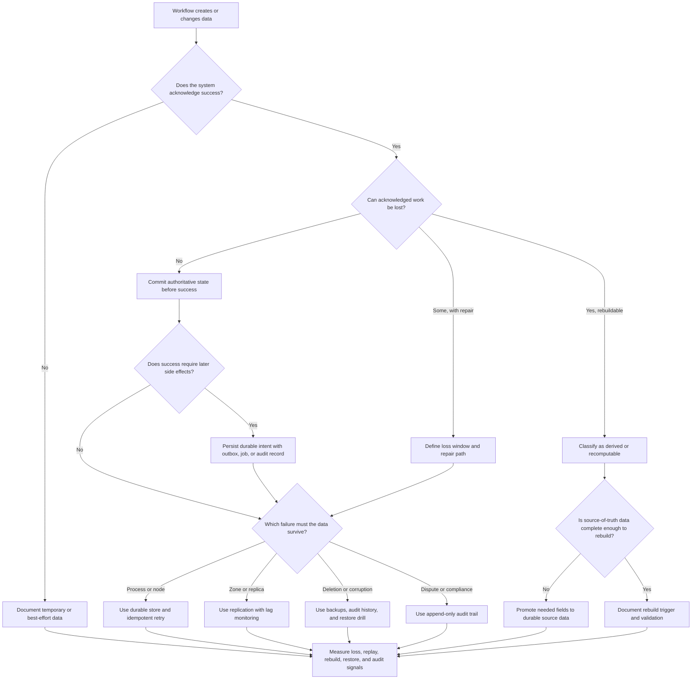

# Durability Requirements

Durability requirements define what data, intent, and evidence must survive
process crashes, node failure, operator mistakes, bad deploys, regional
incidents, and delayed discovery of corruption. Use this decision tree before
choosing persistence, replication, backups, audit trails, replay logs, or
rebuild strategies.

Durability is not the same as availability. A workflow can be temporarily down
and still preserve every confirmed write. A workflow can also stay available
while silently losing events, audit records, files, or derived state. The design
question is what must not disappear after the system says it succeeded.

## Purpose

Use this page to:

- decide which data loss tolerance applies to each workflow;
- classify data as authoritative, audit, derived, temporary, external, or
  recomputable;
- choose when persistence, replication, backups, outbox records, or audit trails
  are justified;
- separate zero-loss user commitments from data that can be replayed, rebuilt,
  or manually repaired;
- name the observable signal that proves durable state can be recovered.

## When This Matters

Durability matters when:

- the system confirms a user action, payment, reservation, permission, upload,
  or approval;
- background work must not disappear after a request returns;
- a migration, import, retention job, or operator tool can change many records;
- derived views such as search, reports, recommendations, or caches can be
  rebuilt from source data;
- audit trails are needed to explain who did what, when, and why;
- backups exist but the restore path has not been tied to user impact.

## Quick Decision

| If the workflow needs... | Start with... | Watch for... |
| --- | --- | --- |
| No acknowledged work lost | Durable commit before success | Higher write latency and stricter failure handling |
| Some loss can be repaired | RPO, repair path, and user communication | Hidden loss when the repair path is not observable |
| Important async side effect | Durable intent, outbox, or durable queue | Duplicate delivery and replay complexity |
| Fast recovery from deletion or corruption | Tested backup and restore plan | Backup success does not prove restore works |
| Surviving a node or zone failure | Replication with monitored lag | Replication can copy corruption or lose lagging writes |
| Evidence for later review | Append-only audit trail | Retention, privacy, and access-control obligations |
| Rebuildable data | Recompute from source of truth | Rebuild time, stale views, and missing source fields |

## Questions To Ask

- What does the user or caller believe succeeded?
- Which durable record proves that success?
- How much acknowledged work can be lost, if any?
- Which data is authoritative, audit, derived, temporary, external, or
  recomputable?
- Which side effects need durable intent before execution?
- Which backups, logs, replicas, or audit trails are needed for recovery?
- Which data could be corrupted and copied into backups or replicas?
- What metric, reconciliation check, or restore drill proves durability?

## Decision Tree



Use the tree to decide what needs durable protection and what can be recreated.
Then choose the smallest mechanism that satisfies the loss tolerance and
recovery path.

## Requirements Discovered

| Requirement | Why It Matters | Design Impact |
| --- | --- | --- |
| Data loss tolerance | Names whether acknowledged work can disappear | Drives durable commit, replication, backup, and replay choices |
| Persistence boundary | Defines what must be written before success | Prevents background or in-memory state from being mistaken for durable state |
| Replication need | Names which failure domain the data must survive | May justify replicas, lag monitoring, failover gates, or simpler backup-only recovery |
| Backup and restore target | Connects recovery copies to RPO and RTO | Requires backup scope, restore drills, validation, and runbooks |
| Audit trail | Preserves evidence for repair, accountability, or review | Requires append-only records, retention, access controls, and searchability |
| Recomputable data | Identifies data that can be rebuilt from source facts | Allows simpler storage if rebuild triggers and validation are clear |

## Options

| Option | Use When | Trade-Off |
| --- | --- | --- |
| In-memory or temporary state | Data can be dropped without user harm | Simple, but unsafe for acknowledged work |
| Durable source-of-truth write | Users are told a fact or command succeeded | Preserves correctness but can add latency and stricter error handling |
| Durable queue or outbox | Later work must not disappear after success | Protects intent but requires retries, idempotency, and monitoring |
| Replication | A node, disk, or zone failure should not lose data | Improves survivability but adds lag and failover concerns |
| Backup and restore | Deletion, corruption, or regional recovery is in scope | Supports recovery but must be tested and validated |
| Append-only audit trail | Actions must be explainable or reversible later | Adds retention, privacy, and access-control responsibilities |
| Recompute derived data | Data can be rebuilt from authoritative facts | Reduces durability burden but needs rebuild capacity and validation |

## Decision Guidance

### Start With What Was Acknowledged

The strongest durability requirement usually starts at the moment the system
tells a user or caller that something succeeded.

Good requirement:

```text
A confirmed reservation must not disappear silently after the API returns
success. The reservation row and an audit event must be durable before success.
```

Weak requirement:

```text
Save reservations reliably.
```

If a write is only accepted for later processing, say which durable record
proves the intent exists and what status the user can inspect.

### Classify The Data

Durability decisions get clearer when data has a role.

| Data Role | Example | Durability Implication |
| --- | --- | --- |
| Authoritative | Reservation, payment, permission, uploaded file metadata | Protect before success and include in restore drills |
| Audit | Actor, action, reason, timestamp, before/after state | Keep append-only enough for repair and accountability |
| Derived | Search index, cache, leaderboard, report table | Rebuild from authoritative data when feasible |
| Temporary | Session hint, preview, transient upload chunk | Drop or retry if the product promise allows |
| External | Provider receipt, partner record, email delivery result | Store local reference and reconciliation status |
| Recomputable | Aggregated count, generated export, recommendation | Keep source facts and rebuild process instead of overprotecting output |

Do not give every role the same durability target. A derived index and a
confirmed reservation usually deserve different RPO, RTO, and restore paths.

### Use Persistence Before Replication

Replication does not help if the system never writes the important fact to a
durable source of truth. Start by defining the commit boundary, transaction, or
durable intent record.

Use replication when the data must survive a specific failure domain:

- process crash: durable local or managed store may be enough;
- node or disk failure: replicated durable storage may be needed;
- zone failure: replicas or backups in another zone may matter;
- regional failure: define RPO/RTO before choosing active or restore-based
  recovery.

Measure replica lag. A lagging replica can turn failover into data loss if it
is promoted without checking what writes are missing.

### Backups Must Restore A Workflow

Backups are not a durability requirement by themselves. They are a mechanism for
meeting a loss tolerance and recovery target.

Before relying on backups, write:

```text
Scope: <which tables, files, audit records, queues, config, or keys are included>
RPO: <maximum acknowledged work lost or needing repair>
RTO: <maximum time until the workflow is usable>
Validation: <row counts, checksums, sample reads, workflow test, or reconciliation>
Drill cadence: <how often restore is practiced>
```

A backup job that completes successfully but has never been restored is not
proof that user data is recoverable.

### Treat Audit Trails As Durable Product Data

Audit trails are not only for compliance. They help operators explain and
repair destructive actions, permission changes, disputes, and support overrides.

Useful audit records include:

- stable actor identity;
- action and affected entity;
- reason or request ID;
- timestamp;
- before/after state when safe and appropriate;
- source IP, job ID, or service identity for sensitive actions;
- correlation ID linking the action to logs and support notes.

Audit durability has trade-offs. Longer retention helps repair and review, but
can increase storage, privacy, access-control, and deletion obligations.

### Recompute Only From Complete Source Facts

Calling data recomputable is safe only when the source of truth contains enough
information to rebuild it.

Good recompute requirement:

```text
The tool search index may be lost because it can be rebuilt from current tool
records and reservation status. Rebuild must finish within 2 hours, and stale
search results must be labeled during rebuild.
```

Risky recompute requirement:

```text
We can regenerate reports later.
```

If the report depends on data that is not retained, privacy-deleted, or only
available in a third-party system, it is not fully recomputable.

## Trade-Offs

| Choice | Improves | Costs Or Risks |
| --- | --- | --- |
| Durable commit before success | Prevents silent loss of acknowledged work | Higher write latency and clearer failure responses |
| Durable queue or outbox | Preserves async intent for replay | Duplicate handling, stuck work, and operational monitoring |
| Replication | Survives local failure and can reduce restore work | Lag, consistency decisions, failover risk, and extra cost |
| Frequent backups | Reduces maximum loss window | More storage, validation, and corruption-retention concerns |
| Append-only audit trail | Improves repair, accountability, and dispute handling | Retention, privacy, access control, and query complexity |
| Rebuild derived data | Avoids overprotecting caches and indexes | Rebuild duration, degraded reads, and source completeness requirements |

## Failure Modes

| Failure Mode | Impact | Design Response | Observable Signal |
| --- | --- | --- | --- |
| API returns success before durable write | User believes work succeeded but it disappears after crash | Commit source-of-truth state before success or return accepted pending status | Write commit errors, missing confirmed records, support reports |
| Worker loses queued work | Background side effect never happens | Store durable intent in outbox or durable queue and retry visibly | Oldest pending intent age, dead-letter count, replay count |
| Replica promoted while behind | Recent writes disappear after failover | Gate failover on lag and reconcile from old primary or logs | Replica lag, missing write IDs, failover validation failures |
| Backup restores incomplete data | Recovery misses files, audit records, or related rows | Test restore scope and validate relationships before repair | Restore drill failures, row/object count mismatch |
| Audit trail is mutable or missing | Operators cannot explain destructive actions or repair safely | Use append-only audit records with scoped access and retention | Missing audit events, audit write failures, manual override count |
| Derived data cannot be rebuilt | Cache, search, or report loss becomes source data loss | Promote missing fields to source of truth or back up the derived artifact | Rebuild failures, source field gaps, stale derived view age |

## Common Mistakes

- Saying "durable" without naming what must survive and what failure is in
  scope.
- Returning success before the durable state or durable intent exists.
- Treating replication as a replacement for backups or audit history.
- Trusting backup jobs without restore drills and validation.
- Backing up derived data while ignoring the source facts needed to rebuild it.
- Keeping audit trails that are incomplete, mutable, or impossible to query.
- Giving every data set the same loss tolerance instead of classifying the data.

## Original Example

A neighborhood tool library stores reservations, tool records, pickup
reminders, staff actions, and a public search index.

Durability requirements:

| Data Or Workflow | Durability Target | Design Impact | Revisit When |
| --- | --- | --- | --- |
| Confirmed reservation | No acknowledged reservation silently lost | Commit reservation and conflict check before success | Write latency or contention threatens the user target |
| Reminder intent | Reminder may be delayed but not forgotten | Store reminder job or outbox record durably | Oldest pending reminder exceeds the recovery target |
| Staff cancellation | Actor, reason, and timestamp must be explainable later | Append audit event with the cancellation write | Audit lookup becomes slow or retention rules change |
| Search index | Can be rebuilt from reservation and tool records | Treat as derived; rebuild and label stale state | Rebuild takes longer than the stated RTO |
| Daily popularity report | Can be regenerated from retained reservation facts | Do not overprotect generated output; protect source facts | Source retention changes or report deadline becomes strict |

Walking this example through the tree: the confirmed reservation is
authoritative and must be durable before success. Reminder delivery can be
async, but the intent to send should survive a worker crash. Staff cancellation
needs audit evidence for repair and accountability. Search and reports are
recomputable only if the reservation and tool records retain the needed fields.
Version 1 can use one durable database, transactional reservation writes,
append-only audit rows for staff actions, a durable reminder outbox, daily
backups, and a documented restore drill. It does not need multi-region
replication until the RPO/RTO or failure domain justifies it.

## Checklist

Before leaving durability discovery, confirm:

- Each important workflow names its data loss tolerance.
- Acknowledged success has a durable source-of-truth record or durable intent.
- Data is classified as authoritative, audit, derived, temporary, external, or
  recomputable.
- Replication is tied to a named failure domain and lag signal.
- Backups include the data, files, audit records, and configuration needed to
  restore the workflow.
- Restore drills validate data integrity and user-visible behavior.
- Audit trails capture actor, action, target, time, reason, and correlation
  where useful.
- Recomputable data has complete source facts, a rebuild trigger, and a
  validation signal.
- Version 1 avoids durability mechanisms that no current loss tolerance
  requires.

## Related Pages

- [Requirements map](./)
- [Availability requirements](availability.md)
- [RPO and RTO](../reliability/rpo-rto.md)
- [Data loss scenarios](../reliability/data-loss-scenarios.md)
- [Backup and restore recovery](../reliability/backup-and-restore-recovery.md)
- [Backups and restore](../data/backups-and-restore.md)
- [Transactions](../data/transactions.md)
- [Schema evolution](../data/schema-evolution.md)
- [Outbox pattern](../communication/outbox-pattern.md)
- [Idempotency](../communication/idempotency.md)
- [Runbooks](../operations/runbooks.md)
