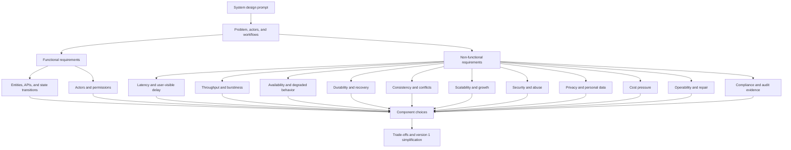

# Requirements

Requirements turn a broad prompt into architecture constraints. Use this map to
find the requirement category that is most likely to change the design before
choosing components.

This section starts with requirement discovery and grows into focused decision
trees for latency, throughput, availability, durability, consistency,
scalability, security, privacy, cost, operability, and compliance.

## Purpose

Use this page to:

- choose which requirement decision tree to read first;
- connect functional and non-functional requirements to component choices;
- avoid adding infrastructure before a requirement justifies it;
- keep version 1 small while naming the signals that should change the design.

## When This Matters

Start here when:

- the prompt is vague and the design could go in several directions;
- a stakeholder says the system must be fast, reliable, scalable, secure, or
  cheap without a concrete target;
- a component choice feels plausible but not yet justified;
- a design review asks which requirement created a cache, queue, replica,
  audit log, rate limit, or operational workflow.

## Quick Decision

| If the main pressure is... | Read first | Design question it raises |
| --- | --- | --- |
| User-visible delay | [latency.md](latency.md) | What must stay in the synchronous path? |
| Request, event, or job volume | [throughput.md](throughput.md) | Which path saturates first? |
| Outage tolerance | [availability.md](availability.md) | What should degrade instead of fail? |
| Data loss risk | [durability.md](durability.md) | What must survive process, node, or region failure? |
| Freshness or conflict risk | `consistency.md` | Which reads and writes need stronger guarantees? |
| Growth over time | `scalability.md` | Which dimension grows: users, data, traffic, or fanout? |
| Unauthorized access or abuse | `security.md` | What must be protected, limited, or audited? |
| Personal data exposure | `privacy.md` | What should be minimized, retained, deleted, or hidden? |
| Budget pressure | `cost.md` | Which resource dominates cost? |
| Running and debugging the system | `operability.md` | What must be observable and repairable? |
| Regulated or audit-heavy workflow | `compliance.md` | What evidence, retention, residency, or deletion rule matters? |

The focused pages are planned by the backlog and will become links as their
tickets are delivered. Until then, use the paths above as the section map.

## Requirements Overview



This map is intentionally requirement-first. A component should appear because a
requirement creates a need, not because it is common in architecture diagrams.

## Requirement Pages

| Requirement page | Status | Planned path | Use it to discover... |
| --- | --- | --- | --- |
| Requirements index and map | Current | `docs/requirements/index.md` | How categories connect to design impact |
| Latency requirements | Current | [docs/requirements/latency.md](latency.md) | p50, p95, p99, synchronous paths, slow dependencies, caching, CDN, and async work |
| Throughput requirements | Current | [docs/requirements/throughput.md](throughput.md) | RPS, event rate, peak traffic, bursts, batching, scaling, and bottlenecks |
| Availability requirements | Current | [docs/requirements/availability.md](availability.md) | Uptime targets, degraded mode, redundancy, failover, regional failure, and dependency failure |
| Durability requirements | Current | [docs/requirements/durability.md](durability.md) | Data loss tolerance, persistence, replication, backups, audit trails, and recomputable data |
| Consistency requirements | Planned | `docs/requirements/consistency.md` | Stale reads, read-your-writes, conflicts, transactions, eventual consistency, and idempotency |
| Scalability requirements | Planned | `docs/requirements/scalability.md` | User growth, data growth, traffic growth, hot keys, horizontal scaling, and sharding triggers |
| Security requirements | Planned | `docs/requirements/security.md` | Users, roles, permissions, sensitive actions, secrets, audit logs, and abuse risk |
| Privacy requirements | Planned | `docs/requirements/privacy.md` | Personal data, access controls, retention, deletion, export, minimization, and logging risks |
| Cost requirements | Planned | `docs/requirements/cost.md` | Storage, compute, network, managed services, overprovisioning, and cost/performance trade-offs |
| Operability requirements | Planned | `docs/requirements/operability.md` | Debugging, monitoring, deployments, on-call, runbooks, alerts, and maintenance tasks |
| Compliance requirements | Planned | `docs/requirements/compliance.md` | Auditability, retention, deletion, data residency, access records, and regulated workflows |

## How Requirements Map To Components

| Requirement category | Component or design choice it may justify | Trade-off to explain |
| --- | --- | --- |
| Latency | Cache, CDN, precomputed view, smaller synchronous path, or async handoff | Faster responses can increase staleness, invalidation work, or background complexity |
| Throughput | Batching, queueing, backpressure, horizontal scaling, or admission control | More throughput can delay individual work or require more operational coordination |
| Availability | Redundancy, failover, degraded mode, circuit breaker, or dependency isolation | Higher uptime can increase cost and may serve reduced functionality during failure |
| Durability | Durable store, replication, backup, restore test, audit log, or recomputation plan | More durable writes can add latency, storage cost, and recovery procedures |
| Consistency | Transaction, conditional write, uniqueness rule, lock, idempotency key, or single writer | Stronger correctness can reduce concurrency, availability, or implementation simplicity |
| Scalability | Partitioning, read replicas, workload isolation, sharding trigger, or hot-key mitigation | Scaling mechanisms add complexity before they add value unless a bottleneck is real |
| Security | Authentication, authorization, rate limit, validation, secret handling, or abuse controls | Stronger controls can add user friction and require support or exception paths |
| Privacy | Data minimization, access boundary, retention limit, deletion/export workflow, or log redaction | Privacy controls can reduce debugging detail and require lifecycle discipline |
| Cost | Quotas, retention limits, batching, simpler storage, caching, or manual workflow | Cost control may reduce freshness, capacity, automation, or convenience |
| Operability | Structured logs, metrics, traces, dashboards, alerts, runbooks, or maintenance workflow | Better operations require consistent identifiers, ownership, and alert hygiene |
| Compliance | Audit trail, access record, retention policy, deletion evidence, residency boundary, or approval flow | Compliance evidence adds storage, process, and review overhead |

The answer is not always a new component. A requirement may be satisfied by a
clear limit, a database constraint, a manual review step, or a simpler version 1
workflow.

## Questions To Ask

- Which user workflow proves the system is useful?
- Which read path must be fast, fresh, or available?
- Which write path must be correct, durable, idempotent, or auditable?
- Which data is sensitive, personal, expensive, or hard to reconstruct?
- Which scale dimension is likely to break first?
- What can be delayed, approximated, manual, or out of scope for version 1?
- What should an operator see when the system is slow, inconsistent, abused, or
  partially unavailable?

## Decision Guidance

Start with the requirement category that changes the architecture most. For
example, a booking system with low traffic but strict no-double-booking rules
should start with consistency before scalability. A public catalog with global
read traffic and rare updates should start with latency and cost before strict
freshness.

After reading a focused requirement page, carry forward four notes:

```text
Requirement: <what must be true>
Design impact: <component, constraint, workflow, or simplification>
Trade-off: <what gets harder because of this choice>
Revisit when: <metric, incident, user need, or scale signal>
```

## Common Mistakes

- Treating broad words like fast, reliable, scalable, secure, or cheap as
  requirements without a target or observable signal.
- Listing features but skipping the qualities that make those features hard.
- Adding a cache, queue, service, replica, or search index before naming the
  requirement it satisfies.
- Designing for every possible future scale dimension instead of the one most
  likely to stress version 1.
- Ignoring operators, support staff, abuse actors, and external systems as
  requirement sources.

## Original Example

A neighborhood tool library wants members to reserve equipment.

Functional requirements:

- members can search available tools;
- members can reserve a tool for a time window;
- staff can cancel unsafe or overdue reservations;
- the system sends pickup reminders.

Requirement impact:

| Discovered requirement | Design impact | Trade-off | Revisit when |
| --- | --- | --- | --- |
| Two members must not reserve the same tool for the same time window | Use a transactional reservation write or uniqueness rule | Stronger write correctness is more important than premature write scaling | Lock contention or write latency becomes measured |
| Search results can be stale for a few minutes | A cached or indexed read path is acceptable later | Users may see a tool that becomes unavailable before reservation | Search freshness causes failed reservations or support tickets |
| Reminders can be delayed | Process reminders outside the reservation write path | Requires retry visibility and duplicate-send protection | Reminder delay misses pickup windows or duplicate sends appear |
| Staff cancellations must be auditable | Store cancellation actor, reason, and timestamp | Adds data retention and permission requirements | Audit records become hard to search or retention rules change |

Version 1 can use one durable database, a simple reservation write path, and
structured logs for conflicts and cancellations. It does not need sharding,
multi-region replication, or a separate search service until usage shows those
requirements are real.

## Checklist

Before moving from requirements to components, confirm:

- Functional requirements name actors, workflows, and state changes.
- Non-functional requirements name latency, throughput, availability,
  durability, consistency, scalability, security, privacy, cost, operability, or
  compliance constraints where they matter.
- Each major component maps to a requirement signal.
- Trade-offs are written next to the requirement that creates them.
- Version 1 defers components that are not justified yet.
- Revisit signals are measurable or observable.

## Related Pages

- [System design process](../method/system-design-process.md)
- [Requirement discovery](../method/requirement-discovery.md)
- [Functional vs non-functional requirements](../method/functional-vs-nonfunctional-requirements.md)
- [Scale estimation](../method/scale-estimation.md)
- [Trade-off vocabulary](../method/tradeoff-vocabulary.md)
- [Design review checklist](../method/design-review-checklist.md)
- [Component selection map](../components/)
- [Documentation index](../)
