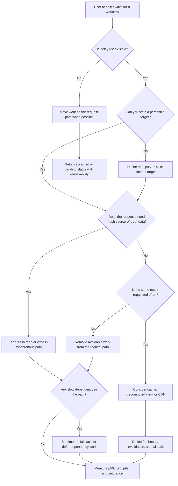

# Latency Requirements

Latency requirements define how quickly a workflow must respond and which delay
is visible to users, operators, or calling services. Use this decision tree
before adding caches, CDNs, queues, replicas, or extra services.

The goal is not to make every path as fast as possible. The goal is to know
which path needs a target, which percentile matters, and what trade-off is
acceptable when a dependency is slow.

## Purpose

Use this page to:

- turn vague words like fast or real-time into measurable latency requirements;
- separate user-visible request latency from background completion time;
- decide whether p50, p95, or p99 latency should drive the design;
- identify when caching, CDN delivery, async work, or dependency isolation is
  justified.

## When This Matters

Latency matters when:

- a user is waiting for a page, search result, reservation, checkout, upload, or
  confirmation;
- a service caller has a timeout or retry policy;
- a slow dependency can block the critical path;
- repeated reads might be served from a cache or edge location;
- work can finish after the response without harming the user workflow;
- tail latency could make a small percentage of users see timeouts.

## Quick Decision

| If the workflow needs... | Start with... | Watch for... |
| --- | --- | --- |
| Consistently good typical experience | p50 target for the main read or write | Median can hide slow tail requests |
| Good experience for most users | p95 target on user-visible paths | p95 can worsen when one dependency is slow |
| Protection from rare but painful delays | p99 target for critical paths | p99 targets can be expensive and noisy |
| Faster repeated reads with tolerable staleness | Cache, precomputed view, or CDN | Invalidation, stale data, and source-of-truth fallback |
| Slow work that can finish later | Async job, queue, or worker | Retry visibility, duplicates, and user status |
| Slow external dependency in the request path | Timeout, fallback, circuit breaker, or deferred workflow | Ambiguous outcomes and degraded responses |

## Questions To Ask

- Which user action is waiting for this response?
- What is the end-to-end latency target from the user's point of view?
- Which percentile matters: p50, p95, p99, or a timeout threshold?
- Is the path synchronous, or can part of it finish after the response?
- Which dependency is slow, variable, or outside the team's control?
- Can the result be stale, precomputed, cached, or served from an edge cache?
- What should the user see when the target is missed?
- What metric, trace span, or log field will prove the target is being met?

## Decision Tree



Use the tree to decide which latency pressure is real. Then write the target,
the path it applies to, and the design trade-off.

## Requirements Discovered

Record latency requirements in a form that can drive design:

| Requirement | Why It Matters | Design Impact |
| --- | --- | --- |
| p50 target | Describes the typical user experience | Helps detect broad slowness in the common path |
| p95 target | Describes experience for most users | Exposes slow queries, remote calls, and queueing delay |
| p99 target or timeout | Protects critical paths from rare long waits | May justify isolation, stricter timeouts, or simpler workflows |
| Synchronous path boundary | Names what must complete before response | Prevents background work from blocking users |
| Staleness tolerance | Says whether cached or precomputed data is acceptable | Justifies cache, CDN, read model, or direct source-of-truth read |
| Slow dependency behavior | Defines what happens when a dependency is slow | Justifies fallback, timeout, retry, circuit breaker, or async repair |

## Options

| Option | Use When | Trade-Off |
| --- | --- | --- |
| Optimize the direct source-of-truth path | Data must be fresh and traffic is modest | Keeps correctness simple but may expose users to slow reads or writes |
| Add an index or precomputed view | Reads are repeated and derived from known data | Speeds reads but adds write/update complexity |
| Add cache | Reads are frequent, expensive, and can tolerate staleness | Improves p50 and p95 but creates invalidation and fallback work |
| Add CDN or edge delivery | Static or cacheable content is served to distant users | Reduces network delay but needs cache-control and purge rules |
| Move work async | Final completion can happen after response | Improves user-visible latency but adds job state, retries, and status |
| Isolate slow dependencies | Remote calls are variable or outside your control | Improves stability but may return degraded or pending responses |

## Decision Guidance

### Choose The Percentile That Matches The Promise

p50 is the median request. It is useful for typical experience, but it can hide
the slowest users.

p95 shows whether most users receive an acceptable response. It is often a good
default for user-visible reads and writes.

p99 is useful for critical flows where rare long delays still cause harm. Use it
carefully: p99 can be noisy, expensive to improve, and sensitive to small
amounts of traffic.

Write the requirement like this:

```text
The availability search should return within 300 ms at p95 for cached reads.
The reservation write should return within 1 second at p95 and fail clearly
instead of waiting longer than 3 seconds.
```

### Separate User-Visible Time From Completion Time

Not all work belongs in the synchronous path.

Keep work synchronous when:

- the user needs the result before taking the next action;
- correctness depends on the write completing now;
- a failure must be shown immediately.

Move work async when:

- the user can see pending, accepted, or processing status;
- retries are expected;
- a slow dependency should not block the main response;
- duplicate work can be made safe with an idempotency key.

### Use Caching Only When Freshness Allows It

Caching helps latency when the same result is requested often or the source read
is expensive. It is harmful when the data must be fresh and the invalidation
rules are unclear.

Before adding a cache or CDN, write:

```text
Freshness: <how stale can the response be?>
Fallback: <what happens on miss, stale entry, or origin failure?>
Invalidation: <what update makes cached data unsafe?>
Revisit when: <latency, load, stale-read bug, or cost signal>
```

### Treat Slow Dependencies As Design Inputs

A dependency that is usually fast but sometimes slow can dominate p95 and p99
latency. Name the dependency, timeout, fallback, and user-visible behavior.

Good requirement:

```text
The quote page should not wait more than 800 ms for the tax estimate. If the
estimate service is slow, show a pending total and refresh after the estimate
arrives.
```

Weak requirement:

```text
The quote page should call the tax service quickly.
```

## Trade-Offs

| Choice | Improves | Costs Or Risks |
| --- | --- | --- |
| Tight p95 target | Better user experience for most users | May require simpler workflows, fewer dependencies, or more capacity |
| p99 target on a critical path | Fewer rare but painful delays | Can be costly to measure and improve |
| Cache or CDN | Lower read latency and origin load | Stale responses, invalidation, and fallback behavior |
| Async handoff | Faster initial response and better isolation | Pending states, retries, duplicate handling, and operator visibility |
| Dependency timeout | Protects the caller from unbounded waits | May return degraded responses or create ambiguous outcomes |

## Failure Modes

| Failure Mode | Impact | Design Response | Observable Signal |
| --- | --- | --- | --- |
| p95 rises because the database query is slow | Most users experience sluggish reads | Add index, reduce response shape, or precompute only after measuring | Query latency, endpoint p95, trace span duration |
| p99 spikes because an external dependency stalls | A small group sees timeouts or abandoned flows | Set timeout and fallback, then retry or reconcile later | Dependency timeout count, p99 latency, pending-state count |
| Cache serves stale data after an update | User sees outdated availability or status | Define TTL, invalidation, and source-of-truth fallback | Stale-read reports, cache age, miss/stale ratio |
| Async job backlog grows | Initial response is fast but completion is late | Add worker capacity, backpressure, or user-facing status | Queue age, job completion latency, retry count |

## Common Mistakes

- Saying "fast" without naming a workflow, percentile, and target.
- Optimizing p50 while ignoring p95 or p99 timeouts.
- Adding a cache before defining freshness and invalidation.
- Moving work async without a status, retry, or duplicate-handling plan.
- Waiting synchronously on slow dependencies that do not need to block the user.
- Treating CDN delivery as useful for every response instead of cacheable
  content.
- Hiding latency failures in generic error logs instead of measuring the slow
  path.

## Original Example

A community meal program lets residents reserve pickup windows and view the
daily menu.

Latency requirements:

| Workflow | Target | Design Impact | Trade-Off |
| --- | --- | --- | --- |
| View today's menu | p95 under 250 ms for most reads | Cache or edge-deliver the public menu after staff publish it | A menu update may take up to one minute to appear everywhere |
| Reserve a pickup window | p95 under 1 second | Keep reservation write synchronous with a uniqueness rule | Correctness matters more than hiding all write latency |
| Send reminder message | Complete within 10 minutes | Process reminders asynchronously | Requires job monitoring and duplicate-send protection |
| Verify optional sponsor code | Do not block reservation longer than 500 ms | Timeout slow sponsor lookup and mark for later review | Some discounts appear after reservation confirmation |

Version 1 can start with one database, indexed reads for reservation windows,
and a small cache for the published menu. It should not add read replicas or a
separate search system until measured p95 latency or database load justifies
that complexity.

Walking this example through the tree: the menu path is user-visible, has a p95
target, and can tolerate brief staleness, so caching or edge delivery is
reasonable. The reservation write is user-visible and needs fresh state, so it
stays synchronous. Reminder delivery is not user-visible at confirmation time,
so it moves async with monitoring and duplicate-send protection.

## Checklist

Before leaving latency discovery, confirm:

- The user-visible workflow is named.
- p50, p95, p99, or timeout targets are explicit where they matter.
- Synchronous work is separated from async completion.
- Slow dependencies have timeout and fallback behavior.
- Cache or CDN choices include freshness, invalidation, and fallback rules.
- Async paths include status, retry, duplicate handling, and observability.
- Metrics or traces can show whether the latency target is being met.
- The design states what version 1 keeps simple and when to revisit it.

## Related Pages

- [Requirements map](./)
- [Requirement discovery](../method/requirement-discovery.md)
- [Scale estimation](../method/scale-estimation.md)
- [Trade-off vocabulary](../method/tradeoff-vocabulary.md)
- [System design process](../method/system-design-process.md)
- [Design review checklist](../method/design-review-checklist.md)
- [Timeouts](../reliability/timeouts.md)
- [Circuit breakers](../reliability/circuit-breakers.md)
- [Sync vs async](../communication/sync-vs-async.md)
- [Metrics](../operations/metrics.md)
- [Tracing](../operations/tracing.md)
- [SLOs](../operations/slos.md)
- [Component selection map](../components/)
