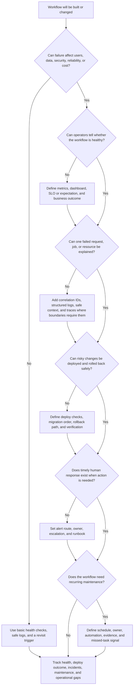

# Operability Requirements

Operability requirements describe how the team will notice, debug, deploy,
repair, and maintain the system before implementation choices harden. Use this
decision tree before choosing monitoring, logging, tracing, dashboards, alerting,
runbooks, deployment controls, on-call ownership, or maintenance tasks.

Operability is not a final polish step. It changes architecture when a workflow
needs safe identifiers, observable state transitions, rollback paths, queue
visibility, owner action, maintenance windows, or clear degraded behavior. The
goal is to make version 1 supportable without instrumenting every internal
detail.

## Purpose

Use this page to:

- discover which workflows need operational evidence before launch;
- separate monitoring, debugging, deployment, on-call, runbook, alert, and
  maintenance requirements;
- decide what a responder must see to explain one failed request, job, tenant,
  resource, or dependency call;
- define deployment and rollback expectations for risky changes;
- decide when a signal should page a human versus create a ticket or dashboard
  trend;
- keep version 1 small while naming the maintenance work that cannot be ignored.

## When This Matters

Operability requirements matter when:

- a workflow has a user-visible success, latency, freshness, availability, or
  correctness expectation;
- support or operators need to debug one user report, request, job, tenant,
  resource, import, export, or provider callback;
- deployments, feature flags, migrations, configuration changes, or schema
  changes can affect many users;
- queues, workers, caches, replicas, derived views, scheduled jobs, or external
  providers can fail silently or fall behind;
- alerts, on-call ownership, escalation, or customer communication are needed;
- backups, cleanup jobs, certificate rotation, secret rotation, data retention,
  index rebuilds, or other maintenance tasks must happen reliably;
- the design adds components that would be hard to operate without dashboards,
  logs, traces, or runbooks.

Skip this tree only for throwaway prototypes with no real users, data, shared
deployment, or support expectation. Record what must change before the
prototype becomes relied on.

## Quick Decision

| If the operational pressure is... | Start with... | Watch for... |
| --- | --- | --- |
| Debugging one failure | Correlation IDs, structured logs, safe context, and traces when work crosses boundaries | Logs that omit the resource or expose sensitive payloads |
| Monitoring workflow health | Metrics, dashboards, SLOs, queue age, and business outcome | Component charts that cannot answer whether users are affected |
| Safe deployments | Rollback path, migration plan, feature flag, and verification | Changes that cannot be reversed or detected quickly |
| Human response | Alert threshold, owner, escalation, and runbook | Pages with no timely action or owner |
| Maintenance tasks | Schedule, owner, verification, and missed-task alert | Cleanup, rotation, or backup work that only exists in memory |
| Small version 1 | Minimal evidence for the critical workflow | Instrumenting everything except the path users need |

Default to operational signals that answer a concrete question. Add more detail
when a workflow, dependency, failure mode, or support path justifies it.

## Questions To Ask

- Which user-visible workflow must someone know is healthy?
- What does success, degraded behavior, partial completion, and failure look
  like for that workflow?
- Which metric proves the workflow is succeeding, slow, stale, delayed,
  rejected, or failing?
- Which identifiers let a responder debug one request, resource, user, tenant,
  job, message, export, import, or provider call safely?
- Which logs or traces explain where the work went and why it failed?
- Which dashboard should answer "are users affected?" in the first minute?
- Which deployment, migration, or configuration change needs rollback,
  verification, or a feature flag?
- Which alert should page a human, who owns it, and what should they do first?
- Which runbook explains mitigation, rollback, repair, verification, and
  escalation?
- Which maintenance tasks need schedule, owner, evidence, and missed-task
  detection?
- What can version 1 handle manually, and what must be automated before launch?

## Decision Tree



Use the tree to make operations part of the design, not a vague promise to
"monitor it later." Each branch should produce evidence, owner action, or a
deliberate version 1 simplification.

## Requirements Discovered

| Requirement | Why It Matters | Design Impact |
| --- | --- | --- |
| Workflow health signal | Operators need to know whether users are succeeding | Drives metrics, dashboards, SLOs, and business outcome checks |
| Debugging evidence | Support and responders need to explain one affected case | Drives correlation IDs, structured logs, traces, and safe identifiers |
| Deployment safety | Bad changes are common failure sources | Drives rollback, feature flags, migration sequencing, and verification checks |
| Alert ownership | A signal is useful only when someone can act on it | Drives thresholds, routing, escalation, on-call expectations, and runbooks |
| Runbook procedure | Responders should not improvise under pressure | Drives mitigation, rollback, repair, communication, and recovery proof |
| Maintenance ownership | Recurring work fails when no one owns schedule and evidence | Drives cleanup jobs, rotations, backups, rebuilds, audits, and missed-task alerts |
| Operational cost and privacy | Logs, traces, metrics, and dashboards can become expensive or risky | Drives sampling, retention, safe labels, and access controls |

## Options

| Option | Use When | Trade-Off |
| --- | --- | --- |
| Basic health and error reporting | Prototype or low-risk workflow | Small footprint, but weak support for user-specific debugging |
| Workflow metrics and dashboard | A team needs current health and trend visibility | Clearer monitoring, but requires metric ownership and dashboard pruning |
| Structured logs with correlation IDs | Support must explain one request, job, or resource | Better debugging, but needs privacy rules and volume control |
| Distributed traces | Work crosses services, queues, workers, or providers | Explains latency and causality, but adds sampling and propagation work |
| Alert plus runbook | Timely human action is needed | Faster response, but can create alert fatigue if poorly tuned |
| Deployment guardrail | Bad deploys, migrations, or configuration changes can cause broad impact | Safer changes, but adds release process and verification work |
| Maintenance automation | Recurring task is frequent or risky to forget | More reliable operation, but creates jobs, alerts, and ownership |
| Manual operational step | Task is rare, low-volume, and needs judgment | Simple version 1, but slower and must be documented with owner and evidence |

## Decision Guidance

### Start From The Operational Question

Do not start with "add monitoring." Start with the question a real person must
answer.

Useful question formats:

```text
Can support explain why reservation res_123 failed?
Can on-call see whether reminders are leaving within 10 minutes?
Can the service owner roll back the schema change without losing accepted work?
Can the team prove yesterday's cleanup job ran and deleted the right records?
```

Each question points to different evidence. Support debugging needs safe
identifiers and logs. Queue freshness needs metrics and dashboards. Deployment
safety needs rollback and verification. Maintenance needs schedule, owner, and
proof.

### Design Monitoring Around Workflows

Monitoring should show user-visible health before component detail.

For each critical workflow, define:

```text
Workflow: <user, operator, or background outcome>
Success signal: <rate, count, freshness, completion, or business outcome>
Failure signal: <error, timeout, stale data, delayed work, or rejection>
Latency or freshness target: <if user-visible>
Saturation or dependency signal: <likely cause>
Dashboard owner: <team or role>
```

Metrics should distinguish accepted, completed, failed, delayed, retried,
rejected, and degraded outcomes. A generic service-up metric is not enough when
users depend on a specific state transition or background job.

### Make Debugging Evidence Safe And Joinable

Debugging one case usually requires joining evidence across logs, traces,
metrics, jobs, and support tools.

Plan identifiers such as:

- request ID or trace ID for one synchronous action;
- resource ID for the user-visible object;
- tenant, organization, branch, or region ID for impact scope;
- job ID, message ID, import ID, export ID, or provider receipt for async work;
- idempotency key for retried writes when safe;
- error class and reason code for stable grouping.

The identifiers must be safe. Do not use secrets, full payloads, session
cookies, private notes, or unnecessary personal data as labels or log fields.
When a workflow handles sensitive data, connect this requirement to
[privacy requirements](privacy.md) and [security requirements](security.md).

### Treat Deployments As Failure Modes

Deployments are part of operability because many incidents start with a code,
configuration, migration, secret, or feature-flag change.

For risky changes, define:

- pre-deploy check or readiness condition;
- migration order and compatibility window;
- feature flag, kill switch, or staged rollout when useful;
- rollback command or fallback path;
- data repair or reconciliation step if rollback is unsafe;
- post-deploy verification from the user's point of view;
- owner who can approve risky rollback or forward fix.

Good requirement:

```text
New reservation conflict logic must be behind a feature flag. After deployment,
verify conflict rate, reservation error rate, and duplicate-reservation count
for 30 minutes. Roll back the flag if valid reservation errors exceed target.
```

Weak requirement:

```text
Deploy carefully.
```

### Page Only When Timely Action Exists

An alert should interrupt a human only when action is needed soon. Otherwise,
use dashboards, tickets, scheduled review, or reports.

For each alert, define:

```text
Risk: <user impact, data risk, security risk, cost risk, or missed promise>
Signal: <metric, event, SLO burn, queue age, or durable check>
Threshold: <value, duration, volume guard, and severity>
Owner: <primary responder and escalation>
First action: <runbook step, rollback, pause, scale, communicate, or inspect>
Recovery proof: <metric or user-visible check>
```

Avoid alerts that only say a component is busy. Component saturation belongs on
dashboards unless it has a known, timely action or precedes real user impact.

### Write Runbooks For Known Risks

Runbooks should exist for alerts, risky deployments, important maintenance
tasks, and manual repair flows.

A practical runbook includes:

- trigger or alert name;
- severity and scope checks;
- dashboards, log queries, trace queries, and recent-change checks;
- first safe mitigation;
- rollback, pause, retry, replay, or degradation path;
- escalation contact and decision authority;
- user, support, or stakeholder communication note when needed;
- recovery verification;
- follow-up evidence to save.

Version 1 can keep runbooks short. A one-page procedure that tells the first
responder what to check and who to call is better than a vague dependency on
tribal knowledge.

### Do Not Forget Maintenance Tasks

Maintenance tasks are operational requirements when the system becomes unsafe,
expensive, stale, or unreliable without them.

Common tasks:

- backup and restore verification;
- data cleanup, archive, retention, and deletion jobs;
- certificate, key, token, and secret rotation;
- index rebuilds, cache warming, search reindexing, and derived-view repair;
- queue replay, dead-letter review, and reconciliation;
- dependency quota review and provider credential checks;
- capacity, cost, log volume, and storage review;
- dashboard, alert, and runbook pruning;
- dependency upgrades and security patch review.

Each task needs owner, schedule, evidence, and missed-task handling. A cleanup
job that fails silently is only a future incident.

## Trade-Offs

| Choice | Improves | Costs Or Risks |
| --- | --- | --- |
| More metrics and dashboards | Faster health assessment and trend review | Noise, cost, ownership, and false confidence if not workflow-focused |
| More structured logs | Easier case-level debugging | Storage cost, privacy risk, and high-cardinality fields |
| More tracing | Clearer cross-component latency and failure path | Sampling, propagation, and instrumentation overhead |
| More alerting | Faster notice for real impact | Alert fatigue and pages without action |
| Strong deployment guardrails | Safer releases and rollback | Slower release flow and extra compatibility work |
| Manual maintenance | Lower automation cost for rare tasks | Missed steps, slower recovery, and reliance on memory |
| Automated maintenance | More reliable recurring operation | More jobs, alerts, permissions, and failure modes to operate |

## Failure Modes

| Failure Mode | Impact | Design Response | Observable Signal |
| --- | --- | --- | --- |
| Workflow has no health signal | Users fail before the team notices | Add success, error, latency, freshness, and business outcome metrics | Support reports arrive before alerts, missing dashboard |
| Logs cannot explain one case | Support and on-call guess during incidents | Add correlation IDs, resource IDs, reason codes, and safe structured logs | Unresolved support cases, manual database inspection |
| Traces break across async work | Latency or failure disappears between API and worker | Propagate trace or correlation context through messages and jobs | Orphan spans, missing job linkage, unknown queue wait |
| Bad deployment has no rollback path | Incident lasts longer or data repair becomes risky | Define rollback, feature flag, migration compatibility, and verification | Failed deploy verification, long mitigation time |
| Alert pages without action | Responders ignore or silence pages | Tie alerts to runbooks, owners, thresholds, and recovery checks | Repeated alerts, low action rate, high false positive count |
| On-call ownership is unclear | Incident response stalls during impact | Define primary owner, escalation, authority, and communication path | Long acknowledge time, repeated handoffs |
| Maintenance task is missed | Backups, cleanup, rotations, or rebuilds silently fail | Add schedule, owner, evidence, and missed-task alert or ticket | Stale backup, expired credential, records past retention |
| Observability leaks sensitive data | Operational tools become exposure surfaces | Use safe IDs, redaction, access controls, retention, and privacy review | PII scan hits, sensitive labels, broad dashboard access |

## Common Mistakes

- Saying "we will monitor it" without naming workflow health signals.
- Logging raw payloads because debugging feels easier in the short term.
- Alerting on every component warning instead of user-visible symptoms and
  actionable risks.
- Creating dashboards nobody owns or uses during incidents.
- Deploying schema, feature-flag, or configuration changes without rollback or
  verification.
- Forgetting maintenance windows, deploy annotations, or alert suppression for
  expected recurring work.
- Treating on-call as a staffing detail instead of a design requirement for
  risky workflows.
- Writing runbooks after the first incident instead of before launch.
- Forgetting cleanup, rotation, backup verification, and other recurring tasks.

## Original Example

A public library reservation system lets patrons reserve rooms, staff approve
special events, and reminder workers send arrival and check-in messages. The
team plans a simple version 1, but the library needs staff to support patrons
without engineering help for every failed reservation.

Operability requirements:

| Workflow | Operational Need | Design Impact | Revisit When |
| --- | --- | --- | --- |
| Patron reservation submit | Staff must debug one failed reservation | Add request ID, reservation ID, branch ID, result class, conflict reason, and trace ID to safe logs | Support cannot explain a report from IDs alone |
| Room availability page | Operators must know whether patrons can browse available rooms | Track request rate, p95 latency, error rate, stale availability age, and successful reservation starts | Browse errors or p95 exceed target during branch hours |
| Reminder worker | Delayed reminders should be visible before patrons miss check-in | Track enqueue rate, oldest queue age, retry count, dead letters, and provider timeout class | Queue age exceeds reminder freshness expectation |
| Approval policy deploy | Bad policy changes can block valid events | Ship behind a feature flag, verify approval error rate and denial reason mix, and roll back flag if valid approvals fail | Denials spike after deploy |
| On-call response | Branch-hours failures need timely action | Page reservation owner for high valid-error rate, attach runbook, and escalate to service owner if no mitigation in 20 minutes | Repeated pages lack owner action |
| Maintenance | Old holds and dead letters should not accumulate forever | Schedule cleanup, dead-letter review, and backup-restore verification with evidence and missed-task tickets | Records exceed retention or restore check fails |

Walking this example through the tree: reservation submission affects users and
needs both monitoring and debugging evidence. Availability browse needs a
workflow dashboard before component charts. Reminder delivery can fail after
the initial request succeeds, so queue age matters more than enqueue success.
Approval policy changes need deployment guardrails because a bad rule can
block valid events. Version 1 can use structured logs, a compact workflow
dashboard, two actionable alerts, short runbooks, and scheduled maintenance
evidence. It does not need a large observability platform before the critical
paths have clear signals and owners.

## Checklist

Before leaving operability discovery, confirm:

- Critical workflows have success, failure, latency, freshness, or completion
  signals where relevant.
- Dashboards answer user-visible health before component detail.
- Debugging evidence includes safe request, trace, resource, tenant, job,
  message, provider, and reason-code identifiers as needed.
- Logs, metrics, traces, labels, and dashboards avoid secrets, raw payloads,
  private notes, and unnecessary personal data.
- Deployment risks have rollback, feature flag, migration, verification, or
  reconciliation plans.
- Alerts name risk, signal, threshold, owner, first action, escalation, and
  recovery proof.
- Known deploys and recurring jobs have maintenance-window, dashboard
  annotation, or alert-suppression handling where needed.
- On-call ownership and decision authority are clear for risky workflows.
- Runbooks exist for paging alerts, risky deploys, known failure modes, and
  manual repair or maintenance tasks.
- Maintenance tasks name schedule, owner, evidence, and missed-task handling.
- Version 1 keeps the smallest operational surface that can detect, debug, and
  repair the critical workflow.

## Related Pages

- [Requirements map](./)
- [Latency requirements](latency.md)
- [Availability requirements](availability.md)
- [Security requirements](security.md)
- [Privacy requirements](privacy.md)
- [Cost requirements](cost.md)
- [Operations overview](../operations/)
- [Observability basics](../operations/observability-basics.md)
- [Metrics](../operations/metrics.md)
- [Logs](../operations/logs.md)
- [Tracing](../operations/tracing.md)
- [Dashboards](../operations/dashboards.md)
- [Alerting](../operations/alerting.md)
- [Runbooks](../operations/runbooks.md)
- [Incident response](../operations/incident-response.md)
- [SLOs](../operations/slos.md)
- [Capacity planning](../operations/capacity-planning.md)
