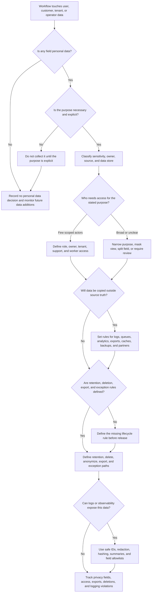

# Privacy Requirements

Privacy requirements describe which personal data the system collects, why it
is needed, who can access it, how long it is kept, how it is exported or
deleted, and where it must not leak. Use this decision tree before choosing data
fields, logs, analytics events, exports, support views, backups, or retention
rules.

This page is design guidance, not legal advice. Laws, contracts, and company
policy may add stricter requirements. The design job is to make personal-data
choices explicit enough that product, engineering, operations, security, and
legal reviewers can evaluate them.

## Purpose

Use this page to:

- identify personal data and the workflow purpose for collecting it;
- minimize data before protecting unnecessary fields forever;
- map access controls for users, support staff, workers, exports, and partners;
- define retention, deletion, and export expectations early;
- prevent logs, queues, analytics, caches, backups, and audit trails from
  becoming accidental privacy copies;
- keep version 1 privacy controls small, testable, and visible.

## When This Matters

Privacy requirements matter when:

- users provide names, contact details, addresses, images, messages, documents,
  identifiers, location, payment-related details, or sensitive notes;
- support, admins, reviewers, partners, or workers can view personal data;
- personal data is copied into logs, metrics, traces, analytics, exports,
  search indexes, caches, queues, or backups;
- users need account deletion, data export, correction, masking, or retention
  limits;
- the system stores audit records, support notes, or history after the primary
  record is deleted;
- a design proposes collecting data because it might be useful later.

Skip this tree only when the system stores no real user, operator, customer,
tenant, or partner data. If that changes, revisit privacy before the data model
and logs harden.

## Quick Decision

| If the workflow has... | Start with... | Watch for... |
| --- | --- | --- |
| New personal data field | Purpose, owner, sensitivity, and minimization check | Collecting optional data because it might help someday |
| Personal data reads | Access rule by actor, resource, purpose, and scope | Support or analytics paths that bypass product permissions |
| Long-lived history | Retention period and deletion or archive trigger | Keeping data forever by accident |
| User deletion expectation | Delete, anonymize, retain-minimal, or legal-review decision | Backups, audit logs, and derived stores preserving data silently |
| User export expectation | Export scope, format, requester proof, and audit record | Exporting other users' data or internal notes by mistake |
| Logs, metrics, traces, or analytics | Redaction, hashing, safe IDs, and field allowlist | Personal data in high-cardinality labels or raw payloads |
| External sharing | Data-sharing purpose, minimum fields, credential, and audit trail | Partner copies that outlive the original purpose |

Default to collecting less data. A field that is never collected does not need
access control, encryption, deletion, export, redaction, or incident response.

## Questions To Ask

- Which personal data does the workflow need to function?
- What user-visible or operator-visible purpose justifies each field?
- Can the system use a less sensitive value, a shorter lifetime, a derived
  value, or a user-controlled optional field?
- Who can read, change, export, delete, mask, or use the data?
- Which copies are created in logs, queues, analytics, search, caches, backups,
  audit trails, support tools, spreadsheets, and partner systems?
- How long is each copy retained, and what event should delete or archive it?
- What happens when a user requests deletion, export, or correction?
- Which data must remain for security, audit, abuse prevention, dispute
  handling, or operational repair?
- Which fields must never appear in logs, metrics labels, traces, support
  screenshots, or exported incident notes?
- Which reviewer must approve a new sensitive field, export, retention change,
  or partner data flow?

## Decision Tree



Use the tree to decide whether data should exist at all, then decide how it can
be accessed, copied, retained, deleted, exported, and observed safely.

## Requirements Discovered

| Requirement | Why It Matters | Design Impact |
| --- | --- | --- |
| Personal-data inventory | Reviewers need to know what exists and why | Drives data model, field classification, ownership, and review |
| Minimization rule | Unused data creates unnecessary exposure and lifecycle work | Drives smaller forms, optional fields, derived values, and deletion of unused data |
| Access controls | Personal data should be visible only for a stated purpose | Drives authorization, support masking, worker scope, and partner contracts |
| Retention policy | Data should not live forever by accident | Drives TTLs, archive jobs, backup expectations, and audit exceptions |
| Deletion behavior | Users or operators may need data removed or anonymized | Drives delete workflows, tombstones, derived-store repair, and backup notes |
| Export behavior | Users, tenants, or admins may need a safe copy | Drives requester proof, export scope, format, rate limits, and audit events |
| Logging rules | Logs can become accidental personal-data stores | Drives redaction, safe identifiers, sampling, field allowlists, and retention |

## Options

| Option | Use When | Trade-Off |
| --- | --- | --- |
| Do not collect the field | The workflow can work without it | Simplest privacy path, but may reduce convenience or analytics |
| Collect optional user-controlled field | The field improves experience but is not required | Needs clear UI, defaults, and deletion behavior |
| Store derived or coarse value | Exact value is not needed for the workflow | Less exposure, but may reduce support or analysis detail |
| Masked support view | Support needs context but not full values | Lower exposure, but some cases need escalation |
| Scoped access control | Specific actors need personal data for a task | Requires authorization, tests, and audit for risky access |
| Retention limit or TTL | Data is useful only for a bounded period | Needs cleanup jobs, monitoring, and exception handling |
| Anonymization or aggregation | Historical statistics are useful after identity is not | Hard to reverse mistakes and can weaken debugging detail |
| User or tenant export | Users or admins need portable records | Requires proof, scope, format, limits, and audit |
| Redaction or hashing in logs | Observability needs a join key without raw data | Can make debugging harder if the safe key is not planned |

## Decision Guidance

### Classify Personal Data By Purpose

Start with a table instead of a database schema:

| Field | Purpose | Sensitivity | Owner | Revisit When |
| --- | --- | --- | --- | --- |
| Contact email | Send appointment updates and account recovery | Personal contact data | User profile | Email is no longer needed for the workflow |
| Pickup address | Coordinate a volunteer visit | Personal location data | Appointment | Visit completes or retention window ends |
| Support note | Explain a user-visible repair | Sensitive operational note | Support case | Case closes and audit exception expires |

Purpose is the anchor. If the team cannot explain why a field is needed, do not
collect it in version 1.

### Minimize Before Protecting

Minimization means reducing data collection, precision, lifetime, and copies.
It is often cheaper and safer than building stronger controls around data the
system did not need.

Minimization choices:

- collect fewer fields;
- make a field optional when the core workflow does not require it;
- store a coarse category instead of an exact value;
- store a reference to an external owner instead of copying the full record;
- derive a count or status and drop the raw input;
- expire temporary data after the workflow completes;
- separate private notes from general operational records.

Good requirement:

```text
Store pickup neighborhood for matching volunteers. Store exact address only
after a resident confirms an appointment, and delete it 30 days after pickup
unless an open support case references it.
```

Weak requirement:

```text
Collect address because it may be useful later.
```

### Bound Access Controls To Purpose

Privacy access controls should answer "who needs this data for what task?"

Examples:

- A resident can view and edit their own contact details.
- A volunteer can see pickup window and neighborhood, but not full contact
  history.
- A support agent can view masked contact fields while handling an open case.
- An export worker can read only the fields included in the approved export
  definition.
- Analytics jobs use anonymized or aggregated data unless a reviewed exception
  exists.

Access controls should apply to APIs, admin tools, support views, exports,
workers, search indexes, and analytics jobs. A private field is not private if
it appears in a broad report or debug view.

### Design Retention And Deletion Together

Retention says how long data stays. Deletion says what happens when the data is
no longer needed or a valid deletion request is processed.

For each data class, define:

```text
Primary store: <delete, anonymize, retain-minimal, or review>
Derived stores: <search, cache, analytics, queues, exports>
Backups: <retention note and restore-time handling>
Audit records: <safe summary, retained fields, or exception>
User-visible result: <what the requester can expect>
Verification: <metric, job result, or sampled check>
```

Deletion does not always mean every byte disappears immediately. Some audit,
security, abuse-prevention, or backup records may need temporary retention. The
design should say which minimal fields remain, why, who can read them, and how
long they last.

### Treat Exports As Sensitive Workflows

Exports package data into portable files or API responses that can outlive the
normal system controls. Treat them as data products with their own permissions.

Export design should specify:

- who can request the export;
- which data scope it includes;
- which fields are excluded, masked, or summarized;
- how requester identity or admin authority is verified;
- how large exports are rate-limited or queued;
- how the export file is delivered and expired;
- what audit event records the request and result;
- how repeated, unusual, or failed exports are alerted.

Avoid one broad export endpoint that includes "everything." Start with the
smallest export that satisfies the user, support, or tenant workflow.

### Treat Logs As Privacy Surfaces

Logs, metrics, traces, dashboards, screenshots, and incident notes often spread
personal data farther than the primary database.

Do not log:

- full names, email addresses, phone numbers, addresses, private messages,
  identity documents, payment data, secrets, tokens, session cookies, or full
  request bodies by default;
- deletion-request payloads or private support notes;
- personal data in metrics labels or high-cardinality dimensions;
- raw partner payloads or webhook bodies unless a reviewed exception exists.

Safer alternatives:

- stable internal IDs;
- masked or hashed values only when the debugging purpose is clear;
- reason codes and categories;
- counts, sizes, status, and state transitions;
- `field_changed=true` instead of old and new values.

Logging rules should be part of the privacy requirement. A team cannot repair
privacy exposure if it does not know where copies are created.

### Choose A Practical Version 1

A practical version 1 privacy plan usually says:

- which personal data is required and which is deferred;
- which personal data is optional or user-controlled;
- which roles, workers, and exports can access each data class;
- which fields are redacted from logs and analytics;
- what retention period applies to primary, derived, and exported data;
- how deletion and export requests are handled;
- which stronger controls need human review before launch.

Do not build a generic privacy platform before the workflow exists. Do write
requirements that prevent accidental collection, unlimited retention, broad
exports, and logs full of personal data.

## Trade-Offs

| Choice | Improves | Costs Or Risks |
| --- | --- | --- |
| Collect less data | Smaller exposure, simpler deletion, fewer access rules | Less personalization, support context, or analytics detail |
| Mask support views | Lower accidental disclosure | Some cases need escalation to see full data |
| Short retention | Lower long-term privacy and storage risk | Less history for support, abuse investigation, or analytics |
| Aggregation or anonymization | Retains trends with less identity risk | Harder debugging and possible loss of user-level repair |
| User export | Transparency and portability | Requires proof, scope control, file expiry, and audit |
| Strict log redaction | Lower accidental leakage | Debugging needs better IDs, reason codes, and reproduction paths |
| Deletion across derived stores | Better lifecycle discipline | More background jobs, reconciliation, and verification work |

## Failure Modes

| Failure Mode | Impact | Design Response | Observable Signal |
| --- | --- | --- | --- |
| Unneeded personal data is collected | Extra exposure and deletion burden | Remove field, make optional, or store less sensitive substitute | Field inventory review, form-change review, unused-field count |
| Support view exposes full data | Staff see more than needed for the case | Mask by default, require escalation, and audit full reveals | Full-reveal count, support access audit, case reason coverage |
| Deletion misses derived stores | User data remains in search, analytics, cache, queue, or export | Track copies and run deletion or anonymization jobs per store | Deletion job failures, stale record checks, derived-store counts |
| Export includes unrelated people or internal notes | Data leaves normal controls with excessive scope | Define export schema, scope, approval, and audit event | Export size, field allowlist violations, unusual export volume |
| Logs include personal data | Observability store becomes exposure path | Use redaction, safe IDs, field allowlists, and log review | Redaction failures, secret/PII scan hits, blocked log fields |
| Retention is undefined | Data lives forever by default | Set retention periods, archive rules, and cleanup ownership | Age distribution, cleanup job lag, records past retention |
| Backup restore reintroduces deleted data | Old copy conflicts with deletion expectations | Document backup retention and run post-restore deletion reconciliation | Restore drill checks, deletion replay count, backup age |
| Partner or downstream copy outlives the source | Deletion or retention expectations are broken outside the primary system | Share minimum fields, define downstream retention, require deletion confirmation or reconciliation, and audit transfers | Partner deletion failures, transfer inventory gaps, stale downstream records |

## Common Mistakes

- Treating privacy as a legal checklist instead of a data-design requirement.
- Collecting fields before naming their workflow purpose.
- Protecting the primary table while copying personal data into logs, exports,
  queues, analytics, support tools, and spreadsheets.
- Giving support or admins full data when masked context would solve most
  cases.
- Defining deletion for one store but not caches, search indexes, exports,
  backups, or audit records.
- Logging raw request bodies during debugging and never removing the log.
- Creating broad exports without requester proof, field allowlists, expiry, or
  audit events.
- Keeping personal data forever because no owner was assigned to cleanup.

## Original Example

A neighborhood repair clinic lets residents book appointments, describe broken
items, upload optional photos, and receive pickup reminders. Volunteers triage
requests, repair coaches manage appointments, and support staff resolve missed
pickups.

Privacy requirements:

| Workflow | Privacy Need | Design Impact | Revisit When |
| --- | --- | --- | --- |
| Appointment booking | Resident name, email, and item description are needed to coordinate repair | Store contact data on the appointment, restrict to resident and assigned staff, and treat free-text descriptions as risky because residents may enter sensitive details | Support cases require broader access |
| Pickup coordination | Exact address is needed only for confirmed pickup visits | Collect address after pickup confirmation and hide it from general volunteers | Pickup logistics expand to partner teams |
| Optional item photos | Photos may include personal background details | Make upload optional, store with appointment scope, and avoid analytics copies | Photo review or model training is proposed |
| Support notes | Notes may include private circumstances | Use structured reason codes plus limited free text visible only to support | Notes become needed in reports |
| Data export | Resident can request appointment and repair history | Export resident-owned records, exclude internal notes, expire file, and audit request | Tenant-wide exports are added |
| Deletion request | Resident can request profile deletion after open appointments close | Delete profile/contact data, anonymize old appointments, keep minimal audit summary | Retention or dispute requirements change |
| Logs and metrics | Debugging should not expose contact fields or photos | Log appointment ID, status, reason code, and safe error class only | Incident response lacks enough safe identifiers |

Walking this example through the tree: the clinic needs some personal data for
appointments, but not every field needs the same lifetime or access. Exact
address is delayed until pickup is real. Photos are optional and not copied to
analytics. Support notes stay separate from normal appointment exports. Version
1 can use a small data inventory, role-scoped views, safe log fields, export
allowlists, and deletion/anonymization jobs. It does not need a broad privacy
platform until data flows, partners, or regulatory requirements grow.

## Checklist

Before leaving privacy discovery, confirm:

- Personal data fields are inventoried with purpose, owner, sensitivity, and
  source.
- Unnecessary fields are removed, made optional, shortened, coarsened, or
  deferred.
- Access controls cover product UI, APIs, workers, support views, exports,
  analytics, and partner flows.
- Retention periods are named for primary data, derived data, logs, exports,
  audit records, and backups where relevant.
- Deletion behavior is defined for source-of-truth records and known copies.
- Export behavior names requester proof, scope, field allowlist, delivery,
  expiry, rate limits, and audit record.
- Logging rules prevent personal data, secrets, tokens, and raw payloads from
  entering logs, metrics labels, traces, dashboards, and incident notes.
- Exceptions for audit, security, abuse prevention, dispute handling, or legal
  review are explicit and minimal.
- Version 1 collects the least personal data that still supports the workflow.

## Related Pages

- [Requirements map](./)
- [Security requirements](security.md)
- [Security design overview](../security/)
- [Authorization](../security/authorization.md)
- [Audit logs](../security/audit-logs.md)
- [Encryption](../security/encryption.md)
- [Data overview](../data/)
- [Backups and restore](../data/backups-and-restore.md)
- [Logs](../operations/logs.md)
- [Operational vs analytical data](../data/operational-vs-analytical-data.md)
