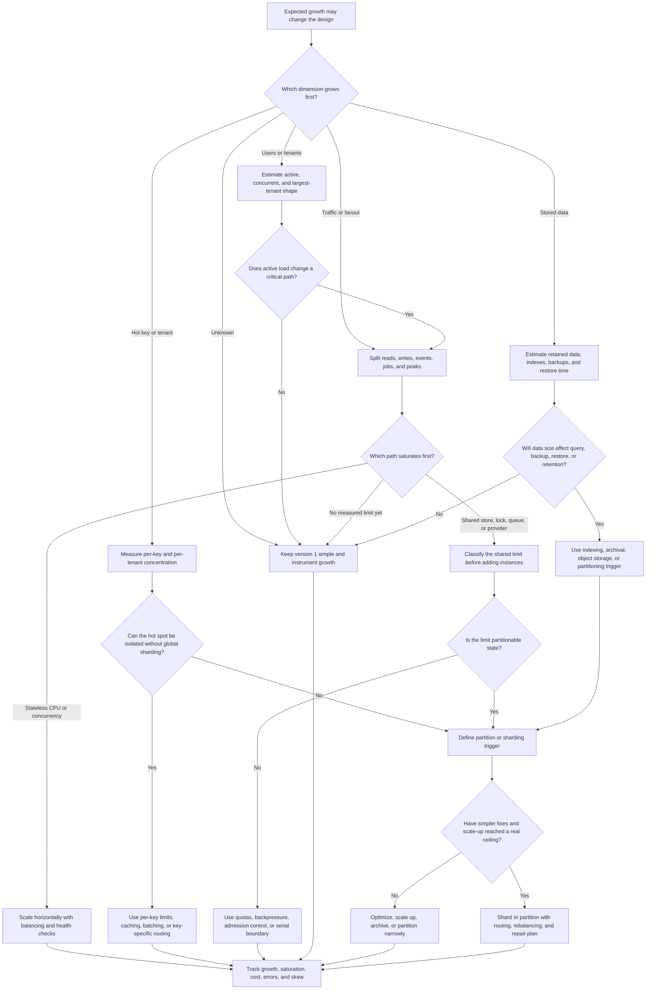

# Scalability Requirements

Scalability requirements describe how the system should keep working as users,
traffic, stored data, fanout, tenants, and operational work grow. Use this
decision tree before adding horizontal scaling, replicas, partitions, sharding,
or hot-key mitigation.

Scalability is not the same as "large." A small system can have a scaling
problem if one tenant, key, file, export, or launch window overwhelms the first
design. A large system can stay simple when growth is steady and the bottleneck
is known.

## Purpose

Use this page to:

- identify the growth dimension that changes the design first;
- separate user growth, data growth, traffic growth, fanout, and hot keys;
- decide when horizontal scaling is useful and when a shared limit blocks it;
- name the signal that would justify partitioning or sharding later;
- keep version 1 simple while leaving clear revisit triggers.

## When This Matters

Scalability matters when:

- the number of active users, tenants, devices, or partner systems is expected
  to grow quickly;
- reads, writes, background jobs, notifications, or imports may grow at
  different rates;
- stored data, history, audit records, large files, or indexes grow over time;
- one key, tenant, item, region, or event can become much hotter than the rest;
- the team is considering horizontal scaling, read replicas, partitioning, or
  sharding;
- the design needs to say which scaling work is intentionally deferred.

Skip this tree when the question is only current request volume. Start with
[throughput requirements](throughput.md) and [scale estimation](../method/scale-estimation.md)
first, then return here when growth over time changes the architecture.
For storage-specific splits, see [partitioning and sharding](../data/partitioning-and-sharding.md).

## Quick Decision

| If the growth pressure is... | Start with... | Watch for... |
| --- | --- | --- |
| More users or tenants | Active-user, concurrent-user, and tenant-shape estimates | Total registered users can hide low active load or one large tenant |
| More traffic | Separate reads, writes, events, jobs, fanout, and peaks | One blended RPS number hides the first bottleneck |
| More data | Retention, object size, index growth, backup, and restore estimates | Queries, migrations, and restores can fail before disk fills |
| Hot keys or tenants | Per-key, per-tenant, or per-item measurements and fairness limits | Average load can look safe while one partition is overloaded |
| Stateless request growth | Horizontal scaling behind balancing and health checks | Shared database, queue, provider, or cache limits may dominate |
| Stateful storage ceiling | Partitioning or sharding trigger after simpler fixes | Routing, rebalancing, repair, and cross-shard queries add cost |

Default to the simplest design that can handle the next credible growth step.
Write the metric that should trigger the next scaling move.

## Questions To Ask

- Which growth dimension is most likely to change first: users, traffic, data,
  fanout, tenants, regions, or hot keys?
- How many users are active in the busiest hour, not just registered overall?
- Which path grows faster than the rest: reads, writes, events, jobs, exports,
  notifications, or searches?
- How much data is created per user, per tenant, per event, or per day?
- How long is source data, history, audit data, and derived data retained?
- Can one tenant, key, item, account, or region receive a disproportionate
  share of the workload?
- Which parts are stateless enough to scale horizontally?
- Which limit remains shared after adding instances?
- What threshold would justify partitioning, sharding, archival, or a dedicated
  worker path?
- What can version 1 cap, queue, delay, approximate, archive, or handle
  manually?

## Decision Tree



Use the tree to turn "we need to scale" into a named pressure, a first
bottleneck, and a measurable trigger. Do not skip straight to sharding unless a
specific shared ceiling makes simpler moves insufficient.

## Requirements Discovered

| Requirement | Why It Matters | Design Impact |
| --- | --- | --- |
| Active-user growth | Registered users do not all create load | Drives request capacity, session handling, and support load |
| Traffic growth | Reads, writes, events, and jobs scale differently | Drives caches, queues, workers, replicas, rate limits, or backpressure |
| Data growth | Retained data changes query, index, backup, and restore behavior | Drives retention, archival, object storage, partitioning, and migration plans |
| Fanout growth | One action can create many downstream jobs or notifications | Drives batching, queueing, dedupe, and consumer lag targets |
| Hot-key or tenant skew | Average load can hide concentrated overload | Drives fairness limits, hot-key mitigation, tenant isolation, or partitioning |
| Horizontal-scaling boundary | Stateless work scales differently from shared state | Drives load balancing, health checks, connection caps, and state externalization |
| Sharding trigger | Sharding is costly and should have a threshold | Drives routing, key choice, rebalancing, repair, and cross-shard query rules |

## Options

| Option | Use When | Trade-Off |
| --- | --- | --- |
| Keep one simple deployment and measure | Growth is expected but current load is small | Simplest version 1, but requires clear metrics and revisit triggers |
| Add product or tenant limits | A cap preserves a useful version 1 experience | Some users hit limits and need support or upgrade paths |
| Optimize query, payload, or index shape | A known path is inefficient before the system is truly large | Local fix, but each index or optimization has maintenance cost |
| Scale vertically | One component needs more CPU, memory, disk, or connections for the next milestone | Buys simplicity but has cost and ceiling limits |
| Scale stateless services horizontally | Request handlers or workers are CPU- or concurrency-bound | Requires balancing, health checks, deploy draining, and downstream protection |
| Add cache, replica, queue, or worker pool | Growth affects reads, stale-tolerant work, bursts, or background jobs | Adds freshness, backlog, retry, and operational visibility decisions |
| Partition or archive data | Data size affects retention, maintenance, or query windows | Adds lifecycle rules and query boundaries |
| Shard by key | One store, writer, table, tenant, or partition cannot meet measured demand | Adds routing, rebalancing, hot-shard risk, cross-shard query limits, and repair work |

## Decision Guidance

### Name The Growth Dimension First

"Scalable" is too broad to guide architecture. Write the specific pressure:

```text
Volunteer search reads may grow from hundreds to thousands of peak RPS during
campaign launches.
Shift signup writes are lower volume but can hot-spot on a few popular shifts.
Application history grows by roughly 80 GB per month and is retained for two
years.
```

Each line points to a different design response. Read growth may justify a
cache or replica. Hot writes may require a conditional write, queue by key, or
fairness rule. Data growth may need retention and archival before it needs a
new service.

### Separate Scalability From Throughput

Throughput asks how much work the system handles in a time window. Scalability
asks what changes as that work grows over time.

Good scalability requirement:

```text
The read path should scale horizontally to 5x launch traffic without increasing
database connections beyond the configured pool limit.
```

Weak scalability requirement:

```text
Make it scalable.
```

Use throughput estimates as input, then add the growth question: what breaks
when users, traffic, stored data, fanout, or tenants increase by 10x?

### Treat Users As Behavior, Not A Vanity Count

Total users rarely drive the design by itself. Active users, concurrent users,
largest tenants, automated clients, and behavior per user are more useful.

Ask:

- How many users are active during the busiest hour?
- Does each active user create reads, writes, uploads, or events?
- Are there tenants whose activity is much larger than the median?
- Can a small number of automated clients create most load?

If user growth does not increase the critical path, do not add scaling
components for it. If one tenant or actor can dominate the workload, design a
fairness or isolation rule before average load becomes misleading.

### Let Data Growth Shape Operations

Data growth is not only storage size. It affects:

- query latency and index maintenance;
- backup, restore, and migration time;
- retention and deletion workflows;
- archive and reporting paths;
- replay, rebuild, and backfill duration;
- cost and regional placement.

Write data requirements with time:

```text
Application events grow by about 40 million records per month. Operators need
90 days searchable online and two years archived for audit lookup.
```

That requirement may justify time partitioning, archival, or a separate
reporting path. It does not automatically justify sharding the live write path.

### Find Hot Keys Before Sharding

Hot keys happen when one key, tenant, item, region, topic, or partition receives
more load than the rest. They are common in leaderboards, popular posts,
inventory drops, celebrity accounts, shared counters, and high-value tenants.

First responses can include:

- per-key or per-tenant rate limits;
- request coalescing for repeated reads;
- caching with careful invalidation or freshness labels;
- batching writes when delay is acceptable;
- queueing or serializing writes by key;
- splitting one hot workload from normal traffic.

Sharding does not remove hot keys automatically. If all traffic still targets
one shard, the shard is still hot. Define how the key will be spread, isolated,
or limited before choosing a sharding strategy.

### Scale Horizontally Only When Shared Limits Are Protected

Horizontal scaling works well for stateless request handlers and workers when
any instance can handle any request. It works poorly when every new instance
competes for the same exhausted database, lock, queue, provider quota, or hot
key.

Before scaling out, confirm:

- session and workflow state are not stored only in local process memory;
- generated files and uploads do not live only on local disk;
- retries and duplicate work are safe for the workflow;
- health checks and deploy draining protect in-flight work;
- connection pools and concurrency are capped;
- downstream dependencies have rate limits, timeouts, and backpressure.

The requirement should say what must remain true after more instances are
added. For example: "API instances may scale out, but total database
connections must stay below 70% of the configured limit."

### Define Sharding Triggers As Last-Resort Thresholds

Sharding splits data or traffic across multiple partitions that require routing.
It can raise ceilings, but it also creates operational work.

Consider sharding only after simpler moves are insufficient:

- query and index shape are already appropriate;
- vertical scaling or narrow partitioning no longer buys enough headroom;
- archival cannot remove enough old data from the hot path;
- the chosen key distributes real traffic instead of moving the hot spot;
- cross-shard queries, transactions, rebalancing, backups, and repair have a
  clear plan.

Good sharding trigger:

```text
Shard reservations by region only if one regional write leader cannot keep
p95 signup latency below 300 ms at 3x measured launch traffic after index,
transaction, and connection-pool fixes.
```

The key must distribute real traffic, not only match an organization chart. If
one region receives nearly all writes, region sharding leaves the hot spot in
place.

Weak sharding trigger:

```text
Shard when we get big.
```

## Trade-Offs

| Choice | Improves | Costs Or Risks |
| --- | --- | --- |
| Product limits | Predictable version 1 load | User friction, support exceptions, and upgrade decisions |
| Vertical scaling | Headroom with less architecture change | Larger failure unit, idle cost, and eventual ceiling |
| Horizontal scaling | More stateless capacity and deploy flexibility | Balancing, health checks, shared-limit protection, and higher coordination cost |
| Caching or replicas | Read capacity and lower source load | Freshness, invalidation, lag, and failover behavior |
| Queues and workers | Burst absorption and background scalability | Backlog, retry, ordering, and observability requirements |
| Partitioning or archival | Smaller hot data set and easier maintenance windows | Lifecycle rules, query complexity, and backfill planning |
| Sharding | Higher ceiling for one store or keyspace | Routing, rebalancing, hot shards, cross-shard limits, and repair complexity |

## Failure Modes

| Failure Mode | Impact | Design Response | Observable Signal |
| --- | --- | --- | --- |
| Average load hides peak growth | System fails during launch, deadline, or daily rush | Estimate peak windows, add headroom, cache, queue, or shed load | Peak RPS, p95 latency, error rate, saturation |
| User growth concentrates in one tenant | One tenant harms others despite safe global averages | Add tenant limits, isolation, fairness queues, or dedicated capacity | Per-tenant RPS, throttles, latency, support cases |
| Data growth slows normal queries | Reads degrade as tables, indexes, or history grow | Add indexes, retention, archival, partitioning, or reporting path | Rows scanned, query latency, index size, table growth |
| Backup or restore time exceeds recovery need | A failure cannot be recovered inside the required window | Test restore, reduce hot data, partition, archive, or change retention | Restore duration, backup age, recovery drill results |
| Hot key overloads one partition | Most capacity is idle while one key fails | Use per-key limits, request coalescing, key isolation, or better partition key | Per-key load, shard saturation, hot-key error rate |
| Horizontal scale overloads shared dependency | More instances create more database, queue, or provider failures | Cap pools, add backpressure, queue, rate limit, or isolate shared resource | Connection use, provider 429s, queue age, retry rate |
| Sharding key is wrong | Rebalancing is expensive and hot shards remain | Choose key from measured access pattern and plan migration | Skew ratio, cross-shard query rate, rebalance duration |

## Common Mistakes

- Saying "support millions of users" without active-user and behavior
  estimates.
- Treating scalability as one requirement instead of naming users, traffic,
  data, fanout, tenants, or hot keys.
- Scaling every component horizontally before finding the shared limit.
- Sharding before trying indexes, retention, vertical scaling, or narrow
  partitioning.
- Ignoring backup, restore, migrations, and reindexing when data grows.
- Designing for average load while a launch, deadline, or hot key creates the
  real peak.
- Forgetting that scaling choices need metrics, owner action, and revisit
  thresholds.

## Original Example

A city volunteer platform lets residents browse opportunities, sign up for
shifts, and receive reminders. Local organizations can post shifts and view
attendance reports.

Scalability requirements:

| Growth Dimension | Requirement | Design Impact | Revisit When |
| --- | --- | --- | --- |
| Users | Launch may bring 120,000 registered users, but the busiest hour is estimated at 8,000 active users | Size for active browse and signup behavior, not total accounts | Active-hour traffic exceeds estimate by 2x |
| Traffic | Opportunity browse is read-heavy; signup writes are lower volume but user-visible | Start with indexed reads and cache popular browse pages if measured load requires it | Browse p95 exceeds target or database read CPU stays high |
| Data growth | Shift, signup, reminder, and attendance records are retained for two years | Keep live operational queries scoped by organization, date, and status; archive older reporting data later | Restore tests or report queries exceed target |
| Hot keys | Disaster-response shifts can receive most signup attempts in a few minutes | Protect each shift with a conditional write or transaction and expose waitlist behavior | Conflict rate or lock wait rises during campaigns |
| Horizontal scaling | Browse and profile reads are stateless; signup writes share the same database invariant | Scale API instances only with database connection caps and source-of-truth write protection | API CPU saturates while database has headroom |
| Sharding trigger | Region sharding is deferred until one regional write leader cannot meet signup latency after simpler fixes | Keep version 1 on one database with indexes, constraints, and measured limits | Regional signup p95 remains high after query and transaction fixes |

Walking this example through the tree: registered-user count sounds large, but
active-hour behavior and hot shifts matter more. Browse traffic can scale with
indexes first and caching later because the final signup write rechecks source
truth. Signup writes need correctness before raw write scaling because one
popular shift can become a hot key. Version 1 can use one database, indexed
browse queries, stateless API instances with capped connections, and a clear
waitlist flow. It does not need sharding until measured regional write pressure
exceeds the single-writer design after simpler fixes.

Interview answer frame:

```text
The first scaling pressure is not total users; it is launch-hour browse traffic
and hot-shift signup contention. I would scale stateless browse reads first,
protect the shared signup invariant, measure per-shift skew, and defer sharding
until a measured regional write ceiling remains after simpler fixes.
```

## Checklist

Before leaving scalability discovery, confirm:

- The primary growth dimension is named: users, traffic, data, fanout, tenants,
  regions, or hot keys.
- Active and concurrent user assumptions are separated from registered-user
  counts.
- Read, write, event, job, and fanout growth are separated where they differ.
- Data growth includes retention, indexes, backups, restores, migrations, and
  archive needs.
- Hot keys, hot tenants, or hot regions have measurement and mitigation plans.
- Horizontal scaling boundaries name what is stateless and what remains shared.
- Shared dependencies have connection caps, rate limits, queues, or
  backpressure where needed.
- Sharding or partitioning has a concrete trigger, key choice, and operational
  plan if it is not deferred.
- Version 1 keeps the simplest scaling mechanism that still satisfies the next
  credible growth step.

## Related Pages

- [Requirements map](./)
- [Throughput requirements](throughput.md)
- [Latency requirements](latency.md)
- [Availability requirements](availability.md)
- [Durability requirements](durability.md)
- [Consistency requirements](consistency.md)
- [Scale estimation](../method/scale-estimation.md)
- [Capacity estimation](../scalability/capacity-estimation.md)
- [Bottleneck analysis](../scalability/bottleneck-analysis.md)
- [Vertical vs horizontal scaling](../scalability/vertical-vs-horizontal-scaling.md)
- [Database read scaling](../scalability/database-read-scaling.md)
- [Performance testing playbook](../scalability/performance-testing-playbook.md)
- [Rate limiting](../scalability/rate-limiting.md)
