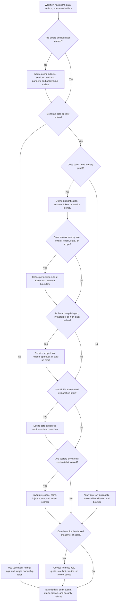

# Security Requirements

Security requirements describe what must be protected, who can do what, which
actions are risky, and how abuse should be detected or limited. Use this
decision tree before choosing authentication flows, authorization models, admin
tools, secrets handling, audit logs, or abuse controls.

Security is not a single feature called "auth." A design may need simple sign-in
for ordinary users, stricter permission checks for role changes, careful secret
rotation for integrations, audit records for exports, and rate limits for cheap
public actions. The goal is to connect each control to a concrete actor, action,
data class, trust boundary, or abuse path.

## Purpose

Use this page to:

- name human and non-human users that interact with the system;
- map roles, permissions, and ownership rules to sensitive actions;
- decide which workflows need authentication, authorization, approval, or audit
  records;
- identify secrets, external credentials, and trust boundaries early;
- describe abuse risks and practical version 1 controls;
- keep the security plan small enough to explain and test.

## When This Matters

Security requirements matter when:

- anonymous users, signed-in users, admins, support agents, workers, partners,
  or webhooks interact with the system;
- users belong to tenants, organizations, branches, teams, or roles;
- actions can approve, export, delete, impersonate, charge, notify, invite, or
  change permissions;
- the system stores credentials, tokens, API keys, personal data, private
  messages, financial data, or business-sensitive records;
- public endpoints can be scraped, spammed, brute-forced, replayed, or used to
  create cost;
- logs, caches, queues, analytics, exports, and backups can copy sensitive
  data.

Skip this tree only for a throwaway prototype with no real users, no sensitive
data, no shared deployment, and no external credentials. Even then, record what
must change before the prototype becomes public.

## Quick Decision

| If the workflow has... | Start with... | Watch for... |
| --- | --- | --- |
| Multiple user types | Actor and role inventory | "User" hides admins, workers, partners, and support agents |
| Tenant, owner, or role boundaries | Permission checks by action and resource | UI-only checks and cross-tenant leaks |
| Sensitive actions | Step-up proof, approval, audit record, or scoped command | Overbroad admin roles and missing denial behavior |
| Secrets or integration credentials | Secret inventory, scoped storage, injection, and rotation | Secrets in source control, logs, queues, or screenshots |
| Admin or support access | Narrow role, reason, masking, and audit trail | Privileged paths bypassing product rules |
| Cheap repeatable actions | Abuse case, fairness key, rate limit, quota, or review queue | Blocking legitimate bursts or missing attack signals |
| Unclear risk | Start with least privilege and safe defaults | Complex controls that nobody can test or explain |

Default to the smallest set of controls that protects the riskiest version 1
workflow. Add stronger controls when an action, data class, trust boundary, or
abuse path justifies them.

## Questions To Ask

- Who are the actors: anonymous visitors, members, tenant admins, support
  agents, operators, workers, services, partners, webhook senders, or devices?
- Which reads, writes, approvals, exports, deletions, role changes, and admin
  actions exist?
- Which roles or ownership rules decide whether each action is allowed?
- Which actions are sensitive because they expose data, change permissions,
  spend money, send notifications, delete data, or affect many users?
- Which secrets, tokens, API keys, signing keys, or service credentials exist?
- Where are trust boundaries between clients, APIs, workers, stores, vendors,
  and internal tools?
- What can a malicious, compromised, or careless client repeat cheaply?
- What should fail closed if authentication, authorization, audit logging,
  secret lookup, or abuse controls are unavailable?
- Which audit record, metric, or alert would reveal permission mistakes,
  suspicious denials, secret leaks, or abuse?

## Decision Tree



Use the tree to discover requirements before naming tools. Authentication,
authorization, audit logs, secret stores, and rate limits should appear because
the tree found a risky actor, action, data class, boundary, or abuse path.

## Requirements Discovered

| Requirement | Why It Matters | Design Impact |
| --- | --- | --- |
| Actor inventory | Different actors have different trust and power | Drives authentication, service identity, admin surfaces, and abuse controls |
| Role and permission rules | Access must match action, resource, owner, tenant, and state | Drives authorization checks, policy data, tests, and denial behavior |
| Sensitive action list | Risky commands need stronger proof and accountability | Drives step-up proof, approval, scoped commands, and audit logs |
| Secret inventory | Credentials grant access and create blast radius | Drives storage, injection, rotation, redaction, and leak response |
| Audit requirements | Risky actions need later explanation | Drives structured audit events, retention, access, and investigation paths |
| Abuse cases | Valid requests can still harm users, data, cost, or availability | Drives rate limits, quotas, validation, review queues, and alerts |
| Failure behavior | Security controls can be unavailable or stale | Drives fail-closed rules, degraded modes, support workflow, and monitoring |

## Options

| Option | Use When | Trade-Off |
| --- | --- | --- |
| Validation and safe operational logs | Action is low risk and does not cross a sensitive boundary | Simple, but not enough for protected data or privileged actions |
| Authentication | The system needs to know which human, service, or partner is calling | Adds session, token, recovery, and dependency behavior |
| Role and ownership authorization | Access depends on role, tenant, owner, branch, or resource state | Stronger protection but needs consistent checks and tests |
| Scoped admin/support workflow | Operators need to view or repair user data | Helps support but increases blast radius and audit needs |
| Approval or step-up proof | Action is irreversible, high value, or high blast radius | Adds friction, support cases, and bypass pressure |
| Secrets management | Services use API keys, signing keys, tokens, or credentials | Requires inventory, storage, rotation, redaction, and ownership |
| Structured audit logs | A later reviewer must answer who did what and why | Adds storage, privacy, retention, and access-control decisions |
| Rate limit, quota, or review queue | A client can repeat expensive or harmful actions cheaply | Protects users and cost but can block legitimate bursts |
| Manual review | Risk is rare, high judgment, or hard to automate safely | Slower response and operational workload |

## Decision Guidance

### Name Actors Before Controls

Do not start with "add auth." Start by naming who or what can call the system:

```text
anonymous visitor
signed-in applicant
organization reviewer
program admin
support agent
notification worker
payment integration
webhook sender
```

Each actor should map to allowed workflows, denied workflows, and the proof they
must present. Non-human actors need identities too. A scheduled worker, service,
partner client, or webhook sender can mutate state or leak data just like a
human account can.

### Map Permissions To Actions And Resources

Roles are useful only when they answer a concrete action question.

Use this format:

```text
Actor: <who is asking>
Action: <read, create, update, approve, export, delete, impersonate>
Resource: <which object or collection>
Condition: <owner, tenant, role, state, approval, risk, or time>
Decision: <allow, deny, require approval, or require step-up proof>
```

Example:

```text
Actor: organization_reviewer
Action: approve
Resource: grant_application
Condition: same organization, assigned review queue, application is submitted
Decision: allow and audit
```

Checks should run where the action is enforced: API handler, service command,
worker, export job, webhook receiver, and admin tool. Client-side visibility can
improve the user experience, but it is not authorization.

### Classify Sensitive Actions

Sensitive actions are not limited to deleting data. They include anything that
changes trust, money, visibility, identity, or blast radius.

Common sensitive actions:

- role, membership, tenant, ownership, and approval-limit changes;
- data exports, bulk reads, reports, and high-volume searches;
- deletion, restore, archive, refund, payout, approval, and cancellation;
- password, email, MFA, recovery, and session changes;
- impersonation, support views, break-glass access, and data repair;
- integration credential changes, webhook configuration, and secret rotation.

For each sensitive action, decide whether version 1 needs MFA,
reauthentication, approval, a support case reason, narrow scope, user
notification, audit logging, or manual review. Do not give every admin every
power because the first admin page is easier to build that way.

### Treat Secrets As Access Paths

A secret is a permission in string form. If it leaks, someone may call a
provider, read data, impersonate a service, sign requests, or create cost.

Create a secret inventory:

| Secret | Owner | Scope | Storage And Injection | Rotation Or Revoke |
| --- | --- | --- | --- | --- |
| Email provider key | Notifications team | Send production email | Deployment secret injected into worker | Disable old key after new worker succeeds |
| Webhook signing secret | Integrations team | Verify one inbound webhook | Secret store value read by receiver | Accept old and new signatures during short rotation window |
| Database credential | API service team | API database access | Deployment secret mounted at startup | Rotate database user and drain old connections |

Secrets should stay out of source control, docs, images, command lines, logs,
queues, metrics labels, traces, screenshots, support tickets, and analytics.
Environment variables can be an injection mechanism, but they do not answer
ownership, audit, rotation, or revocation by themselves.

### Use Audit Logs For Accountability

Audit logs should answer who did what, to which resource, under which context,
and with what result. They are most useful for privileged actions, permission
changes, exports, impersonation, approvals, deletions, and high-risk denials.

Audit events should include safe structured fields:

```text
actor_id
acting_as
action
resource_id
tenant_or_scope
result
reason_or_policy
change_summary
request_or_job_id
occurred_at
```

Avoid full payloads, passwords, tokens, private notes, personal data, and raw
documents in audit records. The audit trail should support investigation
without becoming a second sensitive data store.

### Model Abuse As Repeatable Workflows

Abuse starts with a question: what can a client repeat cheaply?

Examples:

| Abuse Path | Harm | First Controls |
| --- | --- | --- |
| Login or reset brute force | Account takeover or lockout noise | Per-account and per-source limits, step-up proof, safe errors |
| Scraping lists or exports | Data exposure and infrastructure load | Auth, tenant scope, page caps, export limits, anomaly alerts |
| Spam submissions | Polluted data and support workload | Validation, posting limits, moderation queue, duplicate detection |
| Expensive API calls | Cost and provider throttling | API keys, quotas, budgets, backpressure, retry guidance |
| Account takeover | Exports, deletions, privilege changes | MFA for high-risk actions, session revocation, audit alerts |

Rate limits are one control, not the whole security plan. Use identity,
authorization, data minimization, validation, quotas, idempotency, manual
review, and operator visibility where they match the harm.

### Choose A Practical Version 1

A practical version 1 security plan usually says:

- which actors are recognized;
- which actions are protected by server-side authorization;
- which sensitive actions need stronger proof, approval, or audit;
- which secrets exist and how they are stored and rotated;
- which public or expensive actions have limits or review;
- which failures fail closed;
- which stronger controls are deferred until a measurable risk appears.

Do not design a generic security platform when the ticket needs clear
requirements. Prefer a small set of explicit controls that a reviewer can trace
from actor to action to resource to evidence.

## Trade-Offs

| Choice | Improves | Costs Or Risks |
| --- | --- | --- |
| Coarse roles | Easy version 1 onboarding and review | Roles can overgrant as workflows grow |
| Fine-grained permissions | Better least privilege for complex workflows | More policy data, tests, debugging, and support work |
| Step-up proof or approvals | Safer high-risk actions | User friction, operator delay, and emergency exceptions |
| Strict fail-closed behavior | Reduces accidental access during control failure | Can block legitimate work during dependency incidents |
| Detailed audit logs | Better investigations and accountability | Storage, privacy, retention, and access-control burden |
| Aggressive rate limits | Protects cost and availability from abuse | False positives and recovery workflow for legitimate users |
| Scoped secrets | Smaller blast radius after a leak | More inventory, rotation, and ownership work |

## Failure Modes

| Failure Mode | Impact | Design Response | Observable Signal |
| --- | --- | --- | --- |
| Actor model omits workers or partners | Background or integration path bypasses user controls | Give every non-human caller service identity and allowed actions | Unowned credentials, unauthenticated worker calls, missing actor ID |
| Permission check exists only in UI | Caller can bypass page controls through API or worker path | Enforce authorization at command, query, worker, and export boundaries | Cross-tenant denial tests, authorization decision logs |
| Role is too broad | One compromised account or mistake affects many users | Split role, add scope, require approval, and audit high-risk actions | Privileged action volume, role-change events, unusual exports |
| Secret leaks through secondary path | Attacker calls provider, database, or service until revoked | Redact logs, scope keys, rotate credentials, and document revoke path | Secret-scan alerts, provider anomalies, rotation audit events |
| Audit log captures sensitive payloads | Investigation store becomes data exposure path | Log IDs and safe summaries, restrict audit access, set retention | Audit-field review, redaction failures, audit access logs |
| Abuse controls are missing | Cheap repeated requests create cost, spam, scraping, or takeover risk | Add validation, quotas, rate limits, review queues, or step-up proof | Rate-limit hits, denied attempts, export spikes, provider throttles |
| Security dependency is unavailable | System either overgrants or blocks critical workflows unexpectedly | Define fail-closed behavior and degraded support path for each control | Auth failures, policy-store errors, audit write failures |

## Common Mistakes

- Saying "add auth" without naming actors, actions, resources, and conditions.
- Treating authentication and authorization as the same decision.
- Checking permissions in the UI while the API or worker trusts the request.
- Giving admin tools broad bypass power without reason, scope, approval, or
  audit records.
- Storing secrets in source control, logs, queues, traces, screenshots, or
  support tickets.
- Logging full payloads or personal data in audit logs.
- Adding rate limits without naming the abuse path, fairness key, and user
  recovery behavior.
- Designing every future security control before protecting the riskiest
  version 1 workflow.

## Original Example

A community grant portal lets residents apply for small grants, reviewers score
applications, program admins approve awards, and a notification worker sends
status updates. A partner system later receives signed award webhooks.

Security requirements:

| Workflow | Security Need | Design Impact | Revisit When |
| --- | --- | --- | --- |
| Applicant account | Applicant must authenticate before editing or submitting applications | Use authentication, session expiry, and safe recovery flow | Account takeover or reset abuse increases |
| Reviewer scoring | Reviewer can read assigned applications but not all tenant data | Use role plus assignment and organization scope checks | Review queues span multiple organizations |
| Award approval | Admin approval changes money movement and public status | Require scoped admin role, reason, audit event, and optional step-up proof | Award values or fraud risk increase |
| Bulk export | Export exposes applicant contact and award details | Restrict to approved roles, require reason, cap size, and audit access | Export volume or customer requirements grow |
| Notification worker | Worker can send messages but not change awards | Use service identity and scoped credential | Worker begins calling more APIs |
| Partner webhook | Signing secret proves outbound award event authenticity | Store signing secret outside code and support rotation | Partner count or webhook retries grow |
| Public application form | Repeated submissions can create spam and support load | Validate input, limit submissions by account and source, and queue suspicious cases | Spam or fake accounts exceed manual review capacity |

Walking this example through the tree: the system has multiple actors, sensitive
applicant data, role-specific reads, privileged award approvals, secrets for
notifications and webhooks, and cheap public submissions. Version 1 can use
explicit roles, assignment checks, scoped admin actions, structured audit logs,
deployment-managed secrets, and conservative submission limits. It does not
need a custom policy language or full fraud platform until permissions and
abuse cases outgrow readable rules and manual review.

## Checklist

Before leaving security discovery, confirm:

- Users and non-human actors are named separately.
- Roles and permissions are mapped to actions, resources, owners, tenants, and
  resource states.
- Sensitive actions are listed with required proof, approval, audit, or manual
  review.
- Server-side authorization exists for API, worker, export, webhook, and admin
  paths where relevant.
- Secrets are inventoried with owner, scope, storage, injection, rotation, and
  redaction rules.
- Audit logs record risky actions with safe structured fields and clear
  retention/access rules.
- Abuse risks name repeatable actions, harm, fairness keys, controls, user
  recovery behavior, and operator signals.
- Security control failures state whether the system fails closed, degrades, or
  requires support intervention.
- Version 1 uses the simplest control set that protects the riskiest workflow.

## Related Pages

- [Requirements map](./)
- [Security design overview](../security/)
- [Authentication](../security/authentication.md)
- [Authorization](../security/authorization.md)
- [Access-control models](../security/access-control-models.md)
- [Admin tools](../security/admin-tools.md)
- [Secrets management](../security/secrets-management.md)
- [Audit logs](../security/audit-logs.md)
- [Rate limiting and abuse resistance](../security/rate-limiting-and-abuse.md)
- [Third-party integrations](../security/third-party-integrations.md)
- [Throughput requirements](throughput.md)
- [Consistency requirements](consistency.md)
