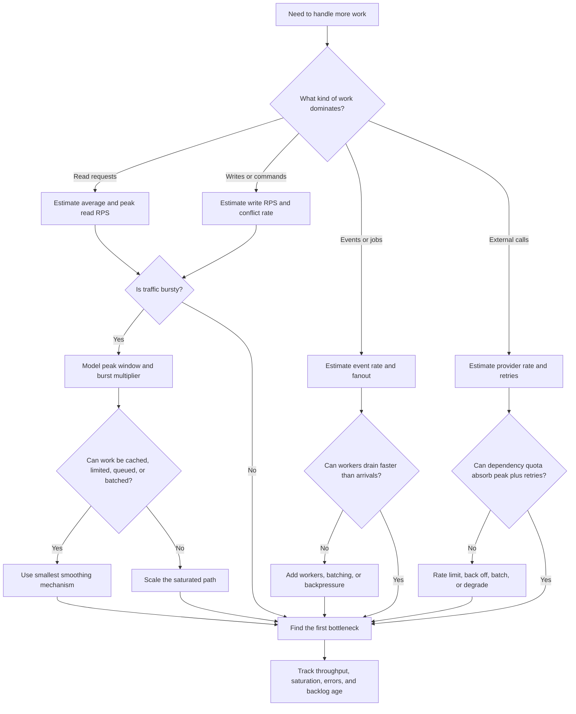

# Throughput Requirements

Throughput requirements describe how much work the system must handle in a
specific time window. Use this decision tree to reason about request rate, event
rate, peak traffic, burstiness, batching, scaling pressure, and bottlenecks
before adding capacity.

Throughput is not one number. Reads, writes, events, background jobs, fanout,
and retries can each create different pressure.

## Purpose

Use this page to:

- separate average RPS from peak RPS;
- estimate event rate and background processing volume;
- identify bursty traffic and retry amplification;
- decide when batching, queues, rate limits, workers, replicas, or partitioning
  are justified;
- name the bottleneck that should be measured before scaling.

## When This Matters

Throughput matters when:

- traffic arrives in launch windows, signup periods, daily rushes, or batch
  imports;
- one user action creates many downstream events or notifications;
- background workers cannot drain work as quickly as it arrives;
- retries multiply traffic during dependency failure;
- read and write paths have different scale needs;
- a team is about to scale every component without knowing which path saturates
  first.

## Quick Decision

| If the pressure is... | Start with... | Watch for... |
| --- | --- | --- |
| User request volume | Separate read RPS, write RPS, and peak RPS | One blended RPS number hides bottlenecks |
| Event or job volume | Estimate event rate, fanout, and worker drain rate | Backlog age can matter more than enqueue rate |
| Predictable bursts | Define peak window and burst multiplier | Average traffic can look harmless |
| Expensive repeated work | Batch when delay is acceptable | Batching improves efficiency but increases latency |
| Saturated path | Identify the first bottleneck | Scaling the wrong component can worsen the limit |
| Unknown scale | Start simple and measure | Premature scaling adds cost and failure modes |

## Questions To Ask

- Which workflow creates the most requests, events, jobs, or fanout?
- What is the average rate and what is the peak rate?
- What time window matters: second, minute, hour, day, launch, or deadline?
- Are reads, writes, background jobs, or downstream calls the dominant pressure?
- How bursty is the workload compared with the daily average?
- Can work be batched, delayed, rejected, throttled, or queued?
- What resource saturates first: CPU, memory, database, network, queue, lock,
  partition, tenant, hot key, or external quota?
- Which metric proves the system is keeping up?

## Decision Tree



Use the tree to decide which rate matters, which peak window matters, and which
component should be measured before adding capacity.

## Requirements Discovered

| Requirement | Why It Matters | Design Impact |
| --- | --- | --- |
| Average RPS | Shows steady-state load | Helps size the simple version and spot overbuilding |
| Peak RPS | Shows the load that breaks the path | May justify caching, rate limits, or extra capacity |
| Event rate | Shows how much async work is created | Drives worker count, queue depth, and consumer lag targets |
| Burstiness | Shows how concentrated traffic is | May justify buffering, batching, backpressure, or admission control |
| Fanout | Shows how one action multiplies downstream work | May justify batching, deduplication, or async delivery |
| Bottleneck | Names the first saturated resource | Prevents scaling the wrong component |

## Options

| Option | Use When | Trade-Off |
| --- | --- | --- |
| Keep one direct path and measure | Peak load is small and bottleneck is unknown | Simple, but may need quick revisit when traffic is measured |
| Add indexes or payload limits | Reads grow but data access pattern is clear | Improves throughput without new infrastructure, but only for known paths |
| Add cache or CDN | Many reads repeat the same cacheable result | Reduces origin load but adds freshness and invalidation work |
| Batch work | Work can wait briefly and benefits from grouping | Improves throughput but increases individual completion latency |
| Queue work | Bursts can be delayed and drained later | Smooths load but adds backlog, retry, and visibility requirements |
| Add workers or instances | Stateless work saturates CPU or concurrency | Helps only if a shared database, lock, or provider is not the real limit |
| Partition or shard | One store, key, tenant, or stream cannot keep up | Adds routing, rebalancing, hot-key, and operational complexity |
| Rate limit or shed load | Abuse, retries, or peaks exceed safe capacity | Protects the system but rejects or delays some clients |

## Decision Guidance

### Separate Average From Peak

Average rate is useful for cost and steady-state sizing. Peak rate is what
usually changes the design.

Write both:

```text
Average availability reads are about 50 RPS.
The Saturday signup peak is expected to be 12x average for 15 minutes, or about
600 RPS.
```

If a design can handle the average but not the peak, decide whether to add
capacity, smooth the peak, reject excess work, or simplify the product promise.

### Split Work By Path

Do not hide all load behind one RPS number.

Use a path table:

| Path | Rate To Estimate | Design Question |
| --- | --- | --- |
| Read request | average and peak RPS | Do indexes, cache, CDN, or replicas matter? |
| Write request | writes per second and conflict rate | Do transactions, locks, idempotency, or partitioning matter? |
| Event fanout | events per second times consumers | Do queues, streams, batching, or backpressure matter? |
| Worker job | enqueue rate and drain rate | Can workers keep up and recover after bursts? |
| External call | provider requests plus retries | Do quotas, backoff, or degraded behavior matter? |

### Use Batching When Delay Is Acceptable

Batching improves throughput when work has fixed overhead per request, event, or
external call. It is a poor fit when each user needs an immediate answer.

Good batching requirement:

```text
The analytics export can wait up to 5 minutes, so events may be batched in
groups of up to 1,000 or 30 seconds, whichever comes first.
```

Weak batching requirement:

```text
Batch writes because batching is faster.
```

Name both the batch size and maximum delay so the trade-off is visible.

### Scale The Bottleneck, Not The Diagram

Adding API instances does not help if the database lock, queue consumer,
provider quota, or hot key is saturated. Throughput requirements should include
the signal that proves the bottleneck.

Use this format:

```text
Symptom: queue age rises above 2 minutes during signup peaks.
Bottleneck: reminder workers process 200 jobs/minute while arrivals reach
700 jobs/minute.
Design choice: add workers and cap retries; revisit batching if provider quota
becomes the next limit.
```

## Trade-Offs

| Choice | Improves | Costs Or Risks |
| --- | --- | --- |
| Higher provisioned capacity | More headroom for peaks | Higher cost and possible hidden downstream limits |
| Batching | Better throughput per worker or provider call | Higher per-item latency and partial-failure handling |
| Queueing | Burst absorption and isolation | Backlog, retry storms, delayed completion, and monitoring needs |
| Rate limiting | Protects shared resources | User-visible rejection or delayed work |
| Partitioning | Higher ceiling for one saturated store or stream | Routing, rebalancing, hot keys, and operational complexity |

## Failure Modes

| Failure Mode | Impact | Design Response | Observable Signal |
| --- | --- | --- | --- |
| Peak traffic exceeds average-based capacity | User requests slow down or fail during bursts | Define peak window, add headroom, cache, queue, or shed load | Peak RPS, error rate, p95 latency, saturation |
| Event fanout overwhelms workers | Jobs complete late even though requests return quickly | Add workers, batch, throttle producers, or reduce fanout | Queue age, drain rate, consumer lag |
| Retries amplify traffic after dependency failure | System overloads while trying to recover | Use backoff, jitter, retry budgets, and circuit breakers | Retry rate, provider errors, request amplification |
| One key or tenant is hot | Most users are fine but one partition is overloaded | Isolate hot key, add per-tenant limits, or rebalance | Per-key throughput, partition CPU, tenant error rate |
| Database lock or write contention rises | Writes stop scaling even with more API instances | Narrow transaction, reduce conflict, or serialize the contested write | Lock wait time, conflict rate, write latency |

## Common Mistakes

- Using one total RPS number for reads, writes, events, jobs, and external calls.
- Designing for average traffic while ignoring peak traffic.
- Adding more instances without checking the shared bottleneck.
- Queueing work without naming drain rate, backlog age, and retry behavior.
- Batching work that users expect to complete immediately.
- Ignoring retry and abuse traffic when estimating peak load.
- Treating sharding as the first scaling move instead of a later response to a
  measured store or key bottleneck.

## Original Example

A neighborhood tool library opens reservations every Saturday morning.

Throughput assumptions:

| Workload | Estimate | Design Impact | Revisit When |
| --- | --- | --- | --- |
| Availability reads | 30 average RPS, 500 peak RPS for 20 minutes | Cache published availability summaries for browse pages | Cache misses or stale reads cause reservation failures |
| Reservation writes | 20 peak writes per second | Keep transactional write path and measure lock contention | Write p95 or lock waits exceed target during signup |
| Reminder events | One reminder per reservation, up to 6,000 in an hour | Queue reminders and drain within 15 minutes | Queue age exceeds 15 minutes or provider quota is hit |
| Staff exports | One daily CSV export | Run as a scheduled background job | Export slows reservation reads or misses staff deadline |

The first bottleneck is likely the reservation write transaction, not raw API
CPU. Version 1 can use one database with a uniqueness rule, indexed availability
reads, a small cache for browse pages, and queued reminders. It should not shard
the reservation table unless measured write contention or hot tools make the
single database the limiting resource.

## Checklist

Before leaving throughput discovery, confirm:

- Read RPS, write RPS, event rate, and worker job rate are separated.
- Average rate and peak rate are both stated.
- The burst window and burst multiplier are named.
- Fanout and retry amplification are included where relevant.
- Batching includes maximum batch size and maximum delay.
- Queueing includes enqueue rate, drain rate, backlog age, and retry behavior.
- The first suspected bottleneck has a metric that proves it.
- Scaling choices have revisit signals and version 1 stays as simple as the
  measured load allows.

## Related Pages

- [Requirements map](./)
- [Latency requirements](latency.md)
- [Scale estimation](../method/scale-estimation.md)
- [Capacity estimation](../scalability/capacity-estimation.md)
- [Bottleneck analysis](../scalability/bottleneck-analysis.md)
- [Performance testing playbook](../scalability/performance-testing-playbook.md)
- [Rate limiting](../scalability/rate-limiting.md)
- [Sync vs async](../communication/sync-vs-async.md)
- [Metrics](../operations/metrics.md)
- [Component metrics catalog](../operations/component-metrics-catalog.md)
