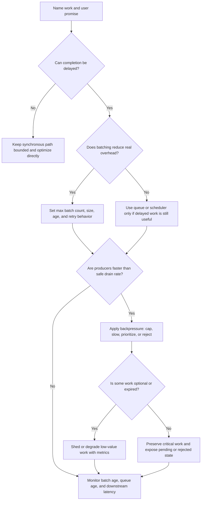

# Batching and Backpressure

Batching groups small units of work so a system can process them with fewer
round trips, commits, locks, provider calls, or network writes. Backpressure
controls what happens when producers create work faster than consumers or
dependencies can safely drain it.

They solve different parts of the same scalability problem. Batching improves
throughput by adding delay and larger work units. Backpressure protects the
system by slowing, rejecting, prioritizing, or shedding work before queues,
databases, providers, or workers fall over.

## Purpose

Use this guide to decide:

- when batching is a good way to improve throughput;
- how batch size, batch age, and partial failure affect latency and recovery;
- which queue-pressure signals prove producers and consumers are mismatched;
- how to match input rate to downstream capacity;
- when to shed optional load instead of accepting stale work;
- how to explain the latency trade-off to users and operators.

The goal is not to make every workflow asynchronous. The goal is to make delay,
freshness, overload behavior, and recovery explicit before the system depends
on batching or a queue.

## When This Matters

Batching and backpressure matter when:

- many small requests, events, writes, or provider calls spend more time on
  overhead than useful work;
- producers can create bursts that workers, databases, caches, or providers
  cannot drain immediately;
- queue depth or oldest job age grows during peaks;
- a dependency has a fixed rate limit, connection pool, write ceiling, or
  concurrency limit;
- optional work such as analytics, enrichment, notifications, recommendations,
  or reports competes with user-visible work;
- retries, fanout, or scheduled jobs create a second wave of load after the
  original traffic spike.

It matters less when the workflow needs a fresh final answer now, the work
volume is small, or a simple query, payload, timeout, or index fix removes the
measured bottleneck.

## Questions To Ask

- What exact work is being batched or slowed?
- Is the user waiting for completion, or can the work finish later?
- What is the maximum acceptable batch age?
- What is the maximum acceptable queue age before the product promise is
  violated?
- Which overhead is batching reducing: network round trips, commits, locks,
  serialization, provider calls, or writes?
- What downstream system sets the safe drain rate?
- What happens when the queue cannot drain fast enough?
- Which work is critical, which can wait, and which can be dropped or
  recomputed?
- How are partial batch failures retried without duplicating side effects?
- Which metric proves the system is rate matched?

## Decision Guidance

### Batch Only When Delay Is Acceptable

Batching trades latency for throughput. It is a good fit when a short delay is
honest and the result can be retried or repaired.

Good fits:

- append analytics events in groups;
- flush view-count or reaction-counter increments;
- call a provider with grouped status updates;
- write audit-like records through a durable outbox when the compliance promise
  allows delayed flush;
- process import rows, thumbnails, reports, or search updates in chunks.

Poor fits:

- deciding whether payment, booking, quota, inventory, or permission changes
  succeeded;
- a read path that must return current state;
- work with no idempotency, dedupe, or partial-failure handling;
- user-visible actions where hidden delay would look like a lie.

Use a batch contract:

```text
Work: append moderation analytics events
Batch trigger: 500 events or 2 seconds, whichever comes first
Durability: events are stored in a local durable outbox before batching
Retry rule: retry failed batch with event IDs; downstream upserts by event ID
User promise: dashboard freshness may lag by 60 seconds
```

If there is no acceptable maximum age, batching is probably the wrong first
move.

### Tune Batch Size And Batch Age Together

Batch size controls efficiency. Batch age controls latency.

Common triggers:

- maximum item count;
- maximum byte size;
- maximum age since first item entered the batch;
- maximum number of keys, tenants, or partitions in one batch;
- flush-on-shutdown or flush-before-cutover behavior.

Large batches reduce overhead but make each attempt heavier. Small batches drain
quickly but may leave throughput on the table. A maximum age is what keeps low
traffic from waiting forever for a full batch.

Example:

```text
Flush up to 1,000 analytics events, 1 MB, or 3 seconds of waiting.
If a provider throttles, reduce active flush concurrency before increasing
batch age beyond the dashboard freshness promise.
```

Track p95 batch age, batch size distribution, failure rate, retry count, and
downstream latency. Average batch size alone is not enough.

### Read Queue Pressure As A Rate Mismatch

A queue is not unhealthy just because it has work. It is unhealthy when work
waits longer than the product promise, or when accepting more work makes
recovery harder.

Useful signals:

- enqueue rate versus dequeue rate;
- queue depth by job type, tenant, key, and priority;
- oldest job age and p95 job age;
- worker concurrency, utilization, and error rate;
- downstream database, provider, cache, or network saturation;
- retry rate and retry age;
- dead-letter count and oldest dead-letter age.

Depth says how much work exists. Age says whether the work is becoming stale.
Rate mismatch says whether the queue will recover.

```text
If enqueue rate is 2,000 jobs/minute and safe dequeue rate is 1,200 jobs/minute,
the queue is accumulating 800 jobs/minute. Adding workers is useful only if the
downstream system can safely accept more than 1,200 jobs/minute.
```

Do not scale workers until the downstream limit is named. More workers can turn
a queue backlog into a database, provider, lock, or hot-key incident.

### Match Rates Before The Queue Becomes Stale

Rate matching makes producer input, queue buffering, worker concurrency, and
downstream capacity agree.

Controls include:

- producer-side rate limits;
- per-tenant, per-key, or per-job-type queue caps;
- worker concurrency caps;
- token-bucket or leaky-bucket shaping for provider calls;
- priority lanes for urgent work;
- scheduled draining for low-priority work;
- bulkheads that reserve capacity for critical workflows.

Caller-visible overload behavior should be explicit. APIs may return `429`
with a retry hint when the caller should slow down, `503` when the service is
temporarily unable to accept work, an accepted-but-delayed status when work is
durable but pending, or a degraded response when optional data is omitted.

The right control depends on who can slow down safely:

| Pressure | Better Control | Reason |
| --- | --- | --- |
| External provider allows 300 calls/minute | Worker concurrency and leaky-bucket drain | Producers may burst, but provider calls must be shaped |
| One tenant floods imports | Per-tenant queue cap or rate limit | Protects other tenants from stale work |
| User-facing writes are delayed by reports | Separate worker pool or priority lane | Critical work should not wait behind batch jobs |
| Queue age exceeds freshness target | Reject, degrade, or shed optional work | Accepting more stale work hides the failure |

Rate matching should be visible in metrics and in the user or operator behavior
when limits activate.

### Shed Load When Work Loses Value

Load shedding is intentionally not doing some work to protect more important
work. It is not the same as data loss when the shed work is optional,
recomputable, expired, or lower priority by design.

Good shedding candidates:

- analytics enrichment that can be sampled or recomputed;
- recommendations, related content, or personalization during overload;
- duplicate refreshes for a cached public page;
- stale imports or exports past their useful deadline;
- low-priority notifications after a higher-priority notification has already
  told the user what they need.

Poor shedding candidates:

- source-of-truth writes after the system has acknowledged success;
- audit records required by the product or compliance promise;
- permission revokes, payment decisions, inventory reservations, or safety
  actions;
- dead-letter review obligations.

Define the rule before overload:

```text
When reminder queue age exceeds 10 minutes, pause low-priority promotional
messages, keep transactional confirmations, and show operators a shedding
counter by tenant and job type.
```

If a team cannot explain which work may be shed, the system should reject new
optional work earlier instead of silently dropping it later.

### Explain The Latency Trade-Off

Batching and backpressure can make the system more stable while making some
actions slower. That trade-off must be part of the design, not an operational
surprise.

Latency effects:

- batching adds wait time before work starts;
- queueing adds wait time when producers exceed safe drain rate;
- backpressure adds caller delay or rejection before work enters the system;
- load shedding may remove optional results or make them stale;
- worker caps protect dependencies but can extend backlog during peaks.

State the promise:

```text
The API returns order accepted after the source write commits. Search indexing
and analytics may lag by up to 2 minutes. If the indexing queue exceeds
2 minutes, optional recommendation refreshes are shed before confirmation jobs
are delayed.
```

This lets readers see which work is complete, pending, stale, rejected, or
intentionally skipped.

## Batching And Backpressure Flow



Use the flow with a measured bottleneck. If the work or downstream limit is not
named, start with [bottleneck analysis](bottleneck-analysis.md).

## Original Example

A neighborhood clinic sends appointment reminders, updates a public wait-time
dashboard, and uploads daily analytics. A new school-year campaign creates a
burst of appointment bookings every morning.

Observed pressure:

| Signal | Observation | Meaning |
| --- | --- | --- |
| Reminder enqueue rate | 1,800 jobs/minute for 20 minutes | Producers burst above normal traffic |
| Provider safe rate | 600 sends/minute | Downstream limit sets drain rate |
| Oldest reminder age | Reaches 14 minutes | User freshness promise is at risk |
| Dashboard event writes | Small writes dominate commit overhead | Batching can reduce write cost |
| Promotional notifications | Share worker pool with confirmations | Optional work competes with critical work |

Version 1 response:

- appointment booking stays synchronous for the source-of-truth reservation;
- reminder jobs are queued with a provider drain limit of 600 sends/minute and
  per-clinic queue age metrics;
- confirmation reminders have priority over promotional notifications;
- dashboard events batch up to 1,000 events, 1 MB, or 3 seconds;
- promotional notifications pause when confirmation queue age exceeds
  5 minutes;
- if reminder age exceeds 10 minutes, operators see a degraded-mode alert and
  the campaign page stops accepting optional reminder signups until recovery.

Rejected for now:

- adding unlimited workers, because the provider is the measured limit;
- batching appointment reservations, because users need the final booking
  decision immediately;
- silently dropping reminder jobs, because accepted reminders are part of the
  user promise.

The design improves throughput for dashboard writes, matches notification rate
to provider capacity, sheds lower-value work first, and makes the latency cost
visible.

## Trade-Offs

| Choice | Benefit | Cost Or Risk |
| --- | --- | --- |
| Larger batches | Better throughput and fewer commits or calls | Higher latency and larger retry units |
| Smaller batches | Lower wait time and easier retries | More overhead and lower throughput |
| Maximum batch age | Prevents low-volume work from waiting forever | More partial batches during quiet periods |
| Queue buffering | Absorbs bursts | Work can become stale or invisible without age metrics |
| Producer backpressure | Protects downstream capacity early | Callers see delay or rejection |
| Worker concurrency cap | Prevents provider or database overload | Queue age may rise during peaks |
| Priority lanes | Protects critical work | Lower-priority work may starve |
| Load shedding | Preserves core workflows | Requires clear rules for what can be skipped |

## Failure Modes

| Failure Mode | Impact | Design Response | Signal |
| --- | --- | --- | --- |
| Batch waits too long to fill | Users or dashboards see stale results | Set maximum batch age and freshness alerts | p95 batch age, stale reports |
| Batch retry duplicates side effects | Users receive duplicate messages or counts inflate | Use idempotency keys and per-item result tracking | Idempotency hit rate, duplicate side effects |
| Queue depth grows but age is ignored | Work violates promise before operators notice | Alert on oldest age and enqueue/dequeue mismatch | Oldest job age, drain deficit |
| More workers overload dependency | Backlog turns into provider or database failure | Cap concurrency and shape output rate | Provider 429s, DB pool waits |
| Backpressure only rejects critical work | Important workflows fail while optional work continues | Define priority and shedding order | Rejection count by class |
| Shed work is not observable | Operators cannot explain missing or stale results | Count shed work by reason, tenant, and job type | Shedding metrics, audit gaps |

## Common Mistakes

- Batching work that must produce a final answer immediately.
- Setting batch size without a maximum age.
- Counting queue depth but not oldest job age or drain deficit.
- Scaling workers before naming the downstream capacity limit.
- Treating backpressure as an emergency-only behavior instead of a normal
  overload contract.
- Shedding work that was already acknowledged as durable or required.
- Using one queue for critical confirmations, reports, analytics, and optional
  promotions without priority or fairness.
- Retrying a whole batch without per-item idempotency or partial-result
  tracking.
- Hiding caller rejection or delayed work from product status and metrics.

## Checklist

Before shipping batching or backpressure, confirm:

- [ ] The batched or throttled workflow is named.
- [ ] The user promise distinguishes complete, accepted, pending, delayed,
      rejected, and shed work.
- [ ] The batch has maximum item count, byte size, and age where relevant.
- [ ] Partial failure and retry behavior are idempotent.
- [ ] Queue pressure is measured by depth, oldest age, enqueue/dequeue rate,
      retry rate, and dead letters.
- [ ] The downstream capacity limit is named before worker count increases.
- [ ] Producer limits, worker caps, priority lanes, or bulkheads match the
      workflow's criticality.
- [ ] Load shedding rules name what can be skipped, sampled, paused, or
      recomputed.
- [ ] Batches preserve tenant, user, permission, and privacy boundaries, and
      failure logs avoid sensitive per-item payloads.
- [ ] Latency trade-offs are documented as freshness or completion promises.
- [ ] Metrics and alerts prove rate matching, backlog recovery, and shedding
      behavior.

## Related Pages

- [Scalability overview](./)
- [Bottleneck analysis](bottleneck-analysis.md)
- [Capacity estimation](capacity-estimation.md)
- [Database write scaling](database-write-scaling.md)
- [Rate limiting](rate-limiting.md)
- [Queue component](../components/queue.md)
- [Queues](../communication/queues.md)
- [Retries and backoff](../communication/retries-and-backoff.md)
- [Bulkheads](../reliability/bulkheads.md)
