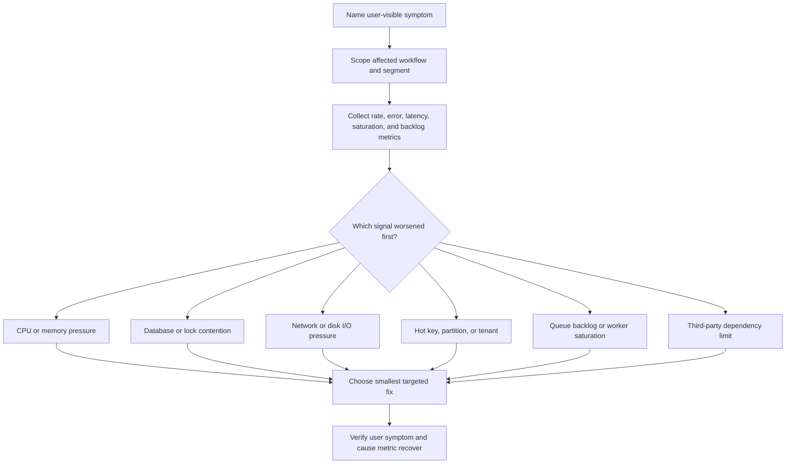

# Bottleneck Analysis

Bottleneck analysis is the practice of finding the resource or dependency that
limits a workflow first. It keeps scalability work grounded in evidence instead
of adding caches, queues, replicas, shards, or more servers before the design
knows what is actually slow, overloaded, or stuck.

A bottleneck is not always the busiest component. It is the constraint that
prevents the workflow from meeting its latency, throughput, freshness,
reliability, or cost expectation.

## Purpose

Use this guide to identify the actual system bottleneck and choose the simplest
scaling move that addresses it.

The output should answer:

- What user-visible symptom is happening?
- Which workflow, route, job, tenant, region, or dependency is affected?
- Which resource saturates first: CPU, memory, database, network, disk I/O,
  locks, hot keys, queue backlog, or a third-party dependency?
- Which metric proves the bottleneck and which metric would prove recovery?
- Which fix removes the bottleneck without moving the problem somewhere worse?

The goal is not to create a perfect performance model. The goal is to stop
guessing.

## When This Matters

Run bottleneck analysis when:

- latency rises as traffic grows;
- throughput stops increasing after adding more workers or instances;
- a queue grows even though workers are running;
- a database, cache, search index, or external provider becomes the suspected
  limit;
- a few tenants, routes, partitions, keys, or jobs are much hotter than the
  rest;
- retries, locks, fanout, or background work make the failure hard to see from
  the user request alone;
- a team is about to add scaling machinery without naming the measured
  constraint.

It matters less when the system is still far below capacity and a simple query,
index, timeout, or payload change clearly fixes the known issue.

## Questions To Ask

Start with the symptom:

- What changed for users: slower response, more errors, stale reads, delayed
  jobs, rejected requests, or higher cost?
- Is the symptom tied to one route, workflow, tenant, key, time window,
  dependency, or deploy?
- Does the bottleneck appear on reads, writes, background work, fanout, or
  recovery work?
- What metric got worse first?
- What resource is saturated while the symptom is happening?
- What work is queued, blocked, retrying, or waiting?
- What limit is external to the system, such as provider quota, network
  bandwidth, or managed-service capacity?
- What would improve if the suspected bottleneck were removed?

Then test the hypothesis:

- If more instances are added, does throughput rise?
- If worker count increases, does queue age fall or does another resource
  saturate?
- If a query is indexed, do rows scanned and latency fall?
- If a hot key is isolated, does the rest of the workload recover?
- If the third-party provider is disabled or mocked, does the workflow recover?

## Bottleneck Analysis Flow



If two signals worsen together, look for a shared cause. For example, database
connection saturation can cause API latency, worker retries, and queue backlog.
Adding API instances may make that shared bottleneck worse.

## Decision Guidance

### Start With A Symptom, Not A Component

The first question is not "is the database slow?" It is "which user-visible
workflow is no longer meeting expectations?"

Use a short statement:

```text
Workflow: residents search available tools by branch and pickup day
Symptom: p95 search latency rose from 250 ms to 2.8 s during Saturday peaks
Affected segment: two branches with popular power tools
First bad signal: database rows scanned and cache miss rate rose together
Recovery metric: p95 search latency and rows scanned return to expected range
```

This keeps the analysis tied to a workflow and avoids optimizing a component
that is busy but not limiting the user outcome.

### CPU

CPU becomes the bottleneck when the system spends too much time computing,
serializing, encrypting, compressing, rendering, parsing, or repeatedly doing
work that could be reduced.

Signals:

- high CPU utilization during the symptom;
- request latency rises while I/O wait is low;
- worker throughput stops increasing even though queues have work;
- expensive serialization, compression, template rendering, or data processing
  appears in profiles;
- one process, route, tenant, or job type consumes most CPU time.

First moves:

- profile the hot path before rewriting it;
- reduce repeated work, payload size, or unnecessary transformations;
- batch small operations when latency allows;
- move expensive non-critical work off the synchronous path;
- add instances only if the workload is stateless and not blocked elsewhere.

Adding machines helps CPU-bound stateless work. It does not help when CPU is
burned by retries, bad queries, lock spinning, or repeated cache misses caused
by another bottleneck.

### Memory

Memory bottlenecks appear as high heap use, garbage collection pressure, paging,
cache eviction churn, or process restarts. They often look like latency spikes
before they become obvious crashes.

Signals:

- memory growth over time or per request;
- frequent garbage collection pauses;
- swap activity or page faults;
- cache eviction rate rises while hit rate falls;
- worker restarts, out-of-memory kills, or container memory limits hit;
- large in-memory exports, joins, buffers, or fanout lists.

First moves:

- stream large responses or exports instead of loading everything into memory;
- page through data instead of materializing full result sets;
- cap caches and queues in memory;
- remove unbounded per-tenant, per-user, or per-request buffers;
- inspect leaks only after confirming growth is not expected workload size.

Memory fixes often reduce latency and cost at the same time. Horizontal scaling
can hide memory pressure briefly, but it does not fix an unbounded buffer.

### Database

Database bottlenecks can come from read load, write load, missing indexes,
connection saturation, lock waits, slow queries, replication lag, or too much
analytical work on the operational store.

Signals:

- query latency rises for one query family;
- rows scanned grows faster than rows returned;
- database CPU, memory, disk I/O, or connections saturate;
- lock wait time or transaction duration rises;
- write conflicts, deadlocks, or constraint retries increase;
- replication lag or backup/restore time exceeds the workflow expectation.

First moves:

- identify the query or transaction family, not only the database host;
- add or adjust an index for a known access path;
- fetch fewer rows or columns and use stable pagination;
- shorten transactions and move side effects out of locks;
- separate analytical scans from operational reads;
- add cache or read replicas only when freshness rules allow it;
- partition only after one database can no longer meet measured requirements.

A database bottleneck is not automatically a sharding problem. Many version 1
systems need a better query, index, transaction boundary, or background job
before they need a new storage architecture.

### Network

Network bottlenecks happen when bandwidth, connection setup, payload size,
cross-region distance, or dependency chatter dominates the workflow.

Signals:

- response size or event payload size grows with latency;
- network throughput approaches a known limit;
- timeouts happen between specific services, regions, or providers;
- many small service calls happen per user request;
- retries increase traffic during dependency failure;
- uploads, downloads, exports, or fanout consume most bandwidth.

First moves:

- reduce payload size and remove unused fields;
- paginate, stream, compress, or move large files to object storage;
- collapse repeated service calls or batch when safe;
- place latency-sensitive services closer together;
- apply retry limits and backoff during dependency failure;
- use CDN or object storage when content delivery is the real pressure.

Do not call the whole system slow when only one cross-region dependency or
large export path is network-bound.

### Disk I/O

Disk I/O bottlenecks appear when reads, writes, fsyncs, logs, indexes, backups,
or temporary files exceed storage throughput or latency limits.

Signals:

- high I/O wait;
- disk latency rises before request latency;
- database checkpoints, compaction, index builds, or backups line up with
  incidents;
- log volume spikes and competes with application writes;
- temporary files grow during sorts, joins, imports, or exports;
- storage capacity or inode usage approaches limits.

First moves:

- reduce unnecessary writes, logs, or temporary files;
- schedule heavy backup, compaction, migration, or export work away from peaks;
- move large immutable files out of the database;
- use better indexes or query shapes to avoid large scans and sorts;
- separate hot operational storage from archive or analytical storage;
- increase storage throughput only after the workload shape is understood.

Disk bottlenecks often show up as database or search latency. Check storage
signals before adding application instances.

### Locks And Contention

Locks bottleneck a system when work waits for shared state instead of using
available CPU or I/O. Contention can happen in databases, application-level
mutexes, distributed locks, job schedulers, or scarce inventory records.

Signals:

- lock wait time rises;
- transaction duration increases under write load;
- deadlocks, conflicts, or retry attempts increase;
- throughput stops rising even though CPU and database I/O are not saturated;
- one resource, row, account, tenant, or partition receives many writes;
- p95 or p99 latency spikes while average latency looks acceptable.

First moves:

- shorten the critical section;
- move side effects outside the transaction or lock;
- use optimistic concurrency when conflicts are rare and retryable;
- split independent state so unrelated work does not share the same lock;
- batch or serialize intentionally when correctness requires it;
- make conflict outcomes visible to users and metrics.

Lock contention is a correctness and scalability issue. Removing the lock
without preserving the invariant may make the system faster and wrong.

### Hot Keys And Hot Partitions

A hot key is a value that receives a disproportionate share of reads, writes, or
events. A hot partition is the storage, cache, queue, or worker shard that owns
too much of that work.

Signals:

- one tenant, object, branch, product, topic, partition, or cache key dominates
  traffic;
- one database partition, queue shard, cache node, or worker pool is overloaded
  while others are idle;
- global counters, leaderboards, scarce inventory, popular resources, or
  scheduled fanout create localized pressure;
- cache hit rate is high overall but one key causes eviction churn or write
  contention.

First moves:

- identify the hot key before changing the whole architecture;
- add per-key or per-tenant metrics where safe;
- shard or bucket the hot key only when the workflow can merge results safely;
- cache read-heavy hot objects with clear invalidation or freshness rules;
- isolate noisy tenants or high-volume jobs;
- rate limit, queue, or degrade hot paths before they starve unrelated work.

Hot-key mitigation should protect the rest of the system without hiding the
fact that one key still needs a product or data-model decision.

### Queue Backlog

Queue backlog means work is arriving faster than it is completed, or some work
is stuck. Depth shows how many items wait; age shows how long users may wait.

Signals:

- queue depth rises and does not drain;
- oldest item age exceeds freshness expectations;
- enqueue rate is higher than dequeue rate;
- retries, poison messages, or dead letters increase;
- workers are saturated, crashed, blocked on a dependency, or starved of
  database connections;
- user-facing state remains `pending`, `processing`, or `needs_review` too
  long.

First moves:

- compare enqueue rate, dequeue rate, oldest age, and worker saturation;
- separate poison messages from healthy work;
- scale workers only if the dependency they call has headroom;
- add priority queues or shed low-priority work when critical work is delayed;
- pause producers if backlog threatens data freshness or cost;
- add runbooks for replay, dead-letter inspection, and stuck-state repair.

More workers can drain a CPU-bound queue. More workers can also overload a
database, provider, or lock bottleneck. Check the downstream limit first.

### Third-Party Dependencies

Third-party dependencies include providers, partner APIs, managed services, and
external systems outside direct control. They can bottleneck throughput,
latency, reliability, or cost.

Signals:

- provider timeout, error, or rate-limit count rises;
- provider latency dominates traces;
- quota or budget burn rate approaches a limit;
- retries increase after ambiguous provider responses;
- one provider region, account, endpoint, or operation is affected;
- circuit breaker opens, fallback volume rises, or queue age grows behind the
  dependency.

First moves:

- set timeouts shorter than the caller's deadline;
- classify retryable and permanent failures;
- add backoff, jitter, and retry limits;
- queue non-critical provider work when the user does not need synchronous
  completion;
- cache or precompute only when provider freshness rules allow it;
- provide degraded behavior or a manual review path for important workflows;
- track provider quota, cost, and support identifiers.

Do not hide third-party bottlenecks behind generic internal errors. The system
needs enough evidence to know whether it is unhealthy or the provider is.

## Trade-Offs

| Decision | Benefit | Cost Or Risk |
| --- | --- | --- |
| Add instances | Helps stateless CPU or concurrency pressure | Can worsen database, provider, or lock bottlenecks |
| Add cache | Reduces repeated read load | Adds invalidation, freshness, and hot-key concerns |
| Add queue | Smooths spikes and protects user latency | Adds backlog, retry, and freshness management |
| Add index | Reduces known query work | Adds write cost, storage, and backfill risk |
| Add replica | Moves stale-tolerant reads off the primary | Adds lag, routing, and failover behavior |
| Shard or partition | Increases capacity for a proven partition limit | Adds routing, rebalancing, and cross-partition complexity |
| Rate limit or shed work | Protects critical workflows under pressure | Rejects or delays legitimate work unless rules are clear |
| Optimize code | Reduces CPU or memory work | Can waste time if the real bottleneck is I/O or contention |

Choose the move that addresses the measured bottleneck, not the move that is
most familiar. After the fix, re-measure because bottlenecks move.

## Common Mistakes

- Adding more application instances when the database is already the limit.
- Scaling workers without checking provider quota, database connections, or
  lock contention.
- Optimizing average latency while p95 or p99 latency is the real symptom.
- Treating queue depth as sufficient and ignoring oldest item age.
- Calling a cache hit rate good while one hot key or stale value causes the
  incident.
- Measuring host saturation but not route, tenant, key, or job-level pressure.
- Fixing a lock bottleneck by removing correctness protection.
- Ignoring network payload size, retries, and cross-region calls.
- Blaming a third-party provider without measuring timeouts, rate limits,
  quota, and fallback behavior.
- Applying a scaling pattern because it is popular instead of because the
  metric points to it.

## Example

A neighborhood equipment library lets residents reserve tools and staff approve
high-value loans. During Saturday mornings, residents report that search is
slow and reminders arrive late.

Observed metrics:

| Signal | Value | Interpretation |
| --- | --- | --- |
| Search p95 latency | 2.8 s, up from 250 ms | User-visible read path is slow |
| Search request rate | 4x normal for two branches | Peak is localized |
| Database rows scanned | 40x normal for availability query | Query shape or index is likely involved |
| Cache hit rate | 35%, down from 80% | Repeated reads are missing cache |
| Reminder queue age | 18 minutes | Background work is delayed |
| Worker CPU | 40% | Workers are not CPU-bound |
| Provider timeout rate | Normal | Reminder provider is not the likely first cause |
| Database connection use | Near limit | Search reads may be starving reminder workers |

Analysis:

- The first bottleneck is not the reminder provider because provider errors and
  latency are normal.
- The reminder queue is a symptom of delayed background work, but worker CPU is
  not saturated.
- The database is shared by search and reminder workers. Search misses and broad
  scans consume connections during the peak window.
- The likely first fix is to improve the availability query and cache behavior,
  then reserve enough database connections or worker isolation for reminders.

Version 1 response:

- add or adjust the availability query index;
- reduce the search result payload and use stable pagination;
- warm or extend the cache only for branch-day availability hints that are
  rechecked during the final reservation write;
- cap search concurrency per branch during peaks;
- keep reminder queue age alerting because it proves whether background work
  recovers.

Rejected for now:

- sharding the database, because the measured problem is a query and connection
  pressure during one peak path;
- adding reminder workers, because workers are blocked behind shared database
  pressure;
- blaming the provider, because provider metrics are normal.

## Measurement Checklist

Before choosing a scaling fix, measure:

- User-visible symptom: affected workflow, route, tenant, key, region, time
  window, and success or latency target.
- Traffic shape: request rate, read/write ratio, fanout, peak multiplier, and
  retry volume.
- CPU: utilization, profiles, per-route or per-job CPU cost, and whether
  throughput rises with more instances.
- Memory: heap growth, garbage collection pauses, swap/page faults, eviction
  churn, and out-of-memory events.
- Database: query latency, rows scanned, rows returned, connection use, lock
  waits, transaction duration, conflicts, deadlocks, and replication lag.
- Network: payload size, bandwidth, cross-region calls, connection counts,
  timeout rate, and retry traffic.
- Disk I/O: I/O wait, disk latency, log volume, temporary files, compaction,
  backup, migration, and storage capacity.
- Locks: lock wait time, critical-section duration, conflict rate, retry rate,
  and the invariant the lock protects.
- Hot keys: top tenants, resources, cache keys, partitions, queues, and worker
  shards by traffic and latency.
- Queue backlog: enqueue rate, dequeue rate, depth, oldest age, retry count,
  dead-letter count, worker saturation, and downstream dependency health.
- Third-party dependencies: call rate, latency, timeout rate, error class, rate
  limits, quota use, retry exhaustion, fallback volume, and cost.
- Recovery proof: the user symptom and suspected cause metric both return to
  the expected range after the fix.

## Related Pages

- [Scalability overview](./)
- [Hot-key mitigation](hot-key-mitigation.md)
- [Capacity estimation](capacity-estimation.md)
- [Database read scaling](database-read-scaling.md)
- [Rate limiting](rate-limiting.md)
- [Metrics](../operations/metrics.md)
- [Observability basics](../operations/observability-basics.md)
- [Timeouts](../reliability/timeouts.md)
- [Retries](../reliability/retries.md)
- [Circuit breakers](../reliability/circuit-breakers.md)
- [Bulkheads](../reliability/bulkheads.md)
