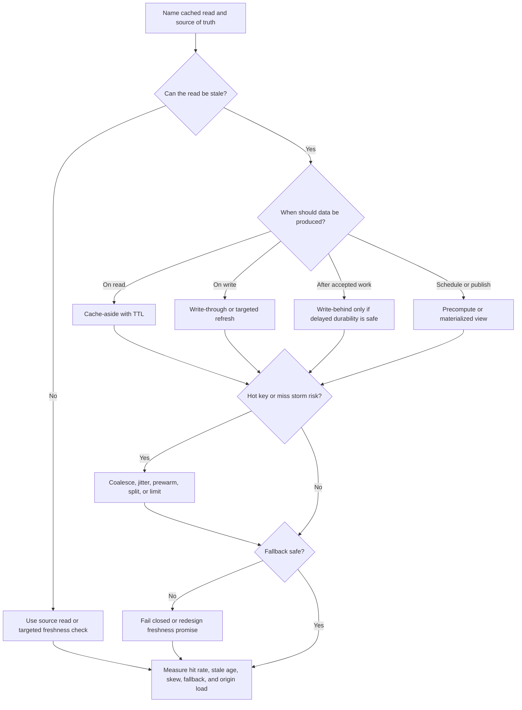

# Caching Strategies

Caching improves performance and scalability when repeated reads can reuse an
answer without violating the product's freshness and correctness promises. A
good cache strategy names the source of truth, the freshness window,
invalidation behavior, hot-key risk, and fallback path before choosing a
pattern.

Caching is not only a speed feature. It is a consistency, capacity, and
operations decision. A cache can reduce origin load during normal traffic and
amplify origin load during misses, expiry, deploys, or outages.

## Purpose

Use this page to decide:

- when cache-aside, write-through, write-behind, or precomputed caching fits;
- how TTLs and invalidation protect freshness;
- how hot keys and miss storms should be handled;
- what fallback behavior is safe when cache or origin fails;
- which mistakes turn a cache into a correctness or reliability problem.

For component selection, see [Cache](../components/cache.md). This page focuses
on patterns for scaling and operating cached reads.

## When This Matters

Caching strategy matters when:

- a read path is repeated, expensive, distant, or bursty;
- the source of truth is approaching a read, CPU, connection, or cost limit;
- public browse, catalog, status, or schedule data can be slightly stale;
- one item, tenant, page, or query can become much hotter than the rest;
- users need a safe degraded response when cache or origin is slow;
- writes make old cached answers unsafe.

Do not add a cache when the read must always be fresh, the query can be fixed
with an index or smaller payload, or the team cannot explain invalidation and
fallback behavior.

## Questions To Ask

- What exact read is being cached?
- What is the source of truth?
- How stale can the cached answer be before it harms a user or workflow?
- Which write, publish, import, deploy, or schedule changes the answer?
- Should the cache be filled on read, write, schedule, publish, or background
  refresh?
- What happens on miss, timeout, eviction, cache outage, and origin outage?
- Could one key become much hotter than the rest?
- Does the cached answer include private, permissioned, or personalized data?
- How will operators see hit rate, stale age, miss storms, hot keys, fallback
  volume, and origin load?

## Decision Guidance

### Start With The Cached Read

Write the cache contract before picking a pattern:

```text
Read: public appointment search for clinic and date.
Source of truth: appointment database.
Freshness: search results may lag by 60 seconds.
Unsafe stale case: final booking confirmation must not trust cached capacity.
Invalidation: staff schedule publish invalidates affected clinic/date keys.
Fallback: stale-if-safe for search; source read or fail closed for booking.
Revisit: origin p95, hit rate, stale reports, hot-key timeouts.
```

If the contract is vague, the cache is premature.

### Use Cache-Aside For Repeated Stale-Tolerant Reads

Cache-aside means the application checks the cache, reads the source on a miss,
stores the answer, and returns it.

```text
read(key):
  value = cache.get(key)
  if value exists and is fresh enough:
    return value
  value = source.read(key)
  cache.set(key, value, ttl)
  return value
```

Use cache-aside when:

- reads repeat enough to justify the cache;
- stale data is acceptable for a bounded window;
- misses can safely read from the source;
- the application can define keys, TTLs, and fallback behavior.

Risks:

- many callers miss at once and overload the source;
- a stale value survives until TTL expiry;
- negative cache entries hide newly created data;
- cache outage sends all traffic to the source unless fallback is limited.

Mitigations include TTL jitter, request coalescing, stale-if-safe responses,
short negative TTLs, and origin rate limits.

### Use Write-Through When Post-Write Freshness Matters

Write-through updates the cache as part of the write path. The source of truth
still owns correctness; the cache update is a freshness optimization.
In this guide, write-through means the source write commits first or atomically
with a source-owned version, then the cache is refreshed or marked stale. Do not
let the cache become the only proof that the write succeeded.

Use write-through when:

- a write can identify exactly which cache keys changed;
- readers need fresh or near-fresh values after the write;
- write latency can absorb the cache update;
- partial failure between source and cache has a repair path.

Example:

```text
Staff publishes clinic hours.
Transaction commits source record with version 42.
Publish path refreshes cache key clinic_hours:clinic_17 with version 42.
Readers reject cached values older than their required source version.
```

Failure behavior matters:

| Failure | Safe Response |
| --- | --- |
| Source write fails | Do not update cache |
| Source succeeds, cache update fails | Mark cache key stale or enqueue repair |
| Cache succeeds, source outcome unknown | Recheck source before confirming success |
| Cache contains older version | Reader falls back to source or shows stale label |

Write-through can improve freshness, but it couples writes to cache operations.

### Use Write-Behind Only For Derived Or Repairable Work

Write-behind accepts a write, updates a cache or buffer, and writes to the source
later. It can reduce write latency, but it is risky because acknowledged work
may not yet be durable in the source of truth.

Use write-behind only when:

- the cached value is derived or rebuildable;
- delayed durability is acceptable and visible;
- the buffer is durable enough for the promise being made;
- ordering, retry, and dead-letter behavior are explicit;
- reconciliation can repair missed writes.

Poor fit:

```text
Accept payment success into a cache and write the payment database later.
```

Better fit:

```text
Record high-frequency view counts in a durable buffer and flush aggregate
counts later. The exact count can lag and can be recomputed from events.
```

Write-behind should raise the same questions as queues: what is durable, what
can retry, what can duplicate, what can be lost, and who repairs failed flushes?

### Treat TTL As A Freshness Budget

A TTL says how long a cached value may be reused before refresh. It is not a
complete invalidation strategy for data that must become fresh immediately.

TTL guidance:

- choose TTL from the product freshness promise, not from guesswork;
- use shorter TTLs for volatile or user-actionable data;
- use longer TTLs for published, versioned, or rarely changing content;
- add jitter so many keys do not expire together;
- use separate TTLs for negative results;
- record cached-at or source-version metadata when stale age matters.

Example:

```text
Public class list: TTL 120 seconds plus targeted invalidation on publish.
Class capacity confirmation: no TTL cache; read source during reservation write.
Missing class ID: negative TTL 10 seconds so newly created classes appear soon.
```

If users act on a value, show age or recheck the source before final decisions.

### Invalidate Where Ownership Is Clear

Invalidation removes or refreshes cache entries when source data changes.

Use targeted invalidation when the write path can name affected keys:

```text
Changing clinic_17 hours invalidates clinic_hours:clinic_17 and
clinic_search:city_4:open_now.
```

Avoid broad invalidation when key ownership is unclear:

```text
Any appointment update might affect dozens of search filters, counts, and
recommendations.
```

When invalidation is uncertain:

- shorten TTLs for stale-tolerant reads;
- use source reads for correctness-sensitive decisions;
- rebuild precomputed views with version markers;
- keep stale-report and invalidation-failure metrics;
- document which stale cases are acceptable.

Missed invalidation is a product bug when users make decisions from old data.

### Plan For Hot Keys And Miss Storms

Hot keys happen when one key receives disproportionate traffic. Miss storms
happen when many callers miss or expire at the same time.

Read hot keys are usually handled with replication, precompute, coalescing, or
stale-if-safe behavior. Write hot keys and counters need a different plan, such
as sharded counters, batching, per-key serialization, or delayed aggregation.

Mitigations:

- request coalescing so one refresh fills a key;
- stale-while-revalidate when old data is safe;
- TTL jitter to avoid synchronized expiry;
- prewarming before launch or publish events;
- key replication for read-heavy public data;
- per-key, per-tenant, or per-route limits;
- fallback content when origin protection is more important than freshness.

Operational rule:

```text
If class_detail:summer_camp_42 exceeds 20% of cache traffic, enable request
coalescing and prewarm replicas before registration opens.
```

Average hit rate is not enough. Measure key skew and origin load during misses.

### Define Fallback Behavior

Fallback is what happens when cache data is missing, stale, slow, or unavailable.

| Fallback | Use When | Risk |
| --- | --- | --- |
| Read source | Origin has capacity and freshness matters | Cache outage can overload origin |
| Serve stale-if-safe | Old data is better than no data | Users may act on outdated information |
| Degrade response | Optional data can be hidden | Product quality drops but core flow survives |
| Fail closed | Stale data could grant access, spend money, or corrupt state | More visible errors |
| Queue refresh | Rebuild can happen later | Users may see pending or old data |

Fallback should protect the source of truth. A cache outage should not turn into
a database outage because every request immediately falls back without limits.
Use timeouts, concurrency caps, circuit breakers, or route-level shedding when
source fallback starts to threaten the origin.

## Cache Pattern Flow



Use the flow to keep caching decisions tied to freshness and failure behavior,
not only latency.

## Original Example

A municipal sports registration system has public class browsing, instructor
profiles, seat reservations, and member account pages.

Strategy:

| Read Or Write | Pattern | Reason |
| --- | --- | --- |
| Public class list | Cache-aside with 120-second TTL and publish invalidation | Read-heavy and safely stale for browsing |
| Class detail for popular camps | Cache-aside plus request coalescing and prewarm | Prevents hot-key miss storms during launch |
| Instructor profile | Write-through refresh on profile publish | Readers expect published changes quickly |
| Seat reservation command | No cache for final decision | Must check source capacity and uniqueness |
| View counters | Write-behind aggregate from durable events | Exact count can lag and be rebuilt |
| Member account page | Direct source read for version 1 | Personalized and permission-sensitive |

Fallback:

```text
If cache is down, public browse reads source with a per-route limit and may
serve the last published class list with a visible age. Reservation writes fail
closed if the source cannot confirm capacity.
```

This design uses caching for repeated stale-tolerant reads while keeping scarce
seat allocation and personal account state on the source-of-truth path.

## Trade-Offs

| Choice | Benefit | Cost Or Risk |
| --- | --- | --- |
| Cache-aside | Simple, source remains explicit | Miss storms, stale data, and fallback overload |
| Write-through | Fresher reads after writes | Write latency and source/cache partial failure |
| Write-behind | Lower write latency for lag-tolerant data | Delayed durability, replay, and reconciliation risk |
| Short TTL | Fresher data | More source reads and lower hit rate |
| Long TTL | Higher hit rate and lower origin load | Slower correction after changes |
| Explicit invalidation | Faster freshness after known writes | Key tracking, missed invalidation, and purge failure |
| Stale-if-safe | Better availability | Users may see old data unless age is visible |
| Fail closed | Protects correctness and privacy | More visible errors during dependency trouble |

## Common Mistakes

- Caching before naming the read, source of truth, and freshness promise.
- Treating TTL as enough for data that must be fresh after writes.
- Using write-behind for user-visible durable decisions.
- Updating source and cache without defining partial-failure repair.
- Letting cache misses stampede the source during deploys or expiry.
- Measuring only average hit rate while one hot key is failing.
- Caching personalized or permissioned data with keys that omit identity,
  tenant, role, or source version.
- Serving stale data without a visible age or source recheck when users can act
  on it.
- Falling back to the source without rate limits during cache outage.
- Forgetting negative-cache TTLs and hiding newly created records.

## Checklist

Before shipping a cache strategy, confirm:

- [ ] The cached read or write path is named.
- [ ] The source of truth is named.
- [ ] The freshness window and unsafe stale cases are explicit.
- [ ] The pattern is chosen intentionally: cache-aside, write-through,
      write-behind, precompute, or no cache.
- [ ] TTLs match the product promise and include jitter when many keys can
      expire together.
- [ ] Invalidation triggers and cache key ownership are documented.
- [ ] Cache keys include tenant, user, permission, locale, version, or other
      required scope.
- [ ] Hot-key and miss-storm behavior is planned.
- [ ] Fallback behavior is source-read, stale-if-safe, degraded, queued, or
      fail-closed by workflow.
- [ ] The origin is protected from fallback overload.
- [ ] Write-through and write-behind partial failures have repair or
      reconciliation paths.
- [ ] Metrics cover hit rate, miss rate, stale age, invalidation failures, key
      skew, cache errors, fallback count, and origin load.

Alert example:

```text
Page when cache fallback reads push origin database CPU above 75% for
10 minutes, or when stale age for public class data exceeds the 120-second
freshness promise.
```

## Related Pages

- [Scalability overview](./)
- [Cache component](../components/cache.md)
- [Hot-key mitigation](hot-key-mitigation.md)
- [Database read scaling](database-read-scaling.md)
- [Bottleneck analysis](bottleneck-analysis.md)
- [Capacity estimation](capacity-estimation.md)
- [Read and write patterns](../data/read-write-patterns.md)
- [Consistency models](../data/consistency-models.md)
- [Circuit breakers](../reliability/circuit-breakers.md)
- [Graceful degradation](../reliability/graceful-degradation.md)
