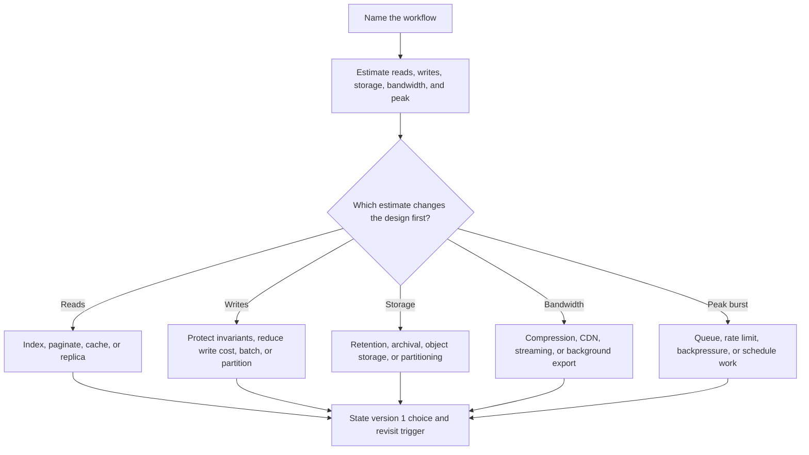

# Capacity Estimation

Capacity estimation turns product assumptions into rough load, storage, and
bandwidth numbers. For scalability design, the point is not to forecast exactly.
The point is to decide which parts of the system are likely to saturate first
and which scaling components are not justified yet.

Use the [capacity estimation worksheet](../../templates/capacity-estimation-template.md)
when you need a fill-in-the-blank version of this guide.

## Purpose

Use this guide to answer:

- How much traffic does the critical path need to handle?
- How much data will the system store and retain?
- How much bandwidth do large responses, uploads, downloads, or fanout consume?
- Are reads, writes, or background jobs the dominant load?
- How different is peak load from average load?
- Which estimate would change the version 1 architecture?

The goal is to find the order of magnitude that affects scaling choices such as
indexes, caching, queues, read replicas, object storage, partitioning, rate
limits, or background processing.

## When This Matters

Capacity estimation matters when:

- a design might need a cache, queue, replica, partition, CDN, or rate limit;
- traffic has launch windows, daily rushes, deadlines, or other bursts;
- one user action fans out to many recipients or events;
- stored data grows with retention, audit, exports, or large files;
- read and write paths have very different load profiles;
- a team is about to add scaling machinery without proving version 1 needs it.

It matters less when all estimates are small enough that one simple deployment
and one database clearly satisfy the workflow.

## Questions To Ask

Start with the product workflow:

- Which user action is on the critical path?
- Which action creates the most reads?
- Which action creates the most writes?
- Which action moves the largest objects?
- Which action creates fanout?
- What is the busiest minute, hour, day, or launch window?

Then map data and constraints:

- How many users or actors are active in the estimate window?
- How many requests does each active actor create?
- What is the average response, upload, event, or record size?
- How long is data retained?
- Which data is source of truth and which is derived?
- What headroom or revisit trigger should the design state?

## Decision Guidance

### Traffic

Traffic estimation should separate average load from the load that matters for
scaling.

Useful formulas:

```text
requests per day =
  active users per day * actions per active user per day

average RPS =
  requests per day / 86,400

peak RPS =
  average RPS * peak multiplier
```

Estimate each important path separately:

| Path | What To Estimate | Why It Matters |
| --- | --- | --- |
| User reads | page views, searches, detail loads | indexes, cache, replicas |
| User writes | creates, updates, approvals, checkouts | transactions, contention, queues |
| Background jobs | imports, exports, reminders, scans | workers, backpressure, scheduling |
| Event fanout | events per second times consumers | broker load, subscriber lag |
| External calls | provider requests and retries | rate limits, timeouts, bulkheads |

Do not hide everything behind one "RPS" number. A system with 1,000 read RPS and
1 write RPS has different scaling pressure than a system with 1,000 write RPS.

### Read/Write Ratio

The read/write ratio helps identify the first scaling move.

```text
read/write ratio =
  read requests in the window / write requests in the window
```

Interpretation:

| Shape | Scaling Pressure | Common First Moves |
| --- | --- | --- |
| Read-heavy | many repeated reads | indexes, pagination, cache, read replica |
| Write-heavy | frequent mutations | narrow writes, batching, queueing, partitioning |
| Balanced | both paths matter | model each critical path separately |
| Conflict-heavy | writes are low but correctness is strict | transactions, conditional writes, locks |

Absolute load still matters. A 100:1 read/write ratio at 2 peak RPS may only
need a good index. A 10:1 ratio at 20,000 peak RPS may need caching, replicas,
and careful fanout control.

### Storage

Storage estimation should include count, size, retention, and growth.

Useful formulas:

```text
daily storage =
  new objects per day * average bytes per object

retained storage =
  daily storage * retention days
```

Include the parts that change the order of magnitude:

- source-of-truth records;
- audit or history records;
- indexes;
- derived projections;
- object files, images, exports, and attachments;
- backups and retention copies;
- event logs or outbox records retained for replay.

Storage affects more than disk cost. It affects backup time, restore time,
index maintenance, query latency, archival policy, and whether large blobs
belong outside the primary database.

### Bandwidth

Bandwidth matters when payloads are large, frequent, or fanned out.

Useful formula:

```text
bandwidth per second =
  peak responses or events per second * average bytes per response or event
```

Estimate:

- download bandwidth for pages, feeds, files, and exports;
- upload bandwidth for images, documents, telemetry, and imports;
- service-to-service payloads;
- event fanout to multiple subscribers;
- replication or backfill traffic;
- retry traffic during dependency failures.

Bandwidth estimates can justify pagination, compression, object storage,
streaming, background export, or CDN use. They can also show that those tools
are not a version 1 concern.

### Peak Load

Peak load is what usually breaks a design first.

Peak sources:

- launches and marketing events;
- ticket sales, enrollment windows, or permit deadlines;
- daily or weekly user routines;
- batch imports or scheduled exports;
- retries during dependency outages;
- abuse, scraping, or accidental client loops;
- one action fanning out to many downstream jobs.

State the peak window explicitly:

```text
Average read load is 50 RPS.
Busiest minute is estimated at 12x average, or about 600 RPS.
```

The mitigation depends on the shape of the peak. A predictable nightly export
can be scheduled or throttled. A public launch may need rate limiting, caching,
queues, and fast rollback. A retry storm needs backoff, jitter, and circuit
breaker behavior.

### Rough Sizing Examples

Capacity estimates should lead to design consequences, not only arithmetic.

| Estimate | Rough Interpretation | Possible Design Consequence |
| --- | --- | --- |
| Peak reads are tens of RPS | small web workload | database indexes may be enough |
| Peak reads are thousands of RPS for the same objects | cache pressure | add cache and protect hot keys |
| Writes are below 1 RPS but conflict-prone | correctness pressure | use transactions or uniqueness constraints |
| Writes are thousands of RPS | write scaling pressure | reduce indexes, batch, partition, or queue |
| Stored data grows by MB/month | simple retention | one database is likely fine |
| Stored data grows by TB/month | storage planning | object storage, archival, partitioning |
| Downloads are small | no special delivery path | paginate and measure |
| Downloads are large and frequent | bandwidth pressure | object storage, CDN, compression, streaming |

Use estimates as a trigger for deeper design, not as proof that one specific
technology is required.

## Capacity Decision Flow



## Worked Example

A neighborhood library lets residents reserve meeting rooms.

Assumptions:

- 80,000 registered residents.
- 12,000 daily active residents during planning season.
- Each active resident searches room availability 6 times per day.
- Each active resident creates or changes 0.15 reservations per day.
- Average search response is 12 KB.
- Average reservation plus audit data is 3 KB.
- Reservation and audit data is retained for 3 years.
- Busiest hour is 10x the daily average.
- The first public registration day may be 25x average for 15 minutes.

### Traffic

Reads:

```text
read requests per day = 12,000 * 6 = 72,000
average read RPS = 72,000 / 86,400 ~= about 1 RPS
busiest-hour read RPS = 1 * 10 ~= about 10 RPS
launch-window read RPS = 1 * 25 ~= about 25 RPS
```

Writes:

```text
write requests per day = 12,000 * 0.15 = 1,800
average write RPS = 1,800 / 86,400 ~= about 0.02 RPS
busiest-hour write RPS = 0.02 * 10 ~= still below 1 RPS
launch-window write RPS = 0.02 * 25 ~= still around 1 RPS
```

### Read/Write Ratio

```text
read/write ratio = 72,000 / 1,800 = 40:1
```

The workflow is read-heavy, but the absolute peak estimate is still modest.
Start with indexed availability queries and pagination. A cache is a later
optimization if measured search latency or database load justifies it.

### Storage

```text
daily reservation storage = 1,800 * 3 KB = 5,400 KB/day ~= 5 MB/day
three-year retained storage = 5 MB * 1,095 ~= 5.5 GB
```

This is small enough for one relational source of truth. Backups, restore time,
and audit retention should be documented, but sharding is not justified by this
estimate.

### Bandwidth

```text
launch-window read bandwidth = 25 responses/sec * 12 KB
                             = 300 KB/sec
```

This does not justify a CDN for search responses. If the room pages later add
large image galleries or downloadable floor plans, estimate that flow
separately because payload size could dominate request count.

### Design Consequence

Version 1 can use:

- one relational database;
- an index for room availability by room, date, and status;
- uniqueness or transaction rules to prevent double booking;
- pagination for availability results;
- basic request metrics for search and reservation writes;
- a launch-day rate limit if abuse or repeated refreshes become visible.

Revisit when peak search reads reach hundreds of RPS, write conflicts create
visible user delays, retained data grows into hundreds of GB, or large downloads
become a dominant bandwidth cost.

## Trade-Offs

Capacity estimation helps avoid premature scaling, but it can also create false
confidence if the inputs are guesses.

- Round numbers are easier to defend than decimal-heavy estimates.
- Ranges are more honest than one exact number.
- A small average can still hide a damaging peak.
- High read/write ratio does not automatically justify a cache.
- Low write volume can still need strong correctness controls.
- Storage size affects backups and restore, not only disk.

Use estimates to choose the next simplest design and to define the metric that
will prove the estimate wrong.

## Common Mistakes

- Estimating average RPS and skipping peak load.
- Combining reads, writes, background jobs, and fanout into one traffic number.
- Ignoring read/write ratio when choosing indexes, caches, or queues.
- Forgetting object size in bandwidth and storage estimates.
- Ignoring retention, audit history, backups, and derived data.
- Treating bursty traffic as if it arrives evenly all day.
- Adding sharding, caching, or streaming before the estimates justify them.
- Failing to name a revisit trigger.

## Checklist

Before using a capacity estimate, confirm:

- The workflow and version 1 scope are explicit.
- Traffic is split into reads, writes, background jobs, and fanout.
- Average and peak RPS are both estimated.
- Read/write ratio is stated and interpreted with absolute load.
- Storage growth includes object count, average size, retention, and audit or
  derived data where relevant.
- Bandwidth includes uploads, downloads, large responses, fanout, or exports.
- Peak load includes launches, deadlines, retries, and abuse where relevant.
- Rough sizing examples lead to concrete design consequences.
- The [capacity estimation worksheet](../../templates/capacity-estimation-template.md)
  is filled out or linked from the design artifact.
- The design states what metric or threshold would trigger a revisit.

## Related Pages

- [Scalability overview](./)
- [Scale estimation](../method/scale-estimation.md)
- [Functional vs non-functional requirements](../method/functional-vs-nonfunctional-requirements.md)
- [Read and write patterns](../data/read-write-patterns.md)
- [Indexes](../data/indexes.md)
- [Transactions](../data/transactions.md)
- [Retries and backoff](../communication/retries-and-backoff.md)
- [Capacity estimation worksheet](../../templates/capacity-estimation-template.md)
