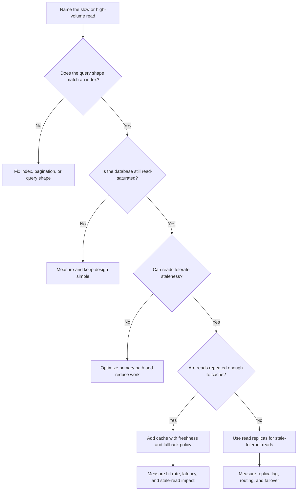

# Database Read Scaling

Database read scaling is the work of serving more reads without breaking
correctness, freshness expectations, or write performance. The first move is
usually not a new database. It is understanding the read path, query shape,
freshness requirement, and bottleneck.

Use this guide when read traffic, query latency, or expensive list/search pages
are starting to shape the architecture.

## Purpose

Use this guide to answer:

- Which read path is slow or high volume?
- Can an index or query change solve the problem first?
- Is the query doing unnecessary work?
- Can a cache serve the answer without violating freshness requirements?
- Would read replicas help, and which reads can tolerate stale data?
- How much replica lag is acceptable?

The goal is to scale reads with the least machinery that satisfies the workflow
and keeps the source of truth clear.

## When This Matters

Read scaling matters when:

- a user-facing page scans, sorts, or joins too much data;
- repeated reads dominate writes;
- a few list or search queries consume most database time;
- dashboards or admin pages compete with operational traffic;
- one database leader is saturated by read load;
- users can tolerate some stale reads, but not for every workflow;
- caching or read replicas are being considered without a freshness policy.

It matters less when peak reads are small and the current database can serve
indexed queries with comfortable headroom.

## Questions To Ask

Start with the read path:

- Who reads this data?
- Is it a lookup, list, feed, search, dashboard, report, or export?
- What filters, sort order, pagination, and joins does it need?
- How many rows are scanned and returned?
- How fresh must the answer be?
- Must users read their own writes immediately?

Then choose the scaling move:

- Does an existing index match the query?
- Can the query fetch fewer rows or columns?
- Can expensive work be moved to a derived view?
- Can a cache serve repeated reads safely?
- Can a read replica serve stale-tolerant reads?
- What metric proves the change helped?

## Decision Guidance

### Start With The Query Shape

Before adding components, write down the query shape:

```text
who reads it
filters
sort order
pagination
expected result size
freshness requirement
peak read rate
```

For example:

```text
Members list available rooms for one building and date, sorted by start time.
The page returns 25 rooms at a time. It must reflect the user's own new
reservation immediately, but it can tolerate a few seconds of lag for other
users' reservations if the final booking write still checks availability.
```

This statement tells you whether the first move is an index, query change,
cache, read replica, or stronger consistency rule.

### Indexes

Indexes are usually the first read-scaling tool because they reduce the work a
database must do for known lookup and list paths.

Use indexes when:

- filters and sort order are stable;
- the query can narrow to a small result set;
- the page needs source-of-truth freshness;
- the write path can afford index maintenance;
- the index supports a real workflow, not a hypothetical future query.

Index guidance:

- match the combined filter, sort, and pagination shape;
- include tenant, owner, status, or time fields when they scope the read;
- avoid indexing low-selectivity fields alone;
- avoid adding many indexes to rescue broad reports;
- measure rows scanned, rows returned, and query latency after the change.

Indexes improve read latency, but every index adds write cost, storage, memory
pressure, and backfill work. If writes are already sensitive, the read scaling
decision must include write impact.

### Query Optimization

Query optimization means reducing unnecessary database and application work
before adding new infrastructure.

Common improvements:

- fetch only columns needed for the page;
- paginate with a stable cursor instead of deep offsets;
- move large blobs out of common list queries;
- avoid repeated per-row lookups that create many small queries;
- precompute small display fields when joins dominate;
- separate operational reads from analytical scans;
- remove filters or sorts that users do not need.

Watch for symptoms:

| Symptom | Likely Issue | First Move |
| --- | --- | --- |
| Many rows scanned, few returned | missing or mismatched index | fix access path |
| Many rows returned, page shows few | missing pagination | limit and cursor |
| Database fast, response slow | payload or app processing | reduce columns or work |
| Query fast alone, slow under load | concurrency or connection pressure | pool, cache, or replica |
| Dashboard slows user writes | analytical scan on operational store | derived reporting path |

The best read-scaling change may be deleting work the user never needed.

### Caching

Caching stores a computed or fetched answer so repeated reads do not hit the
database every time.

Use caching when:

- many callers request the same data;
- the data can be stale for a defined time;
- cache keys and invalidation are clear;
- cache misses do not overload the database;
- the system can handle cache outage or cold start.

Cache candidates:

- public catalog pages;
- stable reference data;
- expensive computed summaries;
- popular detail pages;
- low-risk availability hints that are verified during the final write.

Avoid caching when:

- the workflow requires fresh source-of-truth data;
- invalidation is unclear;
- each query is unique and rarely repeated;
- stale data would cause harmful decisions;
- the cache would hide a bad query that still breaks on misses.

Caching is not a correctness boundary. For example, a room availability page may
cache possible openings, but the reservation write still needs a source-of-truth
check to prevent double booking.

### Read Replicas

A read replica is a copy of the database used to serve read traffic separately
from the leader or primary writer.

Use read replicas when:

- read load is saturating the primary database;
- many reads can tolerate replication delay;
- the system can route stale-sensitive reads to the primary;
- replica lag is observable;
- failover and read routing behavior are understood.

Good replica candidates:

- browsing pages that can lag slightly;
- admin lists where stale status is acceptable and visible;
- dashboards that do not decide user-facing writes;
- read-heavy detail pages after the user's own write is not involved.

Poor replica candidates:

- read-after-write confirmation pages;
- permission checks that must reflect a recent revoke;
- scarce inventory or booking decisions;
- payment, entitlement, or safety-critical decisions;
- workflows where stale data would cause the next command to be wrong.

Read replicas scale read capacity, but they add routing, lag, failover, and
consistency decisions. They are not a substitute for good query shape.

### Stale Reads

A stale read returns older data than the latest committed source-of-truth write.
Stale reads are often acceptable for lists, feeds, dashboards, and derived
views, but not for every workflow.

Ask:

- Can the user act incorrectly if the read is stale?
- Must the user see their own write immediately?
- Can the UI label the data as recently updated?
- Does the next write re-check the source of truth?
- How long can stale data be tolerated?

Common policies:

| Read Type | Freshness Policy |
| --- | --- |
| Confirmation after user write | read primary or session-consistent source |
| Public catalog browse | cache or replica with short lag is often acceptable |
| Admin dashboard | stale with timestamp may be acceptable |
| Permission check | stale is usually unsafe |
| Booking or inventory decision | stale list may be okay; final write must verify |

State stale-read behavior in the design. Do not let it be an accidental
side-effect of adding replicas or caches.

### Replica Lag

Replica lag is the delay between a write committing on the primary and that
change appearing on a read replica.

Replica lag matters because it is variable. It may be small during normal load
and large during bursts, backfills, long transactions, or failover.

Design for lag:

- measure current lag and alert on high lag;
- route read-after-write paths to the primary;
- include timestamps or versions in responses when useful;
- let clients retry reads from the primary for critical confirmation;
- avoid using replicas for authorization or scarce-resource decisions;
- degrade gracefully when lag exceeds the workflow's tolerance.

If the design says "reads can be stale for up to 5 seconds," then replica lag
must be measured against that promise. If no one measures lag, the promise is
not real.

## Read Scaling Decision Flow



## Trade-Offs

Read-scaling tools trade latency, load, freshness, and operational complexity.

- Indexes speed known queries, but slow writes and consume storage.
- Query optimization can remove work, but may require product or API changes.
- Caches reduce repeated reads, but introduce invalidation and stale data.
- Read replicas increase read capacity, but introduce replica lag and routing
  rules.
- Derived views protect operational tables, but add rebuild and freshness work.
- Serving stale reads can improve scalability, but only when the user workflow
  can tolerate it.

Prefer the simplest tool that relieves the measured bottleneck while preserving
the workflow's correctness promise.

## Common Mistakes

- Adding a cache before fixing a missing index.
- Creating read replicas for queries that still scan too much data.
- Serving read-after-write pages from stale replicas.
- Ignoring replica lag until users report missing updates.
- Letting dashboards scan hot operational tables.
- Caching data without an invalidation or TTL policy.
- Optimizing average latency while p95 or p99 still fails.
- Adding indexes for rare reports and slowing every write.
- Treating stale reads as acceptable without product agreement.

## Example

A community clinic lets residents search available appointment slots and book a
visit.

Read paths:

| Read Path | Freshness Need | Scaling Move |
| --- | --- | --- |
| Search open slots by clinic and date | Can be a few seconds stale if final booking verifies | Composite index, then cache popular date searches |
| View appointment confirmation after booking | Must show the user's write | Read primary or use a session-consistent path |
| Staff dashboard by clinic and status | Can lag with timestamp | Read replica or derived reporting view |
| Permission check for staff action | Must be current | Primary read or strongly consistent authorization source |

Design:

- Start with an index shaped like `clinic_id, appointment_date, status,
  starts_at, appointment_id`.
- Paginate search results and avoid loading full patient details in slot search.
- Cache popular availability searches for a short TTL, but treat them as hints.
- The booking write checks the source of truth before confirming a slot.
- Route confirmation reads and permission checks to the primary.
- Use a read replica for staff dashboards only after primary read load is
  measured as a real bottleneck.
- Monitor cache hit rate, primary query latency, replica lag, and booking
  conflicts.

This scales the read-heavy browsing path without letting stale availability
create double bookings.

## Checklist

Before choosing a database read-scaling approach, confirm:

- The read workflow, filters, sort order, pagination, and result size are named.
- Query latency is measured with rows scanned, rows returned, and p95 or p99
  latency.
- Indexes match the actual query shape and write cost is acceptable.
- Query optimization has removed unnecessary columns, joins, blobs, and deep
  offsets.
- Caching has a key, TTL or invalidation policy, fallback behavior, and
  freshness promise.
- Read replicas are used only for reads that can tolerate lag.
- Stale-read behavior is stated for user-facing and operator-facing paths.
- Replica lag is measured and has an alert or routing response.
- Read-after-write and authorization paths are protected from stale reads.
- Dashboards and reports do not overload operational tables by default.
- The design names the metric that would trigger the next scaling move.

## Related Pages

- [Scalability overview](./)
- [Capacity estimation](capacity-estimation.md)
- [Indexes](../data/indexes.md)
- [Read and write patterns](../data/read-write-patterns.md)
- [Operational vs analytical data](../data/operational-vs-analytical-data.md)
- [Transactions](../data/transactions.md)
- [Scale estimation](../method/scale-estimation.md)
- [Retries and backoff](../communication/retries-and-backoff.md)
