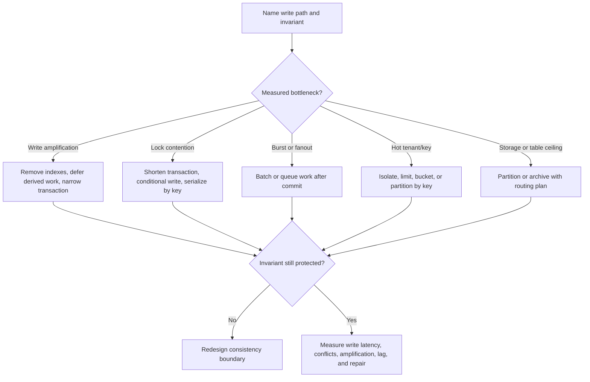

# Database Write Scaling

Database write scaling is about increasing accepted write throughput without
breaking the source-of-truth invariants. The hard part is rarely "more writes"
in the abstract. It is usually lock contention, hot rows, write amplification,
fanout, indexes, transaction scope, or a workflow that needs a different
consistency boundary.

Treat write scaling as a correctness problem first and a capacity problem
second. A faster write path that double-books seats, loses audit history, or
silently drops derived updates is not a scalable design.

## Purpose

Use this page to decide:

- which write path is actually constrained;
- how batching can raise throughput when delay is acceptable;
- when queues protect the write path and when they hide delayed work;
- how denormalization changes write amplification and repair needs;
- when partitioning or sharding can raise write ceilings;
- how contention and hot keys should be measured before redesigning storage.

For partition-key choices, see
[Partitioning and sharding](../data/partitioning-and-sharding.md). This page
focuses on write-scaling playbooks and trade-offs.

## When This Matters

Write scaling matters when:

- p95 or p99 write latency rises under peak traffic;
- lock waits, conflicts, deadlocks, or retry rates grow;
- one row, tenant, partition, counter, or inventory item becomes hot;
- writes update too many indexes, derived tables, caches, or downstream systems;
- user-facing writes compete with analytics, imports, or background jobs;
- the product can batch, queue, or delay part of the work without lying to users.

It matters less when the measured bottleneck is a slow read, missing index,
oversized response, or insufficient single-node headroom. Fix the measured
problem before splitting the write path.

## Questions To Ask

- What exact write is slow or constrained?
- What invariant must remain true after the write succeeds?
- Which records, indexes, counters, queues, caches, or derived views are updated?
- Is the bottleneck CPU, log I/O, index maintenance, lock wait, transaction
  duration, conflict retry, connection pool, or hot key?
- Can any work move after the commit as an outbox event, queue job, or batch?
- Can writes be grouped without violating user latency or ordering promises?
- Can denormalized data be rebuilt or repaired if an update is missed?
- Would partitioning keep the contested write local, or would it create
  cross-partition transactions?
- Which metric proves the write-scaling move worked?

## Decision Guidance

### Measure The Write Shape

Start with the write path, not the database product.

```text
Write: reserve one clinic appointment slot.
Invariant: one slot cannot be assigned to two patients.
Touched state: appointment row, reservation row, audit event, outbox event.
Pressure: lock wait on appointment row during Monday release.
Cannot delay: source reservation decision.
Can delay: confirmation email, search index update, analytics.
```

Useful measurements:

- writes per second by operation type;
- transaction duration and rows touched;
- lock wait time, deadlocks, conflicts, and retry count;
- index count and index update time;
- write-ahead log, replication, or storage I/O saturation;
- connection pool wait time;
- top hot rows, tenants, partitions, or counters;
- downstream fanout per accepted write.

If you cannot name the contested record or amplified work, sharding is usually
guesswork.

### Reduce Write Amplification First

Write amplification means one logical write causes many physical writes or
downstream updates.

Common sources:

- too many secondary indexes on a hot table;
- denormalized read models updated synchronously;
- audit, history, search, cache, analytics, and notification updates in the same
  transaction;
- triggers or cascading writes that are hard to see;
- large documents rewritten for small field changes;
- retries that repeat non-idempotent side effects.

Responses:

- remove unused indexes from hot write paths;
- keep the transaction focused on authoritative state and required invariants;
- move derived updates to an outbox, queue, stream, or scheduled rebuild;
- update only changed fields instead of rewriting large blobs;
- make side effects idempotent so retries do not multiply work;
- measure fanout per accepted write.

Do not remove writes that protect correctness. Remove or defer writes that exist
only for convenience, reporting, search, or notification timing.

### Batch When Delay Is Acceptable

Batching groups several writes into one operation. It can reduce round trips,
commit overhead, index maintenance overhead, and provider calls.

Use batching when:

- users can tolerate a short delay;
- writes are independent or have a clear ordering key;
- the batch has a maximum size and maximum age;
- partial failure has retry or repair behavior;
- the source can handle the larger transaction safely.

Examples:

| Work | Batch Fit | Reason |
| --- | --- | --- |
| Analytics counters | Good | Exact real-time value is not required |
| Audit event inserts | Often good | Append-only and can flush in durable chunks |
| Seat reservation decisions | Usually poor | User needs final success and uniqueness now |
| Email status updates | Good with idempotency | Provider callbacks can be grouped |

Compliance-critical audit records may need to commit with the authoritative
write or use a durable outbox before success is returned. Batch only audit or
event records whose delay and recovery behavior still satisfy the audit promise.

Batching trade-off:

```text
Batch 100 view-count increments or flush every 2 seconds, whichever comes first.
If flush fails, retry the durable batch and expose flush age.
```

Batching improves throughput by adding delay and failure handling. Do not hide
that delay from workflows that need final success now.

### Queue Work After The Authoritative Commit

Queues can protect the write path by moving non-critical work out of the user
transaction.

Good queued work:

- send notification after the write commits;
- update search or analytics projections;
- call a slow provider;
- perform image, report, or export processing;
- run reconciliation or cleanup.

Bad queued work:

- deciding whether scarce inventory was actually reserved;
- enforcing uniqueness after returning success;
- applying permission changes that must be effective before the user continues;
- writing the only durable copy of accepted work without a repair path.

Use a transactional outbox or durable job record when the source write and
queued work must be repairable together:

```text
Commit reservation + outbox event in one transaction.
Worker later updates search, sends email, and records completion.
If publishing fails, the outbox scanner retries without losing the intent.
```

Queued work must expose pending, retrying, failed, and repaired states when the
user or operator cares about completion.
Queues also need backpressure: maximum backlog age, worker concurrency limits,
retry budgets, and admission rules for optional work. They move work out of the
transaction, but they do not remove capacity limits.

Security-sensitive work needs special care. Permission revokes, audit integrity,
and authorization state should not lag silently behind queued workers. If a
queued action can replay, it must recheck current authorization and use
idempotency to avoid repeating side effects.

### Denormalize Carefully

Denormalization stores data in more than one shape to speed reads or localize
writes. It can reduce read pressure, but it often increases write work and
repair complexity.

Use denormalization when:

- a read path is frequent and joins or aggregations are the bottleneck;
- the derived value can lag or be repaired;
- source ownership is clear;
- backfill and reconciliation are practical;
- the write path can afford the extra update or can emit a durable event.

Avoid denormalization when:

- every write must synchronously update many derived copies;
- conflicting copies would mislead users;
- no process can rebuild or compare the derived view to the source;
- the derived view becomes a second source of truth.

Design rule:

```text
Source table owns reservation status.
Denormalized class_summary owns fast browse counts with source_version.
Booking write checks source rows, not class_summary.
Rebuild job can recompute class_summary from reservations.
```

Denormalization is safer when derived data is labeled as derived and rebuildable.

### Partition When One Writer Is No Longer Enough

Partitioning can scale writes when the workload can be split by a key that keeps
important writes local.

Partitioning helps when:

- tenants are mostly independent;
- writes target one account, user, object, region, or time bucket;
- one table or index has outgrown maintenance limits;
- contention is isolated to a subset of keys;
- cross-partition transactions are rare or avoidable.

Partitioning does not help when:

- all writes target one global counter or hot row;
- the transaction needs to update several partitions atomically;
- the partition key is missing from common writes;
- the system cannot operate routing, backfills, resharding, backups, and repair.

Version 1 often keeps one source of truth and prepares for partitioning by
including tenant or resource keys in tables, indexes, jobs, and metrics. Split
only after the measured ceiling justifies the operational cost.

### Reduce Contention, Do Not Ignore It

Contention appears when many writers need the same lock, row, index range,
transaction boundary, or unique constraint.

Common contention points:

- scarce inventory row;
- account balance;
- global sequence or counter;
- current time-range partition;
- tenant summary row;
- uniqueness check on a popular key;
- long transaction that reads, writes, and calls outside services.

Responses:

- shorten transactions and avoid external calls inside them;
- use conditional writes or optimistic concurrency with clear retry limits;
- serialize by key when correctness needs order;
- split counters into buckets and aggregate later;
- hold scarce capacity with short-lived reservations;
- move non-authoritative work after commit;
- add fairness limits for hot tenants or keys.

Contention often protects an invariant. Removing the lock without replacing the
invariant is not scaling; it is data corruption.

## Write Scaling Flow



Use the flow to keep write scaling tied to the invariant being protected.

## Original Example

A community workshop app lets members reserve limited seats in repair classes.
Registration opens at noon and creates a short write spike.

Initial write path:

```text
Reserve seat transaction:
1. Check class capacity.
2. Insert reservation.
3. Update class remaining_count.
4. Insert audit row.
5. Update search summary.
6. Send confirmation email.
```

Measured pressure:

- lock waits occur on `class_id=woodworking_101`;
- write latency rises when confirmation emails time out;
- two extra indexes on reservations are unused by user-facing reads;
- search summary updates fail sometimes and block checkout.

Version 1.5 changes:

| Pressure | Change | Why |
| --- | --- | --- |
| Contended class row | Use conditional reservation insert and short transaction | Keeps seat invariant narrow |
| Email in transaction | Move email to outbox job | Protects checkout from provider latency |
| Search summary | Derive from reservation event with source version | Makes browse counts rebuildable |
| Unused indexes | Remove from hot reservation write path | Reduces write amplification |
| View counters | Batch every 2 seconds from durable events | Exact counter can lag |

Partitioning is deferred. The team adds `class_id`, `site_id`, and
`registration_window_id` to metrics so it can see whether one class, site, or
window becomes a repeat hot key. If a few sites become independently hot, the
next move may be site or registration-window partitioning.

The final reservation decision stays in the source-of-truth transaction. Email,
search, analytics, and counters become delayed, idempotent, and observable.

Invariant-preserving write pattern:

```text
UPDATE class_capacity
SET remaining = remaining - 1
WHERE class_id = 'woodworking_101' AND remaining > 0;

Only insert the reservation if one row was updated. Retries use the same
idempotency key so the same member cannot consume two seats.
```

## Trade-Offs

| Choice | Benefit | Cost Or Risk |
| --- | --- | --- |
| Narrow transaction | Lower lock time and clearer invariants | More delayed derived work |
| Remove indexes | Faster writes and lower storage | Some reads may need redesign |
| Batch writes | Higher throughput and fewer commits | Added delay and partial failure handling |
| Queue derived work | Protects user write latency | Pending, retrying, and failed work must be visible |
| Denormalize | Faster reads or local summaries | Write amplification, lag, backfill, and repair |
| Partition writes | Higher ceiling and isolation | Routing, resharding, cross-partition limits |
| Serialize hot key | Protects correctness under contention | Lower concurrency for that key |

## Common Mistakes

- Scaling writes before naming the invariant the write protects.
- Sharding when the real issue is a long transaction or unused indexes.
- Moving the authoritative decision to a queue while returning final success.
- Denormalizing into multiple sources of truth with no rebuild path.
- Adding indexes for hypothetical reads on a hot write table.
- Batching writes that users expect to be final immediately.
- Ignoring write amplification from triggers, caches, search, analytics, and
  notifications.
- Treating conflict retries as free even when they amplify load.
- Hiding delayed derived work without pending, lag, retry, or dead-letter
  visibility.

## Checklist

Before choosing a database write-scaling approach, confirm:

- [ ] The constrained write path is named.
- [ ] The source-of-truth invariant is explicit.
- [ ] Current write latency, throughput, lock waits, conflicts, deadlocks, and
      retry rate are measured.
- [ ] Write amplification from indexes, triggers, derived views, caches, events,
      notifications, and analytics is listed.
- [ ] The transaction contains only authoritative work that must commit before
      success.
- [ ] Batching has a maximum size, maximum age, partial-failure behavior, and
      user-visible delay policy.
- [ ] Queued work uses a durable intent, idempotency, retry limits, and repair
      visibility.
- [ ] Queued or delayed writes have backlog limits, admission control, and
      backpressure behavior.
- [ ] Denormalized data is rebuildable or reconciled against the source.
- [ ] Partitioning has a key, local write path, cross-partition plan, and
      resharding strategy.
- [ ] Hot rows, tenants, counters, partitions, and time windows are measured.
- [ ] Metrics cover write p95/p99, transaction duration, lock wait, conflict
      rate, retries, write amplification, queue lag, and repair failures.

## Related Pages

- [Scalability overview](./)
- [Bottleneck analysis](bottleneck-analysis.md)
- [Capacity estimation](capacity-estimation.md)
- [Database read scaling](database-read-scaling.md)
- [Caching strategies](caching-strategies.md)
- [Partitioning and sharding](../data/partitioning-and-sharding.md)
- [Read and write patterns](../data/read-write-patterns.md)
- [Transactions](../data/transactions.md)
- [Queues](../communication/queues.md)
- [Outbox pattern](../communication/outbox-pattern.md)
