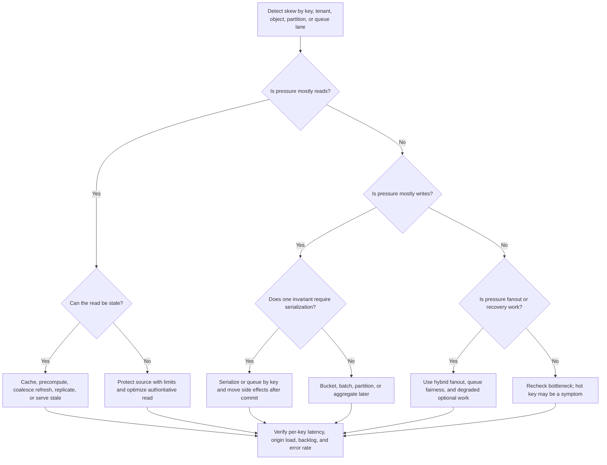

# Hot-Key Mitigation

A hot key is a single tenant, object, user, counter, cache key, queue key, or
partition key that receives enough traffic to become the limiting point of the
system. Hot keys matter because they defeat average-based scaling plans: a
cluster can look half-empty while one key, shard, cache node, or worker lane is
overloaded.

Mitigation starts by naming the hot key and the workflow it harms. Popular
keys, celebrity users, viral content, cache skew, and write hotspots need
different responses, so do not treat every hot key as a sharding problem.

## Purpose

Use this guide to decide:

- how to recognize hot keys before broad scale-out hides the evidence;
- which read-heavy keys can be cached, replicated, precomputed, or served stale;
- which write-heavy keys need bucketing, serialization, batching, or admission
  control;
- how celebrity users and viral content change fanout and cache strategy;
- how to keep one hot key from consuming shared database, cache, queue, or
  worker capacity.

The goal is not perfectly even load. The goal is to keep a concentrated workload
from breaking the rest of the system while preserving the product promise for
that key.

## When This Matters

Hot-key mitigation matters when:

- one product, post, topic, event, tenant, user, or counter becomes much more
  active than the rest;
- a celebrity user or large account creates follower fanout, feed reads,
  notifications, or permission checks that do not look like ordinary users;
- viral content drives a sudden burst of reads, reactions, comments, shares, or
  moderation work;
- a cache has a good average hit rate, but one key causes miss storms, expiry
  stampedes, or one cache node doing most of the work;
- writes concentrate on one row, partition, counter, inventory item, schedule
  slot, or leaderboard;
- adding more application instances, workers, shards, or cache nodes does not
  improve the slow path because all requests still converge on the same key.

It matters less when the traffic is evenly distributed and the bottleneck is a
normal CPU, query, payload, index, or network issue.

## Questions To Ask

- What is the exact hot key: tenant, user, object, route, cache key, partition,
  queue group, counter, or row?
- Is the pressure read-heavy, write-heavy, fanout-heavy, or recovery-heavy?
- Which shared resource is harmed: origin database, cache node, partition,
  lock, queue, worker lane, provider quota, or network link?
- Is the key hot because of normal popularity, a celebrity user, viral content,
  scheduled launch traffic, retry traffic, or abuse?
- Can the hot read be stale, precomputed, replicated, or served from a
  degraded response?
- Can the hot write be bucketed, batched, delayed, serialized, or split by a
  safer dimension?
- What correctness invariant would bucketing or splitting make harder?
- Which per-key metric will prove the mitigation worked?

## Decision Guidance

### Measure Skew Before Scaling The Whole System

Hot keys are easy to miss when dashboards show averages across a fleet.

Measure by key, not only by component:

- top tenants, users, objects, cache keys, partitions, and queue groups by
  request rate;
- p95 and p99 latency for hot keys versus normal keys;
- cache hit rate, miss rate, stale age, eviction rate, and refresh concurrency
  by key;
- write conflicts, lock waits, retry counts, and transaction duration by
  contested record;
- queue depth and oldest age by routing key or worker lane;
- origin reads caused by cache miss or fallback for the hot key.

Useful statement:

```text
Key: event:city-marathon-2026
Pressure: 38% of browse traffic and 61% of cache refresh work for 20 minutes
Harmed resource: product database read pool through cache miss fallback
Safe stale window: public event summary may be 90 seconds old
Recovery metric: origin reads for this key stay below 40 rps during refresh
```

If the hot key cannot be named, the mitigation will probably be broad,
expensive, and hard to verify.

### Treat Read Hot Keys As Distribution Problems

Read hot keys usually need more copies, fewer refreshes, or a safer stale
response. The source of truth should not serve every repeated read for a
popular object.

Use these responses when the read can be stale within a known window:

- cache the hot object with request coalescing so one refresh fills many
  callers;
- use stale-while-revalidate or stale-if-safe when freshness is less important
  than protecting the origin;
- precompute public summaries, counts, rankings, or feed fragments before a
  known launch or broadcast;
- replicate the hot key across cache nodes, regions, or CDN edges when the
  object is public or safely scoped;
- add TTL jitter so many related hot keys do not expire together;
- cap origin fallback concurrency for the key.

If the read must be fresh, do not hide that requirement behind a cache. For
example, a hot concert page can serve stale public event details, but a ticket
purchase must read or write the authoritative inventory path before confirming
success.

Do not replicate private or permissioned content without putting tenant, user,
role, locale, and source version into the key. A hot-key cache bug can become a
security bug when scope is omitted. Scoped keys are necessary but not
sufficient: permission changes may also require targeted invalidation, short
TTLs, or an authorization recheck on sensitive reads.

### Treat Write Hotspots As Correctness Problems

Write hotspots often involve a shared invariant: one inventory count, one
leaderboard row, one popularity counter, one quota bucket, one schedule slot,
or one scarce resource. Splitting writes can raise throughput, but it may also
make correctness harder to prove.

Common mitigations:

| Hot Write Shape | Mitigation | Use When | Watch Out For |
| --- | --- | --- | --- |
| View, like, or reaction counter | Bucket increments and aggregate later | Exact live value can lag | Users may see approximate counts |
| Scarce inventory or appointment slot | Serialize writes for that key | Uniqueness matters more than throughput | Higher latency for the hot item |
| Popular leaderboard | Batch and publish snapshots | Rankings can update periodically | Freshness and tie-breaking must be clear |
| Tenant quota counter | Bucket by tenant and time window | Small lag is acceptable | Overrun rules must be explicit |
| Viral comment thread | Partition by thread segment or time | Reads can merge ordered segments | Moderation and pagination get harder |

For durable decisions, keep the source-of-truth write small and authoritative.
Move notifications, analytics, search updates, and cache refresh to an outbox,
queue, stream, or scheduled repair process.

### Handle Celebrity Users Separately From Ordinary Users

Celebrity users are hot keys with high fanout. They can break designs that work
for normal users because every post, profile update, live event, or permission
change can affect millions of followers.

Safer patterns:

- use fanout-on-write for ordinary users and fanout-on-read or hybrid fanout for
  celebrity users;
- precompute public celebrity profile and post summaries, but recheck
  permission-sensitive state on protected actions;
- isolate celebrity feed generation, notification fanout, and media processing
  from ordinary user worker pools;
- apply per-celebrity and per-follower admission limits for optional fanout;
- make follower counts, reaction counts, and notification totals eventually
  consistent when exact real-time values would create a write hotspot.

Define the boundary operationally. A user can enter the celebrity path when
follower count, fanout size, post read rate, or notification backlog crosses a
threshold for a sustained window, and can leave it only after traffic stays
below the threshold long enough to avoid route flapping.

The product can still feel fresh if the core post appears quickly and secondary
counts, recommendations, and notifications catch up with visible or acceptable
lag.

### Treat Viral Content As A Burst And Recovery Problem

Viral content creates a sudden hot key and often a recovery workload afterward:
cache refresh, ranking updates, moderation scans, notification fanout, search
indexing, and analytics can all pile onto the same object.

Design responses:

- prewarm when a planned promotion, sale, broadcast, or release is known;
- protect the origin with request coalescing, stale reads, and fallback limits;
- split optional fanout from the user-visible publish path;
- use queues with per-key fairness so one viral item does not starve ordinary
  work;
- shed or degrade non-critical features such as live counters, recommendations,
  or related content before rejecting core reads;
- monitor backlog age and retry volume after the burst, not just request
  latency during the burst.

Retries can make viral traffic worse. Use timeouts, backoff, jitter, and retry
budgets so the hot key does not create a second wave of traffic.

### Watch Cache Skew, Not Just Cache Hit Rate

A cache can report a healthy hit rate while one hot key is failing. Cache skew
happens when a few keys dominate cache CPU, memory, network, eviction, or
refresh work.

Signals:

- one cache node has much higher CPU or network use than peers;
- a single key causes most origin fallback traffic;
- the hot key expires and hundreds of callers refresh it at once;
- frequent eviction churn removes cold-but-important keys;
- cache partitions are uneven because the routing key has low cardinality;
- negative caching hides newly created data for hot lookup keys.

Mitigations:

- add request coalescing around hot refreshes;
- use TTL jitter and early refresh before expiry;
- serve stale-if-safe while one refresh runs;
- replicate the hot key instead of relying on one cache owner;
- route large public objects through CDN or edge cache where appropriate;
- isolate cache pools for noisy tenants, routes, or object classes;
- cap origin fallback for the key and return a degraded response when needed.

Average hit rate is an input, not a conclusion. Pair it with top-key traffic and
origin fallback by key.

### Use Admission Control To Protect Shared Capacity

Some hot keys should not receive unlimited service even when the system could
try. A single viral object, tenant, import, or celebrity fanout should not
consume the whole worker pool or database connection budget.

Admission controls include:

- per-key concurrency limits for origin refresh or writes;
- per-tenant and per-route rate limits;
- queue fairness by tenant, object, or priority class;
- bulkheads that reserve capacity for ordinary traffic;
- circuit breakers for optional downstream work;
- degraded responses for non-critical hot-key features.

Make the rejection or degradation policy explicit. It is better to show a stale
public count for one viral object than to let every checkout, signup, or
support workflow compete with that object's refresh storm.

## Hot-Key Mitigation Flow



Use the flow after the hot key is named. If the key is not named, start with
[bottleneck analysis](bottleneck-analysis.md).

## Original Example

A community ticketing site launches registration for a free outdoor concert.
Most pages stay healthy, but one event detail page and one ticket inventory row
become hot.

Observed signals:

| Signal | Observation | Meaning |
| --- | --- | --- |
| Event detail requests | 45% of all site traffic | Popular read key |
| Cache hit rate | 91% average, but event key refreshes time out | Average hides skew |
| Origin reads | Spikes every 60 seconds at TTL expiry | Miss storm |
| Ticket purchase writes | Lock waits on `event_88_inventory` row | Write hotspot |
| Notification jobs | Concert fanout delays all other events | Shared worker starvation |

Version 1 mitigation:

- event detail uses request coalescing, TTL jitter, and stale-while-revalidate
  for a 90-second public summary;
- the event summary is prewarmed 10 minutes before registration opens;
- ticket purchase keeps one authoritative inventory decision path and serializes
  writes for `event_88` instead of splitting the scarce-seat invariant;
- view counts and "people looking now" counters are bucketed and aggregated
  every 30 seconds;
- notification fanout runs in a queue lane capped per event so other events
  still send confirmations;
- if the cache cannot refresh, the public page shows the last published summary
  while purchase writes fail closed unless the source can confirm inventory.

Rejected for now:

- adding more database shards, because one inventory row is the contested
  record;
- raising cache cluster size alone, because one key still refreshes from the
  origin at expiry;
- sending all fanout synchronously during purchase, because confirmation
  latency matters more than immediate recommendations.

## Trade-Offs

| Choice | Benefit | Cost Or Risk |
| --- | --- | --- |
| Request coalescing | Prevents many refreshes for one key | Callers wait behind one refresh |
| Stale-if-safe | Protects origin and improves availability | Users may see old public data |
| Hot-key replication | Spreads read load | Invalidation and privacy scope get harder |
| Bucketing counters | Raises write throughput | Exact value lags and merge logic is needed |
| Per-key serialization | Protects scarce-resource correctness | Throughput for that key is capped |
| Hybrid celebrity fanout | Keeps ordinary users simple | Adds a special path and consistency lag |
| Queue fairness | Protects unrelated work | Hot work may take longer to drain |
| Admission limits | Preserves shared capacity | Some hot-key requests are delayed or degraded |

## Failure Modes

| Failure Mode | Impact | Design Response | Signal |
| --- | --- | --- | --- |
| Stale response used for a final decision | Users act on old inventory, permissions, or quota | Recheck authoritative state for sensitive actions | Stale age on decision path, correction rate |
| Hot-key cache refresh fails open to origin | One key overloads the database or provider | Coalesce refreshes and cap origin fallback per key | Origin reads by key, fallback concurrency |
| Per-key serialization queue grows without bounds | Correctness is protected, but hot users wait too long | Expose backlog age, shed optional work, or split safe subwork | Oldest age by key, timeout rate |
| Viral fanout starves ordinary work | Unrelated users see delayed notifications or jobs | Queue fairness, bulkheads, and per-key worker caps | Queue age by priority and key |
| Bucketed counter cannot be reconciled | Counts drift or cannot be explained after failure | Durable events, periodic reconciliation, and repair runbook | Aggregate mismatch, repair lag |

## Common Mistakes

- Adding more shards without changing the hot key, contested row, or workflow.
- Looking only at average cache hit rate, average partition load, or average
  latency.
- Treating a write hotspot like a read hot key and caching the decision instead
  of protecting the invariant.
- Replicating permissioned data without including tenant, user, role, and
  version in the key.
- Fanout-writing every celebrity update to every follower synchronously.
- Letting one viral object consume all queue workers, database connections, or
  provider quota.
- Bucketing counters that the product presents as exact and immediately
  authoritative.
- Forgetting recovery work after the burst: retries, backfills, indexing,
  cache repair, moderation, and analytics.

## Checklist

Before shipping a hot-key mitigation, confirm:

- [ ] The exact hot key and affected workflow are named.
- [ ] The pressure type is identified: read, write, fanout, recovery, or abuse.
- [ ] Metrics show per-key traffic, latency, errors, origin fallback, lock
      waits, queue age, and cache behavior.
- [ ] Read-hot-key freshness rules are explicit.
- [ ] Write-hot-key invariants are protected before bucketing or splitting.
- [ ] Celebrity or viral-content paths do not starve ordinary traffic.
- [ ] Cache skew is measured by top keys, not only average hit rate.
- [ ] Admission limits, queue fairness, or bulkheads protect shared resources.
- [ ] Degraded behavior is defined for optional hot-key features.
- [ ] The mitigation has a rollback path and a metric that proves recovery.

## Related Pages

- [Scalability overview](./)
- [Bottleneck analysis](bottleneck-analysis.md)
- [Caching strategies](caching-strategies.md)
- [Database write scaling](database-write-scaling.md)
- [Sharding strategies](sharding-strategies.md)
- [Rate limiting](rate-limiting.md)
- [Bulkheads](../reliability/bulkheads.md)
- [Circuit breakers](../reliability/circuit-breakers.md)
