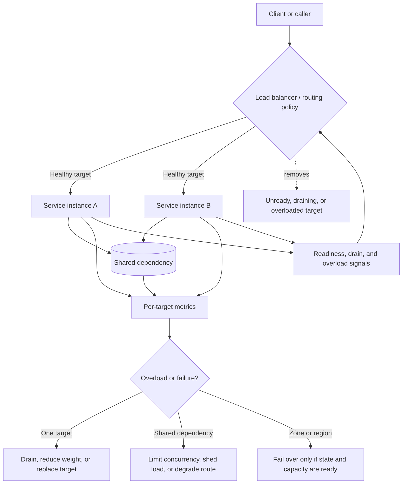

# Load Balancing

Load balancing distributes traffic across service instances, zones, regions, or
versions. It helps with horizontal scale, safer deploys, and failure isolation
when the targets are ready, mostly equivalent, and protected from shared
bottlenecks.

A load balancer does not make a system scalable by itself. It can spread
requests across API instances while the database, cache, queue, provider quota,
hot key, or one overloaded target remains the real limit.

## Purpose

Use this page to reason about:

- which routing rule fits the workload;
- what health checks should remove or keep targets in traffic;
- when sticky sessions help and when they hide state problems;
- what failover means for instances, zones, services, or regions;
- how regional traffic changes data and capacity requirements;
- how overloaded instances are detected before averages hide them.

For the component decision tree, see [Load balancer](../components/load-balancer.md).
This page focuses on scalability trade-offs and failure modes.

## When This Matters

Load balancing matters when:

- one healthy instance is not enough for traffic, deploy safety, or availability;
- stateless service instances can share user requests;
- deployments need weighted rollout, rollback, or connection draining;
- one instance, zone, or region can fail independently;
- user traffic varies by route, tenant, region, or client behavior;
- aggregate metrics look fine while one target is overloaded.

Skip advanced load balancing when version 1 has one instance, low traffic, and
no independent failover requirement. Add measurement first if the bottleneck is
unknown.

## Questions To Ask

- What traffic is being balanced: public HTTP, internal service calls, streams,
  long-lived connections, jobs, or regional user traffic?
- Are targets stateless enough that any healthy target can serve the next
  request?
- What routing decision is required: simple spread, route rule, weighted
  rollout, least-loaded target, zone preference, or regional steering?
- What health signal proves a target should receive this route now?
- What should happen during startup, deploy, drain, overload, dependency
  failure, and target removal?
- Does any workflow need sticky sessions, and what happens when the sticky
  target disappears?
- Which shared dependency becomes hotter as more targets receive traffic?
- What metric shows one target is overloaded even when fleet averages look
  healthy?

## Decision Guidance

### Choose Routing By Requirement

Use the simplest routing rule that explains a real requirement.

| Routing Choice | Use When | Watch For |
| --- | --- | --- |
| Round-robin or random | Targets are equivalent and mostly stateless | Can hide slow or hot targets without per-target metrics |
| Least outstanding requests | Request durations vary significantly | Needs accurate in-flight measurement |
| Weighted routing | Deploy, migration, experiment, or capacity shift needs gradual traffic | Requires rollback and comparison metrics |
| Host or path routing | Different services own different domains or routes | Route conflicts and edge policy sprawl |
| Header or tenant routing | Specific clients, tenants, or versions need isolation | Hidden product logic in routing layer |
| Zone-aware routing | Prefer local targets but survive a zone loss | Uneven capacity and cross-zone fallback behavior |
| Regional routing | User proximity, data residency, or regional failure response matters | Data placement, write ownership, DNS delay, and failover drills |

Layer 4 routing works at the connection level, such as forwarding TCP traffic
without understanding HTTP paths. Layer 7 routing uses application details such
as host, path, method, or headers. Use the shallowest layer that satisfies the
requirement because deeper routing becomes product policy and needs stronger
testing.

Routing should be explainable in one sentence:

```text
Checkout traffic goes to healthy API targets in the same zone when possible,
with a 10% weight to the new version during rollout and automatic removal after
readiness failure.
```

If the routing rule needs a long policy document to understand, it may be
covering for missing service boundaries or product decisions.

### Design Health Checks For Real Readiness

Health checks decide where user traffic goes. A bad check can send traffic to a
broken instance or remove every instance during a shared dependency incident.

Separate these checks:

- liveness: the process is alive and not wedged;
- readiness: the target can serve ordinary traffic now;
- route readiness: a specific route can use its required dependencies;
- startup warm-up: config, caches, connections, and migrations are safe enough;
- drain: the target should stop receiving new work but may finish old work;
- overload: the target is alive but should receive less or no new traffic.

Example:

```text
/livez: process event loop responds.
/readyz: config loaded, database pool available, no shutdown drain in progress.
/readyz/search: search index reachable or degraded search mode enabled.
/readyz/checkout: payment dependency and inventory write path usable enough.
```

Avoid checks that are too shallow:

```text
200 OK from /health while every checkout request fails because config did not
load.
```

Avoid checks that are too deep:

```text
Every target is removed because analytics storage is down, even though checkout
could continue without analytics.
```

### Treat Sticky Sessions As A Temporary Constraint

Sticky sessions route the same user or client to the same target. They can be
useful for legacy local session state, connection affinity, cache warmth, or a
short migration window.

They cost scalability and resilience:

- sticky clients can make one target hot while others are idle;
- target failure can break sessions if state is not recoverable;
- draining and deploys take longer;
- autoscaling may not rebalance existing clients;
- bugs become target-specific and harder to reproduce.

Prefer external session storage, signed client tokens, reconnect behavior, or
idempotent commands. Use sticky sessions only when the design states:

```text
Why stickiness is needed.
How the target can be drained.
What user sees if the target disappears.
When the system will move the state elsewhere.
```

Sticky sessions are a warning that the service is not fully stateless.

### Make Failover Concrete

Failover means traffic moves away from one failed unit. Name that unit.

| Failover Boundary | Detection | Main Risk |
| --- | --- | --- |
| Instance | Readiness, overload, or target errors | In-flight requests and local state |
| Service version | Error budget burn or rollout guardrail | Mixed versions and schema compatibility |
| Zone | Zone-local health, capacity, network failure | Remaining zones may lack spare capacity |
| Dependency path | Route-specific dependency failures | Failover may not help if dependency is shared |
| Region | Synthetic checks, regional SLOs, operator decision | Data, DNS delay, write ownership, and capacity |

Define failover behavior before the incident:

```text
Failure domain: API instance
Detection: readiness failure for 3 checks or p95 latency above 2 seconds for 5 minutes
Traffic shift: remove target and drain open requests
State risk: in-flight checkout command may retry
Safety: idempotency key returns same checkout result
Verification: per-target error rate falls and fleet p95 stays under target
```

Automatic failover works best for stateless instance removal. Regional failover
usually needs more caution, drills, and sometimes manual approval because the
data boundary is larger.

### Handle Regional Traffic Deliberately

Regional traffic is not only a routing problem. It is also a data, capacity,
security, and operations problem.

Regional design choices:

- nearest-region routing for latency-sensitive reads;
- home-region routing when user data has a primary location;
- active-passive routing when one region is standby;
- active-active routing only when writes, conflicts, and replication are
  designed explicitly;
- manual regional recovery when traffic can tolerate a longer interruption.

Questions:

- Which region owns writes for this user, tenant, or object?
- Can another region read the data with acceptable freshness?
- Can one region carry the other region's traffic after failover?
- How long do DNS, clients, or edge caches take to change routes?
- Do sessions, idempotency keys, secrets, queues, and provider credentials exist
  in the failover region?
- Can clients reach regional targets directly and bypass edge authentication,
  TLS or mTLS policy, rate limits, or request logging?
- What is the rollback path if the failed region partially recovers?

Many systems should start with single-region balancing plus a documented
disaster recovery plan. Active regional traffic is justified when latency,
availability, residency, or capacity requirements make the extra state
coordination worth it.

### Detect Overloaded Instances

Fleet averages can hide target-level overload. One target may have a hot tenant,
sticky clients, a bad deploy, a slow dependency connection pool, or a noisy
neighbor while the average looks healthy.

Watch per target and per route:

- p50, p95, and p99 latency;
- error rate and timeout rate;
- active requests and queued requests;
- CPU, memory, event-loop lag, thread pool, and connection pool saturation;
- health-check transitions;
- retry and shed counts;
- traffic share compared with expected weight;
- downstream latency by target.

Respond with:

- remove or reduce weight for one target;
- shed optional routes before critical routes;
- cap per-target concurrency;
- rebalance or expire sticky assignments;
- drain and replace the target;
- protect shared dependencies before adding more traffic.

Do not assume that adding more instances fixes overload. If all targets wait on
the same saturated database, the load balancer only distributes waiting.

## Load Balancing Flow



The routing layer makes traffic choices. The architecture still needs state
ownership, dependency protection, and observability to make those choices safe.

## Original Example

A neighborhood clinic portal has appointment browsing, form upload, and visit
checkout. Traffic spikes every Monday morning when new appointment slots open.

Initial scaling plan:

| Concern | Choice | Reason |
| --- | --- | --- |
| Routing | Simple health-based balancing across three API instances | Requests are stateless after sessions and uploads are externalized |
| Health checks | `/readyz` plus route readiness for checkout and uploads | Search can degrade, checkout cannot fake success |
| Sticky sessions | Avoided for API; WebSocket waiting-room connections reconnect with token | API state should not depend on one target |
| Failover | Automatic instance removal, manual zone failover in version 1 | Instance failure is safe; zone failover needs capacity check |
| Regional traffic | Single home region with documented restore plan | Active-active writes are unnecessary for launch |
| Overloaded target | Reduce weight when per-target p95 exceeds 1.5 seconds for 5 minutes | Avoids hiding one hot instance behind fleet average |

Failure drill:

```text
During deploy, instance B reports ready before its appointment cache is warmed.
Per-target p95 rises only on B. The load balancer removes B after route
readiness fails, existing requests drain, and traffic shifts to A and C. The
team rolls back B, then adds a warm-up check before the next deploy.
```

The load balancer is useful because the service is already mostly stateless,
the health checks match real routes, and the shared appointment database has
connection caps. Without those pieces, balancing would only move the problem.

## Trade-Offs

| Choice | Benefit | Cost Or Risk |
| --- | --- | --- |
| Simple routing | Easy to operate and debug | Less control during deploys or uneven load |
| Weighted routing | Safer rollout and migration | Needs clear comparison and rollback metrics |
| Deep health checks | Catch route-specific breakage | Can remove too much capacity during shared dependency incidents |
| Shallow health checks | Keep capacity during dependency incidents | May route traffic to targets that cannot serve key workflows |
| Sticky sessions | Preserve local affinity during migration | Uneven load and fragile failover |
| Automatic failover | Faster recovery for known failure domains | Bad detection can flap or move traffic unsafely |
| Regional routing | Lower latency or better outage response | Data ownership, replication, capacity, and operations complexity |
| Load shedding | Protects critical paths during overload | Users see explicit rejection or degraded behavior |

## Failure Modes

| Failure Mode | User Impact | Design Response | Signal |
| --- | --- | --- | --- |
| Health check too shallow | Users hit targets that cannot serve real routes | Readiness and route-specific checks | Errors immediately after target marked ready |
| Health check too deep | All targets leave rotation during non-critical dependency failure | Degraded mode and route-specific dependency checks | All-target unhealthy event |
| Sticky target fails | User session, upload, or connection is interrupted | Externalized state and reconnect behavior | Session loss or reconnect spike |
| Overloaded target hidden by average | Some users see high latency while dashboard looks fine | Per-target metrics and weight reduction | One target p95, CPU, or pool outlier |
| Shared dependency overload | More instances amplify the same bottleneck | Connection caps, rate limits, backpressure | Pool exhaustion, downstream p95, timeout rate |
| Failover flaps | Traffic moves repeatedly and worsens incident | Stable health windows and manual guardrails for risky failover | Repeated add/remove events |
| Regional failover lacks data | Users reach region that cannot complete workflow | Data ownership and RPO/RTO design | Failover errors, replication lag, missing keys |
| Route rule conflict | Requests reach wrong service or version | Owned route table and tests | Route mismatch, 404/5xx by path |
| Direct target access bypasses edge policy | Clients skip auth, TLS or mTLS, rate limits, or logging | Restrict direct access and verify edge-only routes | Direct-target request count |
| Draining missing | Deploys drop in-flight requests | Readiness removal and graceful shutdown | Reset connections and deploy-time errors |

## Common Mistakes

- Adding a load balancer before making targets stateless enough.
- Treating a process-up check as readiness for real user workflows.
- Making every dependency part of one global health check.
- Using sticky sessions as a permanent substitute for session design.
- Looking only at fleet averages instead of per-target and per-route behavior.
- Scaling instances while ignoring database connections or provider quotas.
- Assuming automatic failover is safe without naming state risk.
- Adding active regional routing before data ownership and capacity are ready.
- Forgetting connection draining during deploys and autoscaling.

## Checklist

Before relying on load balancing, confirm:

- [ ] The traffic type and workflow are named.
- [ ] Targets are stateless enough for any healthy target to serve the next
      request, or sticky-session risk is explicit.
- [ ] Routing rules are simple, owned, and tested.
- [ ] Health checks distinguish liveness, readiness, route readiness, warm-up,
      drain, and overload behavior.
- [ ] Sticky sessions have a failure, rebalance, and migration plan if used.
- [ ] Failover names the boundary: instance, version, zone, dependency path, or
      region.
- [ ] Regional traffic decisions include data ownership, replication freshness,
      capacity, secrets, queues, and rollback.
- [ ] Targets cannot be reached directly in ways that bypass authentication,
      TLS or mTLS policy, rate limits, or request logging.
- [ ] Per-target metrics expose latency, errors, saturation, active requests,
      health transitions, and traffic share.
- [ ] Shared dependencies have connection caps, rate limits, backpressure, or
      load shedding.
- [ ] Deployments include readiness gates, weighted rollout when needed,
      rollback, and connection draining.
- [ ] The design explains how overloaded instances are removed, reduced, or
      replaced.

## Related Pages

- [Load balancer component](../components/load-balancer.md)
- [Stateless services](stateless-services.md)
- [Vertical vs horizontal scaling](vertical-vs-horizontal-scaling.md)
- [Bottleneck analysis](bottleneck-analysis.md)
- [Capacity estimation](capacity-estimation.md)
- [Availability requirements](../requirements/availability.md)
- [Latency requirements](../requirements/latency.md)
- [Scalability requirements](../requirements/scalability.md)
- [Disaster recovery](../reliability/disaster-recovery.md)
- [Observability basics](../operations/observability-basics.md)
