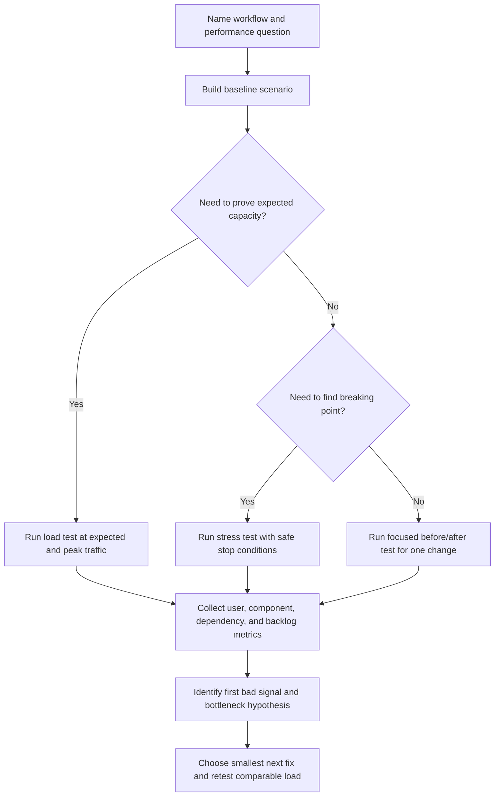

# Performance Testing Playbook

Performance testing is the practice of applying controlled traffic to a system
so the team can learn how latency, throughput, errors, saturation, backlog, and
cost behave before users discover the limit first.

The point is not to produce the biggest number. The point is to answer a design
question:

```text
Can this workflow meet its target load, and what fails first when it cannot?
```

Use [Bottleneck analysis](bottleneck-analysis.md) when a test exposes a limit.
Use [Capacity estimation](capacity-estimation.md) before testing when the load
shape is still a guess.

## Purpose

Use this playbook to answer:

- What is the current baseline for a critical workflow?
- Can the system handle expected load and peak load?
- Where is the first bottleneck as traffic increases?
- How does the system fail beyond its intended capacity?
- Which result is user-visible and which result is only an internal signal?
- Which scaling, query, timeout, queue, cache, or configuration change should be
  tried next?

The output should be a decision, not only a chart. A useful performance test
ends with a statement such as: "checkout p95 met the target at 300 RPS, but
database connection use crossed 80%, so the next change is query and pool
tuning before adding app instances."

## When This Matters

Performance testing matters when:

- a new workflow has a latency, throughput, freshness, or cost target;
- expected traffic is near an unknown system limit;
- a launch, migration, marketing event, or deadline will create a peak;
- a team is deciding whether to add cache, replicas, queues, shards, workers, or
  larger instances;
- an incident suggests the system has a bottleneck that cannot be reproduced
  with one manual request;
- a change claims to improve performance and needs before/after proof;
- background work can fall behind while user requests still appear successful.

It matters less when the system is small, the load is far below capacity, and a
single obvious fix can be verified with focused functional checks and metrics.

## Questions To Ask

Start with the workflow:

- Which user action, API command, job, import, export, or event flow is being
  tested?
- What is the success condition: p95 latency, p99 latency, throughput, queue
  age, freshness, error rate, or cost?
- What traffic mix represents real use: reads, writes, cache hits, cache misses,
  authenticated users, tenants, payload sizes, and background work?
- What data volume and data distribution should exist before the test starts?
- What dependencies are real, mocked, rate-limited, or excluded?
- What is the safe stop condition?

Then prepare interpretation:

- Which metric proves user impact?
- Which metric is expected to saturate first?
- Which component metrics must be captured during the test?
- What result would justify a simple fix instead of new architecture?
- What result would invalidate the current scaling plan?
- How will the team compare before and after results under the same load shape?

## Test Selection Flow



Do not start with a stress test if the team does not know the baseline. Without
a baseline, the test can show that the system breaks without showing whether
the current design is already good enough for the expected requirement.

## Decision Guidance

### Define The Scenario Before The Tool

The test tool is less important than the scenario. A realistic scenario names
actors, actions, data, traffic mix, and success criteria.

Use a short test statement:

```text
Workflow: residents search programs and register for one open seat
Traffic mix: 80% search, 15% detail view, 5% registration writes
Data: 10,000 programs, 200,000 residents, skewed demand for 50 popular programs
Target: search p95 below 500 ms, registration p95 below 800 ms, errors below 1%
Peak: 600 search RPS and 35 registration RPS for 15 minutes
Stop: any payment/provider call disabled, database CPU above 90% for 5 minutes,
      or user-facing error rate above 5%
```

This keeps the test tied to a design decision. A generic "run 1,000 RPS" test
is rarely useful unless the workflow, data, and target are also named.

### Baseline Tests

A baseline test records how the system behaves under known, repeatable
conditions. It gives future tests something honest to compare against.

Run a baseline when:

- a page, API, job, or query becomes important enough to track;
- a new performance-sensitive feature is added;
- a team wants to compare a before/after change;
- production metrics exist but the team needs a controlled reproduction;
- capacity estimates need a starting point.

Baseline test shape:

- run one critical workflow with realistic data;
- use a traffic level the system should comfortably handle;
- keep the load shape, test data, environment, and configuration recorded;
- capture p50, p95, p99, throughput, error classes, saturation, queue age, and
  dependency behavior;
- record cost or resource use when it affects scaling decisions.

A baseline is not a pass/fail event by itself. It is the reference point. If a
future change improves average latency but worsens p99 latency or database
connections, the baseline helps catch the trade-off.

### Load Tests

A load test checks whether the system can handle expected traffic and planned
peak traffic while meeting its user-visible target.

Use load tests when:

- there is a known launch, deadline, or campaign peak;
- capacity estimates suggest a component may saturate;
- autoscaling, queues, rate limits, or cache behavior must be verified;
- a workflow has an explicit latency, error, or freshness target;
- a release changes a hot path.

Good load tests increase confidence because they model:

- realistic read/write mix;
- authenticated and anonymous traffic if both exist;
- cache warm and cache cold behavior when relevant;
- tenant, key, or item popularity skew;
- payload sizes and pagination shape;
- background jobs, retries, and provider calls where safe;
- ramp-up and ramp-down, not only a sudden flat load.

Interpret a load test against the stated target:

```text
Expected load passed:
search p95 = 320 ms at 400 RPS
registration p95 = 620 ms at 25 RPS
error rate = 0.3%
database connections = 58% of cap
oldest reminder job age = 40 seconds
```

This result does not prove the system is infinitely scalable. It proves the
tested workflow met the named requirement with the measured headroom.

### Stress Tests

A stress test intentionally pushes beyond expected load to learn where and how
the system fails. It should have safe stop conditions and a recovery check.

Use stress tests when:

- the team needs to find the first bottleneck;
- overload behavior matters as much as normal performance;
- rate limits, backpressure, queues, circuit breakers, and bulkheads need proof;
- a dependency outage or retry storm could amplify traffic;
- the team needs to set alert thresholds or capacity triggers.

Stress tests should answer:

- What breaks first?
- Does the system fail by slowing down, rejecting work, queueing, timing out, or
  corrupting user expectations?
- Does low-priority work shed before critical work fails?
- Does the system recover after load returns to normal?
- Which metric gives the earliest actionable warning?

Stop before the test becomes destructive. A good stress test may stop when
database connections stay above a cap, queue age crosses a freshness threshold,
provider quota is near exhaustion, or error rate exceeds the agreed limit.

### Bottleneck Discovery

Performance tests find bottlenecks only when the right evidence is captured
during the test. Traffic alone is not enough.

Capture user-visible signals:

- throughput by workflow;
- success and error rate by class;
- p50, p95, and p99 latency;
- freshness or queue age for asynchronous work;
- rejected, throttled, or degraded responses;
- completed business action count.

Capture likely cause signals:

- CPU, memory, garbage collection, disk, network, and file descriptors;
- database query latency, rows scanned, connection use, lock waits, conflicts,
  and replication lag;
- cache hit rate, miss rate, eviction, and source-of-truth fallback load;
- queue enqueue rate, dequeue rate, depth, oldest age, retry count, and
  dead-letter count;
- dependency latency, timeout rate, rate-limit responses, retry volume, and
  provider quota use;
- per-tenant, per-key, per-route, or per-job skew when safe.

Then ask which signal got worse first. If application CPU rises first and
database headroom remains comfortable, adding stateless app capacity may help.
If database connections saturate first, adding app instances may make the
system worse.

### Interpreting Results

Interpret results against the original question, not against a generic idea of
"fast."

Use this order:

1. Confirm the test was valid.
2. Check user-visible pass/fail criteria.
3. Identify the first bad signal.
4. Separate symptom metrics from cause metrics.
5. Decide the smallest next change.
6. Retest with comparable load shape and traffic mix.

Validation questions:

- Did the test data match expected size and skew?
- Did the traffic mix match real use?
- Were caches warm or cold in the intended way?
- Were dependencies real, mocked, or rate-limited as documented?
- Did client-side limits, test runners, network, or load generators become the
  bottleneck?
- Did error rates include validation failures separately from system failures?
- Did the test run long enough to show queue age, cache churn, or memory growth?

Result interpretation examples:

| Result | Likely Meaning | Next Move |
| --- | --- | --- |
| Average latency improves, p99 worsens | Tail path or contention got worse | Inspect slow traces, locks, queues, and retries |
| Throughput plateaus while CPU is low | Shared dependency or lock is limiting | Check database, provider, queue, and connection metrics |
| More workers increase queue retries | Downstream limit is being overloaded | Cap workers, add backpressure, or fix dependency path |
| Cache hit rate rises but conflicts rise | Cache may be serving stale hints | Recheck source-of-truth write and freshness policy |
| Error rate rises before saturation | Timeout, validation, or dependency behavior may be wrong | Classify errors before scaling capacity |
| Cost rises faster than successful work | Scaling move is inefficient | Reduce work, fix hot path, or set a different scaling trigger |

Do not summarize a test only with "passed" or "failed." Record the load,
target, headroom, first bottleneck, and next decision.

## Trade-Offs

| Choice | Benefit | Cost |
| --- | --- | --- |
| Baseline test | Gives repeatable before/after comparison | May miss behavior at peak load |
| Load test | Proves expected capacity against a target | Can create false confidence if traffic mix is unrealistic |
| Stress test | Finds breaking point and overload behavior | Needs safety controls and recovery validation |
| Real dependencies | Exposes real latency, quotas, and failure modes | Can be expensive or risky without isolation |
| Mocked dependencies | Keeps tests safe and repeatable | Can hide provider bottlenecks and retry behavior |
| Production-like data | Reveals skew, indexes, and hot keys | Requires privacy-safe setup and maintenance |
| Small focused test | Easy to interpret and repeat | May miss interaction effects |
| Full workflow test | Shows end-to-end user behavior | Harder to debug without component metrics |

Pick the smallest test that can answer the design question, then broaden only
when the narrow test cannot explain the risk.

## Common Mistakes

- Running a stress test before recording a baseline.
- Testing one endpoint with uniform traffic when real traffic has read/write
  mix, tenant skew, and hot keys.
- Treating average latency as sufficient and ignoring p95, p99, and queue age.
- Forgetting background jobs, retries, provider calls, cache misses, and
  database connection pools.
- Letting the load generator become the bottleneck.
- Comparing before and after results with different data, traffic mix, or cache
  state.
- Declaring success while errors are hidden in async work or dead-letter queues.
- Adding instances after a test without checking shared downstream limits.
- Running risky tests in production without stop conditions, isolation, and
  rollback.
- Reporting charts without a decision or follow-up threshold.

## Example

A library lending platform is preparing for a popular equipment reservation
window. Residents can search equipment, view item details, and reserve a time
slot. The team estimates a fifteen-minute peak when registration opens.

Test statement:

```text
Workflow: search equipment, view item, reserve slot
Traffic mix: 75% search, 20% detail view, 5% reservation writes
Data: 50 branches, 40,000 items, 500,000 residents, 200 hot items
Target: search p95 < 450 ms, reservation p95 < 900 ms, system errors < 1%
Peak: 700 read RPS and 35 write RPS for 15 minutes
Stop: database connections above 85% for 3 minutes, error rate above 5%,
      or oldest confirmation job above 5 minutes
```

Baseline at comfortable load:

| Signal | Result |
| --- | --- |
| Search load | 150 RPS |
| Search p95 | 210 ms |
| Reservation p95 | 480 ms |
| System error rate | 0.1% |
| Database connections | 38% of cap |
| Confirmation queue oldest age | 12 seconds |

Peak load test:

| Signal | Result | Interpretation |
| --- | --- | --- |
| Search load | 700 RPS | Target load reached |
| Search p95 | 780 ms | User-visible read target failed |
| Reservation p95 | 820 ms | Write target still passed |
| Database rows scanned | 25x baseline for search | Search query shape is suspect |
| Database connections | 82% of cap | Shared database is close to limit |
| App CPU | 48% | App instances are not the first bottleneck |
| Confirmation queue oldest age | 70 seconds | Background work remains within target |

Decision:

- do not add app instances first because CPU is not saturated and database
  connections are near the limit;
- add or adjust the search index and reduce result payload;
- keep reservation writes centralized because write latency still meets the
  target and conflicts are low;
- rerun the same peak load shape after the query change;
- set a revisit trigger when search p95 exceeds 450 ms at 700 RPS or database
  connections exceed 70% during the peak window.

Follow-up result:

```text
After query/index change:
search p95 = 340 ms at 700 RPS
database connections = 55% of cap
rows scanned = near baseline
confirmation queue oldest age = 65 seconds
```

The test justifies a small query/index fix instead of horizontal scaling. It
also leaves a clear trigger for the next capacity review.

## Checklist

Before trusting a performance test, confirm:

- The workflow, actors, data shape, and traffic mix are named.
- Baseline results exist for the same scenario or the missing baseline is
  explicitly called out.
- Load tests include expected and peak traffic, not only average traffic.
- Stress tests have safe stop conditions and recovery checks.
- User-visible success criteria include latency percentiles, error classes,
  freshness, queue age, or completed workflow count as appropriate.
- Component metrics cover CPU, memory, database, cache, queue, network,
  dependencies, and provider quotas where relevant.
- Test data includes realistic volume and skew without exposing private data.
- Dependencies are documented as real, mocked, rate-limited, or excluded.
- Load generator limits are ruled out.
- Before/after comparisons use comparable load shape, traffic mix, data, cache
  state, and configuration.
- Results identify the first bad signal and the likely bottleneck.
- The next change is the smallest change that addresses the measured
  bottleneck.
- The report states what metric triggers another test or scaling review.

## Related Pages

- [Scalability overview](./)
- [Bottleneck analysis](bottleneck-analysis.md)
- [Capacity estimation](capacity-estimation.md)
- [Vertical vs horizontal scaling](vertical-vs-horizontal-scaling.md)
- [Database read scaling](database-read-scaling.md)
- [Rate limiting](rate-limiting.md)
- [Metrics](../operations/metrics.md)
- [Observability basics](../operations/observability-basics.md)
- [Retries and backoff](../communication/retries-and-backoff.md)
- [Timeouts](../reliability/timeouts.md)
- [Bulkheads](../reliability/bulkheads.md)
