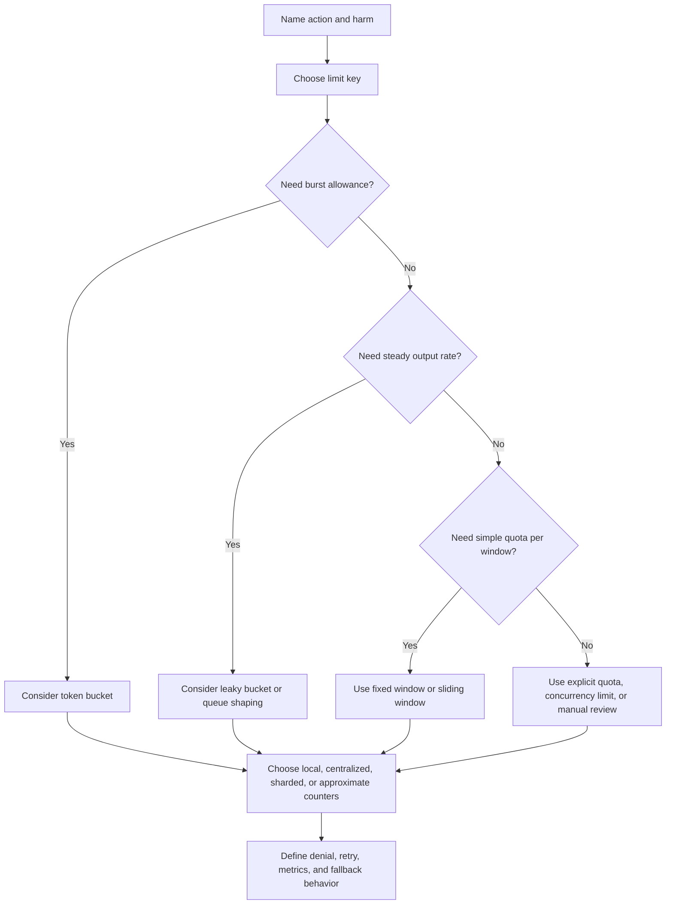

# Rate Limiting

Rate limiting controls how quickly callers can use a system. It protects shared
capacity, keeps one caller from crowding out others, and gives operators a
predictable response when traffic spikes. It is also a user-facing product
decision: a limit that is technically correct but unfair or confusing will cause
support load and retry storms.

Use [Rate limiting and abuse resistance](../security/rate-limiting-and-abuse.md)
to identify abuse cases and risky workflows. Use this page to choose the limit
shape, key, algorithm, storage, and failure behavior.

## Purpose

Use rate-limiting design to answer:

- which action needs a limit and why;
- which caller or resource shares the budget;
- whether the limit should smooth bursts, cap total usage, or protect a scarce
  dependency;
- which algorithm fits the traffic pattern;
- whether counters can be local, centralized, sharded, or approximate;
- what clients and users see when the limit is reached.

The goal is to protect capacity and fairness with the least complex mechanism
that matches the requirement.

## When This Matters

Rate limiting changes the architecture when:

- public or partner APIs can be called directly;
- login, signup, reset, invite, or token flows can be brute-forced;
- one tenant, account, client, or IP range can consume shared capacity;
- requests trigger expensive reads, writes, searches, exports, background jobs,
  provider calls, or notifications;
- traffic arrives in bursts that the downstream system cannot absorb;
- the system must expose stable retry behavior to API clients;
- counters need to work across multiple application instances.

It matters less when traffic is small, callers are trusted, and the downstream
path has comfortable headroom. Even then, documenting the revisit signal is
useful because public traffic patterns can change quickly.

## Questions To Ask

Start from the protected workflow:

- What harm does repeated use cause: overload, cost, abuse, unfairness, or
  dependency throttling?
- Is the limit protecting one caller, one resource, one tenant, or the whole
  system?
- What is the normal burst pattern for legitimate use?
- Should unused capacity accumulate for later bursts?
- Should requests be rejected, delayed, queued, or shaped into a steady rate?
- How exact does the limit need to be?
- Can the system tolerate stale, approximate, or eventually consistent counters?
- What happens if the limit store is unavailable?
- Which response code, retry hint, metric, and log field tells clients and
  operators what happened?

## Rate-Limit Decision Flow



## Decision Guidance

### Start With The Limit Statement

Write the limit in a form a reviewer can test:

```text
Caller: <user, IP, tenant, API key, service, or resource>
Action: <endpoint, command, export, search, login attempt, provider call>
Budget: <count or rate>
Window: <time span or refill rate>
Burst: <allowed or not>
Behavior: <reject, delay, queue, challenge, or review>
Failure mode: <fail open, fail closed, use local fallback, or degrade>
```

Example:

```text
Caller: partner API key
Action: create reservation request
Budget: 120 requests per minute
Window: rolling 60 seconds
Burst: up to 30 extra requests if tokens accumulated
Behavior: return stable rate-limit error with retry hint
Failure mode: fail closed for writes that create provider calls
```

This statement prevents vague limits such as "rate limit the API" from hiding
key decisions.

### Choose The Limit Key

The limit key defines who shares the budget. It often matters more than the
algorithm.

| Limit Key | Good Fit | Watch For |
| --- | --- | --- |
| User ID | Signed-in product actions and per-user fairness | Fake accounts and account takeover can spread usage |
| Tenant or organization ID | Customer fairness and shared plan quotas | One noisy user can consume the tenant budget |
| API key or client ID | Public APIs, partner clients, service clients | Leaked keys need revocation and auditability |
| IP address | Anonymous traffic and coarse edge protection | Shared networks, mobile carriers, and source rotation |
| Resource ID | Protect one target such as a reset token, room, post, or export | Attackers may rotate targets |
| Global key | Protect a dependency or whole cluster | Can block everyone during one caller's spike |

Use multiple keys when the harm crosses boundaries. Login may need per account
and per source limits. Exports may need per user, per tenant, and global worker
limits. Provider calls may need per tenant and global budgets so one tenant
cannot exhaust the provider quota for everyone.

### Fixed Window

Fixed window counts requests in discrete windows, such as one minute or one
hour. When the window resets, the counter starts over.

Use fixed window when:

- the requirement is simple;
- exact smoothing is not important;
- a small boundary burst is acceptable;
- implementation speed matters more than precision;
- the limit protects low-risk or early version 1 paths.

Example:

```text
Allow 100 search requests per user per minute.
Counter key: user_id + current minute.
Reject request 101 until the next minute begins.
```

Benefits:

- easy to explain, implement, test, and observe;
- counters expire naturally with the window;
- works well for coarse quotas and simple API plans.

Costs:

- callers can burst at the boundary by using the end of one window and the
  start of the next;
- all callers reset at the same time unless windows are offset;
- short windows can feel jumpy, while long windows can feel unfair.

Fixed window is a good first choice when the risk of boundary bursts is small.
Do not use it as the only protection for scarce dependencies or high-value
abuse paths.

### Sliding Window

Sliding window limits requests over the most recent period instead of a fixed
calendar bucket. A request at 12:00:30 checks roughly the previous 60 seconds,
not only the current minute.

Use sliding window when:

- boundary bursts would be harmful;
- the limit should feel fairer to clients;
- the system can afford more counter work;
- the protected action has moderate risk or cost.

Common approaches:

- store timestamps for recent requests and remove old entries;
- store smaller buckets, such as per-second counts, and sum the last N buckets;
- estimate a weighted count from the current and previous fixed windows.

Benefits:

- smoother than fixed window;
- reduces burst abuse at reset boundaries;
- easier to explain to API clients as "last N seconds."

Costs:

- more storage or computation than fixed window;
- exact timestamp logs can grow under high traffic;
- approximate bucketed windows can still have edge cases;
- distributed implementations need careful clock and storage behavior.

Sliding window is often a good default for public APIs that need fairness but do
not need burst credits.

### Token Bucket

Token bucket allows bursts while enforcing an average rate. Tokens refill over
time up to a maximum capacity. Each request spends one or more tokens. If no
tokens are available, the request is denied, delayed, or queued.

Use token bucket when:

- legitimate traffic is bursty;
- clients should accumulate some unused capacity;
- the system cares about average rate and burst size separately;
- different actions should cost different numbers of tokens.

Example:

```text
Bucket capacity: 50 tokens
Refill rate: 10 tokens per second
Cost: 1 token for a normal search, 5 tokens for an export preview
```

Benefits:

- supports natural bursts without raising the long-term rate;
- separates sustained rate from burst capacity;
- can model high-cost actions by charging more tokens;
- works well for public APIs and interactive user actions.

Costs:

- requires storing last refill time and token balance;
- clock skew and concurrent updates matter in distributed systems;
- burst capacity can still overload a downstream dependency if set too high;
- clients need clear retry behavior when the bucket is empty.

Token bucket is a strong fit when user experience needs short bursts, such as
loading several page assets, making several quick edits, or retrying a small
number of transient failures.

### Leaky Bucket

Leaky bucket shapes traffic into a steady output rate. Requests enter a queue or
bucket, and work drains at a fixed pace. If the bucket is full, new requests are
rejected or dropped.

Use leaky bucket when:

- downstream capacity needs a steady flow;
- queue length can be bounded safely;
- delayed work is acceptable;
- the system needs backpressure rather than immediate rejection.

Example:

```text
Accept export jobs into a tenant queue.
Drain at 2 jobs per second.
Reject or defer new jobs when the queue exceeds 500 pending jobs.
```

Benefits:

- smooths bursts before they reach a dependency;
- makes queue depth and drain rate observable;
- works well for background jobs, notifications, and provider calls.

Costs:

- adds latency because requests may wait;
- requires queue capacity, ordering, duplicate handling, and cancellation rules;
- poor fit for actions that need immediate user response;
- if the drain rate is wrong, backlog grows silently until users notice.

Leaky bucket is closer to traffic shaping than request denial. Use it when the
system can safely delay work and operators can monitor backlog.

### User Limits

User limits protect fairness and reduce damage from one account. They work well
for signed-in actions such as search, comments, reservations, exports, uploads,
or notifications.

Design choices:

- choose whether the key is user ID, account ID, tenant membership, or session;
- define separate budgets for low-cost and high-cost actions;
- account for compromised users and fake-account creation;
- decide whether admins, staff, partners, or support users have different
  limits;
- make denial understandable and recoverable.

User limits should not replace authorization. A user may be under their rate
limit and still lack permission to perform the action. For high-risk actions,
combine user limits with step-up proof, audit logs, and approval where needed.

### IP Limits

IP limits are useful for anonymous traffic and coarse protection at the edge.
They are weak as the only fairness model.

Use IP limits for:

- anonymous signup, login, reset, and search bursts;
- early rejection before expensive application work;
- rough protection when no stronger identity exists;
- detecting unusual traffic patterns by source.

Watch for:

- many legitimate users behind one shared IP;
- mobile carriers and corporate networks;
- attackers rotating across many sources;
- IPv6 address ranges where one person may have many addresses;
- privacy concerns when logging source details.

Use IP limits as one signal, not the whole design. Pair them with account,
tenant, API key, resource, or action limits when those identities exist.

### Distributed Counters

Distributed counters matter when more than one application instance enforces
the same limit. A limit that works on one process can be bypassed by spreading
requests across many instances.

Options:

| Counter Pattern | Good Fit | Cost Or Risk |
| --- | --- | --- |
| Local in-process counter | Single instance, development, best-effort soft limits | Bypassed across instances and lost on restart |
| Centralized counter store | Stronger shared limit across instances | Adds latency and a dependency on the counter store |
| Sharded counters | High write volume across many keys | Requires aggregation and can be approximate |
| Edge or gateway limit | Rejects before application work | May lack user or tenant context |
| Database-backed counter | Low-volume high-risk actions needing transactions | Can add write contention to the database |
| Approximate counter | High-volume coarse protection | Can over- or under-limit near boundaries |

Design questions:

- Is exactness required, or is approximate protection enough?
- Can the limit store be on the request path?
- What latency budget does the counter check have?
- How are counters expired, compacted, or reset?
- How are duplicate requests or retries counted?
- What happens if the counter store is unavailable?

For high-risk writes, exact counters may be worth the dependency. For noisy
read traffic, approximate or edge limits may protect the system well enough.

### Denial, Retry, And Headers

Rate limiting is part of the public contract for APIs and user flows.

Define:

- the status or error code for limited requests;
- whether clients receive a retry hint;
- whether the response includes remaining budget or reset time;
- whether denied requests are counted again;
- whether retries should use backoff and jitter;
- whether user-facing messages reveal safe next steps without exposing private
  security rules.

For browser flows, "try again later" may be enough for low-risk actions. For
public APIs, stable error codes and retry behavior are important because clients
will automate against them.

### Failure Behavior

Limit checks can fail. The design should state what happens before production
traffic finds out.

Options:

| Failure Mode | Good Fit | Risk |
| --- | --- | --- |
| Fail open | Low-risk reads where availability matters most | Abuse can pass during counter outage |
| Fail closed | High-risk writes, exports, credential flows, provider calls | Users may be blocked during counter outage |
| Local fallback | Short counter-store outages with conservative local limits | Inconsistent across instances |
| Queue and retry | Background work where delay is acceptable | Requires durable queue and duplicate handling |
| Degrade feature | Expensive optional path such as export preview or broad search | Users lose functionality temporarily |

Choose by harm. Login guesses, exports, and provider-triggering writes usually
deserve stricter behavior than low-risk browsing.

### Keep Version 1 Practical

Version 1 can often use simple limits:

- fixed window for low-risk coarse limits;
- sliding window for fairer public API limits;
- token bucket for user-facing bursts;
- leaky bucket or queue shaping for background jobs and provider calls;
- centralized counters only where multiple instances must share one budget;
- clear metrics for allowed, denied, delayed, and failed limit checks.

Revisit when traffic grows across instances, clients need a formal API
contract, attacks become more sophisticated, counter storage becomes a
bottleneck, or false positives create support load.

## Algorithm Comparison

| Algorithm | Best Fit | Main Benefit | Main Cost |
| --- | --- | --- | --- |
| Fixed window | Simple quotas and early version 1 limits | Easy to implement and explain | Boundary bursts near reset time |
| Sliding window | Fairer public API limits | Smooths reset-boundary bursts | More storage or computation |
| Token bucket | Bursty legitimate traffic | Allows bursts while enforcing average rate | Needs token state and careful burst sizing |
| Leaky bucket | Downstream shaping and queued work | Smooth output rate | Adds latency and queue management |

Choose the algorithm after naming the action, harm, limit key, and user-visible
behavior. The wrong key with the right algorithm is still the wrong limit.

## Common Mistakes

- Starting with an algorithm before naming the abuse, fairness, or capacity
  requirement.
- Using one global limit for all users, tenants, endpoints, and costs.
- Relying only on IP limits for signed-in or partner traffic.
- Letting expensive actions cost the same as cheap reads.
- Forgetting retries, idempotency, and duplicate counting.
- Using local counters in a horizontally scaled system without accepting the
  bypass risk.
- Hiding limit denials from metrics and logs.
- Failing open for high-risk actions without alerting.
- Setting burst capacity higher than the downstream dependency can absorb.
- Returning confusing errors that cause clients to retry harder.

## Example

A neighborhood equipment library has public search, resident reservations,
partner kiosk traffic, reminder notifications, and admin exports.

Rate-limit design:

| Workflow | Limit Key | Algorithm | Behavior |
| --- | --- | --- | --- |
| Public search | IP plus optional session | Sliding window | Reject broad anonymous bursts and show a safe retry message |
| Resident reservation request | User ID and tool ID | Token bucket | Allow short bursts, but charge duplicate reservation attempts |
| Partner kiosk API | API key and tenant ID | Token bucket | Return stable API error with retry hint |
| Reminder notifications | Tenant queue | Leaky bucket | Drain at provider-safe rate and alert on backlog |
| Admin export | User ID and tenant ID | Fixed daily quota plus audit | Require MFA and fail closed if quota check is unavailable |

Rejected for version 1:

- a distributed high-volume approximate counter for every endpoint, because the
  first traffic level only needs shared counters for public search and partner
  APIs;
- a global IP-only limit, because partner kiosks and residents need different
  fairness keys;
- unlimited notification retries, because provider calls are the first scarce
  dependency.

The first version protects capacity and abuse paths while keeping the algorithm
choices explainable.

## Checklist

Before accepting a rate-limiting design, confirm:

- The protected action and harm are named.
- The limit key matches the caller, tenant, resource, API key, IP, or global
  dependency being protected.
- Fixed window, sliding window, token bucket, or leaky bucket is chosen for a
  specific traffic shape.
- User limits and IP limits are treated as different tools with different
  failure modes.
- Expensive actions can have different costs or quotas than cheap reads.
- Distributed counter behavior is explicit for multi-instance deployments.
- Counter exactness, expiry, clock behavior, and retry counting are clear enough
  to test.
- Denied requests have stable user or API behavior.
- Retry hints, backoff expectations, metrics, and logs are defined.
- Limit-store failure behavior is explicit for low-risk and high-risk actions.
- Version 1 uses the simplest mechanism that protects the stated harm.

## Related Pages

- [Rate limiting and abuse resistance](../security/rate-limiting-and-abuse.md)
- [Capacity estimation](capacity-estimation.md)
- [Database read scaling](database-read-scaling.md)
- [Retries and backoff](../communication/retries-and-backoff.md)
- [Idempotency](../communication/idempotency.md)
- [Timeouts](../reliability/timeouts.md)
- [Bulkheads](../reliability/bulkheads.md)
- [Security design overview](../security/)
- [Operations](../operations/)
- [Glossary](../glossary.md)
