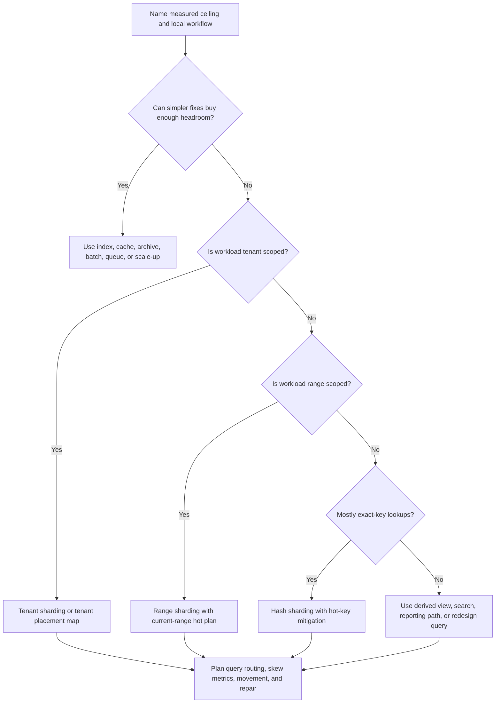

# Sharding Strategies

Sharding splits a data set across multiple storage nodes, clusters, or
placement groups so one store is no longer the only capacity or isolation
boundary. It can raise ceilings for data size, write throughput, tenant
isolation, or maintenance windows, but it also adds routing, resharding, hot
shards, cross-shard query complexity, and repair work.

Use sharding only after naming the pressure that simpler fixes no longer solve.
It is a long-lived operational commitment, not a generic symbol for scale.

## Purpose

Use this page to decide:

- when sharding is justified instead of indexing, caching, archiving, or scale-up;
- whether tenant, hash, or range sharding matches the workload;
- how query complexity changes after data is split;
- what hot shards look like and how they are handled;
- what resharding costs before, during, and after data movement;
- which metrics prove the sharding plan is working.

For the data-modeling primer, see
[Partitioning and sharding](../data/partitioning-and-sharding.md). This page
focuses on scalability strategy and operational cost.

## When This Matters

Sharding matters when:

- one database, table, partition, or tenant has reached a measured capacity
  ceiling;
- write throughput is limited by one writer, log, partition, or hot key;
- storage growth makes backup, restore, migration, or retention windows too
  large;
- a few tenants need scale, compliance, placement, or noisy-neighbor isolation;
- operational work would be safer by moving one tenant, range, or shard at a
  time.

It is usually premature when the real issue is a missing index, broad query,
unbounded report, cacheable read, long transaction, or background job competing
with user traffic.

## Questions To Ask

- What measured ceiling requires sharding?
- Which access pattern must stay local to one shard?
- What shard key is stable, present on requests, and high-cardinality enough?
- Which reads, writes, reports, or repairs will cross shards?
- How will routing find the right shard?
- What happens when one shard gets much hotter than the others?
- How will new shards be added and old shards split, moved, retired, or merged?
- How will backups, restores, schema changes, reindexing, and analytics work by
  shard?
- Which metric triggers resharding before it becomes urgent?

## Decision Guidance

### Choose The Shard Key From The Local Workflow

The shard key determines which data is colocated and which work becomes
distributed. Pick it from the most important local read or write path, not from
the field that is easiest to hash.

Good shard key properties:

- available on every request that needs routing;
- stable for the life of the record or movable through an explicit migration;
- high-cardinality enough to distribute load;
- aligned with ownership, tenant, time, region, or resource boundaries;
- keeps important transactions local;
- supports backup, restore, and repair boundaries.

Weak shard key properties:

- low-cardinality values such as status or type;
- fields that change often;
- keys not known until after a cross-shard lookup;
- keys that concentrate the largest tenant, celebrity user, or current time
  window on one shard;
- keys that make the main query scatter across every shard.

Example:

```text
Workflow: list open work orders for one building and create updates for that
building.
Likely shard key: building_id or tenant_id + building_id.
Weak key: random work_order_id if the main list query is building-scoped.
```

### Use Tenant Sharding For Isolation

Tenant sharding places each tenant, account, workspace, organization, or group
of tenants on a shard. It is useful when tenant boundaries dominate reads,
writes, operations, or compliance.

Use tenant sharding when:

- most queries include tenant ID;
- tenants need independent backup, restore, export, deletion, or placement;
- large tenants should not slow small tenants;
- enterprise tenants may need dedicated capacity;
- cross-tenant operations can move to reporting systems.

Costs:

- tenant size and traffic can be highly skewed;
- cross-tenant analytics need a separate pipeline;
- moving a tenant requires routing changes, data copy, verification, and
  rollback;
- small tenants may be packed together, which creates placement policy;
- support tooling must know tenant-to-shard mapping.

Tenant sharding often starts with a shared shard for small tenants and
dedicated shards for large tenants.

### Use Hash Sharding For Even Distribution

Hash sharding maps a key through a hash function or partition map to spread data
across shards. It is useful when the main operations are exact-key reads or
writes and the goal is even distribution.

Use hash sharding when:

- requests usually target one key;
- range scans and tenant-wide reads are not the primary workflow;
- the key has high cardinality;
- hot keys are rare or have their own mitigation;
- routing can use a partition map or consistent-hashing-like indirection.

Costs:

- range queries scatter across shards;
- tenant exports or reports may touch many shards;
- a single hot key remains hot;
- changing shard count can move many keys without an indirection plan;
- debugging is harder because related records may not be near each other.

Hash sharding is good at spreading ordinary load. It is weak when the product
needs grouped reads.

### Use Range Sharding For Time, Ordered Data, And Retention

Range sharding places records by ordered ranges such as time, numeric ID,
geography, or lexicographic key. It is useful when access and lifecycle follow
those ranges.

Use range sharding when:

- recent time windows dominate reads and writes;
- old data can be archived, compressed, or dropped by range;
- reports read contiguous time or ID ranges;
- operational maintenance benefits from predictable shard boundaries.

Costs:

- the newest range can become the hot shard;
- bad range boundaries create uneven shards;
- splitting a live range is operationally risky;
- inserts may concentrate on one shard unless the key includes another spread
  dimension;
- queries that combine many ranges need fanout and merge logic.

Range sharding needs a current-range hot-spot plan before launch traffic arrives.

### Expect Query Complexity

After sharding, every query has a routing question.

Query shapes:

| Query Shape | Sharding Impact | Design Response |
| --- | --- | --- |
| Exact shard-key lookup | Usually simple | Route directly to one shard |
| Tenant-scoped list | Simple with tenant shard, hard with random hash | Keep tenant-local indexes |
| Time-window report | Simple with range shard, scatter with hash shard | Use reporting store or range fanout |
| Global search | Usually cross-shard | Use search index or derived catalog |
| Global sort or pagination | Hard to page correctly after per-shard limits | Use derived index or gather extra rows and merge carefully |
| Unique username | Cross-shard unless key owns namespace | Use reservation table or scoped uniqueness |
| Cross-shard transaction | Expensive and failure-prone | Redesign workflow or use compensating process |

Avoid hiding scatter-gather reads behind a helper until they become the default
path. Cross-shard fanout can multiply latency, cost, error probability, and
operational load.

### Plan For Hot Shards

A hot shard receives too much traffic, storage, lock contention, or background
work compared with the rest.

Causes:

- one tenant or account is much larger than expected;
- one celebrity user, viral item, or popular resource dominates;
- current time range receives nearly all writes;
- hash key has low effective cardinality;
- background jobs scan one shard more often;
- routing sends too much fallback or retry traffic to one place.

Responses:

- isolate the hot tenant or resource;
- split a tenant by resource, time, or workload;
- add per-key admission limits or fairness;
- bucket write-heavy counters and aggregate later;
- precompute or cache hot reads with explicit freshness;
- move reports, exports, and backfills off the hot operational shard;
- reshard before the shard is too overloaded to move safely.

Do not solve one hot shard by adding many empty shards. The hot key or workflow
must change or be isolated.

### Treat Resharding As A Product Feature

Resharding changes where records live. It needs design, tooling, metrics,
runbooks, and rollback.

Resharding plan:

- source shard and target shard;
- copy strategy and throttling;
- how writes are handled during movement;
- verification by counts, checksums, source versions, or replay positions;
- route cutover and rollback;
- cache, search, queue, and worker updates;
- backup and restore coverage;
- operator ownership and customer communication when needed.

Resharding states:

```text
planned -> copying -> dual-read verify -> write-freeze or dual-write window ->
route cutover -> monitor -> cleanup old copy
```

Write movement choices:

- freeze writes briefly when the tenant is small and the product can tolerate
  the maintenance window;
- dual-write during movement only when idempotency, ordering, and rollback are
  tested;
- route by placement-map version so new writes land on the target after cutover
  while old reads can still verify the source copy.

The simpler version may be tenant move rather than full automatic rebalancing.
That is acceptable if tenant movement is the real operational need.

Security and access controls must follow the placement map. Shard routing should
not let callers choose arbitrary shard IDs, tenant placement must respect data
residency promises, and support tools should enforce tenant authorization before
opening shard-local records.

## Sharding Choice Flow



Use the flow to make the cost visible before the system depends on shards.

## Original Example

A regional volunteer delivery service stores delivery requests, volunteer
assignments, and status history. Version 1 uses one database with good indexes.
After growth, the team sees:

- east-region delivery requests create 45 percent of writes during storms;
- most operational reads are by region and week;
- one large city needs independent restore and support tooling;
- global monthly analytics can lag by one hour.

Candidate strategies:

| Strategy | Fit | Cost |
| --- | --- | --- |
| Hash by request ID | Spreads individual writes | Region/week dashboards scatter across shards |
| Range by week | Helps retention and weekly reports | Current storm week becomes hot |
| Tenant or city shard | Supports city restore and local operations | Large city may need sub-shards |
| Region + week range | Keeps most operational work local | Needs reporting path for global analytics |

Chosen path:

- keep small cities on shared regional shards;
- move the large city to a dedicated city shard;
- range-partition request history by week inside the shard;
- send global analytics to a derived reporting store;
- route by `city_id` through a placement map;
- define a tenant-move runbook before moving the next city.

Hot-shard response:

```text
If one city shard exceeds 65% write CPU for 30 minutes during storms, pause
non-critical exports, rate-limit bulk imports, and split status-history writes
by city_id + week before adding more global shards.
```

The plan is not "hash everything." It keeps local operational queries local,
isolates the large city, and moves global reporting out of the operational
write path.

## Trade-Offs

| Choice | Benefit | Cost Or Risk |
| --- | --- | --- |
| No sharding yet | Simple transactions and queries | Lower capacity ceiling |
| Tenant sharding | Isolation and tenant-local operations | Tenant skew and cross-tenant analytics |
| Hash sharding | Even distribution for exact-key work | Range and grouped queries scatter |
| Range sharding | Retention and range scans are natural | Current range can become hot |
| Dedicated large-tenant shard | Protects small tenants | Placement, movement, and support complexity |
| Derived reporting store | Avoids cross-shard operational scans | Freshness lag and pipeline repair |
| Resharding tooling | Makes growth manageable | Permanent operational investment |

## Failure Modes

| Failure Mode | Impact | Design Response | Signal |
| --- | --- | --- | --- |
| Stale route sends writes to old shard | New and old copies diverge | Versioned placement map and cutover verification | Route-version mismatch, post-cutover writes on source |
| Tenant move partially completes | Some records or derived views are missing | Copy verification, replay position checks, rollback plan | Count/checksum mismatch, missing search rows |
| Shard-local restore misses related data | Restored tenant is inconsistent with queues, caches, or indexes | Restore runbook includes dependent artifacts | Restore validation failures, stale cache hits |
| Support tool bypasses tenant routing policy | Operator sees or changes wrong tenant data | Authorize by tenant before shard access | Direct shard access audit event |

## Common Mistakes

- Sharding before the measured bottleneck justifies it.
- Choosing a shard key without naming the local query or write.
- Assuming hash sharding fixes celebrity users, hot counters, or viral objects.
- Forgetting global uniqueness, search, reports, and support tooling.
- Letting cross-shard queries become the common user path.
- Hardcoding shard locations into application code and jobs.
- Treating resharding as a one-time data copy instead of an operating mode.
- Moving data without verification, rollback, cache repair, and search rebuild
  plans.
- Ignoring backups, restores, schema migrations, and incident response per
  shard.

## Checklist

Before choosing a sharding strategy, confirm:

- [ ] The measured ceiling is named.
- [ ] Simpler fixes were considered and rejected with a revisit threshold.
- [ ] The shard key is stable, available at routing time, and matches a local
      read or write path.
- [ ] Tenant, hash, or range sharding is chosen for a specific workload reason.
- [ ] Cross-shard queries, reports, search, and support tools have a plan.
- [ ] Hot shard risks are named and measured.
- [ ] Global uniqueness and cross-shard transactions are avoided or explicitly
      designed.
- [ ] A placement map or routing layer avoids hardcoded shard locations.
- [ ] Resharding or tenant movement has copy, verification, cutover, rollback,
      and cleanup steps.
- [ ] Backups, restores, migrations, reindexing, cache repair, and analytics are
      shard-aware.
- [ ] Metrics cover shard size, traffic, latency, errors, lock waits, storage,
      replication lag, skew, and movement progress.

## Related Pages

- [Scalability overview](./)
- [Hot-key mitigation](hot-key-mitigation.md)
- [Database write scaling](database-write-scaling.md)
- [Database read scaling](database-read-scaling.md)
- [Bottleneck analysis](bottleneck-analysis.md)
- [Capacity estimation](capacity-estimation.md)
- [Partitioning and sharding](../data/partitioning-and-sharding.md)
- [Scalability requirements](../requirements/scalability.md)
- [Read and write patterns](../data/read-write-patterns.md)
- [Transactions](../data/transactions.md)
