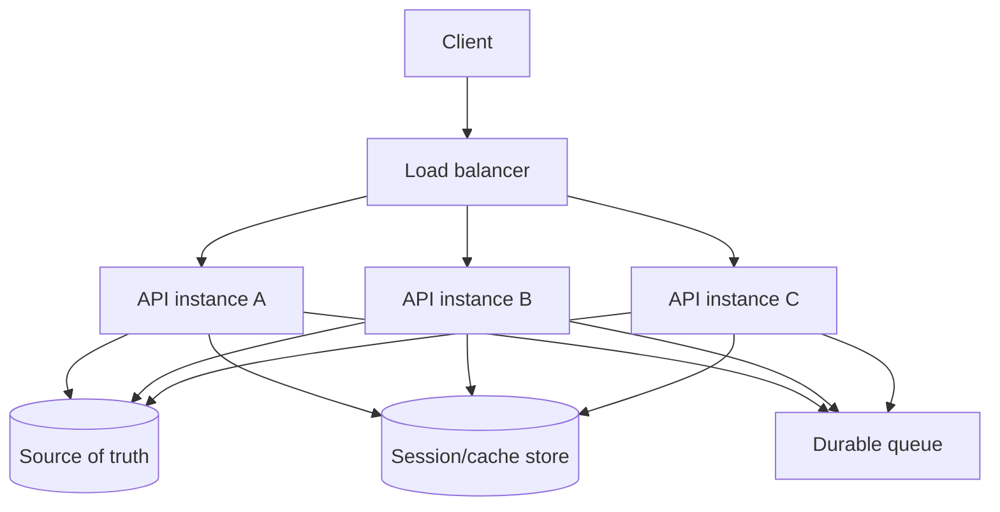
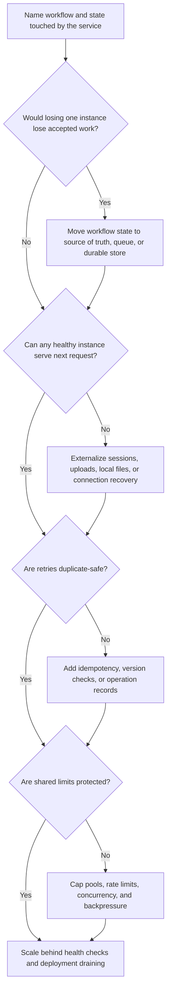

# Stateless Services

Stateless services are easier to scale because any healthy instance can handle
the next request without needing private in-process history from a previous
request. They can be added, removed, restarted, drained, or replaced with less
coordination than services that keep required workflow state in memory or on
local disk.

Stateless does not mean the system has no state. It means the service instance
does not own durable user, workflow, session, or side-effect state by itself.
The state lives in explicit places: a database, cache, session store, object
storage, queue, stream, or client token with clear integrity rules.

## Purpose

Use this page to decide:

- what must be moved out of process before adding service instances;
- how session storage affects load balancing and failover;
- why retries and duplicate requests need idempotency;
- how stateless instances simplify load balancing;
- how statelessness improves deployment flexibility;
- which shared dependencies still limit horizontal scale.

For the broader scale-up versus scale-out decision, see
[Vertical vs horizontal scaling](vertical-vs-horizontal-scaling.md). For routing
across instances, see [Load balancer](../components/load-balancer.md).

## When This Matters

Stateless service design matters when:

- traffic is approaching the capacity of one API or worker instance;
- the team wants safer rolling deploys or faster rollback;
- requests need to be routed across several healthy instances;
- one instance may restart without losing user progress;
- clients or workers retry requests after timeouts;
- local sessions, local files, in-memory counters, or sticky routing are
  blocking horizontal scale.

It is less important when a small version 1 system has one instance, traffic is
low, and a restart can be handled manually. Even then, naming state ownership
early prevents painful migrations later.

## Questions To Ask

- What state does the service read, write, cache, or remember between requests?
- If this instance disappears after accepting a request, what user or workflow
  state is lost?
- Can another healthy instance serve the next request from the same user?
- Where are sessions stored, and how are they invalidated?
- Where do uploads, generated files, exports, and temporary artifacts live?
- Are retries and duplicate client attempts safe?
- What health check proves an instance is ready for any routed request?
- Can deployments drain in-flight work without losing progress?
- Which shared dependency becomes the next bottleneck after adding instances?

## Decision Guidance

### Name The State Boundary

Start by listing every kind of state the service touches. Then decide which
state can remain local and which state must be externalized.

| State Type | Safe Without Shared Server State When... | Externalize When... |
| --- | --- | --- |
| Configuration | It is loaded at startup and identical across instances | Instances need dynamic feature or tenant policy changes |
| Cache | It is only an accelerator and misses are safe | Cache contents are required for correctness |
| Session | It is a signed client token with enough integrity protection | Logout, server-side revocation, or large session data is required |
| Upload file | It is temporary and can be retried from the client | Another instance must finish processing it |
| Job progress | It is only for a currently running attempt | Users need durable pending, retrying, or failed status |
| In-memory counter | It is diagnostic only | It drives rate limits, quotas, uniqueness, or billing |

A service is stateless enough to scale when losing one instance does not lose
accepted work or force users back to the start of a workflow.

### Store Sessions Deliberately

Session storage is usually the first hidden state problem.

Common options:

| Session Choice | Use When | Trade-Off |
| --- | --- | --- |
| Signed client token | Session data is small and revocation needs are modest | Harder immediate revocation; token size and rotation matter |
| Shared session store | Server must revoke, rotate, or update sessions centrally | Adds latency, availability, and cleanup concerns |
| Source-of-truth lookup | Current permissions or account state must be checked often | More database or cache reads |
| Sticky session | Legacy local session state cannot move yet | Uneven load, harder deploys, weaker failover |

Sticky sessions can buy migration time, but they are not a long-term scaling
model. If a user must return to the same instance for correctness, that
instance is a small stateful service with a load balancer in front of it.

Design session behavior explicitly:

```text
Authentication: signed session token with short lifetime.
Authorization: current account and role checked from shared cache backed by the
database.
Logout: revoke token ID in shared revocation store until token expiry.
Failure behavior: any healthy API instance can validate the token and continue.
```

### Make Retries Safe

Stateless request handling often goes with retries: clients retry after
timeouts, load balancers retry failed connections, and workers retry background
jobs. If the service does not remember local history, the durable state must
make duplicates safe.

Use:

- idempotency keys for commands that create side effects;
- conditional writes or version checks for state transitions;
- unique constraints for business invariants;
- operation records for calls to payment, email, or external providers;
- source-of-truth rechecks before applying delayed work;
- clear retry budgets so retries do not become overload.

Example:

```text
Create reservation request includes idempotency_key=client_request_812.
Any API instance can receive a retry. The database stores the key with the
reservation command result, so the second attempt returns the same reservation
instead of creating a duplicate.
```

Stateless instances do not remove the need for memory of what happened. They
move that memory into a durable, shared, and observable place.

### Load Balance Equivalent Instances

Load balancing is simplest when instances are equivalent.

An instance is equivalent when:

- it runs the same compatible code and configuration;
- it can read required state from shared systems;
- it does not need local files from a previous request;
- it can rebuild warm caches without correctness loss;
- it exposes readiness before receiving traffic;
- it can stop accepting new requests while draining old ones.



The load balancer should not need to know user workflow state. It should choose
among healthy targets using routing rules, health checks, and capacity signals.

### Protect Shared Limits

Adding stateless instances increases pressure on shared dependencies.

Before scaling out, define:

- database connection caps per instance and in total;
- provider rate limits and concurrency limits;
- cache connection and memory limits;
- queue producer and worker backpressure;
- file or object storage throughput;
- lock, tenant, or hot-key fairness;
- per-instance and fleet-wide saturation metrics.

Bad scaling move:

```text
Add five API instances while each opens 50 database connections.
The API has more CPU, but the database connection limit is exhausted.
```

Better scaling move:

```text
Add two API instances with a 10-connection pool each, verify database CPU and
connection use stay below target, and use backpressure when checkout calls wait
too long.
```

Stateless services make horizontal scale possible. They do not make downstream
systems infinite.

### Improve Deployment Flexibility

Stateless services are easier to deploy because instances can be replaced
without migrating private local state.

Good deployment behavior includes:

- readiness checks that keep cold instances out of traffic;
- startup warm-up for config, connections, and safe caches;
- connection draining before shutdown;
- graceful cancellation, continuation, or async handoff for in-flight requests
  that may outlive a short drain window;
- backwards-compatible request, response, session, and idempotency-record
  formats during rolling deploys;
- queue or job leases that survive worker restarts;
- rollback that can route traffic away from a bad version quickly.

Deployment flexibility is one of the strongest reasons to remove local state.
If every instance can be drained and replaced independently, the team can roll
forward, roll back, or add capacity without a coordinated outage.

## Statelessness Decision Flow



Use the flow before adding instances. If the answer is "not yet," the next task
is state design, not autoscaling.

## Original Example

A community permit portal lets residents upload documents, check application
status, and receive review comments. The first version runs on one web
instance, but permit season creates bursts.

Hidden state found during review:

| State | Current Design | Scaling Problem | Stateless Fix |
| --- | --- | --- | --- |
| Login session | Local process memory | User loses session when routed elsewhere | Signed token plus shared revocation store |
| Uploaded documents | Local disk before review | Another instance cannot finish processing | Direct upload to object storage with durable upload record |
| Review status | In database | Already shared | Keep as source of truth |
| Email send result | Worker memory until ack | Retry can send duplicates | Store send record by application ID and message type |
| Search filter cache | Local memory | Cache miss is acceptable | Keep local as optional accelerator |

Version 1 scaling plan:

- move document uploads to object storage before adding instances;
- use signed session tokens with shared revocation for logout;
- add idempotency keys to application submission and email jobs;
- put two API instances behind a health-checked load balancer;
- cap each instance's database pool so total connections stay below 70% of the
  database limit;
- drain instances during deploys so in-flight uploads and form submissions
  finish or retry safely.

This plan keeps the API stateless while naming the real state owners. The
database, object storage, revocation store, and queue now carry explicit
availability and observability requirements.

## Trade-Offs

| Choice | Benefit | Cost Or Risk |
| --- | --- | --- |
| Keep state in process | Simple for one instance | Restarts, deploys, and load balancing lose workflow state |
| Signed client sessions | Fewer server lookups | Token revocation, rotation, and size need care |
| Shared session store | Central revocation and session updates | Adds another dependency to every request |
| Externalized uploads | Any instance can continue work | Requires durable upload lifecycle and cleanup |
| Idempotent retries | Duplicate attempts become safe | Needs keys, records, and source-of-truth checks |
| Stateless scale-out | More capacity and safer replacement | Shared dependencies can become the real limit |

## Common Mistakes

- Saying a service is stateless while keeping required sessions in process
  memory.
- Relying on sticky sessions as the permanent state strategy.
- Storing uploaded files or generated exports only on local disk.
- Adding instances without capping database connections.
- Letting load balancers retry non-idempotent commands.
- Treating local cache data as required state.
- Deploying without readiness, warm-up, and drain behavior.
- Scaling stateless APIs while the database, provider, queue, or hot key is
  already the bottleneck.

## Checklist

Before scaling a service horizontally, confirm:

- [ ] The workflow and user promise are named.
- [ ] Sessions live in signed client state, shared storage, or source-of-truth
      checks.
- [ ] Logout, revocation, and permission changes have a documented behavior.
- [ ] Uploads, generated files, exports, and temporary artifacts are not
      required only on local disk.
- [ ] Accepted work is stored durably before a request returns success.
- [ ] Commands that may retry have idempotency keys, operation records, unique
      constraints, or version checks.
- [ ] Load balancer routing can send the next request to any healthy instance,
      or sticky-session risk is documented as temporary.
- [ ] Readiness checks, warm-up, shutdown draining, and rollback behavior are
      defined.
- [ ] Database pools, provider concurrency, queue production, and cache limits
      are capped per instance and fleet-wide.
- [ ] Metrics show per-instance traffic, latency, errors, saturation, retries,
      connection use, and shared dependency pressure.
- [ ] The design states what metric proves adding instances helped.

## Related Pages

- [Scalability overview](./)
- [Vertical vs horizontal scaling](vertical-vs-horizontal-scaling.md)
- [Bottleneck analysis](bottleneck-analysis.md)
- [Capacity estimation](capacity-estimation.md)
- [Load balancer](../components/load-balancer.md)
- [Service layer](../components/service-layer.md)
- [Queues](../communication/queues.md)
- [Idempotency](../communication/idempotency.md)
- [Availability requirements](../requirements/availability.md)
- [Scalability requirements](../requirements/scalability.md)
