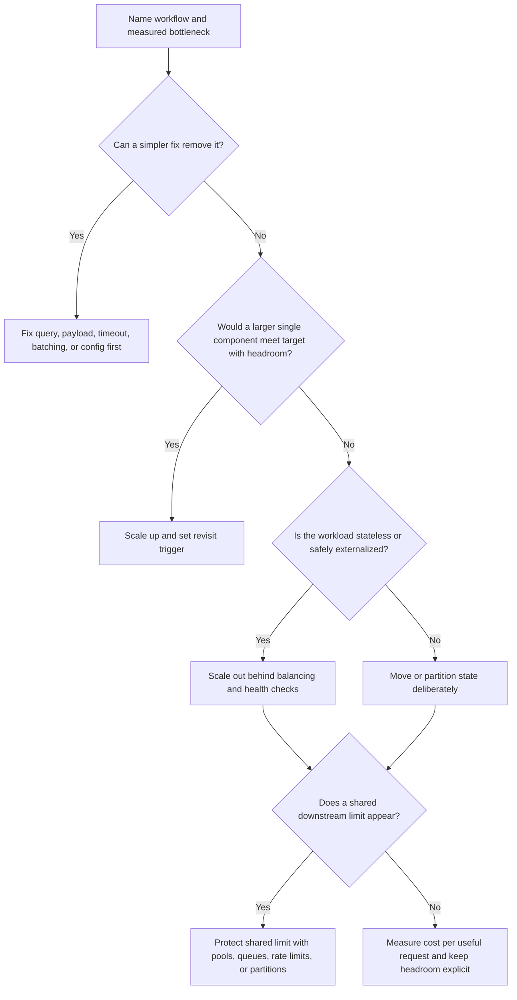

# Vertical vs Horizontal Scaling

Vertical scaling means giving one instance, node, database, worker, or service
more capacity. Horizontal scaling means adding more instances, nodes, replicas,
partitions, or workers. Neither choice is automatically more advanced. The
right choice depends on the measured bottleneck, the state the system must
protect, and the cost of operating the extra moving parts.

Use [Bottleneck analysis](bottleneck-analysis.md) first when the limiting
resource is not known. Use [Capacity estimation](capacity-estimation.md) when
the expected traffic, storage, or bandwidth shape is still unclear.

## Purpose

Use this guide to answer:

- Should version 1 scale one component up before adding distributed machinery?
- Which workloads can be scaled horizontally without breaking correctness?
- Which stateful parts limit horizontal scaling?
- What hidden shared resource could make more instances harmful?
- What cost, availability, and operations trade-offs come with each move?
- What metric should trigger the next scaling step?

The goal is not to choose a permanent architecture. The goal is to make the
next scaling move explicit, measurable, and reversible where possible.

## When This Matters

This decision matters when:

- one application instance, worker, database, cache, or search node is close to
  a known CPU, memory, disk, connection, or throughput limit;
- the team is considering load balancing, replicas, partitioning, sharding, or
  autoscaling;
- traffic has grown beyond comfortable headroom but the system is not yet large
  enough to justify complex distribution;
- one workflow is stateless but another depends on session, lock, inventory, or
  transaction state;
- a proposed scaling change could increase cost faster than user value;
- adding instances might overload a database, queue, third-party dependency, or
  shared rate limit.

It matters less when the current system has clear headroom and a simple query,
index, timeout, retry, payload, or configuration change fixes the observed
problem.

## Questions To Ask

Start with the bottleneck:

- Which workflow is missing its latency, throughput, freshness, or cost target?
- Which resource saturates first: CPU, memory, database, network, disk, lock,
  queue, hot key, provider quota, or connection pool?
- Does throughput improve when one component gets more capacity?
- Does throughput improve when more instances are added?
- What limit remains shared after adding instances?

Then map state and operations:

- Where does session, cache, lock, transaction, file, queue, or tenant state
  live?
- Can any instance handle any request without local state?
- Can retries or duplicate deliveries be handled safely?
- How will traffic be balanced, drained, and shifted during deploys?
- Which metric proves the change helped and which metric proves it moved the
  bottleneck elsewhere?
- What is the monthly cost of idle headroom, operational complexity, and
  incident response time?

## Scaling Decision Flow



This flow should be used after a bottleneck is named. Scaling before naming the
constraint often adds capacity to the wrong part of the system.

## Decision Guidance

### Start With The Smallest Measured Move

Scaling is not the first performance tool. First check whether the system can
avoid unnecessary work:

- add or adjust an index for a known query shape;
- reduce response size, fanout, or repeated service calls;
- batch work only when latency allows it;
- move slow non-critical work out of the synchronous request;
- tune connection pools, worker concurrency, and timeouts;
- remove an accidental lock, deep pagination path, or unbounded in-memory list.

If a small fix removes the bottleneck with enough headroom, use it and write down
the revisit signal. A design that says "revisit when p95 exceeds 400 ms at 500
peak RPS" is easier to operate than a design that adds distributed components
without a threshold.

### Use Vertical Scaling When It Buys Simplicity

Vertical scaling is often the right first move when one component is close to a
resource limit and a larger shape can meet the next milestone without changing
the architecture.

Good fits:

- a database needs more memory for the working set while write volume is still
  modest;
- an application worker is CPU-bound and a larger instance covers the next
  traffic step;
- a background job needs more memory to process bounded batches;
- a search, cache, or queue node needs more disk or memory before distribution
  is justified;
- the product is early and operational simplicity is worth more than perfect
  elasticity.

Vertical scaling is not a failure. It can be a deliberate version 1 choice when
the system has one clear bottleneck, predictable growth, and no hard ceiling in
the near term.

Set limits on the decision:

```text
Scale the database up one size for the launch window.
Revisit if p95 write latency exceeds 300 ms, connection use stays above 70%,
or storage growth would require another size increase within one month.
```

### Scale Out Stateless Services When The Shared Limits Are Known

Horizontal scaling works best for stateless request handlers and workers. A
stateless instance can be replaced, restarted, or added without losing the
workflow state.

Before adding instances, confirm:

- session state is in signed client state, a shared store, or a source-of-truth
  database;
- uploads, generated files, and exports do not live only on local disk;
- request handlers are safe under retries or duplicate client attempts;
- health checks remove bad instances before they receive traffic;
- deployments can drain in-flight work;
- connection pools are capped so new instances do not overload the database;
- downstream dependencies have rate limits, timeouts, and backpressure.

Horizontal scaling helps when application CPU, request concurrency, or worker
capacity is the bottleneck. It does not help when every new instance competes
for the same exhausted database, provider quota, lock, hot key, or network path.

### Watch The Limits Of Horizontal Scaling

Adding instances can make the system worse when the real limit is shared.

Common horizontal limits:

| Limit | What Happens When Instances Increase | Better First Response |
| --- | --- | --- |
| Database connections | More app instances open more connections and saturate the database | Cap pools, fix queries, separate reads, or add a queue |
| Write lock or scarce inventory | More workers create more conflicts and retries | Shorten transactions, serialize by key, or use conditional writes |
| Third-party quota | More callers burn the same provider budget faster | Rate limit, queue, cache, or degrade non-critical calls |
| Hot tenant or key | More capacity helps cold traffic but the hot key still blocks | Isolate, shard by key, cache carefully, or add fairness limits |
| Cache miss storm | More instances create more simultaneous misses | Request coalescing, warmup, TTL jitter, or fallback behavior |
| Network or egress | More instances send more bytes through the same path | Reduce payloads, compress, stream, or move large objects |

Measure the shared limit before and after the change under a comparable load
shape and traffic mix. If total throughput does not rise, the system has
probably moved or exposed the real bottleneck.

### Treat Stateful Services As Design Boundaries

Stateful components need more care because they own data, ordering,
coordination, or correctness.

Examples of stateful constraints:

- databases protect transactions, uniqueness, and durable writes;
- queues own ordering, retries, and delivery state;
- caches may hold derived state with freshness rules;
- workers may coordinate by tenant, partition, lock, or job lease;
- local files, local sessions, and in-memory counters disappear on restart.

For application services, avoid making local process memory the source of truth.
Sticky sessions can be a short-term compatibility tool, but they reduce failure
flexibility and make balancing harder. Prefer externalizing state deliberately
and naming the freshness or consistency rule.

For databases and storage, horizontal scaling usually means choosing a specific
strategy:

- read replicas for stale-tolerant reads;
- partitions for retention, maintenance, or large tables;
- sharding when one write leader or table can no longer meet measured needs;
- derived views when analytical reads should not compete with operational
  traffic;
- object storage when large immutable files do not belong in the primary
  database.

These are not interchangeable. Each one changes routing, recovery,
observability, and failure behavior.

### Include Cost In The Scaling Decision

Scaling cost is more than the bill for a larger machine or another instance.

Vertical scaling costs:

- larger units may be more expensive per unit of capacity;
- a single large component can become a larger failure or maintenance event;
- idle headroom is paid for even when traffic is low;
- some platforms have hard maximum sizes that create a later migration point.

Horizontal scaling costs:

- load balancing, autoscaling, health checks, deploy orchestration, and
  observability need to be configured and operated;
- extra instances can increase database, cache, network, and provider costs;
- partitioning and sharding add routing, rebalancing, and repair work;
- debugging becomes harder when one workflow crosses many nodes.

Compare cost against the useful outcome:

```text
cost per successful request
cost per completed job
cost per active tenant
cost per peak hour
marginal cost per added unit of capacity
operator time per incident
```

The cheapest monthly bill is not always the cheapest system. A small increase in
infrastructure cost can be worth it if it removes on-call risk. A large
distributed design can be too expensive if it solves a problem the product has
not reached.

### Choose A Practical Version 1

A good version 1 scaling plan usually says:

- which component scales up first;
- which service can safely scale out first;
- which state remains centralized;
- which shared limit is protected;
- what metric triggers the next step;
- what decision is intentionally deferred.

In an interview, explain the decision as a sequence: name the bottleneck, state
why a smaller fix or scale-up is enough for now, identify which parts can safely
scale out, and call out the shared limits that would break first.

Example version 1 guidance:

| Situation | Practical First Move |
| --- | --- |
| Small traffic, indexed reads | Keep one app and one database with clear headroom |
| App CPU is the limit | Scale up or add stateless app instances |
| Database reads are the limit | Fix query/index shape, then consider cache or replicas |
| Database writes or locks are the limit | Reduce transaction work before considering sharding |
| Provider calls are the limit | Add timeouts, queues, rate limits, and fallback |
| One tenant or key is hot | Add fairness, isolation, or key-specific mitigation |

The plan should make the next step obvious without forcing the team to build it
before there is evidence.

## Trade-Offs

| Choice | Benefits | Costs |
| --- | --- | --- |
| Scale up | Simple, fast to reason about, fewer moving parts | Hard ceiling, larger failure unit, idle headroom cost |
| Scale out stateless services | More concurrency, better replacement and deploy flexibility | Shared dependencies can bottleneck, more operations work |
| Read replicas | More read capacity for stale-tolerant paths | Replica lag, routing rules, failover behavior |
| Partitioning | Smaller maintenance units and clearer retention boundaries | Query complexity, cross-partition work, operational planning |
| Sharding | More write or storage capacity after single-node limits | Routing, rebalancing, hot shards, cross-shard transactions |
| Queues and workers | Buffers bursts and isolates slow work | Freshness delay, retries, backlog operations |

Use the least complex option that satisfies the measured requirement and keeps
the correctness boundary understandable.

## Common Mistakes

- Scaling application instances when the database is the bottleneck.
- Treating horizontal scaling as automatically better than a larger instance.
- Keeping sessions, uploads, or counters only in local process memory.
- Using sticky sessions as a permanent substitute for a state design.
- Adding workers without checking downstream capacity.
- Adding read replicas for workflows that need read-after-write correctness.
- Ignoring database connection growth after adding app instances.
- Sharding before query shape, indexes, locks, and write paths are understood.
- Optimizing for average cost while peak behavior still fails.
- Failing to define the metric that triggers the next scaling move.

## Example

A city recreation site lets residents register for after-school programs. Most
days are quiet, but registration opens twice per year and creates a short burst.

Initial version:

- one stateless web service;
- one relational database;
- files stored outside the app process;
- program search uses an index by `program_id`, location, age range, and start
  date;
- final registration uses a database uniqueness rule so one seat cannot be
  assigned twice.

During the first launch window, the team measures:

| Signal | Observation | Interpretation |
| --- | --- | --- |
| Web CPU | 90% during program search | App CPU is one bottleneck |
| Database CPU | 45% | Database is not the first limit |
| Database connections | 55% of cap | Adding instances is possible but must be capped |
| Registration conflicts | Low | Seat writes are not yet the bottleneck |
| p95 search latency | 1.4 s during the busiest 10 minutes | User-visible read path needs relief |

Decision:

- scale the web service up for the next launch because it is the fastest simple
  move;
- remove extra response fields from search results;
- add a second stateless web instance only after session state is confirmed to
  live outside the process;
- cap each instance's database pool so total connections stay below the
  database limit;
- keep the registration write centralized because the measured conflict rate
  does not justify sharding or distributed locking.

Revisit triggers:

- add more stateless web instances if web CPU stays above 70% during launch and
  database connections remain below the cap;
- improve read scaling if database rows scanned or p95 query latency rises;
- revisit capacity shape if cost per successful registration rises faster than
  completed registrations during launch windows;
- redesign seat allocation only if lock waits, conflicts, or registration write
  latency become the first bad signal.

This plan uses vertical scaling to buy time, horizontal scaling only where the
service is stateless, and measured stateful limits before changing the database
architecture.

## Checklist

Before choosing vertical or horizontal scaling, confirm:

- The user-visible workflow and bottleneck are named.
- A smaller fix has been considered before adding capacity.
- Vertical scaling has a clear headroom target and revisit trigger.
- Horizontal scaling is limited to workloads that are stateless or have
  deliberately externalized state.
- Sessions, files, counters, leases, locks, and caches have an explicit state
  owner.
- Database connection growth is capped before adding app instances.
- Downstream rate limits, provider quotas, and queue behavior are included.
- Stateful services have a consistency, freshness, or ordering policy.
- Cost is compared per useful request, job, tenant, or peak hour.
- The design states what metric will prove the scaling move worked.

## Related Pages

- [Scalability overview](./)
- [Bottleneck analysis](bottleneck-analysis.md)
- [Capacity estimation](capacity-estimation.md)
- [Database read scaling](database-read-scaling.md)
- [Rate limiting](rate-limiting.md)
- [Stateless services](stateless-services.md)
- [Metrics](../operations/metrics.md)
- [Observability basics](../operations/observability-basics.md)
- [Bulkheads](../reliability/bulkheads.md)
- [Retries and backoff](../communication/retries-and-backoff.md)
