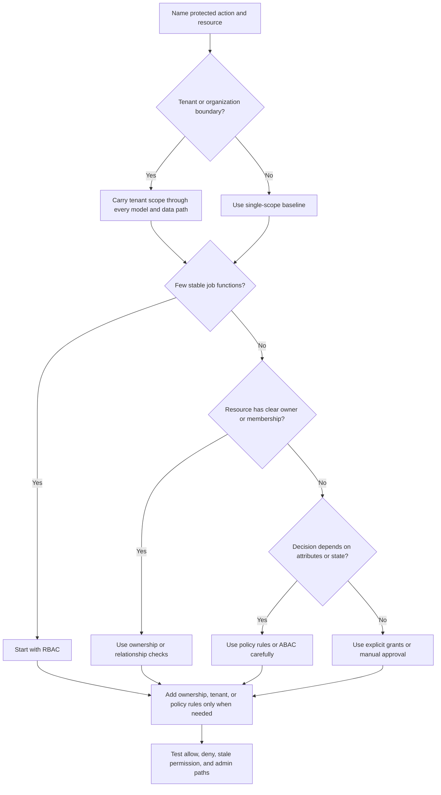

# Access-Control Models

Access-control models are ways to organize authorization decisions so engineers
can explain, test, and operate them. The model is not the goal. The goal is to
make the right action on the right resource possible for the right caller and
hard for everyone else.

Most real systems use a mix of models. A simple role may decide who can open an
admin page, ownership may decide which records appear, tenant isolation may
limit every query, and a policy rule may gate one risky export.

## Purpose

Use this page to compare common access-control models:

- role-based access control (RBAC);
- attribute-based access control (ABAC);
- ownership-based access;
- tenant isolation;
- explicit grants and policy rules when permissions become more complex.

The goal is to choose the simplest model that protects version 1 workflows while
leaving a clear path for growth.

## When This Matters

Access-control model choice matters when:

- the system has more than one user type;
- users belong to teams, tenants, branches, households, or organizations;
- resources have owners, collaborators, reviewers, or assignees;
- admins and support agents need more power than normal users;
- permission depends on resource state, data sensitivity, region, risk, or time;
- public APIs, partner clients, workers, and admin tools share the same data;
- permissions are becoming hard to test, debug, or explain.

For a small single-team tool, a few roles and ownership checks may be enough.
For a multi-tenant product with delegated administration and sensitive exports,
the access model becomes part of the architecture.

## Questions To Ask

Start with the shape of the permissions:

- Are there a few stable job functions, or many conditional decisions?
- Does every resource have one clear owner?
- Can one user belong to multiple organizations, tenants, branches, or projects?
- Does access depend on resource state, sensitivity, risk, or time?
- Do support or admin users need temporary, scoped access?
- Can a service act alone, or only on behalf of a user?
- Which permissions must be visible to users or operators?
- Which checks must be enforced in queries, commands, workers, and exports?
- What is the smallest model a reviewer could test confidently?

## Model Selection Flow



## Decision Guidance

### Role-Based Access Control

Role-based access control gives users named roles such as member, manager,
support, staff, or admin. Each role maps to a set of allowed actions.

RBAC works well when:

- job functions are stable;
- the product can explain permissions in plain language;
- the number of roles is small;
- most users in the same role can perform the same actions;
- operators need simple onboarding and offboarding.

Example:

| Role | Allowed Actions |
| --- | --- |
| Resident | Reserve tools, view own reservations, cancel own pending reservations |
| Volunteer | Update pickup status for assigned branch reservations |
| Staff | Approve high-value loans for assigned branch |
| Admin | Manage inventory, roles, exports, and branch settings |

RBAC becomes risky when roles grow broad enough to include unrelated powers.
"Manager" may start as approval access and later accumulate exports, refunds,
role changes, and support access. Split roles or add policy conditions when one
role starts granting permissions that do not always travel together.

### Ownership-Based Access

Ownership-based access checks whether the caller owns, created, belongs to, or
is assigned to the target resource.

Ownership checks work well when:

- users mostly act on their own records;
- organization or project membership determines access;
- the data model has clear owner fields;
- queries can enforce owner or organization constraints;
- sharing is limited or explicit.

Examples:

- A resident can edit reservations where `reservation.household_id` matches one
  of their households.
- A project member can read tasks where `task.project_id` belongs to one of
  their projects.
- A branch volunteer can update pickup status only for reservations assigned to
  their branch.

Ownership checks should live close to data access. A private list query should
filter by owner, organization, branch, project, or tenant before returning
records. Filtering only in the UI is not authorization.

Ownership alone is not enough for privileged actions. A user may own an account
but still need step-up proof to change the account email. A manager may belong
to a branch but still need a policy limit before approving an expensive loan.

### Tenant Isolation

Tenant isolation keeps one customer's, organization's, or workspace's data away
from another's. It is both a permission model and a data-boundary discipline.

Tenant isolation matters when:

- one deployment stores data for multiple organizations;
- users can belong to more than one tenant;
- APIs accept tenant, workspace, organization, or account identifiers;
- exports, analytics, search indexes, caches, and backups copy tenant data;
- a cross-tenant read would be a serious incident.

Good tenant isolation design:

- stores tenant ID or equivalent scope on tenant-owned records;
- includes tenant scope in queries and indexes;
- validates that the caller belongs to the tenant before using tenant IDs from
  the request;
- prevents background jobs and exports from dropping tenant scope;
- records tenant ID in audit logs and security events;
- tests cross-tenant denial as a normal acceptance check.

Tenant isolation is not the same as RBAC. A tenant admin may be powerful inside
one tenant and have no access to another. A platform support user may need
temporary tenant-scoped access without becoming a tenant admin.

### Attribute-Based Access Control

Attribute-based access control uses attributes about the caller, resource,
action, environment, or request to make a decision.

Useful attributes include:

- caller role, department, branch, clearance, or employment status;
- resource sensitivity, owner, tenant, lifecycle state, value, or region;
- action type such as read, approve, export, delete, or impersonate;
- request context such as time, network, device trust, MFA age, or support case;
- system state such as incident mode or policy rollout.

ABAC works well when access depends on conditions that do not fit cleanly into
a small role list. It is useful for high-risk actions such as exports, refunds,
role changes, approval limits, or region-specific data handling.

Example policy shape:

```text
Allow export when:
  caller.role includes "admin"
  and caller.tenant_id == resource.tenant_id
  and resource.data_classification != "restricted"
  and caller.mfa_age_minutes < 15
  and request.reason is present
```

ABAC can become hard to debug if every decision depends on many attributes from
many stores. Keep policy inputs explicit, log the rule and reason class, and
test common denials. Do not hide business rules in a generic expression nobody
can review.

### Explicit Grants And Delegation

Explicit grants give one caller a specific permission to one resource or scope.
They are useful when access is temporary, delegated, or narrower than a role.

Examples:

- a document owner grants another user viewer access;
- a support lead grants a support agent 24-hour access to one tenant while a
  ticket is open;
- a staff reviewer is assigned one high-value loan request;
- a partner client receives access to one webhook subscription.

Grants need lifecycle rules:

- who can create them;
- what scope they cover;
- when they expire;
- how they are revoked;
- whether the affected user is notified;
- which audit record explains why the grant existed.

Avoid using long-lived grants as a hidden role system. If many users need the
same grant forever, name the role or relationship directly.

### Permission Complexity

Permission complexity grows when the number of actors, resources, scopes,
attributes, and exceptions grows faster than the team can test them.

Warning signs:

- roles have vague names such as superuser, manager-plus, or special-admin;
- checks are copied differently across API handlers;
- UI visibility and server enforcement disagree;
- support access depends on undocumented manual steps;
- policy decisions cannot explain which rule allowed or denied access;
- test coverage only checks allowed paths;
- stale membership, tenant switch, or role revocation behavior is unclear.

Contain complexity by:

- naming actions and resources before inventing permissions;
- keeping tenant or owner scope in query boundaries;
- centralizing repeated checks without hiding action-specific context;
- writing denial tests next to allow tests;
- logging policy reason classes, not sensitive payloads;
- splitting broad roles when they combine unrelated powers;
- adding policy engines or services only when repeated complexity justifies the
  operational cost.

## Trade-Offs

| Model | Benefit | Cost Or Risk |
| --- | --- | --- |
| RBAC | Easy to explain, onboard, and review | Roles can become too broad or too numerous |
| Ownership-based access | Natural for user-owned or organization-owned resources | Shared, delegated, and admin access need extra rules |
| Tenant isolation | Strong boundary for multi-tenant systems | Every data path must preserve tenant scope |
| ABAC | Handles rich conditions and high-risk actions | Harder to test and debug when attributes multiply |
| Explicit grants | Good for temporary or delegated access | Needs expiry, revocation, notification, and audit |
| Central policy helper | Keeps repeated checks consistent | Can hide action context if made too generic |
| Dedicated policy service | Gives multiple services one decision point | Adds latency, availability, migration, and debugging cost |

Use the simplest model that matches the workflow. Add complexity when a concrete
permission shape demands it, not because the model sounds more complete.

## Common Mistakes

- Starting with a policy engine before naming actions and resources.
- Treating tenant isolation as a UI filter instead of a data boundary.
- Creating many roles that are really one role plus ownership or state checks.
- Using ABAC for every decision when a role or owner check is enough.
- Forgetting service, worker, export, search, cache, and support paths.
- Letting admins bypass normal constraints without audit and scope limits.
- Ignoring stale permissions after role, membership, tenant, or grant changes.
- Testing only successful access and not cross-tenant or revoked access.

## Examples

### Small Internal Scheduler

A small internal scheduler lets employees reserve shared rooms. There is one
organization, no external tenants, and no sensitive exports.

Version 1 model:

| Need | Model | Reason |
| --- | --- | --- |
| Employees reserve rooms | Ownership-based access | Users should edit their own reservations |
| Office coordinators cancel any reservation | RBAC | One small role maps to a stable job function |
| Room capacity cannot be exceeded | Resource-state policy | Availability depends on reservation state, not role |

Rejected:

- tenant isolation, because there is only one organization;
- ABAC for normal reservations, because role plus ownership is easier to test;
- a policy service, because one application can enforce the checks directly.

### Multi-Branch Equipment Library

A neighborhood equipment library has residents, volunteers, staff, admins,
branches, and high-value tools.

Access model:

| Requirement | Model Choice | Enforcement Point |
| --- | --- | --- |
| Residents can view their household reservations | Ownership-based access | Reservation queries include household scope |
| Volunteers update pickups for one branch | RBAC plus branch scope | Service command checks role and branch membership |
| Staff approve expensive loans only within a limit | ABAC-style policy | Approval command checks role, branch, tool value, and loan state |
| Branch data must not leak across locations | Tenant or branch isolation | Queries, exports, jobs, and audit logs carry branch scope |
| Admins export borrower history | RBAC plus ABAC | Export job checks admin role, MFA freshness, reason, and data class |
| Temporary support help is needed | Explicit grant | Grant expires when the support case closes |

This design uses RBAC for stable job functions, ownership for normal user data,
branch isolation for data boundaries, and policy rules only where risk justifies
the extra conditions.

## Checklist

Before choosing an access-control model, confirm:

- Protected actions and resources are named.
- RBAC is used only for stable job functions.
- Ownership checks are tied to data access, not just UI filtering.
- Tenant or organization scope is preserved in APIs, queries, workers, exports,
  caches, search indexes, and audit logs.
- ABAC or policy rules name the exact attributes they depend on.
- Explicit grants have owner, scope, expiry, revocation, and audit behavior.
- Admin and support powers are scoped and observable.
- Service and worker authorization paths are included.
- Denial tests cover cross-tenant, non-owner, stale-role, revoked-grant, and
  admin-scope cases.
- Policy decisions can explain why access was allowed or denied.
- Version 1 avoids a policy engine or service unless repeated complexity
  justifies it.

## Related Pages

- [Security design overview](./)
- [Authentication](authentication.md)
- [Authorization](authorization.md)
- [Identifying entities](../data/identifying-entities.md)
- [Transactions](../data/transactions.md)
- [Design review checklist](../method/design-review-checklist.md)
- [Functional vs non-functional requirements](../method/functional-vs-nonfunctional-requirements.md)
- [Glossary](../glossary.md)
