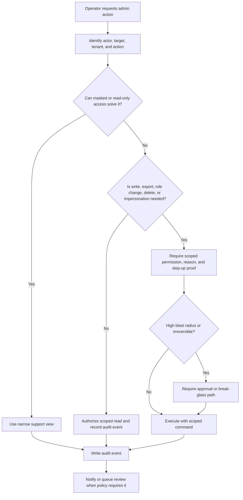

# Admin Tools

Admin tools let trusted operators support users, repair data, approve risky
changes, and respond to incidents. They also create some of the largest
security risks in a system because one internal action can affect many users or
tenants.

Design admin tools as a separate privileged surface, not as a hidden shortcut
around product rules. A safe design makes power narrow, visible, approved when
needed, and easy to investigate later.

## Purpose

Use admin-tool design to decide:

- which privileged actions operators can perform;
- which roles, scopes, approvals, and step-up checks are required;
- when support access should be masked, read-only, or time-limited;
- when impersonation is justified and how it is constrained;
- what audit records prove who did what, for which user or tenant, and why;
- how to limit the blast radius of mistakes, compromised internal accounts, and
  urgent break-glass access.

The goal is not to block legitimate support work. The goal is to make
privileged work deliberate, reviewable, and no broader than the case requires.

## When This Matters

Admin-tool design changes the architecture when:

- support agents can view or edit user, tenant, billing, order, reservation, or
  account data;
- internal tools can bypass normal user workflows;
- operators can impersonate users, reset credentials, change roles, approve
  requests, export data, or delete records;
- one mistake could affect an entire tenant, region, queue, product catalog, or
  large user segment;
- incident response needs emergency access before a normal approval chain is
  available;
- customers, auditors, or engineering leads need evidence for privileged
  access after the fact.

For a small prototype, a single admin page may be enough. For a shared
production system, admin capabilities need explicit permissions, audit events,
failure behavior, and review workflows from the first design pass.

## Questions To Ask

Start with the action, not the admin page:

- Which actions are privileged reads, writes, approvals, exports, deletes, or
  impersonation flows?
- Which role can perform each action, and in which tenant, branch, region, or
  queue scope?
- Can the operator solve the case with masked data or metadata instead of full
  user data?
- Does the action require MFA, reauthentication, a support case, a second
  approver, or a time-limited grant?
- Is the action reversible, and what recovery path exists if it is wrong?
- Which audit event records the actor, target, reason, decision, approver, and
  correlation ID?
- What should happen if authorization, approval, or audit logging is
  unavailable?
- How are high-volume actions, bulk edits, and exports limited?
- Who reviews privileged access patterns and break-glass use?

## Admin Action Decision Flow



## Decision Guidance

### Treat Privileged Access As Its Own Surface

An internal network, employee account, or admin URL should not imply broad
trust. Privileged access needs its own model because the actions are different
from normal product use.

For each privileged action, write a statement like:

```text
Actor: support_agent
Action: view masked borrower profile
Target: user within assigned branch
Condition: open support case, branch scope, no full identity document fields
Decision: allow, audit, and expire case access when the case closes
```

Separate safe support tasks from dangerous administrative tasks:

| Task Type | Example | Baseline Control |
| --- | --- | --- |
| Support read | View masked account status for an open ticket | Scoped role, case reason, audit event |
| Support write | Resend invite or update pickup window | Scoped role, validation, audit event |
| Privileged write | Change user role or approval limit | MFA, reason, audit event, sometimes approval |
| Bulk action | Export tenant history or cancel many jobs | Approval, row limit, dry run, audit event |
| Emergency action | Disable a tenant integration during an incident | Break-glass grant, short expiry, post-review |

This separation keeps the common path fast while making powerful actions harder
to use accidentally.

### Scope Every Role

Admin roles should answer both "what can this operator do?" and "where can they
do it?"

Useful scopes include:

- tenant, organization, workspace, or account;
- branch, region, department, or support queue;
- data class, such as public metadata, contact data, billing data, or incident
  notes;
- action class, such as view, update, approve, export, impersonate, delete, or
  restore;
- time window, case ID, incident ID, or temporary grant.

Avoid one permanent super-admin role for normal work. If one exists for
emergency use, keep it outside day-to-day workflows, require stronger proof,
and review every use.

### Prefer Support Views Before Impersonation

Impersonation lets an operator act as or view the product as a user. It can
solve confusing support cases, but it can also blur accountability because one
session now involves both an operator and an affected user.

Before adding impersonation, ask whether the support case can be solved with:

- a read-only account timeline;
- masked profile and configuration fields;
- a permission explanation panel;
- a replay of the user's relevant workflow state;
- a scoped "send reset" or "resend notification" command;
- a test tenant or demo account.

When impersonation is justified, design it as a controlled mode:

- require an open case, explicit reason, and step-up proof;
- show a visible impersonation state to the operator;
- prevent credential, MFA, billing, export, role-change, and destructive
  actions unless explicitly approved;
- record both the real operator and the effective user in audit logs;
- notify the user or tenant admin when policy requires it;
- end the mode automatically after a short idle or absolute timeout.

Never let impersonation reuse the user's real credentials or hide the operator
identity from server-side authorization and audit checks.

### Require Approvals For High-Risk Actions

Approvals are useful when one person's mistake or compromised account could
cause broad damage. They are not needed for every admin click. Use them where
the action is hard to reverse, high value, privacy-sensitive, or large in scope.

Good approval candidates:

- role, ownership, tenant-admin, or permission changes;
- full data exports, large report downloads, or bulk reads;
- permanent deletion, restore, archive, refund, payout, or cancellation;
- impersonation of sensitive accounts;
- production data repair scripts;
- break-glass grants and incident-only overrides.

An approval record should include:

```text
requested_by: <operator>
approved_by: <different approver or policy>
target_scope: <tenant, user, resource, queue, or branch>
action: <stable command name>
reason: <case, incident, or change reference>
expires_at: <time when approval is no longer valid>
result: <allowed, denied, expired, used, or canceled>
```

Keep the approval close to the command it authorizes. A generic chat message or
ticket comment is weaker than an approval object the system verifies before
executing the action.

### Record Useful Audit Logs

Admin tools need audit events for both successful and denied risky actions.
The audit record should explain the decision without storing full sensitive
payloads.

Record:

- real actor and effective user if impersonating;
- target user, tenant, organization, resource, or queue;
- command name and result;
- reason, support case, incident, or approval ID;
- changed field names and safe before-and-after summaries;
- request ID, job ID, or trace ID;
- source surface, such as admin UI, support console, script, or break-glass
  shell;
- whether MFA, reauthentication, approval, or emergency access was used.

Do not record passwords, tokens, session cookies, full documents, private notes,
or raw payloads in the audit event. If a value is sensitive, record that it was
changed, masked, exported, or redacted rather than copying it.

### Limit Blast Radius

Blast radius is the amount of harm one privileged action can cause before the
system stops it or makes it visible. Limit it with product controls, not only
operator training.

Useful limits:

- require tenant, branch, queue, or resource scope on every admin command;
- put row limits, dry-run previews, and confirmation summaries on bulk actions;
- use allowlists for data repair scripts and dangerous commands;
- make destructive actions reversible when possible through soft delete,
  restore windows, or compensating actions;
- rate-limit expensive admin actions and exports;
- split read, write, export, role-management, and break-glass permissions;
- expire temporary access automatically;
- notify users, tenant admins, or security reviewers for sensitive actions;
- review unusual patterns such as many denied attempts, many exports, or admin
  access outside the operator's usual scope.

For background jobs triggered by admin tools, carry the same scope and approval
into the job payload. A queued bulk job should not become more powerful than the
admin command that created it.

### Design Break-Glass Access

Break-glass access is an emergency path for incidents where normal access is
too slow or unavailable. It should be rare, temporary, and uncomfortable enough
that it is not the everyday support process.

Define:

- who can request break-glass access;
- what proof or second-party approval is required when available;
- which scopes and actions it grants;
- how quickly it expires;
- which notifications are sent;
- what audit events and post-incident review are required;
- how the system behaves if the normal approval service is down.

If break-glass is used frequently for routine work, the normal admin model is
missing a legitimate, safer workflow.

### Handle Failure Safely

Privileged actions should fail closed when the system cannot prove identity,
permission, approval, or audit recording.

Practical failure defaults:

- deny role changes, impersonation, exports, deletes, and break-glass access if
  authorization data is unavailable;
- block high-risk writes if the audit sink cannot accept the event;
- queue lower-risk support writes only if the audit event is durably attached to
  the queued command;
- show safe denial messages that do not reveal hidden resources;
- alert operators when approval, policy, or audit systems fail;
- give incident responders a documented emergency path with post-review rather
  than silent bypasses.

Availability matters, but unreviewable privileged actions create an incident of
their own.

### Keep Version 1 Practical

A useful version 1 does not need a full policy engine. It might include:

- three roles: support, tenant admin, and platform admin;
- scoped support views with masked sensitive fields;
- no impersonation until support cases prove it is necessary;
- MFA or reauthentication for exports, role changes, and destructive actions;
- approval objects for bulk actions and break-glass access;
- append-only audit events for admin reads, writes, denials, approvals, and
  impersonation;
- hard row limits and dry-run previews for bulk commands;
- a weekly review of high-risk admin events.

Revisit the design when support volume grows, tenants need delegated
administration, regulated data enters the system, exports become common, or
one admin mistake could affect many customers.

## Trade-Offs

| Decision | Benefit | Cost Or Risk |
| --- | --- | --- |
| Narrow support views | Reduces unnecessary data exposure | May require extra UI work for support workflows |
| Impersonation | Helps reproduce user-specific problems | Creates accountability and privacy risk if poorly constrained |
| Mandatory approvals | Reduces one-person mistakes for high-risk actions | Adds latency to urgent operations |
| Broad admin role | Fast to implement and easy to explain initially | Overgrants access and increases compromise blast radius |
| Scoped temporary grants | Fits support cases and incidents | Needs expiry, revocation, and audit behavior |
| Fail closed for audit outage | Preserves accountability for risky actions | Can block legitimate urgent work |
| Bulk dry runs | Helps operators catch mistakes before execution | Adds implementation work and can still be ignored if summaries are vague |

## Common Mistakes

- Treating the admin UI as trusted because it is internal.
- Giving support agents full production data when masked fields would solve the
  case.
- Adding impersonation before building simpler support views.
- Recording that an action happened without recording the real operator,
  effective user, reason, target scope, and result.
- Letting queued admin jobs drop tenant scope, approval IDs, or actor context.
- Using approvals in chat but not verifying an approval object in the system.
- Making break-glass access permanent after the incident ends.
- Logging sensitive payloads into the audit trail for convenience.
- Allowing bulk actions without row limits, dry-run summaries, or rollback
  expectations.

## Example

A neighborhood equipment library has residents, volunteers, staff, and a small
admin team. Residents reserve tools. Volunteers manage pickup windows. Staff
approve high-value loans. Admins maintain inventory and branch settings.

Admin-tool design:

| Workflow | Safer Design |
| --- | --- |
| Support checks why a resident cannot reserve a ladder | A support view shows account status, active reservations, branch membership, and masked contact details. It does not show identity documents or full address history. |
| Volunteer asks staff to change a pickup window | Staff can update pickup time for their branch with a reason. The action writes an audit event and sends the resident a notification. |
| Staff approves a high-value generator loan | The approval requires staff role, branch scope, and a loan amount limit. Larger loans need a second approver. |
| Admin needs to reproduce a resident checkout issue | Prefer a read-only workflow trace. If impersonation is needed, require an open case, step-up proof, visible impersonation state, short timeout, and blocked exports. |
| Branch inventory import would update 800 tools | The tool requires a dry run, row count, branch scope, approval, and a resumable job carrying the approval ID. |
| Incident requires disabling one integration | Break-glass grants a platform admin permission to disable only that integration for a short window, then records the action for post-incident review. |

The design keeps normal support quick while forcing the riskiest actions to
name scope, reason, approval, and audit evidence.

## Checklist

Before accepting an admin-tool design, confirm:

- Privileged reads, writes, exports, deletes, approvals, and impersonation flows
  are named.
- Admin roles include action scope and resource scope, not only broad titles.
- Support views expose the minimum useful data and mask sensitive fields by
  default.
- Impersonation, if present, records real actor and effective user, requires a
  reason, and blocks sensitive actions unless separately approved.
- High-risk actions require MFA, reauthentication, approval, or time-limited
  grants where justified.
- Audit logs capture actor, target, action, scope, reason, approval, result, and
  correlation ID without storing sensitive payloads.
- Bulk actions have limits, dry-run summaries, scoped jobs, and recovery
  expectations.
- Break-glass access expires quickly and always gets post-use review.
- Privileged actions fail closed when identity, permission, approval, or audit
  recording cannot be verified.
- The version 1 design is small enough to test, operate, and explain.

## Related Pages

- [Security design overview](./)
- [Authentication](authentication.md)
- [Authorization](authorization.md)
- [Access-control models](access-control-models.md)
- [Audit logs](audit-logs.md)
- [Rate limiting and abuse resistance](rate-limiting-and-abuse.md)
- [Secrets management](secrets-management.md)
- [Encryption](encryption.md)
