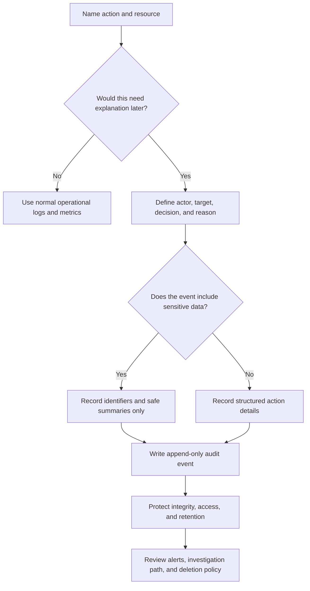

# Audit Logs

Audit logs are structured records that help a team answer who did what, to
which resource, from where, and with what result. They are useful for security,
support, compliance, incident response, and operational debugging, but they are
not the same as normal application logs.

Good audit logging starts from the actions that would be hard to explain after
the fact: permission changes, admin access, data exports, approvals, deletion,
impersonation, support views, and policy denials. The goal is accountability
without turning the audit trail into a second store of sensitive data.

## Purpose

Use audit-log design to answer:

- which actions require accountable records;
- what to log for each action;
- how to prove who changed what;
- how audit events resist tampering;
- which privacy risks the audit trail creates;
- how long audit records should be retained and who can access them.

The goal is to make important security and operations events reviewable without
capturing unnecessary payloads, secrets, or personal data.

## When This Matters

Audit logging changes the architecture when:

- admins, support agents, operators, or internal tools can access production
  data;
- users can change roles, permissions, organization membership, billing state,
  approval status, or deletion settings;
- the system exposes exports, reports, bulk actions, impersonation, or
  break-glass access;
- background jobs, workers, or integrations mutate records asynchronously;
- a support or incident team must reconstruct a sequence of events later;
- regulated, enterprise, or security-sensitive customers ask how privileged
  actions are recorded;
- ordinary application logs may be too noisy, mutable, short-lived, or
  sensitive for accountability.

For a small prototype, audit logs may be a simple append-only table. For a
shared production system, audit logs need clear event fields, privacy controls,
retention decisions, and tamper-resistance.

## Questions To Ask

Start from the actions that need explanation:

- Which reads, writes, exports, approvals, deletions, role changes, and admin
  actions are audit-relevant?
- Who or what performs the action: end user, support agent, admin, service,
  worker, scheduled job, or external integration?
- Is the action performed directly, through impersonation, or on behalf of
  another user?
- Which resource, tenant, organization, or account did the action affect?
- What changed, and what should be summarized instead of stored in full?
- Was the action allowed, denied, queued for approval, partially completed, or
  rolled back?
- Which request ID, job ID, trace ID, or correlation ID connects the audit event
  to operational evidence?
- Who can read audit logs, and how is that access itself audited?
- What fields must be redacted, hashed, tokenized, or excluded?
- How long should records be retained before archival or deletion?

## Audit Logging Decision Flow



## Decision Guidance

### Choose Audit-Relevant Actions

Audit logs should focus on actions that carry security, privacy, financial,
operational, or support risk. Do not audit every harmless screen view by
default. A noisy audit trail is expensive to store and hard to investigate.

Common audit-relevant actions:

- login, logout, failed login, MFA challenge, and credential reset events when
  they matter for investigation;
- role, membership, permission, grant, and tenant-scope changes;
- admin and support views of user or customer data;
- impersonation start, stop, actor, target, and reason;
- export, report download, bulk read, and large search actions;
- create, update, approve, reject, cancel, refund, delete, restore, or archive
  actions on important resources;
- policy denials for high-risk actions;
- secret rotation, key-use policy changes, and integration credential changes;
- background job actions that mutate important state.

Tie each event to a reason for existence. "We log this because support may need
it someday" is weaker than "we log this role change because it grants access to
borrower contact data and needs later review."

### Define The Audit Event

Use structured events, not free-form text. A reviewer should be able to filter
by actor, action, target, tenant, result, and time without parsing prose.

Baseline fields:

| Field | Purpose | Example |
| --- | --- | --- |
| Event ID | Unique audit record identifier | `audit_evt_01H...` |
| Occurred at | When the action decision happened | `2026-05-31T18:20:12Z` |
| Actor | Human, service, worker, or integration that initiated the action | `user_214`, `support_17`, `reservation_worker` |
| Acting as | User or tenant context when delegated or impersonated | `household_82`, `tenant_5` |
| Action | Stable verb or command name | `reservation.approve`, `role.update` |
| Resource | Target object and scope | `reservation_991`, `branch_4` |
| Result | Allowed, denied, failed, queued, or rolled back | `allowed` |
| Reason | User-supplied reason, ticket reference, policy name, or system reason code | `support-case-4812` |
| Change summary | Safe summary of what changed | `status: pending -> approved` |
| Correlation | Request ID, job ID, trace ID, or message ID | `req_7ad1`, `job_2fa9` |
| Source context | Channel, client, service, IP range, device class, or integration name when useful | `admin_ui`, `partner_api` |

The event should describe the decision and the safe shape of the change. It
should not copy full request bodies, secrets, access tokens, private notes, full
documents, or sensitive payloads.

### Show Who Changed What

"Who changed what" is the core audit-log promise. Capture both the initiating
actor and the affected target.

Useful distinctions:

- authenticated user: the person or account that initiated the action;
- effective user: the user being impersonated or represented;
- service identity: the service, worker, or integration that executed the work;
- approver: the person or policy that approved a queued action;
- resource owner: the tenant, organization, branch, account, or user affected by
  the change.

For changes, store a small before-and-after summary:

```text
action: role.update
actor: admin_17
resource: user_42
tenant: library_branch_3
change_summary:
  role: volunteer -> staff
  approval_limit: 0 -> 500
reason: staffing-change-ticket-883
result: allowed
```

Avoid storing entire old and new objects unless the object is already safe for
the audit store. For sensitive fields, record that a field changed without
recording the value, such as `phone_number: changed` or `identity_status:
unchecked -> verified`.

### Build Immutable Audit Trails

An audit trail is useful only if people trust that records were not silently
edited or removed after the fact. "Immutable" does not have to mean complex
distributed infrastructure in version 1, but it should mean the normal
application cannot rewrite history casually.

Practical integrity controls:

- write audit events through an append-only path;
- avoid update and delete operations for normal audit records;
- separate audit-write permission from audit-read permission;
- restrict direct database access to the audit store;
- include event IDs, timestamps, actor IDs, and correlation IDs;
- periodically export or replicate audit events to a store with stricter delete
  controls;
- record correction events instead of editing old events;
- monitor gaps, delayed writes, and unexpected drops in audit volume.

For higher-risk systems, consider tamper-evident chains, signed batches, write
once storage, or independent log sinks. These controls add operational cost, so
justify them with the sensitivity of the actions being audited.

### Manage Privacy Risks

Audit logs can become sensitive data. They reveal user behavior, admin activity,
tenant names, resource identifiers, support reasons, incident timelines, and
sometimes personal data.

Reduce privacy risk by design:

- log stable identifiers and safe summaries instead of full payloads;
- never log secrets, passwords, tokens, private keys, session cookies, or raw
  credential material;
- avoid recording full personal data when an ID, masked value, or change marker
  is enough;
- keep support reasons concise and avoid private user notes unless required;
- limit who can search, export, or download audit logs;
- audit access to the audit logs themselves;
- separate security audit data from product analytics when access needs differ;
- redact or hash fields that are useful for investigation but risky in raw form;
- make retention and deletion rules explicit.

Privacy risk is not solved by calling a table "audit." The same data
minimization, authorization, retention, encryption, and access-review questions
still apply.

### Decide Retention And Deletion

Audit retention should balance investigation value, customer expectations,
storage cost, privacy risk, and project policy. Do not keep audit logs forever
by accident.

Retention questions:

- Which event classes need short, medium, or long retention?
- Which records are needed for security investigations, support disputes,
  billing questions, operational reviews, or regulated workflows?
- Which records should move from hot query storage to archive storage?
- What data is deleted, masked, or retained when a user or tenant is deleted?
- How are backups and exported audit reports handled?
- Who can approve retention exceptions?
- What evidence proves retention jobs ran successfully?

A practical version 1 may use simple classes:

| Event Class | Example | Retention Decision |
| --- | --- | --- |
| Security access events | login failures, MFA changes, password reset attempts | Keep long enough for account investigations and trend review |
| Privileged actions | role changes, impersonation, support views, exports | Keep longer because they explain trust and data access |
| Business state changes | approval, cancellation, refund, deletion, restore | Keep according to the workflow's dispute and recovery window |
| Low-risk operational events | harmless settings reads or page visits | Avoid audit logging or keep only normal operational logs |

If a system has legal or regulatory retention requirements, record them as
project requirements and get the appropriate owner to confirm them. Do not bury
those choices in implementation defaults.

### Design Failure Behavior

Audit logging can fail. Decide what the application should do before the first
incident.

Options:

| Failure Mode | Good Fit | Risk |
| --- | --- | --- |
| Fail closed | Irreversible admin actions, exports, permission changes, break-glass access | Can block urgent work during audit-store outage |
| Queue and retry | Important actions where temporary delay is acceptable | Requires durable queue and duplicate handling |
| Write local fallback and alert | Limited outage windows where the service can buffer safely | Local buffers can be lost or exposed |
| Fail open with alert | Low-risk actions where availability matters more than audit completeness | Creates accountability gaps |

For high-risk actions, failing closed is often the safer default. For lower-risk
business actions, an outbox or durable queue can preserve the audit event without
making the user wait for a separate audit store on every request.

### Keep Version 1 Practical

Version 1 audit logging should be small enough to implement correctly.

A practical starting point:

- audit role, permission, export, deletion, impersonation, support-view, and
  approval actions;
- use a structured append-only audit table or log stream;
- store actor, action, resource, tenant, result, reason, change summary, and
  correlation ID;
- exclude full payloads, secrets, tokens, and sensitive personal values;
- restrict audit-log reads to a small admin or security role;
- define retention classes before records accumulate;
- alert on audit-write failures for privileged actions.

Revisit the design when the product adds enterprise customers, stricter
compliance requirements, powerful admin tools, high-volume exports, cross-tenant
support, or independent security review.

## Trade-Offs

| Decision | Benefit | Cost Or Risk |
| --- | --- | --- |
| Log only high-risk actions | Keeps audit trail focused and cheaper to review | May miss lower-risk events that later become important |
| Log broad activity | More reconstruction detail | Higher privacy, storage, and review cost |
| Append-only database table | Simple to query and implement | Database admins may still have broad access unless constrained |
| Independent audit sink | Stronger separation from application data | More infrastructure, delivery, and monitoring work |
| Full before-and-after snapshots | Easy to reconstruct state | Can copy sensitive payloads and increase deletion complexity |
| Safe change summaries | Reduces exposure | Investigators may need to join with other records for detail |
| Fail closed on audit failure | Protects accountability for risky actions | Can create user-visible outages for admin workflows |
| Queue audit events asynchronously | Reduces request latency | Needs durable delivery, ordering, retries, and duplicate handling |

## Common Mistakes

- Treating normal debug logs as an audit trail.
- Logging full request or response bodies for audit convenience.
- Recording only the resource change but not the actor, effective user, or
  service identity.
- Forgetting support views, impersonation, exports, bulk actions, background
  jobs, and permission denials.
- Allowing the same admin role to perform a risky action and erase its audit
  record.
- Keeping audit records forever without a retention decision.
- Making audit logs searchable by too many people.
- Failing open for privileged actions without alerting or compensating review.
- Using free-form event names that change between services.
- Not testing that audit events are written on both success and denial paths.

## Example

A neighborhood equipment library lets residents borrow tools, volunteers manage
pickup windows, staff approve high-value loans, and admins manage branch
settings.

Audit-log design:

| Workflow | Audit Event | Privacy Choice | Retention Choice |
| --- | --- | --- | --- |
| Staff approves high-value reservation | `reservation.approve` with staff actor, reservation ID, branch ID, result, and reason | Store value range and status change, not resident address or private notes | Keep with reservation history through the dispute window |
| Volunteer views pickup details | `pickup_details.view` with volunteer actor, reservation ID, branch ID, and support shift ID | Store that contact details were viewed, not the phone number itself | Keep long enough to investigate support complaints |
| Admin changes user role | `role.update` with admin actor, target user ID, old role, new role, approval ticket, and request ID | Store role names and user IDs, not full profile | Keep longer because it explains future access |
| Support impersonates resident | `impersonation.start` and `impersonation.stop` with support actor, target resident ID, case ID, and duration | Require concise case ID; avoid private case text | Keep with privileged support events |
| Export borrower history | `borrower_history.export` with admin actor, branch ID, row-count bucket, destination, and reason | Store row-count bucket and destination class, not exported rows | Keep longer and review regularly |

The first version uses one append-only `audit_events` table, a small stable list
of event names, and a rule that privileged actions fail if the audit event cannot
be written. Later, if branches need stronger guarantees, the project can export
signed daily batches to an independent store.

## Checklist

Before accepting an audit-log design, confirm:

- Audit-relevant actions are named explicitly.
- Each event records actor, effective actor when relevant, action, resource,
  scope, result, timestamp, and correlation ID.
- "Who changed what" can be reconstructed without storing full sensitive
  payloads.
- Admin, support, impersonation, export, deletion, role-change, approval, and
  denial paths are covered where they exist.
- Background jobs and integrations record the service identity and originating
  context.
- Immutable audit trails are protected from ordinary update and delete paths.
- Corrections are recorded as new events instead of editing old events.
- Privacy risks are reviewed for every logged field.
- Secrets, tokens, passwords, private keys, and full sensitive payloads are
  excluded.
- Audit-log read access is restricted and itself auditable.
- Retention classes are defined before records accumulate.
- Failure behavior is explicit for privileged and lower-risk actions.
- Tests or focused checks prove audit events are written on success, denial, and
  failure paths that matter.

## Related Pages

- [Security design overview](./)
- [Authentication](authentication.md)
- [Authorization](authorization.md)
- [Data privacy](data-privacy.md)
- [Data retention and deletion](data-retention-and-deletion.md)
- [Access-control models](access-control-models.md)
- [Secrets management](secrets-management.md)
- [Encryption](encryption.md)
- [Operations](../operations/)
- [Data decisions](../data/)
- [Design review checklist](../method/design-review-checklist.md)
- [Glossary](../glossary.md)
