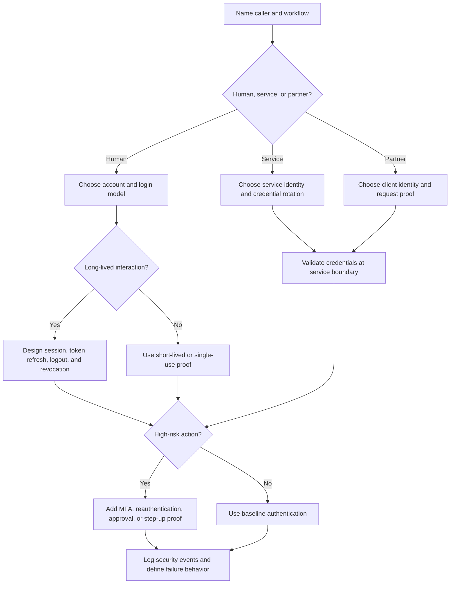

# Authentication

Authentication answers one question before the system decides anything else:
who or what is making this request?

Good authentication design is not only a login form. It includes human identity,
service identity, sessions, tokens, recovery flows, device or factor choices,
and what the system does when identity proof is missing, expired, replayed, or
abused.

Authentication proves identity. Authorization decides what that identity can do.
Keep those decisions connected, but do not treat them as the same control.

## Purpose

Use authentication design to answer common design questions about identity,
sessions, tokens, service auth, MFA, and account lifecycle. Use it to decide:

- which identities the system recognizes;
- how users, services, workers, partners, and admins prove who they are;
- where sessions or tokens are created, stored, refreshed, revoked, and
  validated;
- which flows need stronger proof, such as multi-factor authentication (MFA) or
  reauthentication;
- how account recovery, invite, logout, and credential rotation work;
- which authentication events must be observable without exposing secrets.

The goal is to choose the simplest identity model that protects the risky
workflows and is still practical to implement and operate.

## When This Matters

Authentication changes the architecture when:

- users sign in across browsers, mobile apps, or partner clients;
- tenants, organizations, admins, or support users have different risk levels;
- public APIs, webhooks, workers, or services call each other;
- sessions must survive browser refreshes but not stolen devices forever;
- tokens may be copied into logs, URLs, queues, analytics, or support tickets;
- high-risk actions need MFA, reauthentication, or step-up verification;
- account recovery could become an account takeover path;
- operators need to investigate suspicious sign-ins without storing raw secrets.

For a toy prototype, authentication may be a stub. For a real system with user
data, admin tools, payments, private messages, or partner APIs, identity proof
belongs in the first design pass.

## Questions To Ask

Start with identity and risk:

- Which actors need identities: users, admins, support agents, services,
  workers, devices, partners, or webhook senders?
- Does the system own user accounts, rely on an external identity provider, or
  support both?
- Which actions can anonymous users perform?
- What starts a session, and what ends it?
- Are sessions stored server-side, represented by tokens, or both?
- Which tokens are long-lived, short-lived, refreshable, revocable, or
  single-use?
- Which actions require MFA, reauthentication, or stronger proof than normal
  login?
- How can a user recover access without making takeover easy?
- How do services authenticate to each other and rotate credentials?
- What should happen when authentication dependencies are unavailable?
- Which logs, metrics, and audit records prove who signed in, failed, refreshed,
  rotated, or revoked credentials?

## Authentication Decision Flow



## Decision Guidance

### Identify The Identity Model

Name each identity the system recognizes:

- end user account;
- tenant or organization membership;
- admin or support account;
- service account;
- scheduled worker identity;
- partner client;
- webhook sender;
- device or browser session.

Then decide which identity is authoritative. A small internal tool may use one
existing company identity provider. A public product may own accounts and offer
optional federation later. A partner API may authenticate both the partner
client and the user on whose behalf the request is made.

Do not let "logged in" become the only identity state. Useful states often
include anonymous, invited, active, locked, pending verification, password reset
pending, MFA enrolled, service credential active, and credential revoked.

### Choose Account And Login Flows

For human users, decide how accounts are created and how a user proves control:

- password login;
- passwordless email or phone challenge;
- single sign-on through an external identity provider;
- invite-based access;
- admin-created accounts;
- MFA enrollment and challenge;
- account recovery and credential reset.

Each flow has a different failure and abuse surface. Passwords need reset,
lockout, and brute-force protections. Passwordless links or codes need expiry,
single-use behavior, and delivery failure handling. SSO reduces local password
handling but adds dependency behavior when the provider is unavailable.

Version 1 should choose the fewest flows that match the product. More login
options can help adoption, but they also multiply support cases, edge cases,
and abuse paths.

### Design Sessions

A session lets an authenticated caller avoid proving identity on every request.
Design it as part of the architecture, not as a default library detail.

Decide:

- where session state lives;
- how long an active session lasts;
- whether idle sessions expire;
- whether logout invalidates one session or all sessions;
- how session IDs are stored by clients;
- whether admins can revoke sessions;
- whether session changes are visible to users and operators.

Server-side sessions are easy to revoke and inspect, but they require a shared
store or sticky routing when the app scales. Stateless tokens can reduce lookup
work, but revocation, logout, and permission changes require extra design.

### Use Tokens Deliberately

Tokens are portable proof, so design their lifecycle carefully.

Common token types:

- session token for browser or app requests;
- access token for short-lived API access;
- refresh token for obtaining new access tokens;
- one-time token for email verification, password reset, or invite acceptance;
- service token or signed credential for machine-to-machine calls;
- webhook signature or request proof for inbound partner events.

For each token, specify:

```text
Token purpose: <what it proves>
Issuer: <who creates it>
Audience: <who accepts it>
Lifetime: <how long it works>
Storage: <where it can be kept>
Revocation: <how it is invalidated>
Replay behavior: <what happens if it is reused>
Logging rule: <what must never be logged>
```

Avoid putting sensitive user data in tokens unless the receiver truly needs it.
Prefer identifiers and lookups when claims can change quickly. Treat tokens in
URLs, logs, screenshots, queues, and support tickets as exposure risks.

### Add MFA Where Risk Justifies It

MFA is useful when a password or stolen session is not enough proof for the
action being attempted. It should be tied to risk, not added as a vague
security slogan.

Good candidates for MFA or step-up verification:

- changing password, email, phone, or MFA settings;
- exporting sensitive data;
- changing tenant-wide configuration;
- approving payments, refunds, or destructive operations;
- using admin or support tools;
- signing in from an unusual device or location when the system has that signal.

MFA adds friction, recovery complexity, and support work. For version 1, choose
the smallest set of actions that need stronger proof. Also design recovery:
users will lose devices, support agents will get requests, and attackers will
try to turn recovery into the easiest path in.

### Authenticate Services And Workers

Service authentication proves which machine, worker, job, or partner client is
calling. It is separate from user authentication, though a request may carry
both.

Common service-auth design questions:

- Which service identities exist?
- Who can issue, rotate, and revoke credentials?
- Are credentials short-lived or long-lived?
- Are requests signed, mutually authenticated, or validated through a gateway?
- Does the receiving service check both caller identity and allowed action?
- How are scheduled workers and background jobs identified in logs?
- What happens if a credential leaks or a rotation fails?

Avoid sharing one global secret across many services. It makes rotation and
incident response harder because the blast radius is unclear.

### Handle Recovery And Lifecycle

Authentication designs often fail at lifecycle edges:

- invite acceptance;
- email or phone verification;
- password reset;
- MFA reset;
- account lock and unlock;
- session revocation;
- employee departure;
- tenant admin transfer;
- service credential rotation;
- partner offboarding.

For each lifecycle event, decide who can request it, what proof is required,
what expires, what is logged, and what existing sessions or tokens are revoked.

Recovery should be convenient enough for legitimate users, but not weaker than
normal sign-in for sensitive accounts.

### Make Authentication Observable

Operators need enough signal to investigate identity problems without storing
raw credentials.

Useful events:

- login success and failure;
- logout and session revocation;
- token refresh, expiry, and replay rejection;
- password reset requested and completed;
- MFA enrolled, challenged, failed, and reset;
- service credential issued, rotated, used, and revoked;
- suspicious patterns such as repeated failures, impossible travel, or many
  password resets for one account.

Logs should include actor ID, session ID or credential ID, client ID, request
ID, decision outcome, and reason class. They should not include passwords,
reset tokens, raw session tokens, private keys, or full one-time codes.

### Keep Version 1 Practical

A reasonable version 1 might be:

- account identity for signed-in users;
- one login flow;
- server-side sessions or short-lived access tokens with a clear refresh model;
- password reset or invite flow with single-use expiring tokens;
- MFA only for admins or high-risk actions;
- separate service credentials for workers and partner clients;
- rate limits on login, reset, and token refresh endpoints;
- audit events for sign-in, credential changes, and service credential
  rotation.

Revisit when the system adds mobile apps, multiple tenants, partner APIs,
privileged support tooling, stronger privacy requirements, high abuse volume,
or many internal services.

## Trade-Offs

| Decision | Benefit | Cost Or Risk |
| --- | --- | --- |
| Local user accounts | Full control over signup, recovery, and sessions | Must handle password, reset, abuse, and support flows |
| External identity provider | Reduces local credential handling and can centralize policy | Adds dependency behavior and integration complexity |
| Server-side sessions | Easier revocation and inspection | Requires shared state as the app scales |
| Stateless access tokens | Fast validation and useful for APIs | Revocation, claim freshness, and logout need extra design |
| Long-lived refresh tokens | Better user experience across sessions | Higher damage if stolen and harder lifecycle management |
| MFA for high-risk actions | Reduces account takeover damage | Adds recovery, support, and user friction |
| Shared service secret | Simple to start | Large blast radius and difficult rotation |
| Per-service credentials | Clear ownership and revocation | More inventory, rotation, and policy work |

## Common Mistakes

- Treating authentication and authorization as the same decision.
- Adding login before naming all actors, including services and support users.
- Using tokens without defining issuer, audience, lifetime, storage, and
  revocation.
- Letting reset links or invite links work forever.
- Storing tokens in logs, URLs, analytics events, or support screenshots.
- Adding MFA without designing recovery and support workflows.
- Sharing one service credential across many jobs or services.
- Forgetting to invalidate sessions after password, MFA, role, or tenant
  changes.
- Designing only the happy path and skipping dependency outages, expired
  credentials, replayed tokens, and account lockouts.

## Example

A neighborhood equipment library lets residents reserve tools, volunteers manage
pickup windows, and staff approve high-value loans.

Authentication decisions:

| Area | Decision | Reason |
| --- | --- | --- |
| Identity | Residents, volunteers, staff, admins, reminder worker, and notification provider each have distinct identities. | Permissions and audit records need to distinguish human and service callers. |
| Login | Residents use email-based sign-in for version 1. Staff and admins use organization-managed accounts. | The public flow stays simple while privileged users rely on stronger existing controls. |
| Sessions | Browser sessions expire after idle time, and staff can revoke all sessions for a compromised account. | Residents need convenience, but support needs a clear response to account takeover. |
| Tokens | Invite and reset tokens are single-use and expire quickly. Worker credentials are separate from human sessions. | One-time flows should not become durable credentials. |
| MFA | Admins need MFA before changing roles or exporting borrower data. Residents do not need MFA for normal reservations. | Stronger proof is tied to the actions with the highest blast radius. |
| Service auth | The reminder worker has its own credential and logs every notification job with a credential ID. | Failed or suspicious jobs can be traced without sharing a global secret. |
| Abuse controls | Login, reset, invite, and token refresh endpoints have conservative rate limits and observable denial reasons. | Attackers should not be able to create unlimited verification or reset work. |

Rejected for version 1:

- social login, because the system does not need multiple signup channels yet;
- device fingerprinting, because it would add privacy and support complexity
  before there is evidence of account takeover volume;
- custom per-tool authentication rules, because permission checks can handle
  high-value tools after identity is established.

## Checklist

Before accepting an authentication design, confirm:

- Human, service, worker, partner, and admin identities are named.
- The authoritative identity source is clear for each actor.
- Anonymous actions, signed-in actions, and privileged actions are separated.
- Sessions have a storage model, lifetime, expiry, logout, and revocation
  behavior.
- Tokens have issuer, audience, lifetime, storage, revocation, replay, and
  logging rules.
- MFA or step-up verification is tied to high-risk actions.
- Account recovery does not bypass the normal security model.
- Service credentials are scoped, rotated, revoked, and observable.
- Login, reset, invite, and token refresh endpoints have abuse controls.
- Authentication events are logged without raw secrets or token values.
- Failure behavior is defined for identity providers, session stores, token
  validators, and credential rotation.
- Version 1 uses the fewest authentication flows that satisfy the risk.

## Related Pages

- [Security design overview](./)
- [Requirement discovery](../method/requirement-discovery.md)
- [Functional vs non-functional requirements](../method/functional-vs-nonfunctional-requirements.md)
- [Design review checklist](../method/design-review-checklist.md)
- [Idempotency](../communication/idempotency.md)
- [Retries and backoff](../communication/retries-and-backoff.md)
- [Timeouts](../reliability/timeouts.md)
- [Operations](../operations/)
- [Glossary](../glossary.md)
