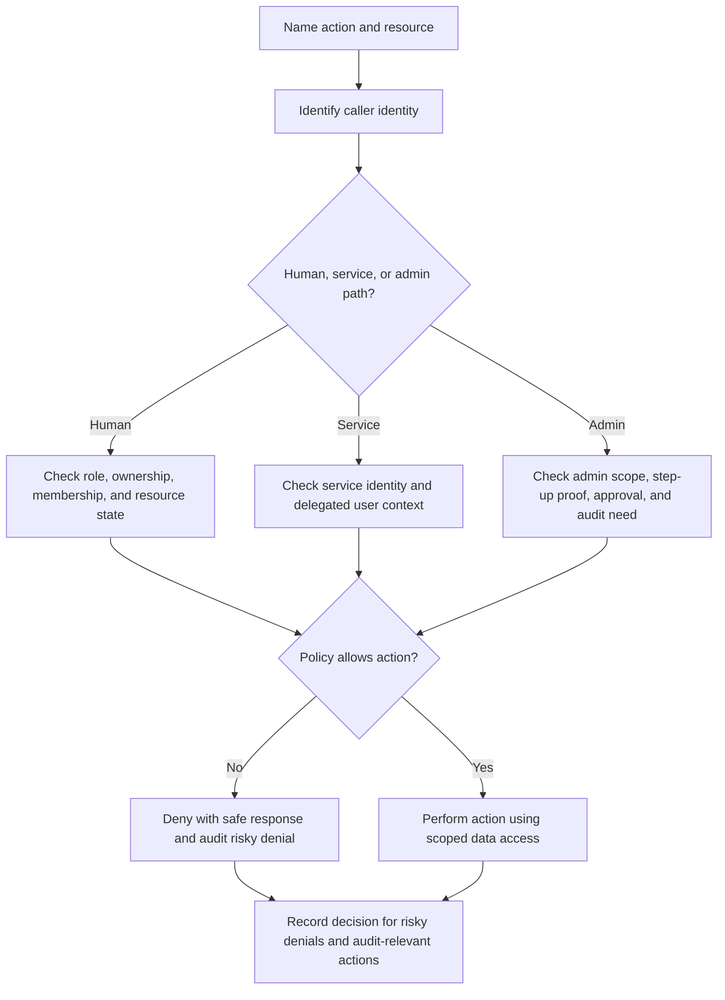

# Authorization

Authorization answers the question that comes after authentication:
is this identity allowed to perform this action on this resource right now?

Good authorization design is not only a role table. It connects users,
services, ownership, organization membership, resource state, admin powers, and
policy checks to each read, write, export, approval, and destructive action.

Authentication proves who or what is calling. Authorization decides what that
caller can do. Keep the two decisions connected, but design and test them
separately.

## Purpose

Use authorization design to answer practical access-control questions:

- which actions need permission checks;
- which resources have owners, members, tenants, or delegated operators;
- where roles are enough and where policies need attributes or relationships;
- how admin and support actions are constrained, approved, and audited;
- where authorization checks run in APIs, workers, services, and admin tools;
- what happens when a policy decision is missing, stale, denied, or unavailable.

The goal is to make permission decisions explicit enough that a reviewer can
trace one risky action from request to decision to audit record.

## When This Matters

Authorization changes the architecture when:

- users can see or change different resources;
- accounts belong to organizations, teams, tenants, households, branches, or
  projects;
- support agents or admins can view or modify other users' data;
- workflows include approvals, exports, refunds, deletions, impersonation, or
  role changes;
- services and workers act on behalf of users;
- data is copied into search indexes, caches, queues, analytics, or admin
  tools;
- a permission mistake could expose cross-tenant data or make an irreversible
  change.

For a single-user prototype, authorization may be simple. For a shared system,
permissions belong in the first design pass, before API and data boundaries
become hard to change.

## Questions To Ask

Start from actions, not from roles:

- Which reads, writes, approvals, exports, deletions, and admin actions exist?
- What resource does each action target?
- Who owns the resource, and who else can act on it?
- Does permission depend on role, ownership, tenant, relationship, resource
  state, data sensitivity, risk level, or time?
- Can a service perform the action by itself, or only on behalf of a user?
- Which checks must happen in the API, service layer, worker, or data query?
- How are denials returned without leaking sensitive data?
- Which permission changes require MFA, approval, notification, or audit logs?
- What should happen if the authorization policy store is unavailable?
- How will tests prove that cross-tenant, stale-role, and admin-bypass cases are
  denied?

## Authorization Decision Flow



## Decision Guidance

### Name Protected Actions

Authorization starts with a list of protected actions. Page access is not
enough, because the same page may contain safe reads, sensitive reads, normal
updates, and admin commands.

Use a concrete action statement:

```text
Actor: <who is asking>
Action: <read, create, update, approve, export, delete, impersonate>
Resource: <which object or collection>
Condition: <ownership, role, tenant, state, policy, or risk rule>
Decision: <allow, deny, require approval, require step-up, or queue for review>
```

Examples:

- A member can read reservations in their own organization.
- A branch manager can approve loans for their branch up to a configured limit.
- A support agent can view a masked user profile only while handling an open
  support case.
- A notification worker can send reminders only for reservations assigned by
  the reservation service.
- An admin can export borrower history only after MFA and an audit reason.

This format makes missing checks easier to spot. If an action cannot name a
resource, condition, and decision, the authorization model is not ready.

### Model Ownership And Scope

Ownership defines who has a natural claim over a resource. Scope defines the
boundary where that claim applies.

Common scopes:

- user-owned resources, such as a profile or draft;
- organization-owned resources, such as projects, reservations, invoices, or
  team settings;
- tenant-owned data in a multi-tenant product;
- branch, region, department, or workspace resources;
- system-owned resources that only services or operators should change;
- shared resources where multiple users have different permissions.

Ownership is not always enough. A user may own a draft but not be allowed to
publish it. A manager may belong to an organization but only approve records for
one branch. A service may own a background job but still need the user context
that caused the job.

Tie ownership checks to data access. For example, a query for one reservation
should include the organization or owner condition, not fetch the record first
and rely only on later UI filtering.

### Choose A Permission Model

Start with the smallest permission model that fits version 1.

Common models:

| Model | Good Fit | Watch For |
| --- | --- | --- |
| Role-based access | Small set of stable job functions such as member, manager, admin | Roles can become too broad as workflows grow |
| Ownership checks | User-owned or organization-owned resources | Shared or delegated access needs extra rules |
| Policy rules | Decisions depend on resource state, sensitivity, risk, or action context | Policies need versioning, tests, and debugging tools |
| Relationship checks | Access follows relationships such as team, branch, viewer, editor, approver | Relationship graphs can become hard to reason about |
| Explicit grants | Temporary access, delegated review, or sharing links | Grants need expiry, revocation, and auditability |

Many systems combine models. Version 1 might use roles plus ownership checks.
Later, high-risk exports, support access, or cross-organization collaboration
may justify explicit policies or grants.

Avoid inventing a flexible policy language before the product needs it. A small
set of readable rules is easier to test than a powerful model nobody can
explain.

### Place Authorization Checks

Authorization checks must run where the action is enforced, not only where the
button is rendered.

Check these paths:

- public API handlers;
- service-layer commands;
- background workers that act on queued messages;
- scheduled jobs;
- internal admin tools;
- support tooling and impersonation flows;
- data export jobs;
- webhooks and partner API actions.

The client can hide buttons and improve usability, but the server must enforce
the decision. Workers should not assume that a queued message is authorized
forever. If roles, ownership, or resource state can change before the worker
runs, re-check authorization or record the exact approval that made the job
valid.

For service-to-service calls, check both contexts when both exist:

- service identity: which machine, worker, or client is calling;
- user or workflow context: on whose behalf the service is acting;
- allowed action: what this service may do with that context.

### Design Admin And Support Actions

Admin power is useful, but it has a larger blast radius than normal user
actions. Treat it as a separate authorization surface, not as a bypass.

For each admin or support action, decide:

- who can perform it;
- whether it requires MFA, reauthentication, approval, or a ticket reference;
- whether the operator sees full data, masked data, or only metadata;
- whether the action is reversible;
- who is notified after the action;
- what audit record proves who did what and why.

Support access should be narrow by default. A support agent may need to view a
masked account, resend an invitation, or trigger a password reset email. That
does not imply permission to export all user data, change roles, or impersonate
without a visible audit trail.

Break-glass access should be rare, time-limited, heavily audited, and reviewed
after use. If every urgent support case needs break-glass access, the normal
permission model is missing a legitimate workflow.

### Keep Policy Data Understandable

Authorization depends on data: roles, memberships, grants, policy flags,
resource owners, account status, tenant boundaries, and resource state.

For policy data, decide:

- which store is authoritative;
- how changes are propagated to services, caches, and workers;
- whether decisions use fresh data or cached data;
- how stale decisions are detected;
- how role and policy changes affect existing sessions and queued work;
- how permission changes are tested before rollout.

Caching authorization data can reduce latency, but stale policy can overgrant
access. If a user is removed from a tenant, the system should define when their
sessions, cached permissions, export jobs, and worker tasks stop working.

### Handle Denial And Failure

Authorization should fail closed for sensitive actions. A missing policy record,
unavailable policy service, malformed resource ID, or unknown tenant should not
turn into broad access.

Design denial behavior:

- return a safe response that does not reveal whether a hidden resource exists;
- log the actor, action, resource ID, tenant or organization ID, policy rule,
  decision, and request ID;
- distinguish expected denial from suspicious repeated denial;
- avoid logging sensitive payloads or raw credentials;
- define retry or degraded behavior when a policy dependency is unavailable.

Not every denial needs an alert. Repeated cross-tenant attempts, admin denials,
export denials, or service credentials attempting unexpected actions are more
useful signals than ordinary user mistakes.

Example failure policy:

- public catalog reads may continue if they do not require private policy data;
- private reservation reads fail closed when the system cannot prove ownership
  or tenant membership;
- exports, role changes, impersonation, and destructive admin actions fail
  closed when the policy store or fresh permission cache is unavailable;
- already-started background jobs either re-check before the sensitive action or
  use a recorded approval with a short validity window.

### Keep Version 1 Practical

A reasonable version 1 might include:

- roles for normal user, manager, support, and admin;
- ownership checks on user-owned and organization-owned resources;
- server-side authorization in every API command and query that returns private
  data;
- no hidden admin bypasses;
- MFA or step-up proof for role changes, exports, and destructive admin
  actions;
- audit records for admin, support, export, role-change, and denied
  cross-tenant actions;
- focused tests for same-tenant allow, cross-tenant deny, stale-role deny, and
  admin-scope deny.

Revisit when the product adds multiple tenants, delegated sharing, public APIs,
complex approval chains, regulated data, partner integrations, or many support
roles.

## Trade-Offs

| Decision | Benefit | Cost Or Risk |
| --- | --- | --- |
| Coarse roles | Easy to explain, test, and operate in version 1 | Can overgrant access as workflows diverge |
| Fine-grained permissions | Better fit for complex actions and least privilege | More policy data, tests, and debugging work |
| Ownership checks in queries | Reduces accidental cross-tenant reads | Requires careful query design and indexing |
| Central policy function | Consistent decisions across APIs and workers | Can become a dependency bottleneck or generic catch-all |
| Local checks near actions | Easy to understand the action in context | Can drift if duplicated across many services |
| Deny by default | Safer when data or policy is missing | Can create support load if denial reasons are opaque |
| Admin override | Helps repair urgent user problems | Needs strict scope, approval, expiry, and auditability |
| Cached permissions | Lower latency and less policy-store load | Stale grants can overgrant after role or tenant changes |

Use inline checks for a small monolith with a few actions. Move repeated checks
into a shared function or library when the same rule appears in many handlers.
Consider a dedicated policy service only when multiple services need consistent
decisions and the added dependency is worth its latency, availability, and
debugging cost.

## Common Mistakes

- Treating authentication as permission to do everything.
- Checking permissions only in the UI.
- Designing roles before naming protected actions.
- Giving support or admin users broad database access because they are
  internal.
- Forgetting workers, scheduled jobs, exports, and webhooks.
- Fetching a resource without an ownership or tenant constraint, then filtering
  later.
- Allowing stale role or tenant membership to keep working after revocation.
- Returning denial messages that reveal private resource existence.
- Logging sensitive payloads while trying to explain authorization decisions.
- Adding a powerful policy engine before there are enough rules to justify it.

## Example

A neighborhood equipment library lets residents reserve tools, volunteers
manage pickup windows, staff approve high-value loans, and admins manage
inventory and roles.

Authorization decisions:

| Action | Check Runs At | Allowed Caller | Resource And Condition | Decision |
| --- | --- | --- | --- | --- |
| View reservation | API query | Resident | Reservation belongs to the resident's household | Allow; otherwise deny without revealing the reservation exists |
| Update pickup status | Service command | Volunteer | Reservation is assigned to the volunteer's branch and in `ready_for_pickup` state | Allow status update, not borrower profile edits |
| Approve high-value loan | Approval API | Staff | Staff belongs to the branch that owns the tool and loan value is within staff limit | Allow and audit approval |
| Export borrower list | Export job | Admin | Admin has export permission, MFA is recent, and a reason is recorded | Queue export and audit requester, scope, and reason |
| Send reminder | Worker | Reminder worker | Worker credential is valid and job references an active reservation | Send notification using the reservation service's scoped data |
| Change user role | Admin tool | Admin | Admin cannot grant permissions outside their branch scope | Require step-up proof, write audit record, and notify affected user |

Rejected for version 1:

- custom per-tool permission rules, because branch ownership and loan value
  cover the first set of workflows;
- direct database access for support, because masked support views and narrow
  actions are enough;
- a general policy language, because the initial rules are few and easier to
  test as named checks.

This design keeps normal permissions simple while making high-blast-radius
actions, such as exports and role changes, visible and harder to misuse.

## Checklist

Before accepting an authorization design, confirm:

- Protected reads, writes, approvals, exports, deletions, and admin actions are
  named.
- Each action has an actor, resource, condition, and decision.
- Ownership, tenant, organization, branch, or relationship scope is explicit.
- Roles are narrow enough for version 1 and have clear revisit signals.
- Policies account for resource state, data sensitivity, and risk where needed.
- Authorization checks run on the server-side action, not only in the UI.
- Services and workers carry service identity and delegated user or workflow
  context when needed.
- Admin and support actions have scope limits, step-up proof, approval, audit,
  or notification where risk justifies it.
- Denials avoid leaking private resource existence.
- Policy data freshness, cache invalidation, and revocation behavior are
  defined.
- Failure behavior is fail-closed for sensitive actions.
- Tests cover allowed access, cross-scope denial, stale-permission denial, and
  admin bypass attempts.
- Audit logs record actor, action, resource, scope, decision, and request ID
  without sensitive payloads.
- Version 1 uses the simplest permission model that protects the risky
  workflows.

## Related Pages

- [Security design overview](./)
- [Authentication](authentication.md)
- [Access-control models](access-control-models.md)
- [Requirement discovery](../method/requirement-discovery.md)
- [Functional vs non-functional requirements](../method/functional-vs-nonfunctional-requirements.md)
- [Design review checklist](../method/design-review-checklist.md)
- [Identifying entities](../data/identifying-entities.md)
- [Transactions](../data/transactions.md)
- [Idempotency](../communication/idempotency.md)
- [Operations](../operations/)
- [Glossary](../glossary.md)
