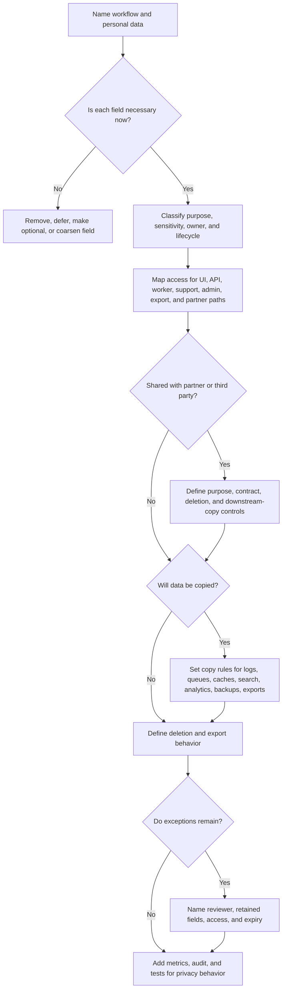

# Data Privacy

Data privacy is the design discipline of collecting only the personal data a
workflow needs, limiting who can use it, and controlling where copies appear.
It affects the data model, authorization checks, logs, queues, analytics,
exports, backups, support tools, and deletion workflows.

This page is engineering guidance, not legal advice. Laws, contracts, and
company policy may add stricter requirements. The system design job is to make
privacy choices explicit enough for the right reviewers to evaluate.

## Purpose

Use this guide to decide:

- which personal data is needed and which should not be collected;
- how minimization changes fields, precision, lifetime, and copies;
- which access controls protect product, support, worker, admin, and export
  paths;
- how logging, metrics, traces, and incident artifacts avoid becoming privacy
  stores;
- how user deletion and export workflows affect primary and derived data;
- which checklist items prove version 1 is privacy-aware without building a
  broad privacy platform too early.

For discovery prompts, start with
[Privacy requirements](../requirements/privacy.md). This page focuses on turning
those requirements into implementation decisions.

## When This Matters

Privacy design matters when:

- users, operators, tenants, partners, or customers provide names, contact
  details, addresses, messages, photos, identifiers, documents, location, or
  sensitive notes;
- support agents, admins, workers, integrations, or analytics jobs can read or
  copy that data;
- logs, metrics, traces, queues, caches, search indexes, exports, screenshots,
  spreadsheets, backups, or incident notes may include personal data;
- users or tenants need deletion, export, correction, masking, or retention
  behavior;
- the design proposes collecting a field because it might be useful later;
- high-risk workflows such as exports, impersonation, support views, deletion,
  or role changes need audit and review.

Skip this work only when the system truly stores no user, customer, tenant,
operator, or partner data. Revisit as soon as that changes.

## Questions To Ask

- What personal data does the workflow need to function?
- What purpose justifies each field?
- Can the system collect less data, a less precise value, a shorter-lived value,
  or an optional user-controlled value?
- Who can read, change, export, delete, mask, or use the data?
- Which service, worker, support, admin, analytics, and partner paths bypass the
  normal UI?
- Which copies are created in logs, queues, caches, search, analytics, exports,
  backups, support tools, and incident artifacts?
- Which optional collection needs user notice, consent, or preference controls?
- What happens when a user asks for deletion or export?
- What minimal evidence must remain for audit, security, abuse prevention,
  dispute handling, or operational repair?
- Which privacy exception needs explicit reviewer approval?

## Decision Guidance

### Start With A Personal-Data Inventory

Do not start with tables or API shapes. Start with data classes, sources,
owners, sensitivity, and purposes.

| Data Class | Source | Owner | Sensitivity | Purpose | Access | Copies | Lifecycle |
| --- | --- | --- | --- | --- | --- | --- | --- |
| Contact email | User signup | Account service | Moderate | Account recovery and appointment updates | User, support with case, notification worker | Notification queue, masked support view | Delete or anonymize after account closure if no hold applies |
| Pickup address | User scheduling form | Fulfillment service | High | Coordinate confirmed visit | Assigned staff only | Route planning job, no analytics copy | Delete after pickup window and support period |
| Support note | Support agent | Support system | Variable | Explain a support action | Support role with open case | Audit summary, no normal export | Retain only case summary after case closes |

Each entry should answer where the data came from, who owns the policy for it,
how sensitive it is, why it exists, who can use it, where it may travel, and
when it should disappear or be minimized.

### Minimize Before Adding Controls

Minimization reduces collection, precision, lifetime, and copies. It is often
more effective than encrypting, auditing, and deleting data that was never
needed.

Use minimization to:

- remove fields with no current workflow purpose;
- make optional fields blank by default;
- store coarse values instead of exact values when the workflow allows it;
- delay collection until the data is actually needed;
- store derived status or counts instead of raw payloads;
- separate sensitive notes from general records;
- expire temporary files, exports, and job payloads quickly.

Example:

```text
Collect neighborhood during browsing so volunteers can estimate coverage.
Collect exact address only after a pickup is confirmed.
Delete exact address after pickup plus support window unless a dispute hold
exists.
```

The version 1 question is: "What is the least personal data that still lets the
workflow keep its promise?"

### Enforce Access Controls On Every Copy

Privacy access control is not only a UI rule. It must follow the data through
queries, commands, workers, exports, search, analytics, support tools, and admin
actions.

Access decisions should name:

- actor: user, support agent, admin, worker, service, partner, or export job;
- action: read, update, mask, reveal, export, delete, impersonate, or repair;
- scope: owner, tenant, organization, branch, case, assignment, or grant;
- purpose: why the actor needs the data now;
- audit: whether the access itself needs an audit record.

Good patterns:

- support views mask personal fields by default and require a case reason for
  full reveal;
- export jobs use field allowlists and carry tenant or owner scope;
- analytics jobs receive anonymized, aggregated, or purpose-limited fields;
- workers read only the fields required for their job payload;
- admin actions that export, delete, or reveal data require step-up proof and
  audit.

If a broad admin role can export every field without a reason, privacy is
mostly a policy hope instead of a system design.

### Treat Logging As Data Creation

Logging a field creates another data store. It may have different access,
retention, search, export, and incident-response behavior than the primary
database.

Avoid logging:

- full request or response bodies by default;
- names, email addresses, phone numbers, addresses, private messages, documents,
  photos, payment data, secrets, tokens, session cookies, or raw partner
  payloads;
- personal data in metrics labels or high-cardinality trace attributes;
- deletion request text, support notes, or exported file contents;
- screenshots or incident notes with unmasked personal data.

Prefer:

- stable internal IDs;
- reason codes and state transitions;
- row-count buckets and destination classes for exports;
- masked values only when a debugging purpose is clear;
- redaction at the logging boundary;
- log field allowlists for sensitive routes;
- short retention for high-risk operational logs.

Observability should help repair the system without becoming the largest
privacy exposure surface.

### Design Deletion As Propagation And Evidence

User deletion is a workflow, not a single database delete. It needs status,
authorization, copy tracking, retry, verification, and safe residual evidence.

Deletion design should answer:

- who can request deletion and what proof is required;
- what open workflows block or delay deletion;
- which primary fields are deleted, anonymized, or retained-minimal;
- which derived copies are cleaned up: search, cache, analytics, queues, object
  storage, exports, support attachments, and partner systems;
- how backups are handled through retention and restore-time reconciliation;
- what audit summary remains without copying deleted payloads;
- how the requester or operator sees completion, failure, or review.

Example:

```text
Profile deletion removes contact fields from the profile table, cancels pending
reminder jobs, deletes active export files, removes search documents, and keeps
an audit event with request ID, actor, completion time, and retained-minimal
reason code.
```

Deletion may have exceptions for security, audit, abuse prevention, dispute
handling, or legal review. Keep those exceptions field-limited, access-limited,
and time-limited.

### Treat Exports As High-Risk Products

Exports move data outside the normal application boundary. They need their own
scope, permission, format, expiry, audit, and abuse controls.

Export design should specify:

- who can request the export;
- whether the export is a user self-export, tenant or workspace export,
  support-scoped export, or admin-only operational export;
- which actor boundary prevents tenant admins or support staff from exporting
  another user's private data without a specific policy reason;
- which fields are included, excluded, masked, or summarized;
- which internal notes, other users' data, and security records are excluded;
- how requester proof, MFA freshness, approval, or support case is checked;
- how the export is generated, delivered, encrypted if needed, expired, and
  deleted;
- how export volume, failures, and unusual patterns are monitored;
- what audit event records scope, requester, reason, row-count bucket, and
  destination class.

Avoid "export everything" endpoints. They are difficult to authorize, review,
delete, and explain after an incident.

## Privacy Design Flow



Use the flow before data shapes, logs, and exports harden into public contracts.

## Original Example

A neighborhood tool library lets residents reserve tools, volunteers coordinate
pickup windows, staff approve expensive loans, and support agents resolve lost
items.

Privacy design:

| Workflow | Design Decision | Trade-Off |
| --- | --- | --- |
| Resident profile | Store name and email because account recovery and reminders need them | More useful support, but deletion must remove or anonymize contact fields |
| Pickup coordination | Show volunteers pickup window and neighborhood; reveal exact address only after assignment | Lower exposure, but some logistics need a controlled reveal flow |
| Support view | Mask email and address by default; full reveal requires open case reason | Safer support access, but one extra step for unusual cases |
| Audit trail | Record support reveal, export, deletion, and role changes with IDs and reason codes | Accountability without storing full personal values |
| Logs | Use reservation ID, branch ID, and error class; exclude contact fields and free-text notes | Debugging needs joins through authorized tools |
| User deletion | Delete contact fields, cancel pending reminder jobs, expire export files, and anonymize old reservations | More jobs and reconciliation than a single delete |
| User export | Export resident-owned reservations and profile fields; exclude support notes and other residents' data | Narrower export, but requires field allowlist and audit |

Rejected for version 1:

- collecting exact address during browse because pickup is not confirmed yet;
- copying support notes into analytics because notes may contain private
  circumstances;
- one admin export that includes every table because it would bypass normal
  purpose and scope rules.

Version 1 can use a small personal-data inventory, masked support views, field
allowlists for logs and exports, short-lived export files, and observable
deletion jobs. It does not need a full privacy platform before partner data
sharing or stricter compliance requirements appear.

## Trade-Offs

| Choice | Benefit | Cost Or Risk |
| --- | --- | --- |
| Collect less data | Smaller exposure and simpler lifecycle | Less personalization, analytics, or support detail |
| Delay collection | Data exists only when needed | More workflow steps when the data becomes necessary |
| Masked support views | Reduces casual exposure | Some cases need controlled reveal |
| Field allowlists | Keeps logs and exports predictable | Requires maintenance as schemas evolve |
| Short export expiry | Limits uncontrolled copies | Users may need regeneration |
| Deletion propagation | Reduces lingering copies | Requires jobs, retries, and reconciliation |
| Retained-minimal audit evidence | Explains actions with less exposure | Needs reviewer-approved field list |

## Failure Modes

| Failure Mode | Impact | Design Response | Signal |
| --- | --- | --- | --- |
| Optional field becomes required by accident | More personal data is collected than intended | Field inventory review and schema/API checks | New field without purpose owner |
| Support view exposes full profile | Staff see data beyond the case need | Mask by default and audit full reveals | Reveal count, access without case |
| Export includes other users' data | Portable file leaks unrelated records | Owner/tenant scope and field allowlist | Export scope test failure, unusual row count |
| Logs contain personal data | Observability store becomes exposure surface | Redaction and safe log field allowlist | PII scan hit, blocked log field |
| Deletion misses queue or search copy | User data remains after deletion | Copy inventory and deletion reconciliation jobs | Deletion job failure, stale derived record |
| Backup restore reintroduces deleted fields | Old data returns after recovery | Restore-time deletion replay | Restore drill deletion mismatch |
| Partner copy outlives purpose | Downstream data remains uncontrolled | Minimum-field sharing and deletion confirmation | Partner deletion failure, transfer inventory gap |

## Common Mistakes

- Treating privacy as a policy document instead of a data-flow design.
- Collecting fields because they might help future analytics.
- Protecting the main table while copying personal data into logs, queues,
  exports, spreadsheets, search, caches, analytics, and backups.
- Giving support full profile access when masked values and case-scoped reveal
  would work.
- Logging raw request bodies during incidents and forgetting them.
- Defining deletion for the primary store but not for derived stores or export
  files.
- Creating broad exports without field allowlists, requester proof, expiry, and
  audit events.
- Keeping audit evidence by copying the sensitive payload being deleted.

## Checklist

Before accepting a privacy design, confirm:

- [ ] Personal data is inventoried by purpose, owner, sensitivity, source, and
      lifecycle.
- [ ] Fields without a current purpose are removed, deferred, optional,
      shortened, coarsened, or derived.
- [ ] Access controls cover UI, API, support, admin, worker, analytics, export,
      and partner paths.
- [ ] Support and admin views mask personal data by default where possible.
- [ ] Logs, metrics, traces, dashboards, screenshots, and incident notes use
      safe IDs, redaction, summaries, and field allowlists.
- [ ] User deletion covers primary records, derived stores, queues, caches,
      search, exports, files, backups, partner copies, and retained-minimal
      evidence where relevant.
- [ ] User export has requester proof, scope, field allowlist, format, delivery,
      expiry, rate limits, and audit record.
- [ ] Audit logs record high-risk privacy actions without copying sensitive
      payloads.
- [ ] Exceptions for audit, security, abuse prevention, disputes, or reviewer
      holds are explicit, minimal, access-limited, and time-limited.
- [ ] Metrics or tests cover deletion jobs, export scope, log redaction, support
      reveals, and unusual export volume.

## Related Pages

- [Security design overview](./)
- [Privacy requirements](../requirements/privacy.md)
- [Authorization](authorization.md)
- [Access-control models](access-control-models.md)
- [Audit logs](audit-logs.md)
- [Data retention and deletion](data-retention-and-deletion.md)
- [Encryption](encryption.md)
- [Data retention](../data/data-retention.md)
- [Operational vs analytical data](../data/operational-vs-analytical-data.md)
- [Logs](../operations/logs.md)
