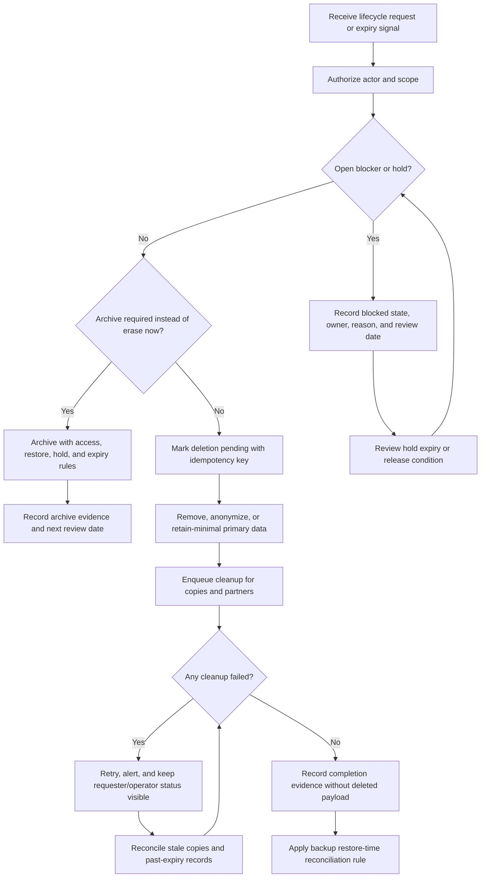

# Data Retention And Deletion

Retention and deletion design turns privacy, security, audit, support, and
recovery promises into concrete lifecycle mechanics. It defines what stays
online, what moves to archive, what is erased, what is kept as minimal evidence,
and how copies are cleaned up without breaking recovery.

This page focuses on security and privacy mechanics. For broader data lifecycle
strategy, see [Data retention](../data/data-retention.md).

## Purpose

Use this guide to decide:

- when data should remain active, become soft-deleted, move to archive, or be
  hard-deleted;
- which data classes need legal holds, dispute holds, or reviewer-approved
  exceptions;
- how deletion propagates through primary stores, derived stores, logs, queues,
  exports, files, caches, search indexes, analytics, partners, and backups;
- what evidence remains after deletion without keeping the deleted payload;
- how users, support staff, and operators see deletion status and failures.

The goal is not to delete everything immediately. The goal is to keep only what
has a current purpose or approved obligation, remove the rest predictably, and
make exceptions visible.

## When This Matters

Retention and deletion mechanics matter when:

- users can close accounts, delete content, request erasure, or export data;
- support, admins, or workers can archive, restore, hide, or permanently delete
  records;
- records can be copied into search, cache, object storage, analytics, exports,
  logs, dead-letter queues, backups, screenshots, or partner systems;
- business workflows have dispute windows, refund windows, abuse review, audit
  evidence, or regulated retention;
- backups may restore data after a deletion request completed;
- old data increases breach impact, storage cost, query cost, or operational
  review burden.

Small systems still need explicit rules. Otherwise "temporary" tables, debug
exports, uploaded files, and deleted rows tend to live forever.

## Questions To Ask

- What data classes exist, including derived copies and generated files?
- Which data is active, inactive, archived, soft-deleted, hard-deleted,
  anonymized, retained-minimal, or under hold?
- Who can request deletion, archival, restore, or hold placement?
- Which workflows block deletion temporarily, such as open disputes, unpaid
  invoices, fraud review, or legal review?
- Which fields can be removed while keeping minimal audit evidence?
- Which copies must be deleted, rebuilt, expired, masked, or reconciled later?
- How are backups handled after deletion and during restore?
- What user-visible status is shown when deletion is pending, blocked, failed,
  or complete?
- Which metric, audit event, or reconciliation check proves the lifecycle job
  ran correctly?

## Decision Guidance

### Start With Lifecycle States

Retention should be modeled as states with owners and transitions, not as a
single cleanup script.

| State | Meaning | Security Design Need |
| --- | --- | --- |
| Active | Needed for normal product behavior | Normal access control, backup, and audit rules |
| Inactive | Not active but still visible for history or support | Reduced indexes, narrower access, clear expiry |
| Soft-deleted | Hidden or disabled but recoverable | Query filters, restore permission, audit event, eventual purge rule |
| Archived | Removed from hot path for approved reason | Explicit access approval, restore process, archive expiry |
| Deletion pending | Accepted for cleanup but not fully propagated | Job state, retries, blocker handling, requester status |
| Retained-minimal | Sensitive details removed but small evidence remains | Field allowlist, strict access, reviewer-owned purpose |
| Hard-deleted or purged | Removed from normal stores and derived copies | Tombstone or job evidence only if required |
| Hold | Deletion or purge paused for approved reason | Owner, scope, expiry, review cadence, audit trail |

Write lifecycle rules by data class:

```text
User messages remain active while the conversation exists.
When the account is deleted, message body is hard-deleted from primary storage
and search, while a retained-minimal moderation event keeps message ID, actor
ID, action, timestamp, and hold reason only if an approved abuse review exists.
```

### Choose Soft Delete Deliberately

Soft delete marks a record as deleted, hidden, disabled, or inactive while the
payload remains recoverable. It is useful when the system needs undo, review,
recovery, or delayed cleanup.

Good uses:

- hiding content while moderators review an appeal;
- allowing account restore for a short grace period;
- preventing duplicate identifiers from being reused immediately;
- preserving workflow state until asynchronous cleanup completes;
- protecting against accidental operator deletion.

Risks:

- normal queries forget `deleted_at is null` and expose hidden records;
- admin and support tools treat soft-deleted data as ordinary data;
- exports, search indexes, and analytics continue to include deleted payloads;
- "deleted" becomes a user-facing promise even though data still exists;
- purge is never scheduled, so soft delete becomes permanent retention.

Soft delete is not enough for privacy deletion unless sensitive fields are also
removed, masked, anonymized, or purged according to the approved lifecycle.

### Use Hard Delete For Payloads That Should Not Remain

Hard delete removes the record or sensitive fields from normal stores. It is the
right choice when the data no longer has a current purpose or approved
retention obligation.

Use hard delete when:

- a short-lived export, upload, token, invitation, or job payload expires;
- a user deletion request has passed proof, blocker, and hold checks;
- a derived copy can be rebuilt from authoritative data;
- keeping the payload creates more security and privacy risk than value;
- retained-minimal evidence is enough to explain the workflow.

Design hard delete with referential integrity in mind. Downstream records may
need null foreign keys, tombstone IDs, safe summaries, or separate audit events
instead of orphaned rows or full copied payloads.

### Archive For Approved History, Not Avoided Deletion

Archival moves data out of hot operational paths while preserving it for a
specific reason. It is not a neutral dumping ground.

Archive design should define:

- which fields move and which fields are removed first;
- archive format, schema version, encryption, and integrity checks;
- lookup keys and metadata that do not expose unnecessary personal data;
- who can request archive access and how that access is audited;
- restore or rehydrate procedure;
- archive retention window, legal-hold behavior, and final deletion rule.

If the team cannot find, interpret, authorize, restore, and delete archived
records, the archive is just hidden operational debt.

### Make Legal Holds Explicit Exceptions

A legal hold, dispute hold, abuse hold, or compliance hold pauses deletion for
an approved reason. It should be narrow and reviewable.

Hold records should include:

- hold ID and affected data class or resource scope;
- approving owner or reviewer group;
- reason code and reference, such as legal case, dispute, or abuse review;
- fields or copies covered by the hold;
- start time, review time, and expected expiry or release condition;
- access rules while the hold is active;
- audit event for placement, update, and release.

Do not implement holds as "turn cleanup off for the whole account forever."
That hides risk, blocks legitimate deletion, and makes later review difficult.

### Treat Backups As Recovery Copies

Backups are not normal queryable records. They exist to recover from failure,
corruption, and operator mistakes. Deletion design should explain how backups
interact with deletion promises without pretending every old backup can be
edited in place.

Backup decisions should specify:

- backup retention window and storage location;
- whether backup retention is shorter for high-risk data;
- how backup access is restricted and audited;
- how deleted records are handled after restore;
- which deletion ledger, tombstone table, or replay job reconciles restored
  data;
- what evidence proves restore-time reconciliation was tested.

A practical pattern is restore-time reconciliation:

```text
Keep a deletion ledger with data class, resource ID, scope, target type,
deletion completion time, and safe reason code. Protect the ledger with narrow
read access, append-only writes, retention rules, and tamper-evidence
appropriate to its recovery role. If a backup is restored, replay the ledger
before the restored environment is used for production traffic or
customer-visible exports.
```

This does not remove the need for backup retention limits. It connects recovery
mechanics to deletion expectations.

### Propagate Deletion Through Copies

Deletion usually touches more than one table. Design it as a workflow with
state, idempotency, retries, and reconciliation.

Common targets:

- primary database rows and field values;
- object storage files and generated reports;
- search indexes and materialized views;
- caches and session stores;
- queues, delayed jobs, outboxes, and dead-letter queues;
- analytics, data warehouse rows, and feature stores;
- logs, traces, screenshots, support attachments, and incident artifacts where
  policy allows deletion or masking;
- active export files and download links;
- partner systems and third-party processors;
- backups through restore-time reconciliation.

Use an allowlisted cleanup plan per data class. "Delete user" should not mean
one ad hoc query in the primary database.

## Retention And Deletion Flow



Use this flow to separate authorization, blockers, primary data changes, copy
cleanup, backup behavior, and evidence.

## Original Example

A neighborhood tool library stores member profiles, reservations, pickup
addresses, waiver PDFs, support cases, search documents, reminder jobs, export
files, audit events, and backups.

Retention and deletion mechanics:

| Data Class | Lifecycle Choice | Deletion Mechanic | Trade-Off |
| --- | --- | --- | --- |
| Member profile | Active until account closure | Remove contact fields, keep member ID tombstone for duplicate prevention | Lower exposure, but support loses old contact details |
| Reservation | Active until return plus support window, then archive | Archive safe reservation summary; hard-delete pickup address | Preserves dispute history without keeping location |
| Waiver PDF | Retain while required by approved policy | Legal hold can pause deletion for specific file and member | Meets obligation, but requires narrow hold ownership |
| Search document | Derived from active records | Delete or rebuild when source is deleted or archived | Simple source of truth, but cleanup jobs must be reliable |
| Reminder job | Short-lived operational copy | Delete after sent, cancelled, expired, or account deleted | Less queue clutter, but needs idempotent job handling |
| Export file | Seven-day expiry | Delete file and download token; retain export audit summary | Limits uncontrolled copies, but users may regenerate |
| Backup | Backup retention window | Reconcile deletion ledger after restore | Enables recovery without reintroducing deleted fields |

Version 1 uses:

- `deleted_at` only for short grace periods and operator undo;
- hard deletion or anonymization for contact fields after account closure;
- a `deletion_requests` table with status, actor, scope, blocker, and request
  ID;
- cleanup workers for search, exports, files, queues, and partner callbacks;
- a small deletion ledger for restore-time reconciliation;
- metrics for blocked requests, failed cleanup jobs, stale derived copies, and
  records past expiry.

Rejected for version 1:

- one global "legal hold" flag that disables all cleanup;
- keeping full profile snapshots in audit logs;
- deleting the primary account row while leaving exports and search documents
  untouched;
- promising instant deletion from already-retained backups.

## Trade-Offs

| Choice | Benefit | Cost Or Risk |
| --- | --- | --- |
| Soft delete | Undo, review, and delayed cleanup are easier | Payload still exists and query filters can fail |
| Hard delete | Reduces exposure, cost, and stale data | Less history and more referential-integrity work |
| Retained-minimal evidence | Explains actions without full payloads | Requires careful field allowlist and reviewer approval |
| Archival | Keeps approved history out of hot paths | Needs access, restore, schema, and expiry controls |
| Legal holds | Preserves records for approved obligations | Can over-retain if scope and expiry are vague |
| Restore-time backup reconciliation | Avoids editing every backup in place | Needs deletion ledger and tested restore process |
| Derived-copy cleanup workers | Covers search, caches, files, queues, and partners | Adds retry, monitoring, and idempotency work |

## Failure Modes

| Failure Mode | Impact | Design Response | Signal |
| --- | --- | --- | --- |
| Soft-deleted row appears in normal query | Hidden or deleted data is exposed | Default scoped queries and tests for deleted records | Deleted row returned by API test |
| Primary row deleted but search copy remains | User still finds deleted content | Source-to-search cleanup job and reconciliation scan | Stale search document count |
| Legal hold has no owner or expiry | Data is retained indefinitely | Hold owner, reason, review date, and release workflow | Hold past review date |
| Backup restore reintroduces deleted data | Completed deletion is undone | Deletion ledger replay before restored data is used | Restore drill mismatch |
| Audit log copies deleted payload | Evidence becomes a hidden data store | Safe summaries and field allowlists | Audit-field review failure |
| Export file survives deletion request | Portable copy remains accessible | Expire active exports during deletion propagation | Active export for deleted user |
| Cleanup worker retries non-idempotently | Deletion creates inconsistent state | Idempotency key and per-target completion state | Duplicate cleanup errors |
| Partner deletion callback fails silently | Downstream copy remains uncontrolled | Partner status, retry, timeout, and escalation | Partner deletion backlog |

## Common Mistakes

- Calling a row "deleted" while keeping full payloads available to admin,
  search, export, or analytics paths.
- Using soft delete for every case without a purge schedule.
- Hard-deleting data before checking open disputes, legal holds, audit
  requirements, or restore implications.
- Archiving data without an access path, schema version, restore drill, or final
  expiry.
- Treating legal holds as account-wide permanent cleanup freezes.
- Forgetting generated files, queues, caches, dead-letter queues, support
  attachments, screenshots, and partner copies.
- Promising backup deletion behavior that the restore process cannot enforce.
- Keeping full deleted records in audit logs "just in case."
- Failing to expose deletion status, blockers, retries, and failures to
  operators or requesters.

## Checklist

Before accepting a retention and deletion design, confirm:

- [ ] Each data class has active, inactive, archive, soft-delete, hard-delete,
      retained-minimal, hold, and purge behavior where relevant.
- [ ] Soft delete is used only when recoverability, review, or delayed cleanup
      is required, and it has query protections plus a purge rule.
- [ ] Hard delete or anonymization removes payloads that no longer have a
      current purpose or approved obligation.
- [ ] Archival names fields, format, schema version, access approval, restore
      process, retention window, and final deletion rule.
- [ ] Legal, dispute, abuse, and compliance holds include owner, scope, reason,
      start time, review date, expiry or release condition, and audit events.
- [ ] Backups have retention, access control, and tested restore-time
      reconciliation for completed deletions.
- [ ] Deletion propagation covers primary stores, derived stores, logs where
      policy allows, queues, caches, search, analytics, exports, files, partner
      copies, and backups.
- [ ] Deletion jobs are idempotent and record per-target completion, failure,
      retry, and reconciliation state.
- [ ] Audit evidence records actor, request, scope, result, and safe reason
      without copying deleted payloads.
- [ ] User-visible or operator-visible status exists for pending, blocked,
      failed, completed, and held deletion requests.
- [ ] Metrics or tests cover records past expiry, stale derived copies, backup
      restore reconciliation, active exports after deletion, and hold review.

## Related Pages

- [Security design overview](./)
- [Data privacy](data-privacy.md)
- [Audit logs](audit-logs.md)
- [Authorization](authorization.md)
- [Admin tools](admin-tools.md)
- [Third-party integrations](third-party-integrations.md)
- [Privacy requirements](../requirements/privacy.md)
- [Compliance requirements](../requirements/compliance.md)
- [Data retention](../data/data-retention.md)
- [Backups and restore](../data/backups-and-restore.md)
- [Logs](../operations/logs.md)
