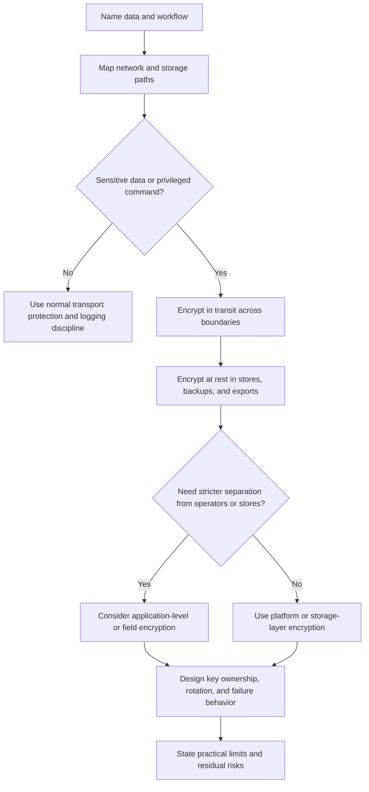

# Encryption

Encryption protects data by making it unreadable without the right key. In
system design, the important question is not "do we encrypt?" but "which data,
which path, which key, which failure mode, and which operational process?"

Encryption is a control, not a complete security model. It helps when data is
intercepted, disks are copied, backups are exposed, or operators need stricter
boundaries. It does not replace authentication, authorization, input validation,
secret handling, logging discipline, or incident response.

## Purpose

Use encryption design to answer:

- which data needs protection in transit;
- which data needs protection at rest;
- who or what manages encryption keys;
- how keys are rotated, revoked, backed up, and audited;
- where application-level encryption is justified;
- what encryption cannot protect in this system.

The goal is to connect encryption choices to data sensitivity, trust boundaries,
operational ownership, and failure behavior.

## When This Matters

Encryption choices change the architecture when:

- public clients, partners, services, or workers cross network boundaries;
- databases, queues, caches, logs, exports, or backups store sensitive data;
- operators, support tools, analytics systems, or vendors can access copied data;
- a system needs separate keys per environment, tenant, region, or data class;
- key loss would make data unrecoverable;
- key compromise would require re-encryption, revocation, or user-visible
  recovery work;
- search, analytics, debugging, or support workflows need data that might be
  encrypted.

For a toy local prototype, encryption may be mostly inherited from local
transport and storage. For a shared or production design, encryption belongs in
the first security pass.

## Questions To Ask

Start with data and boundaries:

- Which data is sensitive enough to encrypt?
- Where does the data move: browser, API, service, queue, database, cache,
  object store, analytics, logs, backups, exports, and support tools?
- Which network paths leave a trusted boundary?
- Which storage locations hold primary, derived, copied, or archived data?
- Who can access plaintext, ciphertext, and keys?
- Are keys shared across environments, tenants, regions, or services?
- How are certificates, keys, and encryption configuration deployed?
- What happens when a certificate expires or a key service is unavailable?
- What must be searchable, sortable, joinable, or debugged after encryption?
- How would operators rotate or revoke a key after compromise?

## Encryption Decision Flow

## Decision Guidance

### Classify Data And Paths

Before choosing mechanisms, list the data and paths.

| Data Or Path | Sensitivity | Where It Moves | Where It Rests | Encryption Decision |
| --- | --- | --- | --- | --- |
| Login session token | Secret credential | Browser to API | Session store and logs must avoid raw value | Transport encryption plus no raw token logging |
| Borrower contact details | Personal data | API, staff UI, notification worker | Database, backups, support views | Transport and storage encryption; masked support view |
| Tool reservation history | Business-sensitive data | API, reports, exports | Database, exports, analytics | Storage encryption; restrict exports and audit access |
| Webhook payload | Partner data | Partner to webhook API | Queue and dead-letter queue | Transport encryption, request signing, queue redaction |

This table separates the decision from the mechanism. If the data does not need
to be stored, deleting it may be better than encrypting it forever.

### Encryption In Transit

Encryption in transit protects data while it moves between clients, services,
providers, and operators. It is most important at trust boundaries.

Common paths:

- browser or mobile client to public API;
- public API to internal service;
- service to database, queue, cache, or object store;
- service to third-party provider;
- partner webhook sender to receiver;
- admin or support tooling to production systems.

Design questions:

- Which endpoints terminate encrypted transport?
- Are internal service calls also protected, or only public traffic?
- Who owns certificate issuance, renewal, and expiry alerts?
- Do service-to-service calls need mutual authentication in addition to encrypted
  transport?
- What happens when certificate renewal fails?
- Are redirects, health checks, callbacks, and webhooks using the same standard
  as normal requests?

Encrypted transport does not make a request authorized. The receiving service
still needs authentication, authorization, validation, and logging rules.

### Encryption At Rest

Encryption at rest protects stored data when disks, snapshots, database files,
object storage, backup media, or exported files are copied outside the expected
access path.

Storage locations to review:

- primary databases;
- read replicas and analytical stores;
- object storage and file uploads;
- queues and dead-letter queues;
- caches when they hold sensitive values;
- logs, traces, and metrics stores;
- backups, snapshots, and exports;
- local development data and test fixtures.

At-rest encryption should answer:

- which store encrypts data and at what layer;
- whether backups and replicas inherit the same protection;
- who can decrypt;
- which keys protect which data classes, environments, tenants, or regions;
- how key rotation affects old data;
- how restore and disaster recovery work if key access is unavailable.

Storage-layer encryption is often a good default. Application-level encryption
is useful when the application needs stronger separation from a store,
administrator, backup, or analytics path, but it adds search, indexing, support,
and key-management complexity.

### Key Management

Keys are the power behind encryption. A design that encrypts data but handles
keys casually has only moved the risk.

For each key, decide:

- owner and backup owner;
- environment and data scope;
- who or what can use the key;
- where the key is stored;
- whether key use is logged;
- rotation trigger and rotation method;
- revocation and compromise response;
- backup or recovery plan;
- what happens if the key is lost.

Avoid sharing one key across unrelated environments or high-blast-radius data
classes. Production, staging, and local development should not depend on the
same keys. If tenant-specific keys are used, the design must also handle tenant
creation, rotation, suspension, export, deletion, and support workflows.

Key availability is a reliability concern. If the key service is unavailable,
some reads, writes, decryptions, or startups may fail. Decide which workflows
fail closed, which can use cached key material for a short window, and which are
paused until key access returns.

### Application-Level Encryption

Application-level encryption means the application encrypts selected fields or
payloads before storing them. It can reduce what a database, queue, backup, or
operator can read directly.

Use it when:

- one data field is much more sensitive than the rest of the record;
- backups or analytics should not expose plaintext;
- tenant or customer separation requires different keys;
- support users should see masked data unless a stricter workflow allows
  reveal;
- a copied database should not be enough to read the protected data.

Costs:

- encrypted fields may be hard to search, sort, join, or partially update;
- debugging and support need safe reveal workflows;
- key rotation may require re-encryption;
- lost keys can mean lost data;
- application bugs can still expose plaintext after decryption.

Use field encryption only where the added protection is worth the operational
cost. Do not encrypt everything at the application layer just because the system
has sensitive data.

### Practical Limits

Encryption has important limits:

- it protects data from some forms of interception or copied storage, not from
  every misuse by an authorized application;
- plaintext exists at endpoints where data is entered, processed, displayed, or
  logged;
- if an attacker controls the application runtime, they may read data after
  decryption;
- encryption does not decide who should be allowed to access data;
- encrypted data may still leak metadata such as timing, size, resource names,
  tenant IDs, or access patterns;
- encrypted values can still be copied to logs, analytics, screenshots, support
  tickets, queues, or exports after decryption;
- key loss can be as damaging as data loss.

State these limits in design reviews. "Encrypted" should not become a shortcut
for "safe."

### Keep Version 1 Practical

A reasonable version 1 might include:

- encrypted transport for public, partner, and service-to-service paths;
- storage-layer encryption for databases, object storage, backups, queues, and
  logs that hold sensitive data;
- separate keys or encryption configuration for local, staging, and production;
- clear certificate renewal and expiry alerts;
- key owners, rotation steps, and emergency revoke paths;
- no application-level field encryption unless a specific data class requires
  separation from storage or operators;
- tests or review checks proving sensitive values are not logged after
  decryption.

Revisit when the system adds more tenants, stricter privacy requirements,
external analytics, stronger support tooling, cross-region data movement,
customer-managed keys, or compliance-driven key separation.

## Trade-Offs

| Decision | Benefit | Cost Or Risk |
| --- | --- | --- |
| Transport encryption at every boundary | Protects data moving across networks | Requires certificate ownership, renewal, and failure handling |
| Storage-layer encryption | Broad protection for stored files, disks, and backups | Store or platform operators may still access plaintext through normal paths |
| Application-level field encryption | Reduces plaintext exposure in stores and backups | Adds search, support, debugging, and key-rotation complexity |
| One shared key | Simple setup | Large blast radius and harder incident response |
| Separate keys by environment or tenant | Limits blast radius and clarifies ownership | More inventory, automation, and recovery planning |
| Short key cache window | Improves availability during key-service issues | Extends exposure if cached material is compromised |
| Immediate key revocation | Stops a compromised key quickly | Can make data unavailable until replacement or re-encryption completes |

## Common Mistakes

- Saying "encrypt everything" without naming data, paths, keys, and operators.
- Encrypting at rest but logging plaintext request bodies.
- Protecting the primary database while ignoring backups, exports, queues,
  caches, analytics, and support screenshots.
- Sharing one key across production, staging, and local development.
- Adding application-level encryption without deciding how search, debugging,
  restore, and rotation work.
- Forgetting certificate expiry, renewal ownership, and rollback.
- Treating encryption as a replacement for authorization or data minimization.
- Losing keys without a tested recovery or data-loss decision.

## Example

A neighborhood equipment library stores borrower contact details, reservation
history, tool photos, staff approval notes, and reminder events.

Encryption decisions:

| Data Or Path | Decision | Reason |
| --- | --- | --- |
| Browser to public API | Use encrypted transport and secure session handling | Borrower contact details and reservation actions cross an untrusted network |
| API to database | Use encrypted transport and storage-layer encryption | The API reads and writes personal and operational data |
| Borrower contact details | Store encrypted at rest; mask in support views | Staff need contact details, but volunteers and broad exports do not |
| Approval notes | Consider field-level encryption if notes include sensitive incidents | Notes have higher sensitivity than normal reservation metadata |
| Tool photos | Use storage-layer encryption, not field encryption | Photos are less sensitive and need simple serving and caching |
| Reminder queue | Avoid raw secrets and unnecessary personal data in messages | Queue and dead-letter entries can become secondary exposure paths |
| Backups | Encrypt and keep key access separate from normal database access | A copied backup should not be enough to read borrower data |
| Key operations | Name key owners, rotation steps, and restore behavior | Operators need a safe process before a leak or key failure |

Rejected for version 1:

- encrypting every field at the application layer, because it would make search,
  support, and reporting harder without a matching requirement;
- one global key for all environments, because staging and production should
  have separate blast radius;
- storing decrypted approval notes in analytics, because derived stores should
  not quietly bypass the original protection.

The design uses encryption where it protects clear risks and avoids pretending
that encryption alone solves authorization, logging, or support access.

## Checklist

Before accepting an encryption design, confirm:

- Sensitive data and privileged commands are named.
- Network paths that need encryption in transit are listed.
- Storage locations that need encryption at rest include databases, queues,
  caches, object storage, logs, backups, and exports.
- Certificate ownership, renewal, expiry alerts, and failure behavior are
  defined.
- Key owners, scope, storage, usage audit, rotation, revocation, and recovery
  are defined.
- Environment, tenant, region, or data-class key separation is justified where
  needed.
- Application-level encryption is tied to a specific data class or trust
  boundary.
- Search, indexing, support, analytics, and debugging limits are understood.
- Key-service outage behavior is defined.
- Sensitive plaintext is not logged after decryption.
- Encryption limits and residual risks are stated.
- Version 1 avoids key and encryption complexity that requirements do not
  justify.

## Related Pages

- [Security design overview](./)
- [Authentication](authentication.md)
- [Authorization](authorization.md)
- [Data privacy](data-privacy.md)
- [Secrets management](secrets-management.md)
- [Access-control models](access-control-models.md)
- [Backup and restore recovery](../reliability/backup-and-restore-recovery.md)
- [Data loss scenarios](../reliability/data-loss-scenarios.md)
- [Operations](../operations/)
- [Glossary](../glossary.md)
